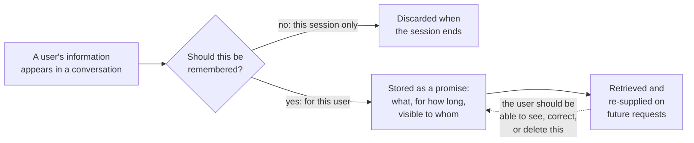

# Memory as a product decision

*Part of [Memory & context for the product leader](./README.md)*

*Last reviewed: 2026-09 · Volatility: fast*

## TL;DR

A model does not remember anything between calls. When a product seems to remember, your
team built that. It saved something, then put it back in front of the model later.

So memory is a feature, not a default. It costs engineering time and storage. It also
makes a promise to the user about what the product will keep and for how long.

This changes the first question to ask about any AI feature. Do not ask "does it have
memory?" Ask "have we decided what it remembers, for whom, and for how long?"

> 🎯 **For the product leader**
>
> **Why it matters** — When memory works, users call it magic. When it works in a way no
> one intended, users call it a breach of trust. The same mechanism causes both. Only the
> product decision around it differs.
>
> **What it changes in your decisions** — You write memory down as a spec, with an owner.
> It is not a side effect of whatever engineering wired up.
>
> **Ask yourself** — *"If a user asked 'what do you remember about me, and for how long?',
> could we give a true, specific answer today?"*
>
> **Risk if ignored** — The feature forgets things users expect it to keep. Or it
> remembers things users thought were gone. Nobody on the team can say which behaviour
> was intended.

## The mental model: a promise, not a switch

Memory is not one setting. It is a set of small promises.

- This detail carries on within a conversation.
- That detail carries on across visits.
- This other detail never leaves the current session.

Each promise has a cost to build and keep accurate. Each has a risk: privacy exposure,
stale facts, or the unease of being remembered too well. Thinking in promises turns a
vague request into something a team can design and test.


```mermaid
flowchart LR
  Q["A user's information<br/>appears in a conversation"] --> D{"Should this be<br/>remembered?"}
  D -->|"no: this session only"| GONE["Discarded when<br/>the session ends"]
  D -->|"yes: for this user"| STORE["Stored as a promise:<br/>what, for how long,<br/>visible to whom"]
  STORE --> DELIVER["Retrieved and<br/>re-supplied on<br/>future requests"]
  DELIVER -.->|"the user should be<br/>able to see, correct,<br/>or delete this"| STORE
```

## Two defaults to avoid

Both defaults come from nobody making the decision.

- **The goldfish product.** It remembers nothing. Users explain their situation again
  every time. A feature that could feel personal feels indifferent.
- **The oversharing product.** It stores everything and brings it back without
  judgement. One surprise at the wrong moment costs more trust than the memory ever won.

Neither is a technical failure. Both are the result of skipping the decision.

## The four-part question

Before any build starts, answer four things in writing.

1. **What** is remembered? A preference, a fact, or a whole transcript.
2. **For whom?** This user only, their whole team, or no one (session only).
3. **For how long?** Forever, until cleared, or on a rolling expiry.
4. **Who can see or edit it?** Only the user, an admin, or only the system.

A feature that answers all four is ready to build. "We will decide later" on any one of
them is how both bad defaults get shipped.

## Worked example: scoping a support assistant

*This example is invented, to show the method.*

A team adds memory to a customer support assistant. The first draft says only "it
remembers the customer." That is not a spec. The team fills in the four parts.

| Detail | What | For whom | How long | Who can see or edit |
| --- | --- | --- | --- | --- |
| Preferred language | A setting | This customer | Until changed | Customer, in account settings |
| Product owned and plan | A fact from the account system | This customer | Always current, read live | Customer and support staff |
| "Prefers short answers" | A style preference | This customer | 12 months since last use | Customer, in a memory list |
| Details of a past complaint | A case summary | Support team only | 24 months | Support staff, not the assistant |
| Health details mentioned in chat | Do not store | n/a | Session only | n/a |

Two decisions matter most. The plan is not stored as a memory at all, because the account
system already holds the true value. And health details are session-only, because storing
them adds risk and no value. The last row is the most useful row in the table.

## Why users notice memory more than other AI behaviour

Most AI flaws are forgiven as "the AI being the AI". A clumsy summary is just a poor
summary. Memory flaws feel personal. Being remembered correctly feels like being
understood. Being remembered wrongly, or having something private resurface, feels like a
violation.

That is why memory needs more product care per feature than most AI capabilities. The
engineering behind it is the same discipline as any context management. See
[Context engineering](../content/00-foundations/context-engineering.md) and
[Context & memory](../agentic-ai/context-and-memory.md).

## Failure modes

- **No decision, by default.** Memory behaviour comes from implementation details. No one
  can state what users were promised.
- **The goldfish product.** Nothing is remembered, and users repeat themselves.
- **The oversharing product.** Everything is stored and resurfaced, with no boundary a
  user could predict.
- **A promise with no owner.** The feature exists, but no one answers for what it stores,
  how long, or whether it is still accurate.

## Under the hood

The model is stateless. Each call sends the full input again. "Memory" is code that
decides what to add to that input. The Claude API makes this explicit. Its memory tool
runs on your side. Claude asks for a file operation and your application carries it out.
In the docs' words, "Memory lives entirely in your application."

That has two consequences for a product leader.

- **You own the store.** Where it lives, who can read it, and when it is deleted are your
  decisions, and your legal exposure.
- **The spec becomes code.** The four-part question maps onto a small record per memory:

```python
from dataclasses import dataclass
from datetime import datetime, timedelta

@dataclass
class Memory:
    text: str                  # WHAT is remembered
    subject_id: str            # FOR WHOM: one user, or an org id
    scope: str                 # "user" | "org"  (session memory is never stored)
    expires_at: datetime       # FOR HOW LONG
    visible_to: tuple          # WHO can see or edit: ("user",), ("user", "admin")
    source: str                # where it came from, for audit and deletion
    created_at: datetime

def is_live(m: Memory, now: datetime) -> bool:
    return now < m.expires_at
```

If a field on this record has no answer in your spec, the spec is not finished.

## Practitioner checklist

- [ ] For each AI feature, can we say what it remembers, for whom, for how long, and who
      can see or edit it?
- [ ] Does the memory feature have a named owner, not only an implementer?
- [ ] Have we tested what a user sees when they ask "what do you remember about me?"
- [ ] Did we choose where the feature sits between "nothing" and "everything", instead of
      inheriting a default?
- [ ] Do we avoid copying facts that another system already holds as the source of truth?

## Related lessons

- [Session, user & organizational memory](./session-user-and-organizational-memory.md)
  — the three shapes this decision takes.
- [Writing and maintaining memory](./writing-and-maintaining-memory.md) — how a memory
  is created, updated and expired.
- [When memory goes wrong](./when-memory-goes-wrong.md) — what happens when this decision
  is skipped.
- [Context & memory](../agentic-ai/context-and-memory.md) — the engineering depth on the
  memory hierarchy.

## Sources

- Anthropic, [Memory tool](https://platform.claude.com/docs/en/agents-and-tools/tool-use/memory-tool)
  (Claude API docs): the memory tool is client-side, and "memory lives entirely in your
  application." Checked 2026-09.
- The support-assistant scenario and its table are invented and illustrative.
