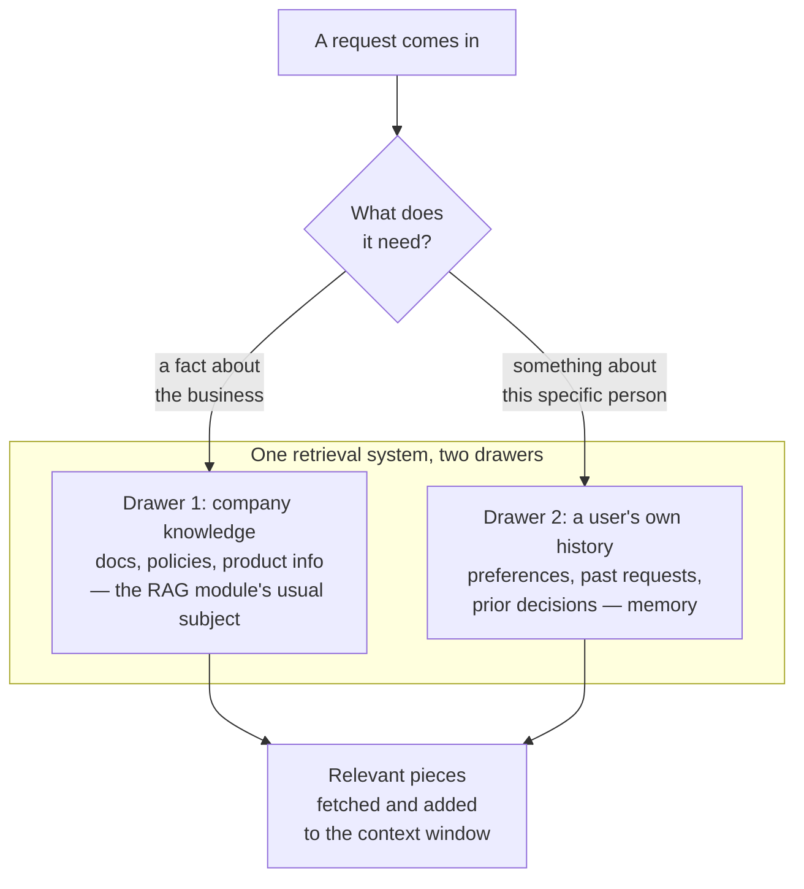

# Retrieval as memory

*Part of [Memory & context for the product leader](./README.md)*

## TL;DR

One of the most common ways an AI product actually implements memory is a technique
covered in full elsewhere in this curriculum: retrieval. Instead of trying to hold
everything a user or an organization has ever said inside the model's limited context
window, a product stores that information externally — in a searchable index — and fetches
only the relevant pieces at the moment they're needed. This is the same mechanism behind
[RAG](../rag-vector-databases/README.md), applied to a different kind of content: not just
your company's documents, but a user's own history, preferences, and past interactions.
Seen this way, "memory" and "retrieval" are not two separate capabilities a product team
builds — user and organizational memory are very often just RAG, pointed at a different
corpus. This lesson is the bridge: it doesn't re-teach retrieval mechanics, which the RAG
module already covers in depth, but it makes explicit why retrieval is memory's most
practical, most common implementation, and what changes when the "documents" being
retrieved are a person's own history instead of a company's knowledge base.

> 🎯 **For the product leader**
>
> **Why it matters** — Teams often plan "add memory" and "add retrieval" as two separate
> roadmap items with two separate budgets, when in practice they're frequently the same
> underlying investment, aimed at different content.
>
> **What it changes in your decisions** — You ask whether a proposed memory feature is
> really a retrieval problem in disguise — and if so, you build it with the same
> discipline (chunking, indexing, retrieval quality) the RAG module already covers, rather
> than reinventing a lighter, less reliable version from scratch.
>
> **Ask yourself** — *"Is this memory feature something we should retrieve on demand, or
> does it genuinely need to be loaded into every request regardless of relevance?"*
>
> **Risk if ignored** — A team builds two separate, redundant systems — one for
> "knowledge" and one for "memory" — that could have been one retrieval pipeline serving
> two different corpora, doubling the engineering and operational cost for no real benefit.

## The mental model: the same filing system, a different drawer

Retrieval, as covered in the [RAG module](../rag-vector-databases/README.md), is a
general-purpose filing system: index a body of text, and fetch the relevant pieces on
demand instead of trying to hold everything at once. Company documents go in one drawer.
A user's own history — their past conversations, stated preferences, prior decisions — can
go in another drawer of the exact same filing system. The mechanism fetching from either
drawer is the same; only the contents differ.

## Why retrieval beats trying to hold everything in the window

The reasoning is identical to why RAG beats stuffing an entire knowledge base into a
prompt, covered in [RAG vs. long-context vs. fine-tuning](../rag-vector-databases/rag-vs-long-context-vs-finetuning.md):
a user's full history grows without bound over time, and pasting all of it into every
request would eventually exceed the context window, cost more with every additional
interaction, and — per the [lost-in-the-middle effect](../llms/the-context-window.md) —
often produce worse answers than a focused, relevant subset would. Retrieval solves this
exactly the way it solves the same problem for company knowledge: index everything, fetch
only what's relevant to the current moment.

## What's genuinely different when the corpus is a person's history

Two things change when retrieval is pointed at memory instead of general knowledge, and
both are worth deliberate attention rather than assuming the RAG playbook transfers
unchanged. **Freshness matters differently.** A company policy document might be stable
for months; a user's stated preference might change from one conversation to the next, so
a memory-retrieval system needs a clearer way to update or override an older stored fact,
not just add to a growing pile. **Consent and visibility are non-negotiable.** Retrieving
from a company's knowledge base raises no personal-privacy question; retrieving from a
person's own history is retrieving personal data, and the [user-memory
obligations](./session-user-and-organizational-memory.md) — visibility, correction,
deletion — apply in full.

## When memory should skip retrieval entirely

Not everything worth remembering benefits from retrieval. A small, stable, always-relevant
set of facts — a user's name, their subscription tier, a handful of core preferences — is
often cheaper and more reliable to simply load into every request directly, rather than
running a retrieval step to fetch something that was always going to be needed anyway.
Reach for retrieval when the stored history is large and only occasionally relevant;
load facts directly when they're small and consistently relevant to nearly everything the
feature does.

## Failure modes

- **Building two systems instead of one** — a separate, bespoke "memory" pipeline built
  alongside a RAG pipeline, duplicating engineering effort that one well-designed
  retrieval system could have served.
- **Treating a user's history like a static document** — applying company-knowledge
  freshness assumptions to memory that actually needs to be correctable and overridable in
  real time.
- **Skipping consent because it's "just retrieval"** — forgetting that retrieving personal
  history is retrieving personal data, with the same obligations as any other user-memory
  feature.
- **Retrieving what should have been loaded directly** — running an unnecessary retrieval
  step for a handful of small, always-relevant facts that would have been simpler to
  include in every request outright.

## Practitioner checklist

- [ ] Have we recognized when a proposed "memory" feature is really a retrieval problem,
      and built it with the RAG module's discipline instead of a lighter, separate system?
- [ ] Does our memory-retrieval system support correcting or overriding a stale stored
      fact, not just appending to history indefinitely?
- [ ] Do consent, visibility, and deletion apply to retrieved personal history the same
      way they apply to any other user memory?
- [ ] For small, stable, always-relevant facts, are we loading them directly instead of
      running an unneeded retrieval step?

## Related lessons

- [RAG & vector databases](../rag-vector-databases/README.md) — the full mechanics this
  lesson bridges to.
- [Session, user & organizational memory](./session-user-and-organizational-memory.md) —
  the obligations that apply once retrieval is pointed at personal history.
- [Chunking & ingestion](../rag-vector-databases/chunking-and-ingestion.md) — the same
  pipeline discipline, applied to a memory corpus instead of a knowledge base.
