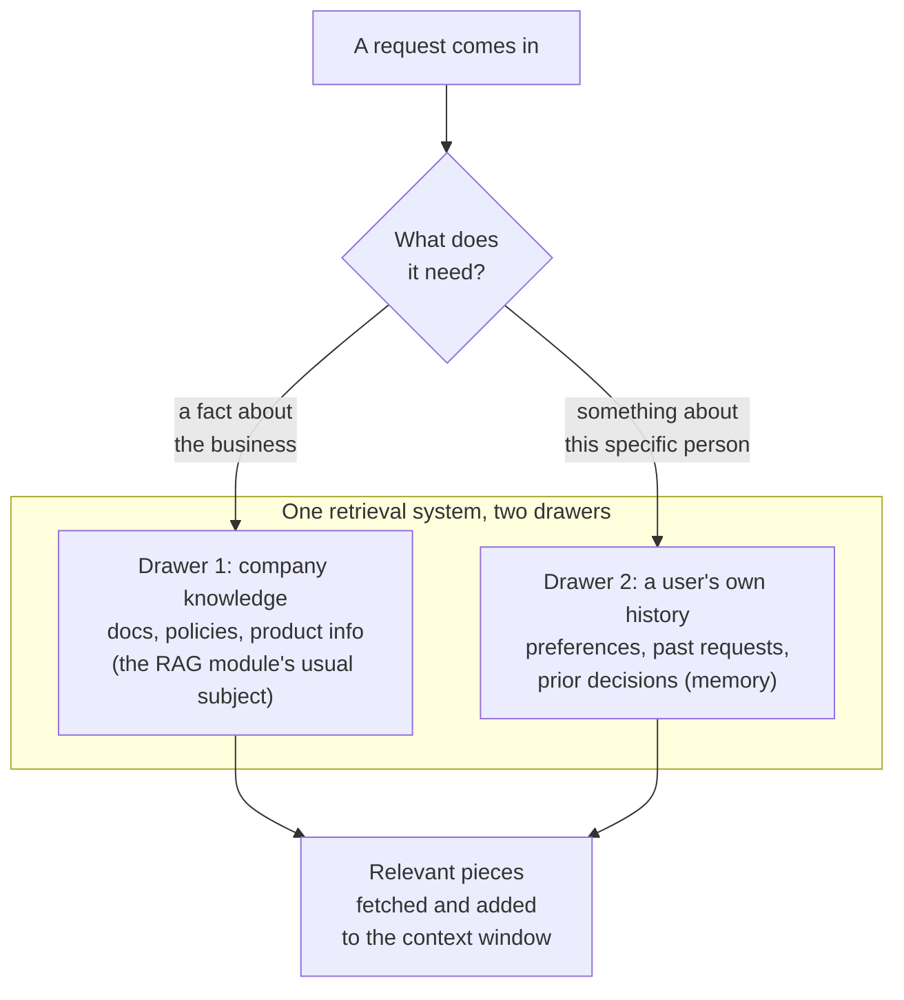

# Retrieval as memory

*Part of [Memory & context for the product leader](./README.md)*

*Last reviewed: 2026-09 · Volatility: fast*

## TL;DR

A model can only use what is in its context window right now. A user's full history will
not fit, and would cost more with every visit. So products store memories outside the
model and bring back the relevant few. That is retrieval, the same technique behind
[RAG](../rag-vector-databases/README.md). Point it at a person's history instead of a
company's documents, and you have memory.

Retrieval is not the only way to build memory. There are three common designs.

1. **Load it directly.** A small, stable set of facts goes into every request.
2. **Retrieve on demand.** A large history is searched, and the best matches are added.
3. **Let the agent keep notes.** The agent reads and writes its own files as it works.

This lesson helps you pick between them. It does not re-teach retrieval mechanics. The RAG
module covers those.

> 🎯 **For the product leader**
>
> **Why it matters** — Teams plan "add memory" and "add retrieval" as separate projects
> with separate budgets. Often they are one investment aimed at different content. Other
> times a much simpler design would do.
>
> **What it changes in your decisions** — Before approving a memory build, you ask which
> of the three designs fits the amount and kind of data. Then you reuse the retrieval
> stack you already have.
>
> **Ask yourself** — *"Is this memory small enough to load every time, large enough to
> need search, or task progress an agent should note for itself?"*
>
> **Risk if ignored** — You build a search pipeline for forty facts. Or you paste a huge
> history into every call and pay for it, with worse answers.

## The mental model: one filing system, different drawers

Retrieval is a general filing system. Index some text, then fetch the relevant pieces on
demand. Company documents go in one drawer. A user's own history goes in another. The
mechanism is the same. Only the content differs.


```mermaid
flowchart TB
  subgraph SYSTEM["One retrieval system, two drawers"]
    KNOW["Drawer 1: company knowledge<br/>docs, policies, product info<br/>(the RAG module's usual subject)"]
    HIST["Drawer 2: a user's own history<br/>preferences, past requests,<br/>prior decisions (memory)"]
  end
  Q["A request comes in"] --> WHICH{"What does<br/>it need?"}
  WHICH -->|"a fact about<br/>the business"| KNOW
  WHICH -->|"something about<br/>this specific person"| HIST
  KNOW --> ANSWER["Relevant pieces<br/>fetched and added<br/>to the context window"]
  HIST --> ANSWER
```

## Why not hold everything in the window

The reasoning matches [RAG vs. long context vs. fine-tuning](../rag-vector-databases/rag-vs-long-context-vs-finetuning.md).
A history grows without limit. Pasting it all into each call soon exceeds the window and
raises cost on every visit. Quality can also fall as the window fills. Anthropic calls
this context rot: "as the number of tokens in the context window increases, the model's
ability to accurately recall information from that context decreases." A focused subset
usually beats the whole pile. See also the
[lost-in-the-middle effect](../llms/the-context-window.md).

## Choosing among the three designs

| Design | Use when | Cost | Main risk |
| --- | --- | --- | --- |
| Load directly | Facts are few, stable, and relevant to almost every request. A name, a plan, five preferences. | Small tokens on every call. No search step. | The set grows quietly and crowds the window. |
| Retrieve on demand | History is large and only sometimes relevant. Past tickets, old chats, notes. | An index, a search step, and tuning. | Missed matches, and stale results ranked first. |
| Agent-kept notes | A long task spans many contexts or sessions. The agent records progress and reads it back. | File storage, and a handler you must secure. | Clutter, wrong notes, and saved untrusted text. |

Agent-kept notes suit work in progress. Anthropic's docs describe the memory tool as
letting an agent record "what it learns in memory files" and read them "back on demand".
It gives "just-in-time context retrieval" without a search index.

## Worked example: sizing the choice

*This example is invented. The numbers are illustrative.*

A tax-help assistant serves returning customers. The team lists what it might remember.

| Item | Size | How often needed | Design |
| --- | --- | --- | --- |
| Name, filing status, country | About 40 words | Almost every request | Load directly |
| Ten stated preferences | About 150 words | Most requests | Load directly |
| Last three years of Q&A threads | About 60,000 words | Occasionally ("what did I do last year?") | Retrieve on demand |
| Progress on a half-finished return | A few hundred words, changing | Only during that task | Agent-kept notes |

Loading the first two rows costs a few hundred tokens per call, so no search step is
needed. Loading the third row on every call would cost about 80,000 tokens each time. It
would also bury the answer. Retrieval fetches the two threads that matter. The fourth row
is a task record. The agent writes it and reads it back later.

## What changes when the corpus is a person's history

Two things differ from company knowledge. Both need deliberate attention.

- **Freshness matters more.** A policy may hold for months. A preference can change
  between chats. The store needs a way to replace an old fact, not only add to a pile.
  See [Writing and maintaining memory](./writing-and-maintaining-memory.md).
- **Consent and visibility are required.** Searching a company knowledge base raises no
  personal privacy question. Searching a person's history retrieves personal data. The
  duties from [Session, user & organizational memory](./session-user-and-organizational-memory.md)
  apply in full.

## Tradeoffs

- **Two systems are sometimes right.** Company knowledge and personal history have
  different owners, different freshness and different privacy rules. They can share
  tooling and still live in separate indexes. Do not merge them just to save effort.
- **Simple beats clever.** Loading five facts directly is more reliable than searching for
  them. Add search when the data outgrows the window.
- **Retrieval ranks by relevance, not truth.** A stale memory can match the query better
  than the current one. Use dates as a signal.

## Failure modes

- **Building a search pipeline for a handful of facts.** Extra moving parts and missed
  matches, for no gain.
- **Treating history like a static document.** Old and new facts both retrieved, with no
  way to tell which is current.
- **Skipping consent because it is "just retrieval".** It is still personal data.
- **One shared index with no filter.** A query from one user returns another user's
  memories. See [When memory goes wrong](./when-memory-goes-wrong.md).

## Under the hood

A common pattern combines the first two designs. Load the small profile every time. Search
the large history, but only inside the caller's own records.

```python
def build_memory_context(store, caller, user_message, k=4):
    profile = store.get_profile(caller.user_id)             # small, always loaded
    hits = store.search(
        query=user_message,
        filter={"subject_id": caller.user_id},              # scope BEFORE ranking
        top_k=k * 3,
    )
    # Prefer newer memories when relevance is close.
    hits.sort(key=lambda m: (m.score + 0.1 * m.recency_boost), reverse=True)
    return {"profile": profile, "recalled": hits[:k]}       # placed in the prompt
```

Three engineering habits matter here.

- **Filter first, then rank.** The user filter is part of the query, not a post-step.
- **Show freshness to the ranker.** Store `last_confirmed`. Use it in scoring.
- **Cap what you add.** Fix a token budget for recalled memories. More is not better.

For chunking, embeddings and retrieval quality, use the RAG track:
[Chunking & ingestion](../rag-vector-databases/chunking-and-ingestion.md) and
[Retrieval quality](../rag-vector-databases/retrieval-quality.md).

## Practitioner checklist

- [ ] For each kind of memory, did we choose load directly, retrieve, or agent notes, and
      write down why?
- [ ] Are small, always-relevant facts loaded directly, not searched?
- [ ] Can the store replace or expire an old fact, not only append?
- [ ] Is the per-user filter part of the query, applied before ranking?
- [ ] Do consent, visibility and deletion cover retrieved personal history?
- [ ] Is there a token budget for recalled memories?

## Related lessons

- [RAG & vector databases](../rag-vector-databases/README.md) — the full retrieval
  mechanics.
- [Writing and maintaining memory](./writing-and-maintaining-memory.md) — how memories
  get into the store.
- [Session, user & organizational memory](./session-user-and-organizational-memory.md) —
  the duties that come with personal history.
- [Context & memory](../agentic-ai/context-and-memory.md) — compaction and the memory
  hierarchy in agents.

## Sources

- Anthropic, [Effective context engineering for AI agents](https://www.anthropic.com/engineering/effective-context-engineering-for-ai-agents)
  (Sep 29, 2025): the context rot quotation, and just-in-time retrieval. Checked 2026-09.
- Anthropic, [Memory tool](https://platform.claude.com/docs/en/agents-and-tools/tool-use/memory-tool)
  (Claude API docs): agent-kept memory files and just-in-time context retrieval. Checked
  2026-09.
- The tax-assistant scenario, its sizes and the code sketch are invented and illustrative.
