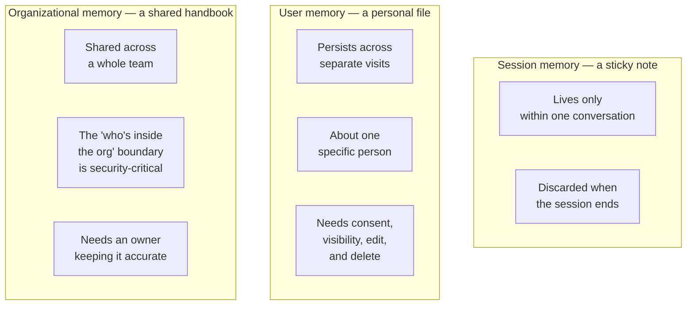

# Session, user & organizational memory

*Part of [Memory & context for the product leader](./README.md)*

## TL;DR

"The product remembers me" is really three different features wearing one name, and
conflating them is where most memory-feature mistakes start. **Session memory** carries
information within one active conversation, and disappears when the session ends — the
lowest-risk, most universally expected form. **User memory** carries information about one
specific person across separate visits, days or months apart — a real, ongoing store that
needs consent and a way to see and edit it. **Organizational memory** carries shared
knowledge across an entire team or company — a style guide, a set of standard procedures,
a shared history — where the boundary of who's inside the "organization" is itself a
security-critical decision. Each shape answers "who is this for, and for how long" with a
different answer, and each needs its own design, its own storage, and its own risk review.
Treating all three as one undifferentiated "memory" feature is how a team accidentally
gives organizational visibility to something that was only ever meant to be personal, or
vice versa.

> 🎯 **For the product leader**
>
> **Why it matters** — The three shapes carry very different stakes. A session forgetting
> something is a minor annoyance. A user's private preference leaking into a shared,
> organizational context is a real privacy incident.
>
> **What it changes in your decisions** — Every memory feature gets explicitly scoped to
> one of the three shapes at design time, with the boundary between them treated as a
> security boundary, not an implementation detail.
>
> **Ask yourself** — *"For this specific memory feature, which of the three shapes is it —
> and have we actually enforced that boundary, or just assumed it?"*
>
> **Risk if ignored** — A feature designed as "user memory" accidentally becomes visible
> across an entire organization, because nobody treated the boundary between the two as
> something that needed active enforcement.

## The mental model: a note, a file, and a shared handbook

Session memory is a **sticky note** — useful for the length of one task, thrown away when
it's done. User memory is a **personal file** — it persists, it's about one specific
person, and that person has a reasonable expectation of control over what's in it.
Organizational memory is a **shared handbook** — everyone on the team can read from it,
someone has to own keeping it accurate, and the question of who counts as "the team" is
exactly the access-control question that matters most.

## Session memory: the lowest-risk shape, still worth naming explicitly

Within one active conversation, carrying forward what was already said is close to a
baseline user expectation — a chat assistant that forgets your name three messages after
you gave it feels obviously broken. The risk here is low because the information never
outlives the session, but it's still worth naming explicitly in a spec, because "session
memory" has a real engineering cost (the [context engineering](../content/00-foundations/context-engineering.md)
discipline of managing what stays in the window as a conversation grows long) and a real
edge: what happens when the session is long enough that early information has to be
compacted or dropped.

## User memory: a real, ongoing store with real obligations

Once information is meant to survive past the current session — "remembers my size,"
"knows I prefer short answers," "recalls what we discussed last month" — you've built a
genuine, persistent data store about a real person, and it inherits every obligation any
other personal data store carries. It needs the user's informed awareness that it exists,
a way for them to see what's actually stored, a way to correct it when it's wrong, and a
way to delete it entirely. A memory feature that delights a user with "it knows me" but
gives them no visibility into what "knows me" actually means is accumulating a trust debt
that surfaces the first time the memory is wrong, or resurfaces something unexpectedly.

## Organizational memory: the boundary is the whole feature

Shared knowledge — a company's style guide, standard operating procedures, "how we've
always handled this type of request" — is genuinely valuable to encode as memory an AI
feature can draw on. The entire risk of this shape concentrates in one question: exactly
who is inside the boundary that can read and write it? Get this boundary wrong and the
consequence isn't a minor inconvenience, it's the exact failure mode covered in the next
lesson — information crossing from one team, tenant, or customer into another's view. This
is the same [multi-tenant isolation](../content/05-safety-multitenancy/multi-tenant-isolation.md)
discipline that applies to any shared system, applied here to a memory store instead of a
database.

## Why naming the shape first prevents the worst mistakes

Most damaging memory failures trace back to a feature quietly sliding from one shape into
another without anyone deciding it should. A note meant to be session-only gets
accidentally persisted. A preference meant to be personal gets folded into a shared
knowledge base "to make the assistant smarter for everyone." Naming the shape explicitly,
at design time, and treating a shift between shapes as a decision that needs its own
review — not something that happens as a side effect of a different change — is the single
cheapest safeguard available.

## Failure modes

- **Unnamed shape** — building a memory feature without deciding which of the three shapes
  it is, so its actual behavior is whatever the implementation happened to produce.
- **Session memory that outlives the session** — information meant to be temporary
  persisting by accident, because nothing explicitly cleared it.
- **User memory with no visibility or control** — a persistent personal store the user
  can't see, correct, or delete, discovered only when it surfaces something wrong.
- **Organizational memory with an unenforced boundary** — shared knowledge accessible to
  more people, teams, or tenants than the feature was ever meant to serve.

## Practitioner checklist

- [ ] Is every memory feature explicitly labeled as session, user, or organizational — not
      left implicit?
- [ ] For user memory: can the person it's about see, correct, and delete it?
- [ ] For organizational memory: is the "who's inside the boundary" question enforced by
      the system, not just assumed?
- [ ] Do we review it as a real decision whenever information looks like it's shifting
      from one shape to another?

## Related lessons

- [Memory as a product decision](./memory-as-a-product-decision.md) — the four-part
  question this lesson's three shapes each need answered.
- [Multi-tenant isolation](../content/05-safety-multitenancy/multi-tenant-isolation.md) —
  the boundary-enforcement discipline organizational memory depends on.
- [When memory goes wrong](./when-memory-goes-wrong.md) — what happens when a shape's
  boundary fails.
