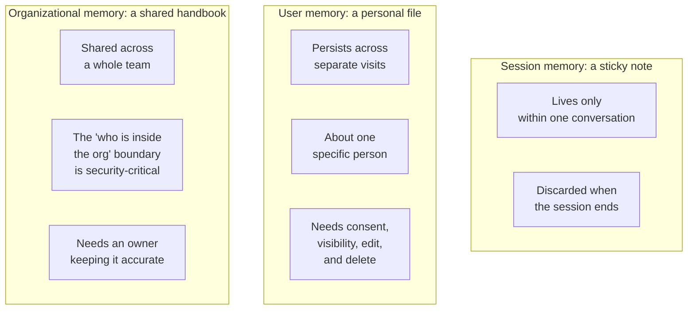

# Session, user & organizational memory

*Part of [Memory & context for the product leader](./README.md)*

*Last reviewed: 2026-09 · Volatility: fast*

## TL;DR

"The product remembers me" is three different features with one name. Mixing them up is
where most memory mistakes start.

- **Session memory** lasts for one conversation. It is gone when the session ends. It is
  the lowest-risk shape, and users expect it.
- **User memory** lasts across visits, for one person. It is a real data store. It needs
  consent, and a way for the user to see and change it.
- **Organizational memory** is shared across a team or company. Think of a style guide or
  standard procedures. Who counts as "inside" the organization is a security decision.

Each shape needs its own storage, its own review, and its own answer to "who sees this,
and for how long?"

> 🎯 **For the product leader**
>
> **Why it matters** — The stakes differ a lot. A session that forgets is a small
> annoyance. A private preference that leaks into shared, organizational memory is a
> privacy incident.
>
> **What it changes in your decisions** — Every memory feature is scoped to one of the
> three shapes at design time. The line between shapes is a security boundary, not an
> implementation detail.
>
> **Ask yourself** — *"Which of the three shapes is this feature? Did we enforce that
> boundary, or only assume it?"*
>
> **Risk if ignored** — A feature built as user memory becomes visible across the whole
> organization. No one treated the boundary as something to enforce.

## The mental model: a note, a file, and a shared handbook

- **Session memory is a sticky note.** It helps for one task, then you throw it away.
- **User memory is a personal file.** It lasts, it is about one person, and that person
  expects some control over it.
- **Organizational memory is a shared handbook.** Everyone on the team reads it. Someone
  must keep it accurate. The key question is who counts as "the team".


```mermaid
flowchart TB
  subgraph SESSION["Session memory: a sticky note"]
    S1["Lives only<br/>within one conversation"]
    S2["Discarded when<br/>the session ends"]
  end
  subgraph USER["User memory: a personal file"]
    U1["Persists across<br/>separate visits"]
    U2["About one<br/>specific person"]
    U3["Needs consent,<br/>visibility, edit,<br/>and delete"]
  end
  subgraph ORG["Organizational memory: a shared handbook"]
    O1["Shared across<br/>a whole team"]
    O2["The 'who is inside<br/>the org' boundary<br/>is security-critical"]
    O3["Needs an owner<br/>keeping it accurate"]
  end
```

## Session memory: low risk, still worth naming

Inside one conversation, carrying earlier turns forward is a basic expectation. An
assistant that forgets your name three messages later feels broken.

The risk is low because nothing outlives the session. Still, name it in the spec. It has
a real cost: the context must be managed as the conversation grows. It also has a real
edge case. In a long session, early details get summarised or dropped. Decide which
details must survive that step. The mechanics are in
[Context engineering](../content/00-foundations/context-engineering.md).

## User memory: a real store with real duties

Once information outlives the session, you have built a data store about a real person.
It inherits the duties of any personal data store.

- The user knows it exists.
- The user can see what is stored.
- The user can correct it.
- The user can delete it.

A feature that delights users with "it knows me" but hides what "knows me" means builds
trust debt. The debt comes due the first time the memory is wrong.

## Organizational memory: the boundary is the feature

Shared knowledge is valuable. Examples are a style guide, a support playbook, or "how we
handled this last time". The whole risk sits in one question: exactly who can read and
write it?

If you get the boundary wrong, one team's, tenant's or customer's information appears in
another's view. That is the failure covered in
[When memory goes wrong](./when-memory-goes-wrong.md). The defence is the same
[multi-tenant isolation](../content/05-safety-multitenancy/multi-tenant-isolation.md) you
would apply to any shared system.

## Worked example: three notes, three shapes

*This example is invented, to show the method.*

A sales assistant has three things it might remember. The team places each one.

| Item | Shape | Why | Boundary to enforce |
| --- | --- | --- | --- |
| "Use the Q3 price list, not Q2" | Session | True for this task only | Cleared when the chat ends |
| "Priya likes bullet points and a two-line summary first" | User | About one person | Only Priya's requests can read it |
| "Our discount policy: max 15% without approval" | Organization | Everyone on the team needs it | Only members of this account can read it. Only the sales-ops owner can edit it. |

Now the tempting mistake. The assistant notices that Priya's summaries score well and
proposes to fold her style into the shared handbook "to help everyone". That moves a fact
from user to organization. It is a shape change, so it needs its own review and Priya's
consent. It must not happen as a side effect of a tuning change.

## Why name the shape first

Most serious memory failures start when a feature drifts from one shape to another, and
no one decided it should. A session note gets saved by accident. A personal preference
gets merged into shared knowledge. Name the shape at design time. Treat any move between
shapes as a decision with its own review. This is the cheapest safeguard you have.

## Failure modes

- **Unnamed shape.** The feature acts however the implementation happens to make it act.
- **Session memory that outlives the session.** Temporary data is saved by accident
  because nothing cleared it.
- **User memory with no visibility.** A personal store the user cannot see, correct or
  delete. They find it when it says something wrong.
- **Organizational memory with an unenforced boundary.** Shared data reaches more people
  or tenants than intended.

## Under the hood

The boundary must be enforced in the store, not in the prompt. Scope every read and write
by the caller's identity, and filter before anything reaches the model.

```python
def read_memories(store, caller, query):
    # The scope comes from the authenticated caller, never from model output.
    allowed = [
        m for m in store.search(query)
        if (m.scope == "user" and m.subject_id == caller.user_id)
        or (m.scope == "org" and m.subject_id == caller.org_id)
    ]
    return allowed   # only these are placed in the model's context
```

Three rules keep this honest.

- **Take the identity from the session, not from the model.** A model can be tricked into
  asking for another user's id.
- **Filter before ranking or summarising.** A summary of data the caller may not see is
  still a leak.
- **Log every read across a shape boundary.** You cannot audit what you did not record.

The Claude memory tool works this way by design. Its `/memories` path is only a prefix.
In the docs' words, your handler maps it "onto real storage, such as a per-user directory
or keys in a database." Choosing that mapping is the boundary decision.

## Practitioner checklist

- [ ] Is every memory feature labelled session, user or organizational?
- [ ] For user memory: can the person see, correct and delete it?
- [ ] For organizational memory: does the system enforce who is inside the boundary?
- [ ] Do we review it as a real decision when data seems to move from one shape to
      another?
- [ ] Do scope checks use the caller's authenticated identity, not text the model wrote?

## Related lessons

- [Memory as a product decision](./memory-as-a-product-decision.md) — the four-part
  question each shape must answer.
- [Writing and maintaining memory](./writing-and-maintaining-memory.md) — how items enter
  and leave each shape.
- [Multi-tenant isolation](../content/05-safety-multitenancy/multi-tenant-isolation.md) —
  the boundary discipline organizational memory depends on.
- [When memory goes wrong](./when-memory-goes-wrong.md) — what happens when a boundary
  fails.
- [Context & memory](../agentic-ai/context-and-memory.md) — the same three shapes in the
  agent hierarchy.

## Sources

- Anthropic, [Memory tool](https://platform.claude.com/docs/en/agents-and-tools/tool-use/memory-tool)
  (Claude API docs): `/memories` is a prefix your handler maps to real storage, such as a
  per-user directory or database keys. Checked 2026-09.
- The sales-assistant scenario is invented and illustrative.
