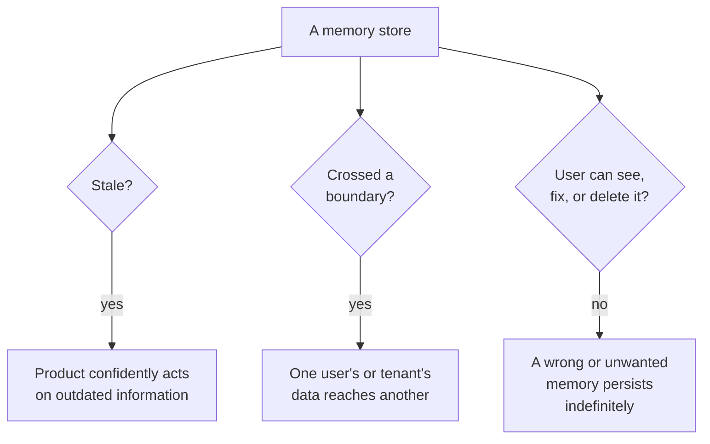

# When memory goes wrong

*Part of [Memory & context for the product leader](./README.md)*

## TL;DR

A memory feature fails in three specific, predictable ways, and every one of them is a
trust problem before it's a technical one. **Staleness** — a stored fact that used to be
true isn't anymore, and the product confidently acts on the outdated version. **Leakage**
— information crosses a boundary it was never meant to cross: one user's data reaching
another user, or one tenant's data reaching a different tenant. **No path to correction or
deletion** — a user has no way to see what's stored about them, fix it when it's wrong, or
remove it entirely, which turns an ordinary mistake into a lasting, uncorrectable one. Each
of these has a specific, known mitigation, and none of them are exotic — they're the same
categories of failure any system holding personal data has always had to design against,
now applied to a memory feature built on top of a model. The product leader's job is
making sure each one has an explicit owner and an explicit test, before a real incident
forces the question.

> 🎯 **For the product leader**
>
> **Why it matters** — Unlike most AI quality issues, a memory failure is rarely forgiven
> as "the AI being imperfect." It reads as the product getting something specifically and
> personally wrong, and it costs trust disproportionate to how small the underlying bug
> might have been.
>
> **What it changes in your decisions** — Staleness, leakage, and correctability each get
> a named owner and a specific test in the launch checklist for any memory feature — not a
> general "we'll monitor it" assurance.
>
> **Ask yourself** — *"If a user's stored information turned out to be wrong, or someone
> else's stored information turned out to be visible to them, would we find out from our
> own monitoring, or from the user telling us?"*
>
> **Risk if ignored** — A memory feature ships, works fine in every internal test, and
> then fails in exactly one of these three ways in front of a real user — the failure mode
> a launch checklist should have caught before anyone outside the company saw it.

## The mental model: three ways a filing system betrays its owner

A memory store is a filing system, and filing systems fail in three classic ways: a file
goes out of date and nobody updates it (staleness), a file ends up in the wrong person's
folder (leakage), and the person the file is about has no way to open the drawer and fix
what's inside (no correction or deletion). None of these three failure modes are unique to
AI — they're the oldest failure modes in data management — but a memory feature built
quickly, on top of a model, can reintroduce all three if nobody designed against them
deliberately.

## Staleness: acting confidently on what used to be true

Information stored once and never revisited drifts out of date — a preference changes, a
fact becomes false, a policy is updated. The danger isn't that the model has stale
information; it's that it presents outdated information with exactly the same confidence
as current information, giving a user no signal that what they're hearing might be
outdated. The mitigation is structural, not a matter of trying harder: give stored facts
an explicit freshness — a "last confirmed" marker, an expiry, or a periodic re-check —
rather than treating memory as permanently and silently true once written.

## Leakage: the boundary that mattered most

This is the single most damaging memory failure, and it maps directly onto the boundary
question from [session, user & organizational memory](./session-user-and-organizational-memory.md):
one user's personal information reaching another user, or one tenant's data reaching a
different tenant. It costs more trust in one incident than the memory feature will earn
back across every convenience it ever provided, because it converts "the AI understands
me" into "the AI can't be trusted with anything I tell it." The mitigation is the same
[multi-tenant isolation](../content/05-safety-multitenancy/multi-tenant-isolation.md)
discipline that protects any shared system: enforce the boundary at the system level,
test it adversarially before launch, and never rely on the model itself to respect a
boundary it was never actually prevented from crossing.

## No path to correction or deletion: an ordinary mistake becomes permanent

Every memory system will eventually store something wrong — a misheard preference, an
outdated fact, information a user wishes they hadn't shared. That's not itself
catastrophic. What turns it into a real problem is a product with no way for the person
it's about to see it, fix it, or remove it. This is increasingly a legal requirement, not
just good practice — many privacy regimes now recognize something close to a right to be
forgotten, and a memory feature with no deletion path is a compliance gap as much as a
trust one. The practical bar: a user should be able to ask "what do you remember about
me" and get a true, specific, actionable answer, not a shrug.

## Building the checklist these three failures deserve

Each failure mode has a concrete test that belongs in a memory feature's launch review,
not a general assurance. For staleness: does every stored fact have an age or an expiry a
person could inspect? For leakage: has the tenant or user boundary been tested
adversarially, by someone actively trying to cross it, not just assumed to hold? For
correction and deletion: can a real user, through the actual product, see, correct, and
delete what's stored about them, today — not in a hypothetical future release?

## Failure modes

*(This lesson's own subject is failure modes; the three above are developed in depth
throughout. Here is where they compound.)*

- **All three treated as one generic "privacy risk"** — losing the specific, different
  mitigation each failure needs to a single vague privacy review that doesn't test any of
  them concretely.
- **Staleness discovered by a user, not by monitoring** — no internal freshness signal, so
  the first sign of a stale memory is a confused or frustrated customer.
- **An untested boundary assumed to hold** — leakage risk dismissed because "the system
  design should prevent it," with no adversarial test actually confirming that it does.
- **A deletion request with no real mechanism behind it** — a privacy policy that promises
  deletion, backed by no actual, working path to fulfill it.

## Practitioner checklist

- [ ] Does every stored memory carry an age, a freshness signal, or an expiry a person
      could inspect?
- [ ] Has the user or tenant boundary around memory been tested adversarially, not just
      assumed?
- [ ] Can a real user, through the product today, see, correct, and delete what's stored
      about them?
- [ ] Is each of these three failure modes owned and tested separately, rather than
      folded into one generic privacy review?

## Related lessons

- [Memory as a product decision](./memory-as-a-product-decision.md) — the promise this
  lesson's failures each break.
- [Multi-tenant isolation](../content/05-safety-multitenancy/multi-tenant-isolation.md) —
  the boundary-enforcement discipline that prevents leakage.
- [Security & privacy sense](../technical-product-sense/security-and-privacy.md) — the
  broader privacy instincts this lesson applies specifically to memory.
