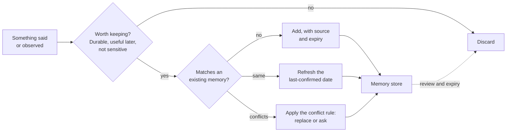

# Writing and maintaining memory

*Part of [Memory & context for the product leader](./README.md)*

*Last reviewed: 2026-09 · Volatility: fast*

## TL;DR

Most talk about memory is about reading: what to fetch and show. The write path decides
whether the memory is worth reading. It answers four questions.

- **What** is worth saving?
- **When** does the product save it?
- **How** does a new fact change an old one?
- **When** does a memory expire or get reviewed?

A store with no write policy fills with trivia, duplicates and stale facts. Retrieval then
serves that mess back with full confidence. Most "the AI got me wrong" complaints trace to
the write path, not to the model.

> 🎯 **For the product leader**
>
> **Why it matters** — Memory quality is set when a memory is written. A bad note saved
> today is a wrong answer next month.
>
> **What it changes in your decisions** — You ask for a written policy for saving,
> updating and expiring memories. You decide who writes: the model, your code, or the
> user.
>
> **Ask yourself** — *"If a user changes an important fact today, what happens to the old
> version in our store? Who would notice if it did not change?"*
>
> **Risk if ignored** — The store grows without limit. Old and new facts sit side by side.
> The assistant picks one, and the user sees a confident mistake.

## The mental model: a filter before the store

Think of the write path as a gate in front of the store, not a pipe into it.



## What is worth saving

Save a fact only if it passes four tests.

1. **Durable.** It will still be true next week. "Prefers short answers" passes. "Is
   running late today" fails.
2. **Useful later.** It would change a future answer. Trivia does not.
3. **Not held elsewhere.** If an account system already owns the true value, read it
   live. A copy in memory will go stale.
4. **Safe to keep.** Health, financial and other sensitive details need an explicit
   decision. The default should be "do not store".

Anthropic's docs note that Claude "usually refuses to write sensitive information to
memory files," and advise validation code for stronger guarantees. Treat model behaviour
as a helpful default, not a control.

## When memory gets written

There are three common triggers. Each has a different cost and a different failure.

| Trigger | How it works | Strength | Weakness |
| --- | --- | --- | --- |
| The user asks | "Remember that I prefer metric units." | Clear consent. Easy to explain. | Users forget to ask. |
| End of session | A step reads the transcript and extracts durable facts. | Catches what users never think to say. | Extra model cost. Can save wrong inferences. |
| During the task | The agent writes its own notes as it works. | Fits long tasks that outlast one context window. | The model decides what matters, and may save trivia. |

The third is the design behind the Claude memory tool. Anthropic's context-engineering
guidance calls it structured note-taking, where "the agent regularly writes notes persisted to
memory outside of the context window." Pair it with guidance on what to save. The docs
suggest prompts such as "Only write down information relevant to <topic> in your memory system."

## Updating without creating a mess

Facts change. When a new fact meets an old one, the store needs a rule. Pick one per
kind of memory.

| Situation | Example | Rule |
| --- | --- | --- |
| Same fact again | "I like short answers" (twice) | Keep one record. Refresh its last-confirmed date. |
| Newer replaces older | "I moved to Pune" after "I live in Delhi" | Replace, and keep the old value in history for audit. |
| Ambiguous conflict | "Send it to Sam" vs a saved "Send it to Sara" | Ask the user. Do not guess. |
| Sensitive change | A new bank account | Require confirmation through the product, not through chat text. |

Without a rule, an append-only store keeps both facts. Later retrieval may return the
older one first.

## Expiry and review

Every memory needs an end date or a review date. Anthropic's docs recommend that
applications "periodically delete memory files that haven't been accessed in a long
time." Good defaults:

- Expire preferences after a long idle period, such as 12 months without use.
- Expire case notes when the case's retention period ends.
- Show users their memories periodically and let them confirm or remove them.

## Worked example: one fact, changing over time

*This example is invented, to show the method.*

A travel assistant serves a customer over several months.

| When | What the user says | Write decision | Store after |
| --- | --- | --- | --- |
| Jan | "I'm vegetarian." | Durable and useful. Add, source "chat, Jan". | diet: vegetarian |
| Mar | "Book me the vegetarian option again." | Same fact. Refresh date. | diet: vegetarian (confirmed Mar) |
| Jun | "I've started eating fish." | Conflict, newer wins. Replace. Keep old value in history. | diet: pescatarian (Jun); history: vegetarian |
| Jun | "My card ends in 4412." | Sensitive, and a payment system owns it. Do not store. | unchanged |
| Nov | (no mention for 5 months) | Nothing written. At the 12-month review, ask: "Still pescatarian?" | diet: pescatarian, pending review |

Without the policy, the store would hold "vegetarian" and "pescatarian" together. It would
also hold a card fragment nobody wanted stored.

## Who writes: the model or your code

| Design | Who decides what to save | Good for | Watch for |
| --- | --- | --- | --- |
| Model-written notes | The model, through a memory tool | Long agent tasks, coding, research | Trivia, clutter, saving untrusted text |
| Pipeline extraction | Your code runs an extraction step | Consumer personalization, predictable rules | Extra cost, wrong inferences |
| User-authored | The user, in a settings page | Anything sensitive or high-stakes | Low coverage |

Most products mix these. High-stakes items should use the last row.

## Failure modes

- **Trivia hoarding.** Everything is saved. Retrieval buries the useful facts.
- **Silent overwrite.** A wrong inference replaces a correct fact, and no history remains.
- **Duplicate drift.** The same fact is stored five ways. The versions slowly disagree.
- **Saving untrusted text.** The model writes content from a web page or email into
  memory. That content may carry instructions. See
  [When memory goes wrong](./when-memory-goes-wrong.md).
- **No provenance.** A memory has no source, so you cannot check it or delete what came
  from it.

## Under the hood

A write policy is a short function in front of the store. This sketch shows the shape.
It is illustrative, not a library.

```python
def write_memory(store, candidate, caller, now):
    if not passes_tests(candidate):                 # durable, useful, safe
        return "dropped"
    if candidate.source_is_untrusted:               # web page, inbound email, tool output
        return queue_for_user_confirmation(candidate)
    existing = store.find_similar(candidate, subject=caller.subject_id)
    if existing is None:
        store.add(candidate.with_expiry(now).with_source())
        return "added"
    if existing.text == candidate.text:
        existing.last_confirmed = now
        return "refreshed"
    if candidate.is_newer_and_low_risk():
        store.archive(existing)                     # keep history for audit
        store.add(candidate.with_expiry(now).with_source())
        return "replaced"
    return ask_user(existing, candidate)            # ambiguous or sensitive
```

If you use the Claude memory tool, your application handles six commands: `view`,
`create`, `str_replace`, `insert`, `delete` and `rename`. Each command is a point
where you can validate, log or block. Two rules from the docs matter most:

- **Validate every path.** A path such as `/memories/../../secrets.env` must not reach
  files outside the memory directory.
- **Cap file size and delete old files.** Both are your job, not the model's.

## Practitioner checklist

- [ ] Do we have a written rule for what is worth saving, including what is never saved?
- [ ] Is it clear who writes: the model, our code, or the user?
- [ ] What happens to an old fact when a new one contradicts it? Do we keep history?
- [ ] Does every memory carry a source, a last-confirmed date and an expiry or review
      date?
- [ ] Are facts owned by another system read live instead of copied?
- [ ] Is content from untrusted sources kept out of memory, or held for confirmation?

## Related lessons

- [Memory as a product decision](./memory-as-a-product-decision.md) — the four-part
  question the write policy implements.
- [Session, user & organizational memory](./session-user-and-organizational-memory.md) —
  which shape a new memory belongs to.
- [Retrieval as memory](./retrieval-as-memory.md) — how stored memories get read back.
- [When memory goes wrong](./when-memory-goes-wrong.md) — staleness, poisoning and
  deletion.
- [Context & memory](../agentic-ai/context-and-memory.md) — the memory hierarchy, and why
  models left alone save trivia.

## Sources

- Anthropic, [Memory tool](https://platform.claude.com/docs/en/agents-and-tools/tool-use/memory-tool)
  (Claude API docs): the six commands, path validation, size caps, expiry, the sensitive
  information note, and prompt guidance on what to write. Checked 2026-09.
- Anthropic, [Effective context engineering for AI agents](https://www.anthropic.com/engineering/effective-context-engineering-for-ai-agents)
  (Sep 29, 2025): structured note-taking as agentic memory. Checked 2026-09.
- The travel-assistant table and the write-policy code are invented and illustrative.
