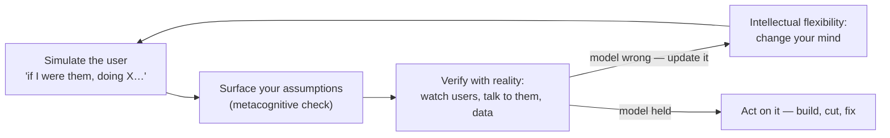

# Cognitive empathy: anticipating unvoiced needs

*Part of [Product sense for the AI PM](./README.md)*

## TL;DR

Cognitive empathy is understanding how users *think, decide, and experience* your product —
distinct from emotional empathy (feeling their pain). It lets you predict what a user will
need or do next because you can simulate their perspective. Three tools build it:
**metacognition** (examining your own thinking and biases), **intellectual flexibility**
(changing your mind as evidence arrives), and **simulation** (mentally or literally walking
the user's journey). Together they fight the *curse of knowledge* — the expert's blindness
to what a novice sees.

> 🎯 **For the AI PM**
>
> **Why it matters** — With an AI product you're deep in the model's capabilities and jargon;
> the curse of knowledge is acute. You know the prompt that works — the user has no idea what
> to type, what the model can do, or why it just refused them.
>
> **What it changes in your decisions** — You design for the user's *actual* mental model of a
> chat box or a suggestion, not your expert one, and you build the affordances (examples,
> hints, graceful failure) that a first-timer needs.
>
> **Ask yourself** — *"What does a user who has never seen our model assume it can do — and
> where will that assumption break?"*
>
> **Risk if ignored** — A powerful model that only power users can operate, because the team
> mistook its own fluency for the user's.

## Metacognition — thinking about thinking

Metacognition is stepping back to examine your *own* decision process. For a PM it's the
guard against knee-jerk assumptions and the **curse of knowledge** — where an expert forgets
what it's like to be a novice. A payments PM steeped in fintech jargon assumes an
onboarding step is "obvious"; a first-timer finds it baffling. Metacognitive awareness
turns that assumption into a testable question — *run a quick test with a first-timer* rather
than trusting expert intuition.

It also catches **overconfidence**: teams grow sure of a solution after months on it, though
people routinely overestimate their accuracy. Two techniques:

- **Ask "what would prove me wrong?"** — the falsification habit, run on your most confident
  belief.
- **Pre-mortems** — imagine it's a year out and the product failed; list the plausible
  reasons. This surfaces hidden risks *before* they cost you.

In meetings, metacognition can be literal: pause and say *"let's break down how we're
arriving at this conclusion,"* making the implicit logic explicit and examinable.

## Intellectual flexibility — changing your mind

Cognitive empathy needs **flexibility**: adapting your thinking as new data arrives, and
holding perspectives other than your own. In fast-moving domains, rigidity is obsolescence.
Flexibility is being able to say *"I was wrong"* or *"the market changed, so our approach
should too"* without ego.

Cultivate it deliberately:

- **Seek diverse perspectives** — sit with customer support to hear raw frustration, shadow a
  sales call for enterprise concerns. These pop your product-building bubble.
- **Challenge your own assumptions** — *"we've always targeted young users; could this serve
  seniors, and what would that take?"*
- **Build psychological safety** — reward people for surfacing inconvenient truths; assign a
  devil's advocate.
- **Beware the sunk-cost fallacy** — months invested in a feature is not a reason to keep
  investing if it isn't working. Kodak invented the digital camera and clung to film; rigid
  thinking, not lack of evidence, sank it.

## Simulation — walking in the user's shoes

To anticipate needs, **simulate** the user: *"if I were a [target user] trying to do [X] in
[context], what would I feel or do next?"* Mental simulation surfaces gaps before they hit
production. Ways to do it:

- **User-journey mapping** — diagram each step toward a goal and, at each one, imagine the
  user's question or emotion. Mapping a first food-delivery order reveals that after
  ordering the user wonders *"what happens now?"* — so you need clear confirmation and
  tracking to pre-empt anxiety.
- **Role-playing / living the day** — take rides as driver *and* passenger; build something
  with your own API as an external dev would. Real simulation builds empathy data misses.
- **Dogfooding + usability testing** — use your own product; watch real users and narrate
  their thoughts (*"she's hesitating here — confused by the wording"*).
- **Perspective switching** — for multi-sided products, step through as each user type. A
  growth feature for buyers may add friction for sellers — a trade-off you can only see by
  switching seats.

Some PMs write mini-narratives — *"Jane opens the app to do X, expects Y, sees Z, gets
frustrated"* — because vividly imagining a task engages circuits close to actually doing it.

## Many tactics, one strategy: talk to your users

A working PM's version of everything above, from Twitter's Paul Rosania: there are many
tactics for staying in tune with users, "but only one strategy: talk to your users."
Three of his observations are worth keeping:

- **Mediated research has a failure mode.** A dedicated research team is a luxury — and
  a danger, because consuming results second-hand trains you to think of users as
  *cohorts and percentages* instead of humans. Quantitative data is critical; so is
  regularly watching one real person use your product.
- **The problems you witness are realer than the ones you're told.** Watching people do
  the simplest things — like repeatedly mistyping a password and concluding the *product*
  is broken — surfaces legitimate user problems that no survey would ever report,
  because the user doesn't know that's what happened.
- **This is where intuition actually comes from.** At first the patterns you spot are
  small ("people struggle with passwords"). Over time they generalize into heuristics
  ("web forms can never be too simple"), the heuristics connect, and eventually you
  predict user feedback before you hear it. Product sense isn't innate perception — it's
  compressed exposure: patterns → heuristics → generalization, built by repetition.

That last point is the practical answer to "can product sense be learned?" — yes, at
the rate you accumulate direct user contact, and no faster.

## Actionable steps

- **Daily perspective-taking** — spend a few minutes imagining one user interaction; jot the
  pain point; verify it with real users or data.
- **Metacognitive check-ins** — at kickoff, design review, and pre-launch, list assumptions
  and how you might be wrong.
- **Maintain empathy maps** — what the persona says, thinks, does, feels at each stage;
  update as research arrives.
- **Train flexibility** — deliberately seek contrarian data; assign someone to argue the
  opposite of the prevailing view.
- **Immerse in the user's environment** — visit the clinic, work a support shift; concrete
  detail feeds intuition analytics can't.

> **📦 Mini-case — the password "bug."** Twitter PM Paul Rosania, volunteering at
> computer-help sessions, watched users mistype their password repeatedly and conclude
> *Twitter* was broken. No support ticket, survey, or dashboard would ever surface
> that as a product problem — the users didn't know what happened, so they couldn't
> report it. Only direct observation catches the problems users can't articulate;
> that's the concrete case for simulation *plus* verification, never simulation
> alone.

## Failure modes

- **Curse of knowledge** — designing for your own expert mental model, not the novice's.
- **Confirmation over falsification** — gathering evidence you're right instead of hunting for
  what would prove you wrong.
- **Ego-driven rigidity** — defending a months-old decision against new evidence (sunk cost).
- **Empathy by assertion** — claiming to "know the user" without simulation or observation.

## Practitioner checklist

- [ ] Have I named my key assumptions about the user — and how each could be wrong?
- [ ] Did I run "what would prove me wrong?" on my most confident belief?
- [ ] Have I actually *simulated* the journey (mapped, role-played, or watched a real user),
      not just imagined it once?
- [ ] For a multi-sided product, did I step through every user type?
- [ ] Am I treating a months-old decision as revisable when evidence shifts?

## Related lessons

- [Motivation theory](./motivation-and-behaviour.md)
- [Creativity](./creativity.md)
- [Product sense for AI products](./product-sense-for-ai.md)
- [TPM: eval-driven development](../technical-product-management/tpm-for-ai-products.md) — where trace-reading turns empathy into a ritual
