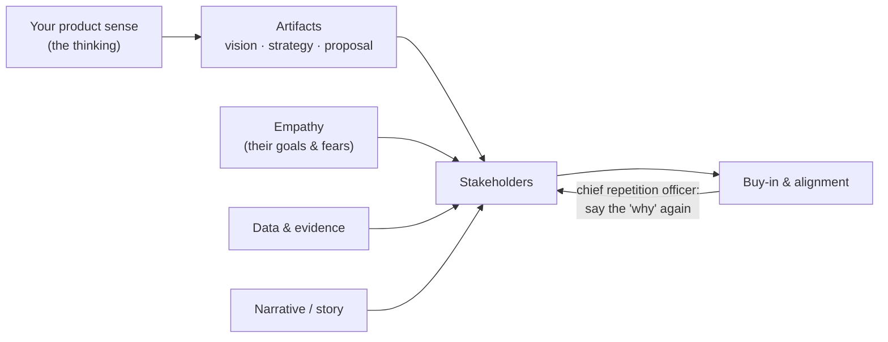

# Communication: artifacts, influence, and interviews

*Part of [Product sense for the AI PM](./README.md)*

## TL;DR

Product sense you can't communicate can't move a team. Three facets matter: crafting clear
**artifacts** (vision, strategy, proposals) that capture your thinking so others can act on
it; **influencing stakeholders** — earning buy-in without authority through empathy, data,
and storytelling; and **navigating interviews** on both sides of the table, where *how* you
communicate product sense often matters as much as the ideas themselves. The through-line:
clarity is king, and you are the "chief repetition officer" for the product's why.

> 🎯 **For the AI PM**
>
> **Why it matters** — AI products are full of uncertainty — what the model can do, where it
> fails, what "good" means. Vague communication compounds that uncertainty into
> misalignment; clear artifacts and honest framing are how you keep a team sane when the
> ground is shifting.
>
> **What it changes in your decisions** — You write the vision and the "what we won't do" for
> the AI feature *explicitly*, and you communicate model limitations and unknowns candidly
> instead of over-selling a demo.
>
> **Ask yourself** — *"Does everyone from eng to the exec understand what this AI feature is
> for, what it won't do, and how we'll know it worked?"*
>
> **Risk if ignored** — A team that each imagined a different product behind the same
> impressive demo, discovering the gap only at launch.

## Crafting product artifacts

Artifacts are the tangible communications a PM produces — they capture product sense in words
and become the team's reference.

- **Vision** — a concise, inspiring picture of the future you'll create, rooted in user value.
  Amazon's Kindle vision: *"Every book ever printed, in any language, all available in under
  60 seconds."* Focus on the *why* and *what* (the outcome), not the *how*. Trick: imagine
  your product wildly successful in five years — what does that look like for users? — and
  distil that.
- **Strategy document** — if vision is the destination, strategy is the map: target
  users/segments, value propositions, positioning, and the few product pillars. Tell it as a
  story (problem/opportunity → approach → why it wins), back it with data, and clarify scope
  (what's *out*). Tailor depth to the audience — a one-page summary for execs, the full doc
  for the team.
- **Proposals & one-pagers** — to persuade others to back a specific idea: context, problem,
  solution, impact. Amazon's **PRFAQ** (an imagined press release + FAQ) forces a
  customer-centric, clarity-first viewpoint. However you format it, answer: *Who is it for?
  What problem? Why now? How do we know it's needed? What does success look like?* Keep it
  brief; add a mock-up to make it concrete.

**Tips:** use plain language (a non-expert should get the gist), get feedback (*"does this
vision excite you? is this clear?"*), and keep artifacts *living* — update them and let them
become the reference others quote in meetings.

## Influencing stakeholders

A brilliant idea still needs buy-in, and a PM usually has no authority to compel it.
Influence is earned:

- **Know each stakeholder's motivation** — an eng lead values feasibility and team morale; a
  CFO values ROI; sales cares about customer demand. Tailor the message: lead with the KPI
  for leadership, the technical challenge for engineers.
- **Build credibility with transparency and data** — back proposals with research (*"60% of
  200 surveyed users were frustrated with onboarding"*) and be honest about risks and
  unknowns (*"here's what we know, here's what we're still investigating"*). Over-selling
  erodes trust; candour builds it.
- **Tell stories** — wrap the idea in a narrative (a user's day made better) so stakeholders
  *feel* the problem, not just hear the facts.
- **Find champions, understand detractors** — enlist supporters to spread the message; meet
  skeptics one-on-one — heard skeptics often become allies, and sometimes they've spotted a
  real risk.
- **Keep channels open** — regular updates prevent surprises and build confidence. Influence
  is many small conversations and active listening, not one big speech. Enable others to win
  alongside you and goodwill compounds.

## Navigating interviews

Communication of product sense is on trial in interviews — on both sides.

**As the candidate.** Product-sense questions ("design a product for X," "improve feature Y
for user Z") test structured thinking, creativity, empathy, and clear communication.
Practice a frame: clarify the **goal and user** → surface **needs** → **prioritize** a
solution → describe it with **trade-offs**. Think out loud about *why* each choice — that
shows metacognition and empathy. Keep a few real stories ready and structure them with
**STAR** (Situation, Task, Action, Result), emphasizing the product-sense parts: the user
insight, how you weighed options, what principle guided you, what you learned. Ask a couple
of clarifying questions; acknowledge pros/cons (there's rarely one perfect answer); stay
concise.

**As the interviewer.** Assess product sense through *how* they reason. Do they start from the
user? Do they show cognitive empathy (asking about goals and pain)? Creativity (multiple
solutions)? Awareness of trade-offs and a simple strategy? Ask reflective follow-ups (*"why
that approach?"*, *"what if metric A drops?"*) to see rationale (metacognition) and
adjustment (flexibility). Have them critique an existing product; strong candidates
structure the critique around user needs, cite observations, and justify improvements. Keep
it conversational — the best signal comes when a candidate thinks out loud.

## Actionable steps

- **Refine one document** — hand a current vision/strategy/PRD to someone outside the team; if
  they don't "get it" without you narrating, sharpen it.
- **Build a stakeholder map** — list who cares about what; tailor your next proposal to hit
  those notes.
- **Send proactive updates** — a regular note with progress, data, next steps, and a user
  insight builds credibility.
- **Practice a product case** occasionally (any product, 15 minutes, timed) — it sharpens
  on-the-spot recommendations too.
- **If hiring, design the loop** — a product-sense rubric and questions that let candidates
  show it.

> **📦 Mini-case — the PRFAQ discipline.** Amazon's press-release-and-FAQ ritual forces
> the communication *before* the build: if you can't write the customer-facing story
> of the finished product in one page — what it is, who it's for, why they care — you
> don't understand the product yet, and no amount of building will fix that. The
> artifact is the thinking. A cheap version for any team: draft the launch
> announcement at kickoff, and treat every sentence you can't yet write as an open
> product question.

## Failure modes

- **Jargon and length** — a doc only the author understands; busy stakeholders won't dig.
- **Facts without story** — technically correct pitches that never make anyone *feel* the
  problem.
- **Over-selling** — hiding risks to win approval, then losing trust when reality lands.
- **Assumed alignment** — believing people remember the vision; they don't, so repeat it.

## Practitioner checklist

- [ ] Would someone outside my team understand this artifact with no verbal narration?
- [ ] Have I tailored the message to what each key stakeholder actually cares about?
- [ ] Am I candid about risks and unknowns, not just the upside?
- [ ] Does the proposal answer who/what problem/why now/how we know/what success looks like?
- [ ] Am I repeating the "why" often enough that the whole team can state it?

## Related lessons

- [Creativity](./creativity.md)
- [Cognitive empathy](./cognitive-empathy.md)
- [Domain expertise](./domain-expertise.md)
- [TPM: specs, PRDs & RFCs](../technical-product-management/specs-prds-and-rfcs.md) — the artifacts, professionalized
