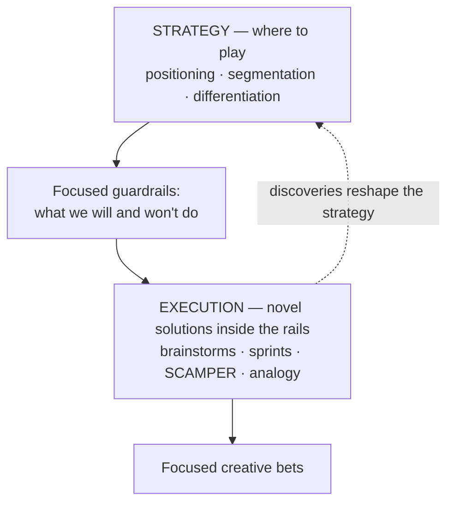

# Creativity: from strategic thinking to creative execution

*Part of [Product sense for the AI PM](./README.md)*

## TL;DR

Creativity in product management has two halves. **Strategic thinking** decides *where* the
product plays — positioning, segmentation, differentiation, and a focused core strategy
(being clear on what you will and won't do). **Creative execution** is the day-to-day
generation of novel solutions — a safe, curious mindset; team rituals (brainstorms, design
sprints, hack days); and techniques (SCAMPER, mind mapping, analogy, constraint
brainstorming). Strategy without execution is a nice deck; execution without strategy is
motion without direction. You need both, and creativity is most effective *within*
strategic guardrails.

> 🎯 **For the AI PM**
>
> **Why it matters** — "Let's add AI" is not a strategy. When a capability is suddenly cheap
> and everyone has it, differentiation moves to *what problem you point it at and for whom* —
> a strategic-creativity question, not a model question.
>
> **What it changes in your decisions** — You force a real positioning statement for the AI
> feature ("for [who] who [need], it is [what] unlike [alternative]") and kill AI ideas that
> don't strengthen a core pillar, however cool the demo.
>
> **Ask yourself** — *"If a competitor shipped the same model tomorrow, what would still make
> our product the one users choose?"*
>
> **Risk if ignored** — A pile of undifferentiated AI features chasing the trend, none tied to
> a segment that cares.

## Strategic thinking

Strategic creativity means cleverly defining *who* the product is for, *what* unique value
it offers, and *how* it wins.

- **Positioning** — fill in the statement: *"For [target segment] who [need], [Product] is a
  [category] that [benefit]. Unlike [competition], it [unique differentiator]."* Good
  positioning is specific — not "a task app for everyone" but "a task app for working parents
  that reduces mental load by prioritizing intelligently." It then guides every feature and
  message.
- **Segmentation** — divide the market into groups and choose whom to serve, ideally by
  **need or behaviour**, not demographics. Slack targeted engineering teams already chatting
  in IRC (a behavioural segment) inside "internal team communication" — winning a niche that
  then expanded.
- **Differentiation** — why a user picks you over alternatives. Two broad routes: do
  something **new** (capabilities others lack) or something **better** (same need, faster /
  cheaper / more delightful). Find the *whitespace* competitors leave — but differentiation
  must **matter to the user**; a feature nobody cares about isn't winning.
- **Core of strategy** — *focus*: being clear on what you will and won't do. Instagram's early
  core was photo sharing, made simple and social, deliberately *not* expanding too soon.
  Derive a few clear pillars from your vision and value proposition, and use them to
  **evaluate ideas**: if an idea doesn't strengthen a pillar, shelve it.

Tie it together with goals (OKRs) so quarterly execution follows the strategy rather than
chasing shiny objects — and validate the strategy against reality (is the chosen segment
responding?), adjusting as you learn.

## Creative execution

Even the best strategy falters without the day-to-day creativity to realize it.

**Mindset.** Creativity starts with **psychological safety** and a **growth mindset** — people
must feel safe proposing wild ideas and asking "stupid" questions. Model it: celebrate
experiments that fail, frame setbacks as learning, reward those who iterate. And engineer
**diversity of thought** — bring design, engineering, data, and marketing into ideation early;
each lens seeds ideas no silo reaches alone.

**Rituals** that institutionalize creativity:

- **Brainstorms** with rules ("defer judgment," "no idea too crazy") — plus formats like
  *Crazy Eights* (8 sketches in 8 minutes) and *brainwriting* (write silently, then share) so
  introverts contribute as much as extroverts.
- **Design sprints** — a time-boxed problem-to-tested-prototype process; even a mini
  brainstorm → prototype → test cycle injects structured creativity.
- **Hack days** — freedom to build anything product-related; many beloved features (Gmail's
  undo send) began this way.
- **"How might we…?"** framing and the **5 Whys** to reframe a problem from its root — reframing
  opens new solution spaces.

**Techniques** to break analytical ruts:

| Technique | What it does |
| --- | --- |
| **SCAMPER** | Substitute, Combine, Adapt, Modify, Put to another use, Eliminate, Reverse — systematically tweak an existing flow |
| **Mind mapping** | Branch outward from a central problem to surface non-linear connections |
| **Analogy thinking** | Borrow structure from a far field ("how do airports manage flow?") |
| **Constraint brainstorming** | Add an absurd constraint ("zero eng resources," "voice only") to force new approaches |
| **User co-creation** | Ask power users how *they'd* solve it |

Not every idea will be good — the point is to generate range, then filter against strategy.

## Actionable steps

- **Protect creative time** — a recurring slot for experiments, treated like sprint planning.
- **Run a creativity workshop** with a clear goal ("ideas to improve week-1 retention") and a
  cross-functional group.
- **Adopt one ritual** this quarter (idea round, quarterly hack day) and make it repeatable.
- **Cross-pollinate** — a monthly "cool things I saw" share; outside inspiration seeds
  features.
- **Prototype bold ideas** fast — a tangible prototype rallies support that a doc can't.

> **📦 Mini-case — Instagram says no.** Early Instagram was a cluttered check-in app
> (Burbn) whose data showed users mostly shared photos. The strategic-creativity move
> wasn't adding — it was *cutting*: rebuild around photo sharing only, with filters as
> the differentiator, and explicitly decline everything else the app already did.
> Focus was the creative act. The test for your own roadmap: can you name the last
> good idea you shelved because it didn't strengthen a pillar? If not, you have a
> backlog, not a strategy.

## Failure modes

- **"Add AI" as strategy** — a capability with no segment, positioning, or differentiation
  behind it.
- **Differentiation nobody wants** — unique features that don't map to a real user need.
- **No focus** — a strategy that never says "no," so effort scatters.
- **Ideation theatre** — brainstorms that generate stickies but never prototype or ship.

## Practitioner checklist

- [ ] Can I state the product's positioning in the "for [who] who [need]…unlike…" form?
- [ ] Are my segments defined by need/behaviour, not just demographics?
- [ ] Does every roadmap item strengthen a named core pillar?
- [ ] Is there a repeatable team ritual that generates and *tests* new ideas?
- [ ] When stuck, do I reach for a technique (SCAMPER, analogy, constraints) instead of
      grinding the same angle?

## Related lessons

- [Cognitive empathy](./cognitive-empathy.md)
- [Communication](./communication.md)
- [Domain expertise](./domain-expertise.md)
- [First principles: the method](../first-principles/the-method.md) — deconstruction as the sharpest ideation technique
