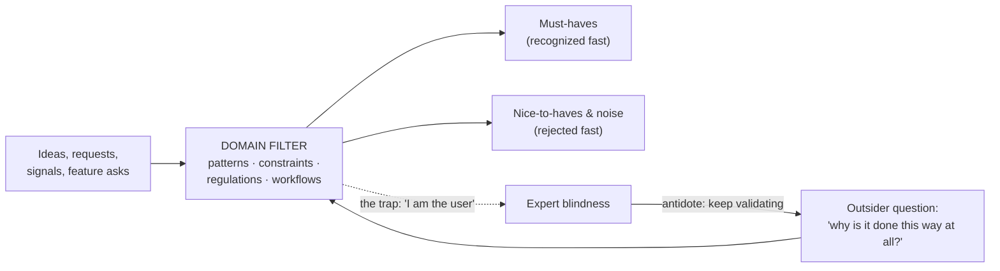

# Domain expertise: turning knowledge into intuition

*Part of [Product sense for the AI PM](./README.md)*

## TL;DR

PM fundamentals transfer across industries, but **domain expertise** — deep knowledge of the
specific world your product lives in — is what upgrades guessing into *knowing*. It acts as
a filter on decisions: you can tell must-haves from nice-to-haves, anticipate what will hit
resistance, and move faster because you recognize patterns. Build it deliberately
(immersive learning, asking "dumb" questions, hands-on experience, a network of experts),
but don't get **trapped** by it — experts drift into "I am the user" and stop validating.
The best domain experts pair deep knowledge with an outsider's willingness to ask *"why is
it done this way at all?"*

> 🎯 **For the AI PM**
>
> **Why it matters** — AI has two domains at once: the *user's* industry and the *AI* domain
> itself (what models do well, where they hallucinate, what evaluation and safety require).
> Thin knowledge in either produces confident, wrong product bets.
>
> **What it changes in your decisions** — You learn enough of the model's failure surface to
> know which features are safe to ship and which need a human in the loop — and enough of the
> user's world to know where a wrong answer is merely annoying versus genuinely harmful.
>
> **Ask yourself** — *"In this domain, what does a confidently-wrong model output actually cost
> the user — and do I know that cost well enough to set the quality bar?"*
>
> **Risk if ignored** — Shipping an AI feature that's impressive in the demo and dangerous in
> the real workflow, because nobody understood the domain stakes.

## Why domain knowledge strengthens intuition

Picture a healthcare-software PM. With thin domain knowledge you build an EMR around generic
UX and obvious needs (notes, scheduling). With deep expertise you know the intricacies:
HIPAA compliance, that doctors have *seconds* to enter data between patients, common billing
issues, the politics of adopting new tools. That knowledge becomes a **filter**: you intuit
must-haves vs. nice-to-haves, foresee what will meet resistance, and prioritize what truly
adds value in context.

Experts decide faster because they **recognize patterns** and recall lessons from similar
situations. A fintech PM who knows payments cold will quickly reject a "cool" feature whose
compliance approval would take a year — and find a creative path that meets the need without
the red tape, where a novice would charge in and hit the wall.

Domain knowledge also builds **credibility**: speaking your users' and stakeholders' language
makes you a more persuasive communicator and a more trusted decision-maker — sales and
marketing back your calls when they see you truly understand the market.

**But it must complement, not replace, the rest.** Marty Cagan's warning: experts get
entrenched, assume they *are* the user, and overlook new perspectives. Domain expertise is a
turbocharger for product sense — used wisely, it lets you skip the basics and focus on the
subtleties outsiders miss — but only if you keep validating.

## Building it (without getting trapped)

Entering a new domain, be systematic:

- **Immersive learning** — in the first months, consume everything: industry reports, blogs,
  webinars, thought leaders. Cagan suggests ~1–3 months of aggressive learning to chart
  strategy confidently in a new domain. Treat it like an onboarding project with goals ("by
  day 60, I'll have talked to 5 domain experts and read 3 seminal reports").
- **Ask "dumb" questions (AMA-style)** — flip *Ask Me Anything*: have experts explain things to
  you. Not grasping how ACH differs from wire transfers? Ask a fintech ops manager. Humility
  and curiosity win respect; it's far better to ask early than to decide wrong out of
  ignorance.
- **Hands-on experience** — live the domain: observe hospital staff using the software; sell
  something on your own e-commerce platform; build a small project with your own API.
  Knowledge is procedural and contextual, not just vocabulary.
- **Leverage team and users** — part of expertise is knowing *where to get answers fast*. Build
  a network of go-to people (the veteran engineer, the candid customer) and pull in
  specialists (legal, compliance, ops) early.

**Balance with fresh perspective.** A newcomer's *"why is it done this way at all?"* sometimes
becomes a breakthrough, precisely because they don't accept "that's just how it is." As you
gain expertise, preserve that outsider curiosity: rotate people across domains, keep
validating with real users, and don't let expertise curdle into arrogance — *"constantly
revisit assumptions about the domain and customers,"* because new regulations, behaviours,
and competitors will surprise you.

## Tackling AMAs — expertise on display

An **AMA** (Ask Me Anything) is a stress test for domain mastery. Imagine leading a crypto
product when a customer asks, *"with the new crypto tax rules, how does this wallet help me
report transactions?"* Deep expertise lets you explain the rule change and point to the
specific (or planned) tax-reporting features — even citing conversations with tax experts.
A teammate's forward-looking *"will DeFi threaten our approach?"* draws on your strategic
view of how you differ and coexist.

Preparing for an AMA is itself a learning exercise — it forces you to anticipate what
knowledgeable people will ask, refreshing your understanding. Comfortably fielding tough
Q&A signals to executives that you're on top of the domain and to your team that they can
trust your guidance. And when you *can't* answer, knowing where to find it — or having an
informed hypothesis — is itself the mark of expertise.

## Actionable steps

- **Make a 90-day learning plan** — key topics, experts to meet, resources to read; track it
  like onboarding.
- **Join domain communities** — forums, Slack groups, meetups; absorb practitioners'
  real-world nuances.
- **Run expert/user panels** — invite experienced users or specialists to Q&A with the team.
- **Document domain knowledge** — a living wiki of terms, regulations, and common workflows;
  writing it reinforces your learning and onboards others.
- **Test your expertise** — write the 5 hardest questions someone could ask about your
  product/domain and answer them; the gaps are your study list.

## Failure modes

- **The expert's trap** — "I am the user," so you stop validating and miss new perspectives.
- **Vocabulary without context** — knowing the terms but not the procedures and stakes.
- **Arrogance over curiosity** — treating the domain as solved when regulations and behaviours
  keep moving.
- **Analysis paralysis in a new domain** — endless learning with no decisions; set a
  time-box.

## Practitioner checklist

- [ ] Do I know this domain's real constraints (regulatory, workflow, political), not just its
      surface needs?
- [ ] Have I asked the "dumb" questions instead of deciding around my ignorance?
- [ ] Have I experienced the domain hands-on, not only read about it?
- [ ] Am I still validating with real users rather than assuming I *am* the user?
- [ ] Could I field an AMA on my product/domain — and do I know where to find what I can't
      answer?

## Related lessons

- [Communication](./communication.md)
- [Cognitive empathy](./cognitive-empathy.md)
- [Product sense for AI products](./product-sense-for-ai.md)
