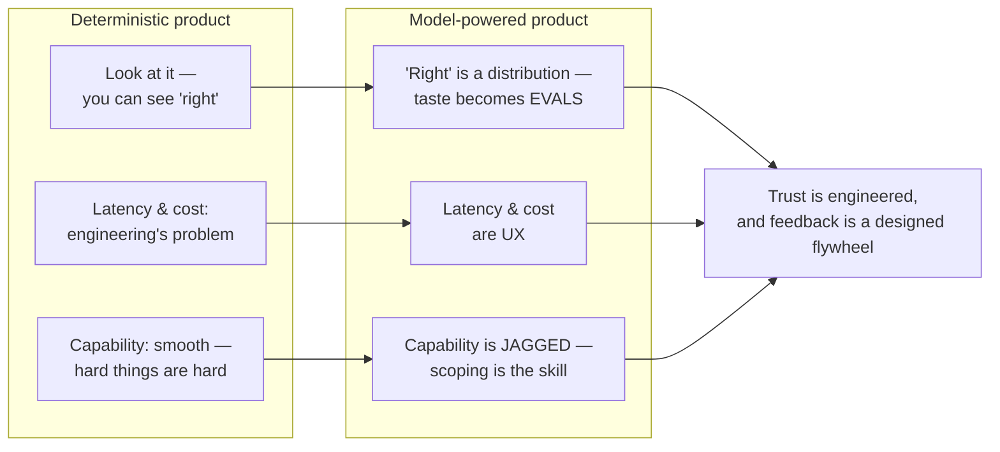

# Product sense for AI products

*Part of [Product sense for the AI PM](./README.md)*

## TL;DR

Everything in this module still applies when your product is powered by a model — but the
*material* changes, and product sense has to adapt. A model is **probabilistic, non-stationary,
and confidently wrong sometimes**, which reshapes five instincts: quality becomes something
you *measure with evals* rather than eyeball; trust has to be engineered under
**non-determinism**; **latency and cost** become first-class UX, not back-end details; the
capability frontier is **jagged**, so scoping is a product skill; and **feedback becomes a
flywheel** you design on purpose. The AI PM's edge is knowing where a model genuinely adds
value — and where a boring deterministic feature wins.

> 🎯 **For the AI PM**
>
> **Why it matters** — This is the synthesis lesson: it takes motivation, empathy, creativity,
> communication, and domain expertise and ports them into the one place they most often
> break — a product whose core component is a stochastic model.
>
> **What it changes in your decisions** — You stop treating "the model" as the product and
> start treating the *system around it* (evals, guardrails, fallbacks, UX for failure) as the
> product — which is exactly where taste and judgment live.
>
> **Ask yourself** — *"For this job, does a probabilistic model actually beat a deterministic
> feature — and if it does, how will the product stay trustworthy when the model is wrong?"*
>
> **Risk if ignored** — Shipping the demo, not the product: a magical first impression that
> can't be trusted, measured, or afforded at scale.

## Taste becomes evals

With a normal feature you can look at it and know if it's right. With a model, "right" is a
distribution — the same prompt can produce a great answer today and a poor one tomorrow. So
product taste has to become **measurable**. The AI PM defines what "good" means as an
**eval**: a graded set of representative and adversarial cases the product must pass, run
continuously so quality doesn't silently regress. Your product sense — knowing what a great
output *feels* like for this user — is what makes the eval meaningful; without it, you
optimize a number that doesn't map to value. And it's exercised trace by trace: reading real
outputs and calling pass or fail, not reviewing an aggregate score someone else defined —
the dashboard tells you *that* quality moved, the traces tell you *what good means here*.

This is the same instinct as [measuring satisfaction](./motivation-and-behaviour.md), just
moved upstream into the model's outputs. (The engineering of this — golden sets,
LLM-as-judge, regression gates — is the subject of the AI Engineering track's
[evals lesson](../content/04-evals-observability/evals.md).)

## Trust under non-determinism

A confidently-wrong answer is worse than a visibly-broken feature, because the user can't
tell. Product sense for AI is largely **trust design**:

- **Show your work** — grounding answers in retrieved, citeable sources so users (and you) can
  check them, and saying *"I don't know"* when the context is silent rather than inventing.
- **Calibrate confidence** — signal uncertainty in the UX instead of presenting every output
  with the same authority.
- **Design the failure, not just the success** — the [Hook-model reward](./motivation-and-behaviour.md)
  has an evil twin: a bad first output that breaks the habit forever. Graceful failure,
  easy correction, and "undo" are core, not polish.

The [cognitive-empathy](./cognitive-empathy.md) tools matter more here: simulate the user
who trusts a wrong answer, and the one who's been burned once and now distrusts every
answer.

## Latency and cost are UX

For a deterministic feature, latency and cost are engineering concerns. For an AI feature
they're **product** concerns, because they trade directly against quality:

| Lever | Buys you | Costs you |
| --- | --- | --- |
| Bigger / stronger model | Quality | Latency, $ |
| Smaller / quantized model | Speed, $ | Some quality |
| Streaming the response | *Perceived* speed | — |
| Caching | Speed, $ | Staleness risk |

The product-sense call is *which axis this user's job actually cares about* — a coding
assistant lives or dies on latency; a legal-review tool can wait for accuracy. (The
mechanics of these trade-offs are the AI Engineering track's
[stack-tradeoffs lesson](../content/06-strategy-tradeoffs/inference-stack-tradeoffs.md).) This is
[motivation theory](./motivation-and-behaviour.md) again: a slow or costly path is friction
that squanders the model's value.

## The jagged frontier — scoping as product sense

Model capability is **jagged**: a model can draft a legal argument yet miscount the words in
a sentence. There's no smooth "it's good at hard things and better at easy things" line. So
the highest-leverage product decision is **scoping** — pointing the model at jobs inside its
reliable frontier and keeping it away from jobs where its failure is costly and invisible.

This is [strategic thinking](./creativity.md) applied to capability: the differentiation
isn't "we have AI," it's *"we found the job where this model is genuinely reliable and
valuable, for a user who cares."* Often the best AI product uses the model for the 20% that
delights and a deterministic system for the 80% that must be correct.

For enterprise products, plot the job on two axes: **task complexity** and the buyer's
**tolerance to task failure**. Most visible AI wins live where failure is cheap (a blog
outline that misses is deleted); enterprise value lives where failure is expensive (a
diagnosis, a payment) — and the way in is not to wait for a perfect model but to take
jobs of modest complexity in low-tolerance domains and *wrap service checks around
them*: verification steps, human gates, escalation paths. The frontier then shifts
outward with the model — but the scoping discipline is what got you in the room.

## AI-enabled vs. AI-native

A distinction that sharpens scoping conversations: an **AI-enabled** product bolts a
model onto an existing product — the photo editor that grows an "AI-enhance" button. An
**AI-native** product is built around the model — the generative image platform where,
without the model, there is no product. The test is one question: *turn the model off —
what's left?* Both are legitimate; the product-sense failure is building one while
pricing, roadmapping, or pitching the other. AI-enabled work is feature work: the
existing product's quality bar, margins, and UX conventions still govern. AI-native work
changes the question you start from — not *"how can AI enhance this feature?"* but
*"if intelligence were the core material, how would we solve this problem from
scratch?"* — and it makes the eval, the failure UX, and the cost curve the product,
not accessories to it.

## The patterns users now expect

Product sense includes knowing the reference points users bring, and 2025 reset them.
Four patterns became the standard candles every AI product gets compared against:

- **Deep-research modes** — async, minutes-long jobs that return a *report*, not a
  chat reply. They taught users that waiting is acceptable when the output is worth
  it — and reset expectations for what "an answer" can be.
- **Proactive AI** — briefings and suggestions that arrive *unprompted* (the
  Pulse-style morning digest). The pattern's product sense is consent and restraint:
  proactivity delights precisely until it presumes.
- **Persistent memory as a headline feature** — "it remembers me" moved from silent
  personalization to a marketed, user-visible, user-editable surface. Products that
  remember silently now read as creepy; products that forget read as broken.
- **Visible thinking** — showing reasoning progress ("searching… comparing…
  reconsidering…") became a trust affordance. Users forgive latency they can watch;
  they distrust magic that arrives instantly and wrong.

None of these obligates you to build all four — but every user who's touched a 2025-era
assistant now carries them as priors, and your product is scored against those priors
whether you like it or not.

## Feedback is a flywheel you design

AI products get better with use — but only if you build the loop. Every correction,
thumbs-down, and edit is signal. The [Hook model's investment phase](./motivation-and-behaviour.md)
becomes literal: user effort improves the product's data, which improves outputs, which
earns more use. Product sense here is deciding **what feedback to capture, how to make giving
it feel worthwhile, and how to close the loop** without violating trust or privacy.

One caution from systems thinking: a flywheel is a *reinforcing* feedback loop, and
reinforcing loops amplify whatever is in them — engagement, but also bias (a model that
under-serves a group gets less engagement from that group, which further shrinks their
share of the training signal) and filter bubbles. Design the **balancing loops**
alongside the flywheel: monitoring for skew, ethical checks on what the loop optimizes,
and a metric of success that rewards long-term user value rather than whatever spins
fastest.

## Keep a human in the loop where it counts

Domain sense ([domain expertise](./domain-expertise.md)) tells you where a wrong answer is
merely annoying (a playlist suggestion) versus genuinely harmful (a medical dosage, a
financial transaction). The former can be fully automated; the latter needs a human
checkpoint, clear provenance, and an audit trail. Matching the level of autonomy to the
**cost of being wrong** in this domain is one of the sharpest expressions of AI product
sense.

## Actionable steps

- **Write the eval before the feature** — define, in cases, what "good" means for this job.
- **Design the wrong-answer path** — grounding, "I don't know," easy correction, undo.
- **Name the axis that matters** — latency, quality, or cost — and optimize for the user's job,
  not all three.
- **Scope to the reliable frontier** — list the jobs the model does reliably and the ones it
  doesn't; ship the first, guard or defer the second.
- **Instrument the feedback loop** — capture corrections and close the loop into evals and,
  where appropriate, the product.
- **Match autonomy to stakes** — full automation where wrong is cheap; human-in-the-loop where
  wrong is costly.

> **📦 Mini-case — Air Canada's chatbot.** The airline's support bot confidently
> described a bereavement-refund policy that didn't exist; a tribunal made the company
> honor it. Every theme of this lesson in one incident: an ungrounded model given full
> authority in the UX (no citations, no "I don't know"), no eval that would have
> caught policy hallucination, and a failure whose cost was legal and reputational,
> not technical. The fix — answer only from real policy documents, with citations —
> was a *product* decision available the whole time.

## Failure modes

- **Demo-driven development** — a great first impression that can't be measured, trusted, or
  afforded at scale.
- **Confident hallucination in the UX** — every output presented with equal authority, wrong
  ones included.
- **AI where deterministic wins** — using a probabilistic model for a job that needed to be
  exactly right.
- **No feedback loop** — a product that never improves because the signal was never captured.
- **Ignoring cost/latency until launch** — a delightful feature that's unaffordable or too slow
  in production.

## Practitioner checklist

- [ ] Have I defined "good" as an eval, grounded in real product taste?
- [ ] Is there a designed, trustworthy path for when the model is wrong?
- [ ] Do I know which of latency / quality / cost this user's job actually prioritizes?
- [ ] Have I scoped the feature to the model's *reliable* frontier?
- [ ] Is there a feedback loop that turns usage into improvement?
- [ ] Does the level of autonomy match the cost of a wrong answer in this domain?

## Related lessons

- [Motivation theory](./motivation-and-behaviour.md)
- [Cognitive empathy](./cognitive-empathy.md)
- [Creativity](./creativity.md)
- [Domain expertise](./domain-expertise.md)
- [Recap & real-world examples](./recap.md)
- [Evals & testing the harness](../harness-engineering/phases/15-evals-and-testing-the-harness/README.md) — where product taste for AI becomes an executable eval suite.
