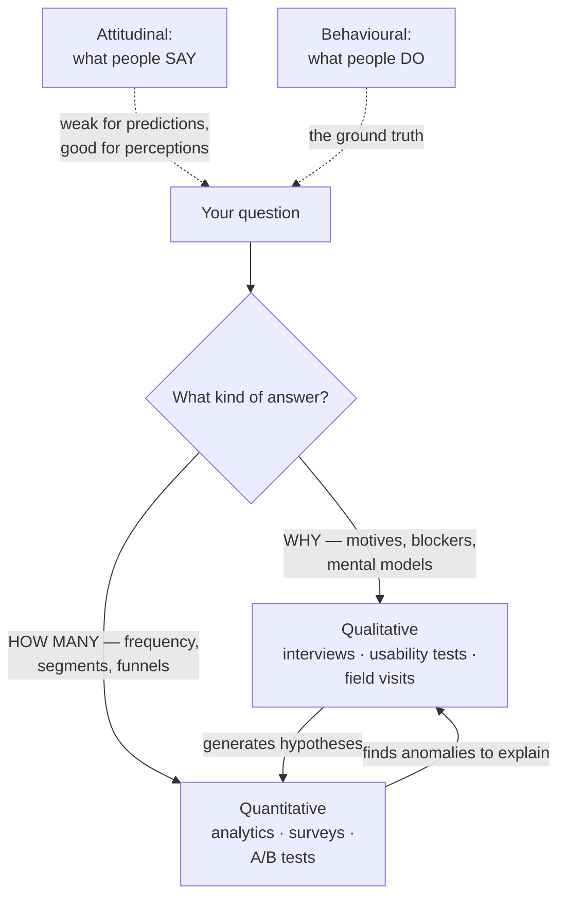

# User research: the craft of finding out

*Part of [Product sense for the AI PM](./README.md)*

## TL;DR

Product sense is built from user contact, so the craft of *getting* that contact well
is a discipline of its own. The method landscape splits on two axes: **qualitative**
(interviews, usability tests — *why* people do things) vs. **quantitative** (analytics,
surveys at scale — *how many* do it), and **attitudinal** (what people say) vs.
**behavioural** (what they actually do). The two iron rules: match the method to the
question, and **trust behaviour over statements** — users are honest about problems
and unreliable about solutions and futures. Interviewing is the core skill: past
behaviour over hypotheticals, open questions over leading ones, silence over filling
it, and five users per round beats fifty per year.

> 🎯 **For the AI PM**
>
> **Why it matters** — AI products add research questions classic funnels miss: do
> users *trust* the output, can they *repair* a wrong answer, do they understand what
> the system can't do? None of these appear in analytics until they appear as churn.
>
> **What it changes in your decisions** — You watch users react to *imperfect* AI
> output (seed the test with a wrong answer on purpose); you treat edits, retries,
> and abandonments as research data; and you never validate an AI feature only on its
> best-case demo behaviour.
>
> **Ask yourself** — *"Have I watched a real user hit a wrong answer from this
> feature — and did they recover, retry, or quietly leave?"*
>
> **Risk if ignored** — A feature validated on what users *said* in a demo glow, dead
> in three weeks on what users actually *did*.

## The method map

The pairing is the point: qualitative finds the *why* behind the numbers, quantitative
tells you which whys are common enough to matter. A funnel drop-off (quant) tells you
where; five interviews (qual) tell you what happened there; a survey (quant again)
tells you how widely the explanation holds. Research that stays on one side of the map
produces either anecdotes with no scale or scale with no explanation.

And always weight by the say–do gap: users who *said* they'd pay, didn't; users who
*said* the old design was fine had already stopped using it. Statements are data about
perceptions; behaviour is data about the world.

## Interviewing — the core skill

Most PM research is conversations, and most conversations are quietly corrupted by the
asker. The craft:

- **Past behaviour, not hypotheticals.** "Tell me about the last time you booked
  travel for work" beats "would you use a tool that…?" every single time. People are
  historians of their own behaviour and terrible futurists.
- **Open, then narrow.** Start wide ("walk me through it"), drill into specifics
  ("what did you do next? what were you feeling there?"), save your topics for the
  end. The structure of the [5 Whys](../first-principles/the-method.md) works on
  humans too — gently.
- **Don't lead, don't pitch.** "Don't you think X would help?" produces polite
  agreement, not truth. If you're testing your idea, watch them *use* it; don't ask
  them to bless it.
- **Silence is a tool.** The best material arrives after the pause you resisted
  filling.
- **Small n, high frequency.** Five users per round, rounds every few weeks,
  compounds into the [pattern → heuristic → intuition](./cognitive-empathy.md)
  engine. Fifty interviews once a year produces a report; five a month produces
  product sense.

Usability testing is interviewing's behavioural twin: give a task, watch, and narrate
nothing. The moment you explain the interface, the test is over — you won't ship
yourself alongside the product to explain it to everyone else.

## Researching AI products

Three questions classic research rarely asks, and AI products live or die on:

- **The trust curve.** First impressions of AI features are unstable: delight at a
  good answer, betrayal at a bad one. Research the *second* session, not just the
  first — and deliberately show participants an imperfect output to watch the
  recovery: do they edit, retry, distrust the feature, or distrust the whole product?
  ([Trust design](./product-sense-for-ai.md) is downstream of what you learn here.)
- **The mental model.** Users bring wildly different theories of what the system is
  ("it's Google," "it's a person," "it knows my account"). Mismatched mental models
  predict misuse and disappointment better than any usability metric — surface them
  by asking users to *predict* what the feature will do before they try it.
- **Behavioural signals as always-on research.** Edits, retries, rephrasings, and
  abandonments are a continuous usability study running in production — the same
  signals your [flywheel](./product-sense-for-ai.md) captures. Sample the traces
  behind them ([the trace-reading ritual](../technical-product-management/tpm-for-ai-products.md))
  and you have qualitative research at quantitative scale.

## Failure modes

- **The focus-group future** — asking users to predict their own behaviour, then
  building on the predictions.
- **Leading the witness** — questions shaped so agreement is the polite answer;
  research as pitch rehearsal.
- **Demo-glow validation** — testing only the happy path of an AI feature; users
  meet the unhappy path in production instead.
- **Research theatre** — a big annual study that's stale before it's summarized,
  instead of small continuous contact.
- **Cohorts-and-percentages drift** — consuming only aggregated findings until users
  stop being people ([the mediated-research trap](./cognitive-empathy.md)).

## Practitioner checklist

- [ ] For my current open question: is it a *why* or a *how many* — and does my
      method match?
- [ ] Am I asking about past behaviour, or hypothetical futures?
- [ ] When did I last *watch* a user (not a dashboard) use the product — and was it
      within the month?
- [ ] For AI features: have I tested the wrong-answer experience on purpose?
- [ ] Are edits/retries/abandonments instrumented and sampled as research, not just
      as metrics?

## Related lessons

- [Cognitive empathy](./cognitive-empathy.md)
- [Motivation & behaviour](./motivation-and-behaviour.md)
- [Product sense for AI products](./product-sense-for-ai.md)
- [Metrics & experimentation](../technical-product-management/metrics-and-experimentation.md)
