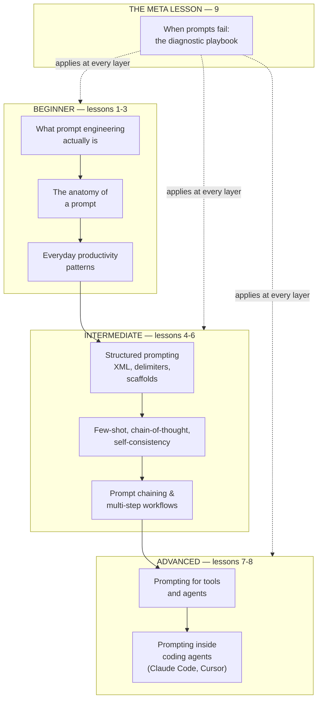

# Prompt engineering, from productivity to coding agents

Prompt engineering is the craft of writing input a language model will *reliably* act
on. At the beginner end, that means turning ChatGPT or Claude from a novelty into a
productivity tool — drafting emails, summarizing meetings, translating a rough idea
into a first draft. In the middle, it means the techniques power users reach for when
consistency starts to matter: structured prompts, few-shot examples, chain-of-thought,
prompt chaining. At the far end, it means the patterns developers use to drive coding
agents like Claude Code and Cursor — where the prompt is a spec, and the model is
writing the code that ships. This module walks the full arc, one lesson per layer, so a
reader picks up the mental model on lesson 1 and lands with real advanced patterns by
lesson 9.

**A note on scope.** This is the *technique* module — the how of writing a prompt. Two
adjacent modules deepen it in different directions. [Context engineering](../context-engineering/README.md)
argues that the *inputs to the prompt* (instructions, retrieval, memory, tool state)
are the real quality lever at scale — prompt engineering is one layer inside that
picture. [TPM for AI products](../technical-product-management/tpm-for-ai-products.md)
covers how you *evaluate* whether a prompt works. This module stays on the craft
itself: what to write, why, and how it fails.

## The knowledge graph

Every lesson sits on one arc — from the person typing into a chat box, through the
techniques that make outputs reliable, to the patterns that let coding agents ship
production code:

Read it in three passes. **Beginner:** the mental model, the six parts of a prompt,
and the everyday patterns that turn an LLM into a productivity tool. **Intermediate:**
the techniques power users use to make outputs consistent — structure, worked examples,
step-by-step reasoning, multi-step chains. **Advanced:** how prompts change shape when
the model can *act* — call tools, run code, edit files — and the specific patterns of
prompting inside coding agents.

## The lessons

- [**What prompt engineering actually is**](./what-prompt-engineering-actually-is.md) —
  the mental model shift from "asking questions" to "engineering the input a
  probabilistic system needs."
- [**The anatomy of a prompt**](./the-anatomy-of-a-prompt.md) — role, task, context,
  format, examples, constraints: the six parts a good prompt names on purpose.
- [**Everyday productivity patterns**](./everyday-productivity-patterns.md) — the
  handful of moves that get 80% of the value out of ChatGPT or Claude for real work.
- [**Structured prompting: XML, delimiters, scaffolds**](./structured-prompting.md) —
  what changes when consistency starts to matter and the prompt gets reused.
- [**Few-shot, chain-of-thought, and self-consistency**](./few-shot-cot-self-consistency.md)
  — the classical techniques that reliably improve reasoning quality, and when each
  earns its cost.
- [**Prompt chaining and multi-step workflows**](./prompt-chaining-and-workflows.md) —
  breaking a task into sub-prompts, passing outputs between steps, and why one prompt
  stops being enough.
- [**Prompting for tools and agents**](./prompting-for-tools-and-agents.md) — how the
  prompt changes shape when the model can call tools, and the ReAct pattern that runs
  underneath most agent scaffolds.
- [**Prompting inside coding agents**](./prompting-inside-coding-agents.md) — how
  Claude Code, Cursor, and Aider prompts differ from chat prompts, and the "prompt as
  spec" pattern that runs modern agent-assisted development.
- [**When prompts fail: the diagnostic playbook**](./when-prompts-fail.md) — the
  short list of things that actually go wrong, and how to tell which one bit you.

Each lesson pairs the technique with a **🎯 For the AI PM (or coding-agent user)**
briefing — why it matters, the decision it changes, the question to ask your team or
yourself, and the risk if ignored — plus one diagram that makes the mechanic concrete.

## Connects to other tracks

- [Context engineering](../context-engineering/README.md) — the strategic layer above
  prompt engineering: instructions, retrieval, memory, and tool state as the real
  quality lever, with the prompt as one component inside them.
- [TPM for AI products](../technical-product-management/tpm-for-ai-products.md) —
  eval-driven development, the discipline that decides whether a prompt is good
  enough to ship.
- [AI agents](../ai-agents/README.md) — the scaffolds this module's lesson 7 prompts
  drive.
- [Agentic workflows](../agentic-workflows/README.md) — the multi-step orchestration
  patterns this module's lesson 6 chains fit inside.
- [Tool calling](../tool-calling/README.md) — the function-schema mechanics this
  module's lesson 7 sits on top of.

**📌 Close out the module:** [Recap & real-world examples](./recap.md).
