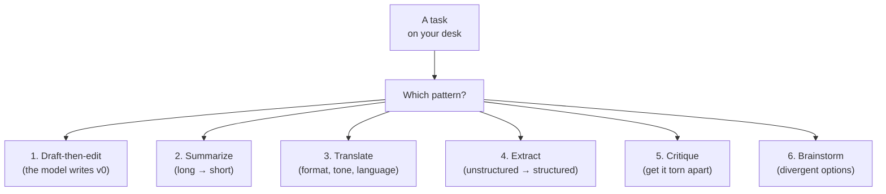

# Everyday productivity patterns

*Part of [Prompt engineering, from productivity to coding agents](./README.md)*

## TL;DR

Most of the value people get out of ChatGPT or Claude comes from a small handful of
patterns applied to real work: drafting the first version of something you'll edit,
compressing a long thing into a shorter thing, translating between formats and
languages, extracting structured facts out of unstructured text, and getting a
critique before you send. None of these are exotic. Each has a shape that works and
a shape that doesn't. This lesson names the six patterns, gives each one a canonical
prompt shape, and shows the small edits that turn a mediocre output into a useful
one. If you are new to prompt engineering, this is the lesson where you get most of
the productivity lift — long before you need XML tags or chain-of-thought.

> 🎯 **For the AI PM (or coding-agent user)**
>
> **Why it matters** — Your intuition for where a model shines and where it quietly
> fails is built from doing this daily, not from reading benchmarks. This is the
> cheapest possible training.
>
> **What it changes in your decisions** — You start noticing which of your team's
> workflows shorten by 40% with one good prompt, which shorten by 90%, and which
> break because the model was the wrong tool for the job. That map is your
> intuition-in-progress.
>
> **Ask yourself** — *"Which of the six patterns matches the task I'm about to do —
> and am I using its canonical shape?"*
>
> **Risk if ignored** — You either under-use models (a slow, manual habit for a task
> a prompt would collapse in seconds) or over-use them (asking a model to do a job
> it has no way of doing well).

## The six patterns

Almost every everyday LLM use fits one of these six. Naming the pattern before you
start typing is the difference between a prompt that lands and one that wanders.

## Pattern 1 — Draft-then-edit

The model writes a version zero. You edit it. This works because writing from a blank
page is the slow part of most communication tasks, and the model is very good at
producing a competent, unremarkable first draft. Your editing turns it into your
voice.

The shape:

> Draft a [thing] for [audience]. Purpose: [what you want them to do after reading].
> Tone: [describe or name it]. Length: [under N words]. Keep the facts below exact:
> [the facts].

The move: never accept the model's draft as the final version. It reads as a middling
version of every draft in its training data, because that's what it is. The draft
saves you the empty-page cost. The edit is what makes it yours.

## Pattern 2 — Summarize

Long thing in, short thing out. The model is very good at this until the "long thing"
is longer than its context window or contains reasoning it can't verify.

The shape:

> Summarize the [document / meeting transcript / thread] below for [audience]. Length:
> [under N words / N bullets]. Include: [what must not get cut]. Exclude: [what does
> not matter].
>
> [Content]

The moves: always name the audience (a summary for your CEO is different from one for
your engineers), always name what must not get cut (numbers, decisions, action
items), and always cap the length or you'll get a "summary" almost as long as the
original.

## Pattern 3 — Translate

Between languages, between formats (Markdown to slack, JSON to CSV, paragraph to
bullet list), or between registers (formal to casual, technical to plain-language).
Very reliable — this is close to what the model was trained on.

The shape:

> Convert the [input format] below to [output format]. Keep: [what must stay].
> Change: [what to translate].
>
> [Content]

The move: explicitly name what stays and what changes. A "casual version" of a
technical email can quietly lose the technical precision that made it useful. State
which of tone, structure, or content is up for change and which is fixed.

## Pattern 4 — Extract

Pull structured data out of unstructured text: entities, dates, sentiment, action
items, decisions, contact details, prices. The extraction is often the whole point —
you feed the output into a spreadsheet or a database.

The shape:

> Extract the following fields from the text below, returning JSON with exactly these
> keys: `[key1, key2, key3]`. If a field is not present, use `null`. Do not add
> fields I did not ask for.
>
> [Content]

The moves: name the exact keys, name the type (`null` when missing, not "N/A" or "not
found"), and forbid extra fields. Without the last constraint the model will
helpfully add `notes` or `confidence` fields you didn't ask for and your parser
didn't expect.

## Pattern 5 — Critique

Ask the model to tear a thing apart. This is the most under-used pattern, because
most people default to asking the model to praise or improve. Critique is faster and
more useful.

The shape:

> You are a skeptical [expert role]. Read the [document / plan / argument] below and
> list the strongest reasons it is wrong or weak. Do not offer improvements. Do not
> soften your language. Order by severity.
>
> [Content]

The move: block softening explicitly ("do not offer improvements," "do not soften").
Left alone, the model will hedge every criticism with a compliment and a suggestion.
Stripped of the softening, the same output is far more useful.

## Pattern 6 — Brainstorm

Divergent options, not one recommended answer. Useful when you want to see the space
of possibilities before you commit.

The shape:

> Generate [N] distinct [things]. Each should [criterion]. Cover a range from
> [conservative option] to [ambitious option]. Do not repeat variations of the same
> idea in different words.
>
> [Optional context]

The move: force diversity ("cover a range from X to Y") and forbid rewording ("do not
repeat variations"). Without those, the model gives you N phrasings of one idea.

## Tradeoffs

- **Speed vs. quality.** These patterns are optimized for productivity — the model
  gets you 80% there in 5 seconds, and you spend a minute editing. If the stakes are
  high enough that the last 20% has to be perfect, iterate the prompt or move up to
  the intermediate techniques in later lessons.
- **Trust vs. verification.** Extract and translate are highly reliable and lightly
  verified. Summarize needs a spot-check for accuracy. Critique is opinion, not fact.
  Match your verification effort to which pattern you used.
- **Chat vs. saved template.** A one-off draft belongs in the chat. Anything you do
  weekly should become a saved prompt in a text file. Losing five minutes to typing
  the same prompt shape every week is losing five minutes forever.

## Failure modes

- **Prompt as query.** "Summarize this" instead of the shape above. The output is a
  summary of the wrong thing at the wrong length for the wrong audience.
- **Skipping the audience.** Every one of the six patterns has an implicit audience.
  Unnamed, the model picks its default one — usually the average reader on the
  internet, which is nobody.
- **Praise-mode by default.** Asking "what do you think of this?" gets you a
  reassurance. Ask for critique when you want critique.
- **No cap on length.** A summary or a brainstorm without a length spec turns into a
  scroll of prose. The cap is the discipline.
- **Fabrication in extraction.** The model fills in a missing field with a
  plausible-sounding value instead of `null`. State the null contract or you'll
  poison your spreadsheet.

## Practitioner checklist

- [ ] For today's tasks: can I name which of the six patterns each one is?
- [ ] Am I using the canonical shape for that pattern, or improvising each time?
- [ ] Do the prompts I run weekly live in a text file I can grab, or am I retyping
      them?
- [ ] For summaries and extractions: did I state the audience, the length, and (for
      extraction) the null contract?
- [ ] When I want criticism, am I asking for it — with the softening explicitly
      blocked?

## Related lessons

- [The anatomy of a prompt](./the-anatomy-of-a-prompt.md)
- [Structured prompting: XML, delimiters, scaffolds](./structured-prompting.md)
- [When prompts fail: the diagnostic playbook](./when-prompts-fail.md)
