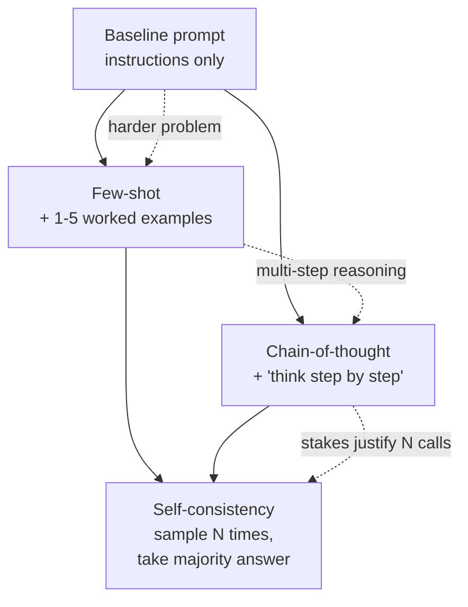

# Few-shot, chain-of-thought, and self-consistency

*Part of [Prompt engineering, from productivity to coding agents](./README.md)*

## TL;DR

Three techniques from the research literature reliably lift model quality on tasks
that are harder than "reword this paragraph." **Few-shot** — showing the model a few
worked input-output pairs before the real input — lifts consistency on classification,
extraction, and any task with a house style words can't fully describe.
**Chain-of-thought** (CoT), from Wei et al. 2022, asks the model to reason step by
step before answering, and lifts accuracy on math, logic, and multi-hop reasoning.
**Self-consistency**, from Wang et al. 2022, samples several answers and takes the
majority, at the cost of running the same prompt several times. Each has a specific
job, a specific cost, and a specific failure mode. Beginner-level prompts often work
without them. Anything harder than pattern-matching against training data usually
needs one.

> 🎯 **For the AI PM (or coding-agent user)**
>
> **Why it matters** — Modern models often do CoT internally on hard problems (the
> reasoning-model class does it by default), but you still need to know when the
> technique earns its cost — and when few-shot gives you a bigger lift than a bigger
> model.
>
> **What it changes in your decisions** — Before you upgrade to a more expensive
> model, you first try three worked examples and step-by-step reasoning. Cheaper,
> faster, often enough.
>
> **Ask yourself** — *"Have I actually shown this model what the right answer looks
> like, or have I only described it in words?"*
>
> **Risk if ignored** — You pay for a bigger model to solve a problem a smaller model
> with three examples would have handled. Or you ship a reasoning-heavy feature that
> silently fabricates answers when a two-line "think step by step" would have caught
> the error.

## The three techniques



Read the diagram as a decision ladder. Start with the baseline prompt. When
consistency slips, add few-shot examples. When the problem involves multi-step
reasoning, add chain-of-thought. When the stakes justify running the same call
several times, add self-consistency on top.

## Few-shot: show, don't tell

The pattern is simple. Put 1-5 worked examples between the instructions and the
input, each labeled clearly:

```
<examples>
<example>
<input>Meeting notes: "Team agreed to ship v2 by Q3. Anna will draft the plan by Friday."</input>
<output>{"action_items": [{"owner": "Anna", "task": "draft the plan", "due": "Friday"}]}</output>
</example>
<example>
<input>Meeting notes: "We discussed the roadmap. No decisions."</input>
<output>{"action_items": []}</output>
</example>
</examples>

<input>{{USER_INPUT}}</input>
```

Three lessons from a decade of use:

- **Cover the edges.** One example of the happy path, one of a common edge case
  (empty result, malformed input), one of a case you'd otherwise expect the model to
  get wrong. Three well-chosen examples usually beat ten random ones.
- **Match the format exactly.** If the output should be JSON, the example outputs
  are JSON. If it should be a paragraph, they're paragraphs. Format drift in
  examples produces format drift in outputs.
- **More is not always better.** Beyond ~5 examples, most tasks stop improving, and
  you're spending tokens. Some tasks improve up to ~20; test to find the knee.

Few-shot works because it's a shorthand for a specification that would be tedious to
write. The model interpolates between the examples. The right examples define the
right interpolation.

## Chain-of-thought: reason step by step

Wei et al. showed in 2022 that appending "let's think step by step" to a prompt
lifted the model's performance on math word problems by tens of percentage points.
The mechanism, roughly: the model is a next-token predictor. When it commits to an
answer first, it has no way to backtrack. When it commits to reasoning first, each
step in the reasoning constrains the next, and the final answer inherits the
constraint.

Two flavours:

- **Zero-shot CoT.** Add "think step by step before answering" to the prompt. No
  examples needed. Works on many tasks; often not enough on the hardest ones.
- **Few-shot CoT.** Provide examples where the *output* itself shows step-by-step
  reasoning ending in the answer. Stronger; requires the effort of writing worked
  reasoning traces.

A concrete shape:

> Think step by step. Show your reasoning. Then give the final answer inside
> `<answer>...</answer>`.

The `<answer>` tag lets the calling code parse just the answer while the reasoning
trace is available for debugging and evaluation.

**A note on reasoning models.** Modern reasoning-tuned models (the OpenAI o-series,
Claude's extended-thinking mode, DeepSeek-R1-class open models) do chain-of-thought
internally by default. Explicit CoT prompts are less necessary — sometimes
counterproductive, since the model has already been trained to reason. The
technique still applies to non-reasoning models and to cases where you need the
reasoning trace visible.

## Self-consistency: sample and vote

Wang et al. (2022) showed that on reasoning tasks, running the same prompt N times
with a nonzero temperature, then taking the majority answer, beats a single call —
even a single call at the same total token cost. The intuition: the model's
"single answer" is one sample from a distribution. Sampling several and voting
approximates the mode of the distribution, which is often closer to correct than
any one sample.

The cost is real: N calls instead of 1. Reserve self-consistency for:

- High-stakes decisions where a wrong answer is expensive.
- Structured problems (math, code, extraction) where "majority" is well-defined.
- Cases where you can't verify the answer another way.

Don't reach for it on open-ended generation (essays, creative writing) — there's no
majority to vote on.

## Tradeoffs

- **Few-shot vs. bigger model.** Three good examples often lift a smaller model
  above a bigger one, at a fraction of the cost. Always try few-shot before you
  upgrade tiers.
- **CoT vs. latency.** Chain-of-thought lengthens outputs. If your product has a
  strict latency budget and the reasoning trace isn't needed, use a reasoning-tuned
  model that thinks internally instead of prompting for visible steps.
- **Self-consistency vs. cost.** N× the calls is N× the token bill. Fine for a batch
  overnight; painful for a real-time feature at scale.
- **Explicit CoT vs. reasoning models.** With a reasoning-tuned model, extra
  "think step by step" prompting sometimes hurts. Test both.

## Failure modes

- **Examples that don't represent the input distribution.** Three cheerful,
  well-formed examples produce a model that fails on the first messy real input.
  Draw examples from real user inputs, not synthetic ones.
- **Format drift in few-shot.** Your examples end in a period, the real output
  doesn't. The one you didn't notice contaminated the rest.
- **CoT that hallucinates the reasoning.** The model produces plausible-looking
  steps that don't actually support the answer. Chain-of-thought is more legible,
  not more truthful. Verify the answer, not the trace.
- **Self-consistency on the wrong task.** Voting on an essay doesn't make it
  better. It makes it more expensive.
- **Few-shot that leaks answers.** Your example inputs happen to be from your eval
  set. You are now measuring memorization, not generalization.

## Practitioner checklist

- [ ] For any task the model handles inconsistently: have I tried 3-5 worked
      examples before assuming the model can't do it?
- [ ] For reasoning-heavy tasks: does my prompt ask for step-by-step reasoning, or
      am I using a reasoning-tuned model where the trace is internal?
- [ ] For high-stakes decisions: is self-consistency (N samples, majority vote)
      worth the cost, or am I gambling on one call?
- [ ] Do my few-shot examples cover the edges (empty result, malformed input, hard
      case) — not just three variants of the happy path?
- [ ] Are my few-shot inputs drawn from real user data, and disjoint from my
      evaluation set?

## Related lessons

- [The anatomy of a prompt](./the-anatomy-of-a-prompt.md)
- [Structured prompting: XML, delimiters, scaffolds](./structured-prompting.md)
- [Prompt chaining and multi-step workflows](./prompt-chaining-and-workflows.md)
- [TPM for AI products](../technical-product-management/tpm-for-ai-products.md) — the
  eval-driven discipline that decides whether a technique earned its cost.
