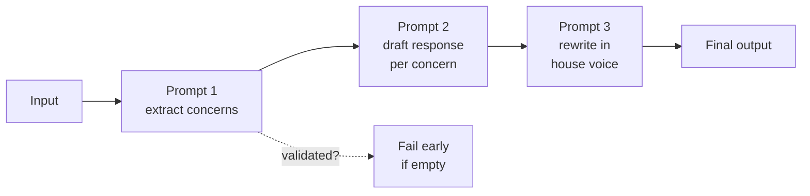

# Prompt chaining and multi-step workflows

*Part of [Prompt engineering, from productivity to coding agents](./README.md)*

## TL;DR

Some tasks are too complex for one prompt to solve well. **Prompt chaining** breaks a
task into a sequence of smaller prompts, each doing one thing, with the output of
one feeding the input of the next. A chain that does "find the top three concerns in
this document, draft an email addressing each, then rewrite in the CEO's voice" runs
three prompts, not one — and each prompt does its one job better than any single
prompt would do all three. Chaining trades one call for several, and one prompt to
debug for several to debug, in exchange for higher-quality outputs and clearer
failure modes. It's the last technique inside a single-user, single-thread workflow
before you cross into the *agentic* territory of the next two lessons, where the
model itself decides what to run next.

> 🎯 **For the AI PM (or coding-agent user)**
>
> **Why it matters** — Most production LLM features you use are chains, whether
> their authors called them that or not. Naming the pattern is the difference
> between designing a chain on purpose and stumbling into one that half-works.
>
> **What it changes in your decisions** — When a single prompt underperforms, the
> next move is to decompose the task before reaching for a bigger model. You spec
> chains as first-class product artifacts, not implementation details buried in
> engineering.
>
> **Ask yourself** — *"Is my prompt trying to do two verbs at once — and would
> splitting it in half improve the output enough to justify the second call?"*
>
> **Risk if ignored** — You ship a single-prompt feature that fails 20% of the time
> on complex inputs, when a two-step chain would have failed 3% of the time.

## The mental model

Each box is one prompt. Each arrow is a data handoff. The dotted arrow is the
underappreciated part: a chain can *check* an intermediate output and fail early
rather than passing garbage forward. A one-prompt version has to succeed at all
three steps in one shot, with no place to stop and check.

## When to chain

Not every task benefits. Chain when:

- **The task has two or more distinct verbs.** "Extract action items and then draft
  a Slack message about them" is two verbs. Splitting them lets each prompt use its
  best technique — extraction as few-shot JSON, drafting as free prose with a role.
- **One step's output is another step's input, and the format matters.** Feeding
  structured JSON into the next prompt is more reliable than parsing prose.
- **You need to inspect the middle.** For debugging, for eval, or for user review
  ("show me the concerns you extracted before you draft the email"), intermediates
  need to exist.
- **Different steps want different models.** A cheap fast model can do extraction;
  a stronger, slower model can do the final draft. A one-prompt version pays the
  strong-model tax on the whole task.

Don't chain when the task is genuinely single-verb, or when the latency of N
sequential calls kills the user experience.

## Patterns that come up over and over

- **Extract → decide → act.** Pull structured facts from unstructured input, apply
  a decision rule (usually a simple prompt or non-model logic), then generate the
  action based on the decision. Almost every "AI feature that does something" fits
  this shape.
- **Draft → critique → revise.** One prompt writes a draft. A second prompt (often
  with a critical role) tears it apart. A third rewrites incorporating the
  critique. Slower and more expensive than one call — reliably higher quality on
  writing tasks.
- **Split → summarize → synthesize.** For inputs too long for one context window,
  split into chunks, summarize each, then synthesize the summaries. Map-reduce for
  LLMs.
- **Route → specialist.** A cheap classifier prompt picks which of several
  specialist prompts to call next. Common in customer-support triage and
  content-classification pipelines.

## What changes when the chain runs itself

A hand-built chain is a script. A **workflow** is a hand-built chain given a name,
error handling, retries, observability, and a runtime. Whether you build it in
LangChain, LlamaIndex, a bespoke Python script, or a cloud step-function, the
prompt-engineering discipline is the same:

- Each prompt is versioned separately.
- Each prompt's output is validated before it becomes the next prompt's input.
- Failure at any step is loggable, replayable, and traceable.

The full mechanics of orchestrating this at scale — retries, parallel steps,
human-in-the-loop checkpoints — live in the [agentic workflows
track](../agentic-workflows/README.md). This lesson stays on the prompt-writing
side.

## Tradeoffs

- **Quality vs. latency.** N sequential calls means N× the round-trip time.
  Acceptable for a batch job; painful for a real-time chat.
- **Quality vs. cost.** N calls means N× the tokens (though often shorter ones per
  call). Chains that do "draft-critique-revise" run three calls where one would
  have. The lift is worth it when quality matters; wasteful when it doesn't.
- **Debuggability vs. simplicity.** A chain is easier to debug because you can
  inspect intermediates. A chain is harder to reason about because there are more
  moving parts. As a rule: chain when quality demands it; keep it flat otherwise.
- **Determinism vs. flexibility.** A hand-written chain always runs the same steps
  in the same order. An agent (next lesson) picks its own steps. Chains are
  predictable and shippable. Agents are flexible and harder to test.

## Failure modes

- **The single-prompt hero.** Trying to do a five-step task in one very long prompt.
  It works in the demo, fails on real inputs, and there's no way to know which step
  broke.
- **Format drift between steps.** Prompt 1 returns JSON; prompt 2 expects JSON;
  prompt 1 occasionally returns "Here is the JSON: {..." with narration in front.
  Parser breaks silently.
- **No intermediate validation.** Prompt 1 returns an empty list; prompt 2 dutifully
  drafts a response to nothing; user sees a confused "there are no concerns to
  address" email.
- **Chained hallucinations compound.** Prompt 1 fabricates one small fact; prompt 2
  treats it as truth and elaborates; prompt 3 writes a persuasive final version. The
  error looks bigger at the end.
- **Latency stacking.** Three prompts at 2 seconds each is a 6-second response. The
  UX has to hide it (streaming, progressive display) or the feature feels broken.

## Practitioner checklist

- [ ] For any prompt that underperforms: have I identified the distinct verbs in
      the task and considered splitting them?
- [ ] Do the intermediate outputs in my chain use structured formats (JSON, XML)
      that the next prompt can consume reliably?
- [ ] Does each step validate its input, so a failure in prompt 1 doesn't quietly
      poison prompt 3?
- [ ] Is the total end-to-end latency of my chain acceptable — and if not, do I
      have streaming or progressive display to hide it?
- [ ] Am I using a cheaper model for extraction/classification steps and reserving
      the expensive model for the generation step?

## Related lessons

- [Structured prompting: XML, delimiters, scaffolds](./structured-prompting.md)
- [Few-shot, chain-of-thought, and self-consistency](./few-shot-cot-self-consistency.md)
- [Prompting for tools and agents](./prompting-for-tools-and-agents.md)
- [Agentic workflows](../agentic-workflows/README.md) — the orchestration layer
  around chains and agents.
