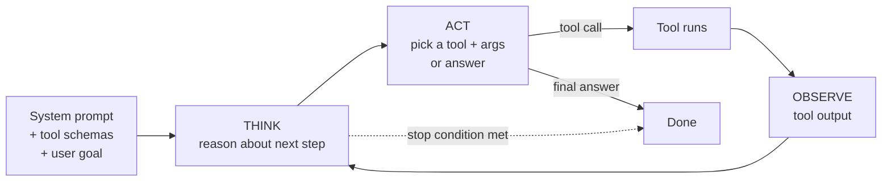

# Prompting for tools and agents

*Part of [Prompt engineering, from productivity to coding agents](./README.md)*

## TL;DR

The prompt changes shape the moment the model can *act* — call a function, run a
search, read a file, hit an API. Instead of steering a single generation, you're
steering a loop: the model reasons about what to do, picks a tool from a schema you
supplied, receives the tool's output, reasons again, and stops when the task is
done. That loop has a name — **ReAct** (Yao et al., 2022) — and every modern agent
scaffold is a variant of it. The prompt engineering that runs it is a specialization
of everything from lessons 1-6, plus three new concerns: how to describe available
tools so the model picks the right one, how to constrain the loop so it terminates
cleanly, and how to handle tools that fail without derailing the whole run. This
lesson is the bridge from "prompting a model" to "prompting an agent."

> 🎯 **For the AI PM (or coding-agent user)**
>
> **Why it matters** — Agent-shaped features fail in ways non-agent ones don't:
> tools misused, loops that don't stop, cascading errors after one bad step. The
> prompt is the primary steering surface for all of it.
>
> **What it changes in your decisions** — Tool descriptions become spec-level
> artifacts, not one-line docstrings. The system prompt spells out when *not* to
> call tools, not just when to call them. Termination criteria are explicit.
>
> **Ask yourself** — *"If my agent has to decide between three plausible tools for
> a task, does the tool description tell it which one and when?"*
>
> **Risk if ignored** — An agent that calls the wrong tool, calls the right tool
> with wrong arguments, or loops until it hits the max-steps guardrail — all
> because the prompt described the tools instead of specifying them.

## The mental model — the ReAct loop



Read the loop as *think → act → observe → repeat*. The prompt sets it up: role,
goal, available tools, termination rules. The model executes it. Each turn produces
either a tool call or a final answer. Each tool output becomes new context for the
next turn. The whole run is one prompt, extended.

## Three concerns unique to agent prompts

### Concern 1 — describe tools like APIs, not features

A tool description is not marketing copy. It's an API contract the model reads
to decide when and how to call the tool. Good tool descriptions name:

- **What the tool does** (one sentence, imperative).
- **When to use it** (specific inputs and situations).
- **When NOT to use it** (this is often what stops wrong-tool calls).
- **What each parameter means** (with types and constraints).
- **What the tool returns** (shape, and what "no result" looks like).

Compare a weak description:

```
search_documents: Search the document store.
```

To a strong one:

```
search_documents: Search the internal document store by keyword query.
Use for: finding company policies, product specs, meeting notes indexed
before today.
Do NOT use for: real-time information (use `web_search` instead), or
answers already in the current conversation.
Args:
  query (str): 2-8 word keyword phrase; not a natural-language question.
  top_k (int): 1-10, default 5.
Returns:
  List of {doc_id, title, excerpt}. Empty list if no matches.
```

The mechanics of writing these schemas — JSON Schema, OpenAPI-style descriptions,
Anthropic's tool_use block, OpenAI's function calling — are covered in the [tool
calling module](../tool-calling/README.md). This lesson is about the *content* that
goes in the description.

### Concern 2 — constrain the loop so it terminates

Left alone, an agent may loop until it hits a max-steps limit, especially on tasks
without a clear success signal. The prompt has to name the stop conditions:

- **Success:** "Stop and return the final answer as soon as [specific condition]."
- **Impossibility:** "If you cannot find the answer after 3 tool calls, stop and
  say so."
- **Cost/step budget:** "Do not make more than 5 tool calls total for this task."
- **Confidence:** "If any tool returns an error, do not retry more than once
  before reporting the failure."

Termination is a prompt-engineering problem, not just a runtime guardrail. The
runtime cap is the safety net; the prompt is the intent.

### Concern 3 — handle tool failures on purpose

Tools fail. APIs time out. Search returns empty. A file doesn't exist. Without
guidance, the model often invents a plausible answer instead of admitting the tool
failed. The fix is explicit:

> If a tool returns an error, do not invent the result. Report the error, then
> either retry once with a corrected argument, use a fallback tool if one exists,
> or stop and tell the user what failed.

## The system prompt for an agent

Putting it together, a production agent system prompt tends to include:

- **Role and scope.** "You are a research assistant. Only answer questions from
  approved corpora."
- **Available tools** (with schemas as described above).
- **Reasoning rules.** "Think through what you need before calling any tool. Prefer
  the cheapest tool that could answer the question."
- **Termination rules** (as above).
- **Failure handling.**
- **Output format** for the final answer.
- **What NOT to do.** ("Do not call the same tool twice with identical arguments.
  Do not answer questions outside your scope.")

The user turn provides the task. The rest of the loop is the model + tools +
scaffold. But the ceiling on agent quality is set by that system prompt.

## Tradeoffs

- **Tool count vs. clarity.** More tools give the agent more power and more
  choices. Past ~10 tools, the model starts confusing overlapping ones. Group and
  prune.
- **Freedom vs. determinism.** A loose prompt lets the agent invent creative
  approaches. A tight prompt makes it predictable. For customer-facing features,
  tighter usually wins.
- **Step budget vs. quality.** A step budget prevents runaway costs; too low a
  budget causes premature give-up. Tune against real tasks.
- **Prompt-level termination vs. runtime guards.** Both are needed. The prompt
  should terminate in the intended cases; the runtime cap catches the ones the
  prompt didn't foresee.

## Failure modes

- **Wrong tool for the job.** Two tools do similar things; the description doesn't
  disambiguate; the model picks the wrong one under pressure. Add a "do NOT use
  for" line.
- **Right tool, wrong arguments.** Especially for tools with structured filters or
  date ranges. Add examples inside the tool description if the format is not
  obvious.
- **Fabrication after a tool failure.** Tool returned empty; model invented an
  answer. Explicit failure-handling instructions catch this.
- **Loops that don't stop.** No explicit success or impossibility condition; agent
  keeps trying variants. Named termination criteria fix it.
- **Runaway cost from too many tools.** The agent explores. Budget it explicitly.

## Practitioner checklist

- [ ] For every tool the agent can call: does the description name both when to use
      it and when NOT to?
- [ ] Are the arguments for each tool described with types, ranges, and format
      examples where format is not obvious?
- [ ] Does the system prompt spell out at least one success condition and one
      impossibility condition for terminating the loop?
- [ ] Does the prompt tell the model what to do when a tool fails or returns
      empty?
- [ ] Is there a step budget in the runtime *and* an intended step count in the
      prompt?

## Related lessons

- [Prompt chaining and multi-step workflows](./prompt-chaining-and-workflows.md)
- [Prompting inside coding agents](./prompting-inside-coding-agents.md)
- [Tool calling](../tool-calling/README.md) — the schema mechanics this lesson's
  tool descriptions sit inside.
- [AI agents](../ai-agents/README.md) — the scaffolds that run the ReAct loop.
- [Agentic workflows](../agentic-workflows/README.md) — orchestration patterns
  around agents.
