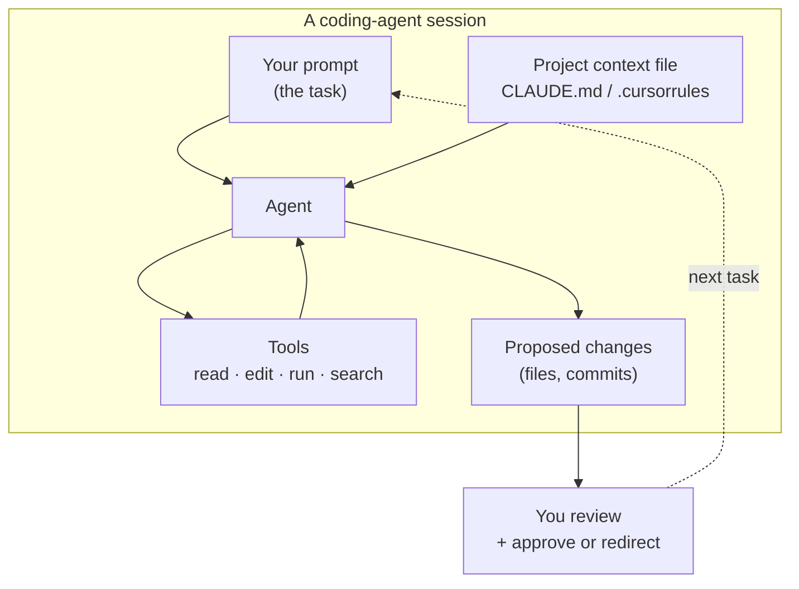

# Prompting inside coding agents

*Part of [Prompt engineering, from productivity to coding agents](./README.md)*

## TL;DR

Coding agents — Claude Code, Cursor, Aider, Windsurf, Continue — are agents whose
tools are `read_file`, `edit_file`, `run_command`, `search_code`. Their prompts
carry more weight than any other kind of prompt in daily use today, because the
output isn't a chat reply — it's real code that ships. The prompt-engineering craft
here has its own idioms: the **prompt is the spec** for the change; a project-level
context file (Claude Code's `CLAUDE.md`, Cursor's `.cursorrules`, Aider's
`CONVENTIONS.md`) supplies house rules to every session; **plan mode** or
"propose-then-apply" separates thinking from acting on high-risk changes; and
**sub-agents** or delegated tasks parallelize work while protecting the main
context window. This lesson names the patterns, so a developer new to coding agents
gets the leverage on day one instead of stumbling into it over a month.

> 🎯 **For the AI PM (or coding-agent user)**
>
> **Why it matters** — For developers, this is the highest-productivity prompting
> surface in the industry right now. For PMs, it is where "vibe coding" turns from
> demo into product (see [TPM for AI products](../technical-product-management/tpm-for-ai-products.md)).
>
> **What it changes in your decisions** — You start treating your `CLAUDE.md` (or
> equivalent) as a versioned engineering artifact, not a scratch note. You reach
> for plan mode on any change touching more than one file. You delegate parallel
> investigations to sub-agents instead of blocking the main session.
>
> **Ask yourself** — *"Am I prompting this coding agent the way I would write a
> ticket for a competent contractor — spec, constraints, verification — or the way
> I would text a friend?"*
>
> **Risk if ignored** — Agent-generated code that compiles, runs, and quietly
> breaks something else. Or a session that wanders because you never named a
> success condition, and you don't notice until 45 minutes in.

## The mental model

Every arrow here is a prompt-engineering surface. Your prompt is the task. The
project context file is the *always-on* system prompt every session inherits. The
tool descriptions are what the agent reads to decide what to do next. The proposed
diff is what you review — and the quality of your review depends on how tightly you
scoped the prompt.

## Pattern 1 — the prompt is the spec

Coding-agent prompts read like small tickets, not chat messages. A weak prompt:

> Add caching to the search endpoint.

A strong prompt:

> Add an in-memory LRU cache to `src/search/handler.py`'s `search()` function.
>
> - Cache key: the normalized query string.
> - Cache size: 1000 entries. Eviction: LRU.
> - Cache TTL: 5 minutes.
> - Do not cache when the caller passes `no_cache=True`.
> - Add a unit test in `tests/search/test_cache.py` covering: cache hit, cache
>   miss, eviction at capacity, TTL expiry, and the `no_cache=True` bypass.
> - Do not touch any other file.

Every line in the strong prompt is a constraint the agent will honor. The
"do not touch any other file" line alone prevents 30% of accidental sprawl.

The rule: prompt as if the agent will do exactly what you wrote and nothing you
didn't. Because it will.

## Pattern 2 — the project context file is the always-on system prompt

Claude Code reads `CLAUDE.md`. Cursor reads `.cursorrules`. Aider reads
`CONVENTIONS.md`. All of them play the same role: a project-scoped file, checked
into git, that ships to every session as part of the system prompt.

What to put in it:

- **What the codebase is.** One paragraph. What ships, what stack.
- **Layout.** Where things live, and one-line notes on why.
- **Build/test/lint commands.** So the agent can verify its own work.
- **House rules.** "Prefer editing existing files to creating new ones." "Don't
  add try/except unless the failure mode is real." "No new dependencies without
  approval."
- **Anti-patterns.** Things the codebase has learned the hard way not to do.

What NOT to put in it:

- Task-specific instructions (those belong in the prompt for that task).
- Onboarding text for humans (that belongs in README.md).
- Long philosophical notes (the agent skims for facts, not essays).

Every project's `CLAUDE.md` becomes a prompt-engineering artifact you version and
review like code. A bad `CLAUDE.md` invisibly degrades every session in that
project.

## Pattern 3 — plan mode and propose-then-apply

For any change touching more than one file, or any change to unfamiliar code,
run the agent in **plan mode** (Claude Code's `/plan`; Cursor's "Ask" mode before
"Compose"; Aider's `/architect`). The agent proposes the change without applying
it. You review the plan, redirect if needed, then approve.

The idiom:

- Small, obvious changes: apply mode.
- Anything touching multiple files, config, migrations, or public APIs: plan mode.
- Anything you're not sure how to structure yourself: plan mode with the agent
  helping you think.

Skipping plan mode on a large change is the coding-agent equivalent of
skipping code review. Fast at first. Painful the second time.

## Pattern 4 — sub-agents for parallel investigation

Both Claude Code and Cursor let you spawn sub-agents (background tasks, task tool)
for work you want to run in parallel without polluting the main session's context.
Good uses:

- **Investigations.** "Find every place `logger.warning` is called with a hardcoded
  string" — dispatch to a sub-agent; get a summary back.
- **Broad refactors.** "Rename `foo` to `bar` across the entire test directory,
  reporting any file it couldn't update automatically."
- **Independent tasks.** Two unrelated bugs in different subsystems can run as two
  parallel sessions.

The rule: sub-agents are for tasks whose *result* you want, not tasks whose
*process* you want to steer. If you need to intervene mid-task, do it in the main
session.

## Pattern 5 — verification is part of the prompt

The best coding-agent prompts end with a verification clause: "After making the
change, run `pytest tests/search/` and report the output." "Then run `npm run
typecheck`." "Then show me the diff." The agent runs the check itself and either
declares success with evidence or reports the failure. This is the coding-agent
equivalent of the acceptance criteria in a [PRD](../technical-product-management/specs-prds-and-rfcs.md).

Without a verification clause, the agent judges its own work on vibes.

## Tradeoffs

- **Speed vs. safety.** Apply mode is fastest. Plan mode is safest. Match to
  change size.
- **Context depth vs. `CLAUDE.md` bloat.** Everything in the context file costs
  tokens on every session. Keep it tight; move anything task-specific to prompts.
- **Sub-agent parallelism vs. coordination cost.** Two parallel sub-agents beat
  two sequential ones on wall-clock time; they lose the shared context that
  sequential work preserves.
- **Autonomy vs. review.** More autonomous agents ship faster and hide more bugs
  in what they produced. High-autonomy sessions need higher-quality prompts and
  more careful review.

## Failure modes

- **The one-liner ticket.** "Fix the bug" with no repro, no file names, no
  acceptance criteria. Agent guesses; guess is wrong; you spend twice as long
  fixing the guess as you would have fixing the bug.
- **Missing `CLAUDE.md`.** Every session re-learns the project from scratch.
  Every session makes the same mistakes.
- **Skipping plan mode on a large change.** Agent commits to a wrong structure
  by the third file; unwinding costs more than proposing would have.
- **No verification clause.** Agent reports "done"; you find the tests were never
  run half an hour later.
- **Sub-agent spam.** Dispatching sub-agents for tasks small enough to just do,
  because it feels productive. Each sub-agent has spin-up cost. Match to task
  size.
- **Prototype code shipped as production code.** Vibe-coded code demos beautifully
  and lacks error handling, tenancy, and tests. Ship the prototype through the
  same eval-driven pipeline as any other code.

## Practitioner checklist

- [ ] Does my current prompt read like a ticket a competent contractor could
      pick up, or like a text message?
- [ ] Does this project have a `CLAUDE.md` (or equivalent) with layout, commands,
      and house rules — kept in git, reviewed like code?
- [ ] For any change touching more than one file: am I using plan mode, or am I
      trusting the agent to structure it in one shot?
- [ ] For investigations that would fill my main context: am I dispatching them
      to sub-agents?
- [ ] Does my prompt end with a verification clause — a test, a typecheck, a
      diff review — so "done" has evidence, not vibes?

## Related lessons

- [Prompting for tools and agents](./prompting-for-tools-and-agents.md)
- [When prompts fail: the diagnostic playbook](./when-prompts-fail.md)
- [TPM for AI products](../technical-product-management/tpm-for-ai-products.md) —
  the "vibe coding" section covers the PM-side risk of shipping prototype-grade
  agent-generated code.
- [AI agents](../ai-agents/README.md) — the scaffolding underneath these tools.
