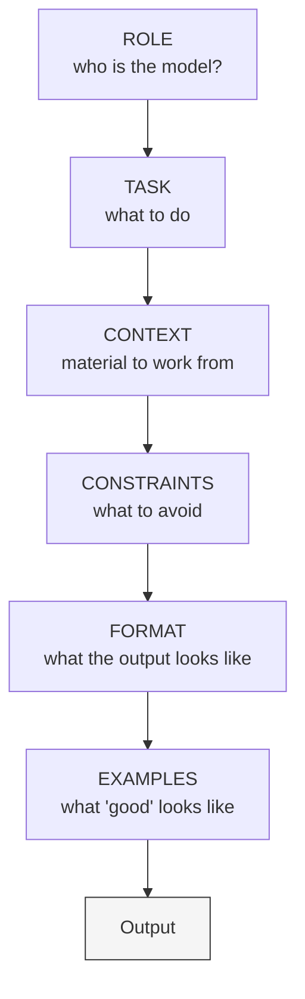

# The anatomy of a prompt

*Part of [Prompt engineering, from productivity to coding agents](./README.md)*

## TL;DR

A prompt that works reliably is not one clever sentence — it names six things on
purpose. **Role** (who the model is playing), **task** (what to do), **context** (the
material to work from), **constraints** (what to avoid), **format** (what the output
should look like), and **examples** (what "good" looks like when you can show it).
Beginner prompts tend to have one or two of these, implicit and mixed. The upgrade to
"power-user" is not a longer prompt — it is a prompt that hits each of the six on
purpose, in an order the model can follow. Anthropic's own prompt engineering guide
organizes its advice around exactly these dimensions, and every technique in the rest
of this module — few-shot, chain-of-thought, tool use — is a specialized way of
filling one of them.

> 🎯 **For the AI PM (or coding-agent user)**
>
> **Why it matters** — Prompts fail one of these six ways more often than they fail
> for lack of cleverness. Naming the missing part is faster than rewriting the whole
> thing.
>
> **What it changes in your decisions** — You treat any prompt template your team
> ships as a checklist against these six parts. You review prompts the way you review
> a PRD — is the role explicit, is the format specified, are examples present.
>
> **Ask yourself** — *"Which of the six parts is this prompt leaving to the model to
> guess?"*
>
> **Risk if ignored** — A prompt that "worked in the demo" ships to production and
> drifts wildly, because the parts you left implicit got interpreted differently at
> scale.

## The mental model

The order matters. Role first, so every later instruction inherits its framing. Task
next, so the model knows what to do before it hears what to avoid. Context after
that, so the material sits in the model's working memory when it starts. Constraints
before format, so the format spec is scoped by what's allowed. Examples last —
because examples are the strongest signal, and they anchor everything above them.

## The six parts, one line each

- **Role** — "You are a copy editor for a financial newsletter." Sets the register,
  the vocabulary, the implied expertise. A role is not fluff. It compresses a whole
  paragraph of tone instructions into one sentence.
- **Task** — "Rewrite the paragraph below to be shorter, keeping the numbers exact."
  One verb, one object, one modifier. If the task has two verbs, it's two prompts.
- **Context** — the material the task operates on: the email to reply to, the code
  to review, the document to summarize. In Anthropic's guides this often lives inside
  an XML tag like `<document>...</document>` — see the [structured prompting
  lesson](./structured-prompting.md) for why.
- **Constraints** — the negative space. "Do not add facts I did not give you." "Do
  not use bullet points." Constraints are what stops the model from doing the
  reasonable-but-wrong thing.
- **Format** — the shape of the output. "Reply as a JSON object with keys `subject`
  and `body`." "Reply in one paragraph, under 80 words." Format specs cut more
  variance than any single trick.
- **Examples** — one to five worked cases of input → ideal output. Examples are the
  most expensive part of a prompt to write and the highest-leverage. Lesson 5 covers
  how few-shot examples work mechanically.

## A worked pass: from one-liner to production prompt

The one-liner:

> Summarize this article for me.

What's missing: role (whose lens?), task (what kind of summary — TL;DR? key points?
counter-arguments?), constraints (what to leave out?), format (bullets? paragraph?
JSON?), examples (what does "good" look like?).

The upgrade:

> You are a research assistant to a senior product manager. Read the article inside
> `<article>...</article>` and produce a summary the PM can skim in 30 seconds.
>
> Constraints: do not add facts not in the article. Do not soften the article's
> claims.
>
> Format: three sections — *what it argues* (1 sentence), *the strongest evidence*
> (2-3 bullets), *what the PM should do about it* (1 sentence).
>
> Example: `<example>` [one worked case here] `</example>`

The upgraded prompt is longer. It's also *repeatable*. The one-liner gets a good
output on a good day. The upgraded prompt gets the same shape of output every day,
by every user, until the shape itself needs to change.

## Tradeoffs

- **Length vs. rigidity.** Longer prompts constrain more, and also cost more tokens
  and take longer to read. The right length is the shortest prompt that hits all six
  parts unambiguously.
- **Role vs. task specificity.** A very specific task ("rewrite this in the second
  person, past tense, under 60 words") sometimes lets you drop the role. A very
  strong role ("you are a court reporter") sometimes carries the format implicitly.
  Don't repeat information the other part already carries.
- **Examples cost effort up front.** They also become the most reusable asset. If a
  prompt will run a thousand times, one hour writing three good examples is the
  cheapest possible investment.

## Failure modes

- **The role is missing.** The model defaults to a generic helpful assistant. Tone
  and register drift with every call.
- **Two tasks in one prompt.** "Summarize this article and email the summary to
  legal." The model does neither well. Split into two prompts, or chain them (see
  [prompt chaining](./prompt-chaining-and-workflows.md)).
- **Constraints in the wrong place.** A constraint that arrives after the format
  spec often gets ignored, because the model has already committed to the format's
  shape.
- **Format specified as prose.** "Reply concisely, in a friendly tone." Concise and
  friendly are subjective. Word counts and named sections are not.
- **No examples where they were the only thing that would have worked.** Some tasks
  — extraction into a specific JSON shape, matching a house voice, following a rare
  convention — cannot be specified in words. They can only be demonstrated.

## Practitioner checklist

- [ ] Can I point to the role, task, context, constraints, format, and examples in
      my current prompt — or is at least one missing?
- [ ] Is the task one verb, or has it quietly become two?
- [ ] Are my constraints stated as things to avoid, not as things to prefer?
- [ ] Does my format spec use numbers and structure, not adjectives?
- [ ] If the task has a "house style" a description can't capture, do I have at
      least one worked example?

## Related lessons

- [What prompt engineering actually is](./what-prompt-engineering-actually-is.md)
- [Everyday productivity patterns](./everyday-productivity-patterns.md)
- [Structured prompting: XML, delimiters, scaffolds](./structured-prompting.md)
- [Few-shot, chain-of-thought, and self-consistency](./few-shot-cot-self-consistency.md)
