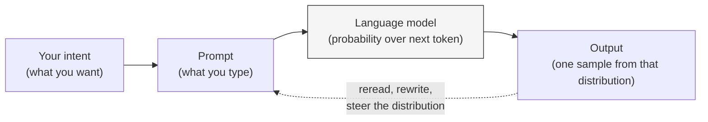

# What prompt engineering actually is

*Part of [Prompt engineering, from productivity to coding agents](./README.md)*

## TL;DR

**Prompt engineering is the craft of writing input a language model will reliably act
on.** It's not a magic incantation and it's not "asking clearly." It sits somewhere
between programming and technical writing. A language model is a probabilistic system
that generates the next likely token given the ones so far. Your prompt is the input
that steers the probability distribution — small changes in wording shift the output
in ways a search engine never would. The mental model to hold: you are not talking to
a person, and you are not calling an API with a fixed contract. You are conditioning a
statistical process. That framing changes what you write, why you rewrite it, and how
you know it worked.

> 🎯 **For the AI PM (or coding-agent user)**
>
> **Why it matters** — Whether the model returns useful output or plausible-sounding
> nonsense depends on the input you gave it, more than the model you picked. Treating
> prompt writing as an afterthought is treating your product's quality as an
> afterthought.
>
> **What it changes in your decisions** — You stop debating models before you have
> debated prompts. You treat prompt iteration as real design work with a version
> history, not a one-off keystroke.
>
> **Ask yourself** — *"If someone else wrote this prompt tomorrow, would they get the
> same output — and do I know why?"*
>
> **Risk if ignored** — You blame the model for a prompt problem, swap providers
> looking for relief, and rediscover the same failures with a different logo.

## The mental model

The gap between the first box and the last box is where prompt engineering lives.
Your intent is clear in your head. The prompt is a lossy translation. The model is a
sampler over possible continuations, not a search engine looking up the right answer.
The output is one draw from that distribution. Every arrow in the diagram is a place
you can lose quality, and every one is a place you can steer it back.

## Three habits that separate a good prompt from a lucky one

- **Write intent, not questions.** A prompt is closer to a brief than a query. "Draft
  a two-paragraph reply to the email below, matching its tone, ending with a proposed
  time" beats "reply to this." The first prompt names the format, the length, the
  register, and the ending. The second one leaves the model to guess.
- **Iterate the prompt, not the output.** The temptation is to edit the model's
  output by hand until it's right. Do that once and you have a good response. Do it
  on a prompt template and every future use gets that lift for free. The unit of work
  is the prompt.
- **Read what came back on its own terms.** If the output missed the mark, the
  question is not "did the model fail?" but "which sentence in my prompt failed to
  constrain it?" That reframe turns a bad output into a diagnostic signal.

## What "engineering" actually adds

Three things distinguish engineering from typing:

- **Repeatability.** A good prompt behaves the same way tomorrow, and behaves the
  same way when a colleague uses it. Ad-hoc prompts fail this test the moment
  something in the model, the context, or the phrasing changes.
- **Version control.** Every prompt that ships in a product or automates a workflow
  needs the same treatment as code: named, dated, changed only through review. A
  prompt that lives only in someone's ChatGPT sidebar is a single point of failure.
- **Evaluation.** The only way to know a prompt is better than the last one is to run
  both against the same set of examples and compare. This is the
  [eval-driven development](../technical-product-management/tpm-for-ai-products.md)
  discipline the AI PM track builds on.

The rest of this module is the specific craft. Lesson 2 breaks a prompt into its six
named parts. Lessons 3 through 6 climb the ladder from everyday productivity into
techniques power users depend on. Lessons 7 and 8 cover what changes when the model
can act — call tools, run code, edit files. Lesson 9 is the diagnostic playbook when
something goes wrong.

## Failure modes

- **The one-shot fallacy.** You write a prompt, judge the model on its first output,
  and give up when it's mediocre. The output *should* be mediocre. Iteration is the
  job, not a sign of failure.
- **The "just ask clearly" trap.** Clarity is necessary and not sufficient. A clear
  prompt with no examples, no format spec, and no role often still under-delivers.
- **Chasing model changes.** You blame the model for a failure that a two-sentence
  prompt edit would fix, then spend a week evaluating alternatives.
- **Prompts as folklore.** Every teammate has their own copy of the "good" prompt for
  a shared task, and none of them are versioned. Quality drifts sideways across the
  team.

## Practitioner checklist

- [ ] Do I have a clear picture of what I want the model to output, before I start
      typing?
- [ ] Am I editing the prompt when the output is wrong, or editing the output by
      hand?
- [ ] For any prompt I reuse: is it saved somewhere versioned, and would a colleague
      get the same result running it cold?
- [ ] When a prompt underperforms, can I name which sentence in it failed to
      constrain the model?

## Related lessons

- [The anatomy of a prompt](./the-anatomy-of-a-prompt.md)
- [When prompts fail: the diagnostic playbook](./when-prompts-fail.md)
- [Context engineering — why prompt engineering doesn't scale alone](../context-engineering/why-prompt-engineering-doesnt-scale.md)
