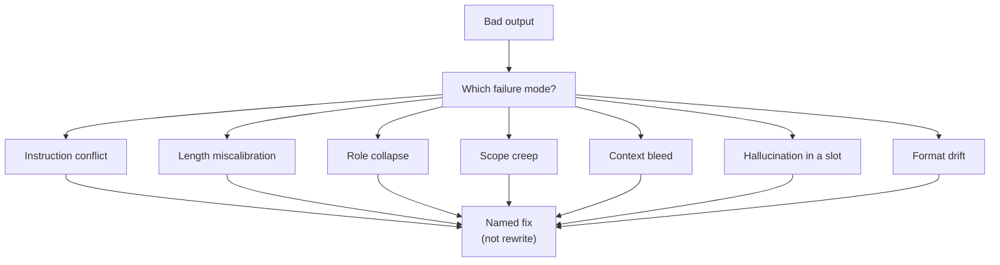

# When prompts fail: the diagnostic playbook

*Part of [Prompt engineering, from productivity to coding agents](./README.md)*

## TL;DR

Prompts fail in a small number of well-known ways. Naming the failure is faster than
rewriting the prompt. This lesson is a diagnostic playbook: seven common failure
modes, the signal each one leaves behind, and the specific fix that clears it. The
seven are **instruction conflict**, **length miscalibration**, **role collapse**,
**scope creep**, **context bleed**, **hallucination in a well-defined slot**, and
**format drift**. Every prompt problem you'll hit in daily use is one of these or a
combination. The habit worth building is *diagnose before you rewrite* — a bad
output is data, and the data usually tells you which of the seven you have. This
lesson closes the module because every technique above is a specialized fix for one
or more of these failures.

> 🎯 **For the AI PM (or coding-agent user)**
>
> **Why it matters** — Teams waste weeks rewriting prompts by intuition when the
> failure has a name and a known fix. The named-failure vocabulary compresses that
> debugging time by 10×.
>
> **What it changes in your decisions** — Bug reports on AI features start with
> "which of the seven?" rather than "the model is broken." Prompt reviews use the
> same list as a checklist.
>
> **Ask yourself** — *"When my prompt underperforms, do I diagnose which mode it
> failed in — or do I rewrite from scratch on vibes?"*
>
> **Risk if ignored** — Prompt churn: the same team rewriting the same prompt
> against the same failure, learning nothing, calling the model "unreliable."

## The mental model

Every bad output has a shape. That shape usually maps to one of the seven. Match
the shape, apply the fix, re-run, and only rewrite from scratch if the same output
appears against a *different* diagnosis than you thought.

## F1 — Instruction conflict

**Signal:** Output follows one rule but breaks another. Different runs pick
different rules.

**Diagnosis:** Read the prompt aloud, one sentence at a time. Do any two sentences
tell the model to do opposite things? A common one: "keep the response short" plus
"cover every edge case."

**Fix:** State priority explicitly. "If brevity and completeness conflict, brevity
wins." Or split into two prompts, each with one consistent goal.

## F2 — Length miscalibration

**Signal:** Output is either padded with filler or truncated mid-thought.

**Diagnosis:** No length spec at all, or a word count without a shape spec.

**Fix:** Specify both a target length *and* the override rule "as short as
complete." Or specify structure ("three sections of one paragraph each") — the
structure implies the length more reliably than any word count.

## F3 — Role collapse

**Signal:** Response starts in the role you set, then drifts back to a generic
helpful-assistant tone by the second half.

**Diagnosis:** Role stated once, at the top; long prompt dilutes it; no
reinforcement.

**Fix:** Move role to a system prompt if the API supports one. Add a role
reminder near the end: "Remember: you are the [role]. Stay in role. Do not soften
conclusions." For chat, restate the role right before the closing instruction.

## F4 — Scope creep

**Signal:** Output addresses adjacent topics the prompt didn't ask for. "I also
thought it worth noting that..." sections appear.

**Diagnosis:** The goal statement is broad; no scope boundary defined; the model
does what it does best — cover more ground helpfully.

**Fix:** Add a scope boundary. "Address only [X]. Do not discuss [Y]." The
negative constraint is what stops the drift; the positive one alone does not.

## F5 — Context bleed

**Signal:** In a chat interface, output references earlier conversation content
that contradicts what the current prompt said.

**Diagnosis:** Prompt deployed mid-conversation with established context; the
older content is dominating.

**Fix:** Open with "Ignore prior conversation. Treat this as a fresh task."
For repeated production use, run the prompt through the API in a clean context
window instead of extending a session.

## F6 — Hallucination in a well-defined slot

**Signal:** The model fabricates a specific factual value in a slot where a real
value should go — a date, a name, a citation, an ID. Especially painful in
extraction tasks.

**Diagnosis:** No explicit contract for "unknown" or "not present" — the model
fills the slot with something plausible rather than admitting a gap.

**Fix:** State the null contract. "If a field is not present, use `null`. Do not
invent values. Do not use `\"unknown\"` or `\"N/A\"` — use `null`." Combine with
grounding: "Every value must come from the text below. If it is not there, it is
null."

## F7 — Format drift

**Signal:** Output looks right most of the time and occasionally arrives in a
different shape — extra fields, missing keys, prose wrapping a JSON block, an
opening "Sure! Here is the JSON:" line that breaks parsers.

**Diagnosis:** Format specified in words but not enforced; no examples of the
exact output shape.

**Fix:** Provide one or two few-shot examples in the exact format. Use structured
output APIs (JSON mode, structured outputs) if available. On Claude, prefill the
opening character of the expected shape to force it.

## Diagnosing before rewriting — the two-minute pass

When an output fails, before touching the prompt:

1. **Copy the exact output and the exact prompt into a scratch pad.** Both.
2. **Match the output against the seven signals above.** One usually fits; two or
   three sometimes do.
3. **Apply the specific fix.** Not a rewrite. A targeted edit at the specific
   sentence that failed.
4. **Re-run against the same input.** Confirm the specific failure is gone.
5. **Re-run against different inputs.** Confirm the fix didn't create a new one.

If step 2 doesn't match any of the seven, the failure is a rarer case — often
either the model is genuinely wrong on the task (a capability limit, not a prompt
problem), or the *context* the prompt operates on is bad, and you're in the
territory of [context engineering](../context-engineering/README.md) rather than
prompt engineering.

## What the module has been building toward

Look back at the seven failures and the lessons that fix them:

- Anatomy of a prompt (lesson 2) — the whole-prompt checklist that prevents F1,
  F2, F3, F4.
- Everyday productivity patterns (lesson 3) — canonical shapes that resist F4 and
  F6.
- Structured prompting (lesson 4) — XML boundaries that prevent F5 and F7.
- Few-shot and CoT (lesson 5) — examples that prevent F7 and reduce F6.
- Prompt chaining (lesson 6) — decomposition that prevents F1 (two verbs) and F4.
- Prompting for tools and agents (lesson 7) — termination rules that prevent
  agent-specific loop failures.
- Prompting inside coding agents (lesson 8) — verification clauses that catch
  F6 before it ships.

The module is a set of techniques. This lesson is the diagnostic that tells you
which technique to reach for.

## Failure modes (about the diagnostic itself)

- **Rewriting on vibes.** Skipping the diagnosis and rewriting from scratch. The
  new prompt inherits a variant of the same failure, and you learn nothing.
- **One-symptom diagnosis.** Matching the first signal that fits and stopping.
  Two or three often apply together; miss one, and the fix doesn't hold.
- **Blaming the model.** Concluding the model is "just bad at this" without
  running the diagnostic. Sometimes true. Usually not.
- **Ignoring the input.** Half of "prompt failures" are actually context or input
  failures — the prompt is fine but the material it operates on is stale, wrong,
  or missing. That's the [context engineering](../context-engineering/README.md)
  discipline.

## Practitioner checklist

- [ ] When a prompt underperforms, do I diagnose against the seven modes before
      rewriting?
- [ ] Is my fix targeted (one sentence changed) or wholesale (whole prompt
      rewritten)?
- [ ] Do I re-run the failing input first, then run different inputs to check
      for regression?
- [ ] Have I ruled out that the failure is a context or capability problem, not
      a prompt problem?
- [ ] Do I keep a log of failures and their fixes, so the seven-mode vocabulary
      becomes the team's shared debugging language?

## Related lessons

- [What prompt engineering actually is](./what-prompt-engineering-actually-is.md)
- [The anatomy of a prompt](./the-anatomy-of-a-prompt.md)
- [Structured prompting: XML, delimiters, scaffolds](./structured-prompting.md)
- [Context engineering](../context-engineering/README.md) — for the failures that
  turn out not to be prompt failures.
