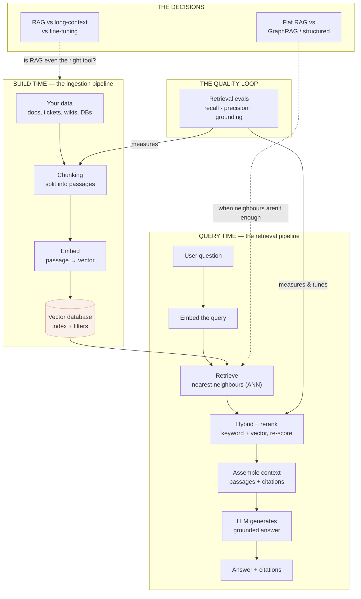

# RAG & vector databases for the product leader

A model's built-in knowledge is frozen at training time, generic, and unattributable — it
cannot know your customers, your contracts, or what changed this morning, and when it
doesn't know, it guesses fluently. **Retrieval-Augmented Generation (RAG)** is the fix that
launched a thousand AI features: before the model answers, you *retrieve* the relevant
facts from your own data and put them in front of it, so the answer is grounded in
something real, current, private, and citable. The machinery underneath — embeddings,
vector databases, chunking, reranking — is where most AI-feature engineering budget
actually goes, and where most AI-feature quality is actually won or lost.

This module is the product leader's map of that machinery. It teaches what RAG is and why
it beats the alternatives, how semantic search and vector databases actually work (without
the vendor fog), why chunking and retrieval quality quietly decide whether your feature is
trustworthy, when to reach for long-context or fine-tuning instead, and where flat RAG runs
out and structured retrieval (GraphRAG) takes over. It is the topic-organized front door;
each lesson links to the deeper mechanics in the [AI engineering RAG module](../content/03-rag/README.md)
and the [Knowledge graphs](../knowledge-graphs/README.md) track.

## The knowledge graph

RAG isn't a product — it's a pipeline with a quality loop. Everything here hangs off this
picture:

Read it in three passes. **The pipeline:** at build time you chop your data into passages,
turn each into a vector, and index it; at query time you turn the question into a vector,
pull the nearest passages, sharpen them, and hand them to the model as grounded context.
**The quality loop:** retrieval evals measure whether you're finding the right passages and
whether the answer is actually supported — and tune chunking and reranking until they are.
**The decisions:** RAG is one option against long-context and fine-tuning, and flat
similarity retrieval eventually gives way to structured retrieval when the answer is a
*connection* rather than a passage.

## The lessons

- [**Why RAG?**](./why-rag.md) — grounding, freshness, private data, citations: the four
  jobs a frozen model can't do, and the honest test for when you need retrieval.
- [**Embeddings & semantic search**](./embeddings-and-semantic-search.md) — how meaning
  becomes math, why search-by-meaning beats keywords, and where it quietly fails.
- [**Vector databases**](./vector-databases.md) — indexing, approximate nearest neighbours,
  metadata filters, and choosing without the vendor fog.
- [**Chunking & ingestion**](./chunking-and-ingestion.md) — the unglamorous pipeline that
  silently decides what can ever be found; where quality is really made.
- [**Retrieval quality**](./retrieval-quality.md) — hybrid search, reranking, and the
  recall/precision tradeoff that separates a demo from a product.
- [**RAG vs. long-context vs. fine-tuning**](./rag-vs-long-context-vs-finetuning.md) — the
  three ways to give a model knowledge, and the cost of each choice.
- [**Beyond flat RAG: GraphRAG & structured retrieval**](./graphrag-and-structured-retrieval.md)
  — where similarity search runs out and structure takes over.

Each lesson pairs the mechanics with a **🎯 For the product leader** briefing — why it
matters, the decision it changes, the question to ask your team, and the risk if ignored —
and a diagram. For the engineering-depth version of retrieval mechanics and evals, follow
the spokes into [RAG architecture](../content/03-rag/rag-architecture.md) and
[Retrieval evals](../content/03-rag/retrieval-evals.md).

**📌 Close out the module:** [Recap & real-world examples](./recap.md).
