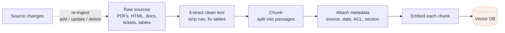

# Chunking & ingestion

*Part of [RAG & vector databases for the product leader](./README.md)*

## TL;DR

Before anything can be retrieved, your data has to be turned into passages, embedded, and
indexed — the **ingestion pipeline**. Its most consequential and least glamorous step is
**chunking**: cutting documents into pieces small enough to embed precisely and retrieve
cleanly. This quietly sets a ceiling on your whole feature, because *the model can only ever
answer from a chunk that retrieval can find* — chunk badly and the right answer becomes
literally unreachable, no matter how good your model or vector database. Too big, and each
chunk is a vague blur that retrieves imprecisely and wastes context; too small, and you
slice the answer away from the context that makes it meaningful. Around chunking sits the
rest of the pipeline: extracting clean text from messy sources (PDFs, HTML, tables),
attaching metadata (source, date, permissions), and — the part teams forget — keeping it
all *fresh* as the underlying data changes. Ingestion is a permanent product surface, not a
one-time load.

> 🎯 **For the product leader**
>
> **Why it matters** — When a RAG feature "can't find the answer that's obviously in our
> docs," the cause is almost always here, not in the model. Chunking and ingestion set the
> quality ceiling everything else operates under.
>
> **What it changes in your decisions** — You budget ingestion as ongoing product work with
> an owner, not a one-off script; and when quality is poor you look at chunks and freshness
> *before* swapping models or vector databases.
>
> **Ask yourself** — *"When our data changes, how long until retrieval reflects it — and
> can the right answer even survive our chunking intact?"*
>
> **Risk if ignored** — A feature that's accurate on launch day and subtly wrong within
> weeks: stale answers, un-findable facts, and citations to fragments that don't actually
> contain the claim.

## The mental model: you can only find what you filed well

Retrieval is only as good as the filing. Chunking is deciding how to cut the documents into
index cards; a fact that gets split across two cards, or buried in a card about ten other
things, is a fact your system can't cleanly retrieve. The model never sees your documents —
it sees the cards retrieval hands it. **Chunking is the act of deciding what's findable.**

## The chunking tradeoff

There's no universally right chunk size — there's a tension you tune:

| Chunk too **big** | Chunk too **small** |
| --- | --- |
| Retrieves imprecisely — one chunk covers many topics, so "relevant" is blurry | Loses context — a sentence retrieved without its surroundings is ambiguous or misleading |
| Wastes the context window and money — you paste in lots of irrelevant text | Fragments answers — the full answer spans several chunks, and retrieval grabs only one |
| Dilutes the embedding — the vector averages many meanings into mush | Explodes count — more vectors, more cost, more near-duplicates to rank |

The craft is cutting along the document's **natural structure**, not by blind character
count: by section, clause, heading, or logical unit, so each chunk is *about one thing*.
Common refinements: **overlap** (repeat a little text across adjacent chunks so a
boundary-straddling answer survives), and keeping structured content (tables, code, lists)
intact rather than slicing mid-row. "Split every 500 characters" is the naïve default that
produces confusing fragments; structure-aware chunking is where quality jumps.

## The rest of the pipeline (where quality leaks)

- **Extraction.** Real sources are messy — PDFs with headers/footers/columns, HTML full of
  navigation, tables that turn to gibberish when flattened. Garbage extracted here is
  garbage retrieved later; clean extraction is unglamorous and decisive.
- **Metadata.** Every chunk should carry where it came from (for [citations](../content/03-rag/retrieval-evals.md)),
  when (for recency filtering), who may see it (for [permissions/isolation](../content/05-safety-multitenancy/multi-tenant-isolation.md)),
  and its section/title (which often helps retrieval more than the body). Metadata is what
  lets you filter, cite, and stay safe — not an optional extra.
- **Freshness.** This is the step teams skip and regret. Data changes; the index must track
  it — add new, update changed, *delete removed*. A chunk for a policy that was retracted,
  still sitting in your index, will be retrieved and answered from with a confident
  citation to a dead source. Decide the refresh cadence and the deletion path up front.

## Cold start vs. steady state

Treat them as different projects. The **cold start** is the one-time backfill of existing
data — bounded, scriptable, a good place to iterate on chunking. The **steady state** is
forever: new documents arrive, old ones change and get deleted, sources get added, chunking
strategy evolves and needs re-runs. A pipeline built only for the backfill produces a
feature that's correct at launch and decays every week after — and a quietly-decaying
knowledge feature is worse than none, because people trust it.

## Failure modes

- **Character-count chunking** — slicing mid-sentence or mid-table because it was the
  one-line default; retrieval returns confusing fragments and the model answers from them.
- **The lost middle** — the answer spans a chunk boundary and no single chunk contains it,
  so it's unretrievable; fixed by structure-aware chunking and overlap.
- **Metadata-less chunks** — no source, date, or ACL, so you can't cite, can't filter by
  recency, and can't isolate tenants; three problems from one omission.
- **Ingest-once** — a backfill with no update/delete path; the index is a snapshot of the
  past wearing today's UI, citing retracted sources.
- **Dirty extraction** — nav bars, boilerplate, and mangled tables embedded as if they were
  content, polluting every retrieval.

## Practitioner checklist

- [ ] Do chunks follow the document's natural structure (sections/clauses), not a blind
      character count — with overlap where answers straddle boundaries?
- [ ] Does every chunk carry source, date, permissions, and section metadata?
- [ ] Is there an add/update/**delete** path so the index tracks the source, with a defined
      refresh cadence?
- [ ] Is text extraction clean for our messiest real sources (PDFs, tables, HTML)?
- [ ] Is ingestion owned as ongoing product work — and do we look here first when retrieval
      quality dips?

## Related lessons

- [Embeddings & semantic search](./embeddings-and-semantic-search.md) — what each chunk
  becomes and how it's found.
- [Retrieval quality](./retrieval-quality.md) — measuring and improving what chunking makes
  possible.
- [RAG architecture](../content/03-rag/rag-architecture.md) — the engineering-depth spoke on
  the full pipeline.
- [Governance, quality & trust](../knowledge-graphs/governance-quality-and-trust.md) —
  provenance and freshness, generalized.
