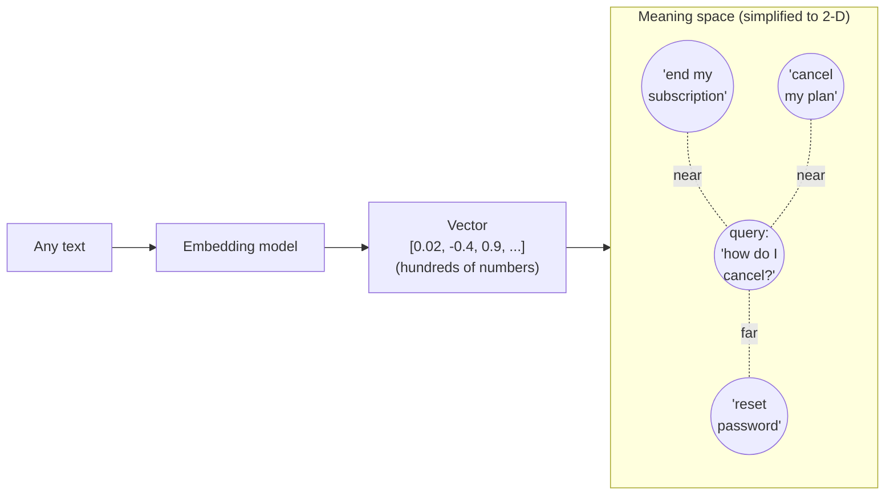

# Embeddings & semantic search

*Part of [RAG & vector databases for the product leader](./README.md)*

## TL;DR

To retrieve by *meaning* rather than exact words, you first turn text into numbers that
capture what it means. An **embedding** is that translation: a model reads a piece of text
and outputs a long list of numbers (a *vector*) positioned so that texts with similar
meaning land near each other in space. Then "search" becomes geometry — the passages most
relevant to a question are simply the vectors *closest* to the question's vector. This is
**semantic search**, and it's why a RAG system can answer "how do I cancel?" using a help
article titled "ending your subscription" that shares not a single keyword. The magic has
sharp edges: embeddings capture fuzzy similarity, not truth or logic; they can rank a
confidently-wrong-but-similar passage above the right one; and the embedding model you
choose, and the fact that queries and documents look different, quietly cap how good
retrieval can ever be.

> 🎯 **For the product leader**
>
> **Why it matters** — Embeddings are the substrate under every RAG feature, semantic
> search bar, recommendation, and dedup system you'll ship. Not knowing what they can and
> can't do leads to promising "it understands meaning" and then being blindsided when it
> confidently retrieves something merely *similar* to the answer.
>
> **What it changes in your decisions** — You treat the embedding model and the retrieval
> approach as product choices with quality consequences, not infrastructure to rubber-stamp
> — and you insist retrieval is *measured* ([recall/precision](./retrieval-quality.md)), not
> eyeballed on a few happy-path queries.
>
> **Ask yourself** — *"For a question worded nothing like our documents, does retrieval
> still find the right passage — and how would we even know?"*
>
> **Risk if ignored** — A feature that dazzles on demo queries and fails on the long tail
> of real phrasings, because 'similar' silently diverged from 'relevant' and nobody was
> measuring.

## The mental model: meaning as a map

Imagine every possible sentence placed on an enormous map, arranged so that things meaning
similar things sit close together — "cancel my plan," "end my subscription," and "stop
billing" cluster in one neighbourhood; "reset my password" sits far away. An embedding is
just the **coordinates** of a piece of text on that map. Semantic search is then trivial:
embed the question, go to its coordinates, and grab whatever passages are nearby.

Real embeddings don't have 2 dimensions — they have hundreds or thousands, so "nearby" can
capture topic, tone, entities, and intent all at once. But the intuition holds: **distance
in the space is (approximately) dissimilarity of meaning.** Everything a vector database
does ([lesson 3](./vector-databases.md)) is bookkeeping to find nearby points fast.

## How it actually works

- **Embedding a passage** — an embedding model (a cousin of the LLM, often much smaller)
  converts each chunk of your data into one vector, once, at ingestion time. You store the
  vectors in a [vector database](./vector-databases.md).
- **Embedding a query** — at question time you embed the query with the *same* model, into
  the *same* space, so distances are comparable.
- **Measuring closeness** — the system computes a distance (usually *cosine similarity* —
  the angle between vectors) and returns the top-k nearest passages. That's the retrieval.
- **The model must match** — queries and documents must be embedded by the same model;
  swapping the embedding model means re-embedding your entire corpus, because old and new
  vectors live in different spaces. This is a real migration cost, not a config flip.

## Why it beats keyword search — and where it doesn't

Keyword (lexical) search matches strings: fast, exact, and blind to paraphrase. It nails
"error E-4021" and whiffs on "the app crashed with that timeout code." Semantic search is
the mirror image — it gets the paraphrase and can miss the exact string (a product SKU, a
person's name, a rare acronym). Neither wins everywhere, which is exactly why production
systems run **both** and blend them ([hybrid search](./retrieval-quality.md)).

| | Keyword (lexical) | Semantic (embeddings) |
| --- | --- | --- |
| Matches | Exact words / strings | Meaning / paraphrase |
| Great at | IDs, names, codes, jargon, exact quotes | Natural-language questions, synonyms, intent |
| Blind to | Synonyms, rephrasing | Exact tokens it deems "unimportant" |
| Fails quietly when | The user doesn't know the exact term | The right passage is worded very differently *and* something merely similar outranks it |

## The sharp edges

Three properties of embeddings routinely surprise teams, and each is a product risk:

- **Similar ≠ correct.** Embeddings rank by resemblance, not truth. A passage describing
  the *old* policy is embedding-close to one describing the *new* policy; a passage about a
  *competitor's* feature is close to one about yours. Retrieval will happily hand the model
  a similar-but-wrong passage, and the model will answer from it. [Reranking and
  metadata filters](./retrieval-quality.md) exist to fight this.
- **No logic or negation.** "Refunds allowed" and "refunds not allowed" sit almost on top of
  each other — the words are nearly identical, the meaning is opposite. Embeddings feel
  meaning but don't *reason*; they can't reliably tell a rule from its negation.
- **Query/document asymmetry.** A short question and a long document passage look different
  even when they match. Good systems handle this (e.g. embedding models tuned for
  asymmetric search, or generating a hypothetical answer to embed instead of the raw
  question) — but naïvely embedding both the same way leaves quality on the table.

The through-line: embeddings are a powerful *first-pass filter*, not a final judge of
relevance. Design the pipeline to assume the first pass is fuzzy and add a sharper stage
after it.

## Failure modes

- **Trusting cosine similarity as truth** — shipping the top vector match as "the answer"
  with no reranking or filtering; the confidently-similar-but-wrong passage sails through.
- **Embedding-model mismatch** — embedding queries and documents with different models (or
  changing the model without re-embedding); distances become meaningless.
- **Ignoring the exact-match tail** — going pure-semantic and losing every query that hinges
  on a code, name, or SKU; the fix is [hybrid search](./retrieval-quality.md), not a bigger
  model.
- **Negation and version bugs** — retrieving the outdated or opposite passage because it's
  lexically almost identical; needs metadata (dates, status) and filters, not just vectors.
- **"It understands meaning" theatre** — selling embeddings as comprehension; they're
  similarity, and the gap shows up on the long tail of real queries.

## Practitioner checklist

- [ ] Are queries and documents embedded with the *same* model, and do we know the cost of
      ever changing it (full re-embed)?
- [ ] Do we have a plan for exact-match needs (IDs, names, codes) — i.e. hybrid, not
      pure-semantic?
- [ ] Is there a stage *after* similarity ([reranking](./retrieval-quality.md), filters)
      to catch similar-but-wrong passages?
- [ ] Do version/recency and permissions live in metadata we can filter on, so we don't
      retrieve the stale or forbidden passage?
- [ ] Is retrieval quality measured on real, diverse phrasings — not just demo queries?

## Related lessons

- [Vector databases](./vector-databases.md) — where the vectors live and how nearest
  neighbours are found fast.
- [Retrieval quality](./retrieval-quality.md) — hybrid search and reranking, the sharper
  second stage.
- [RAG architecture](../content/03-rag/rag-architecture.md) — the engineering-depth spoke.
- [Semantic caching](../content/01-inference-internals/prompt-vs-semantic-caching.md) — the
  same embedding trick applied to caching responses.
