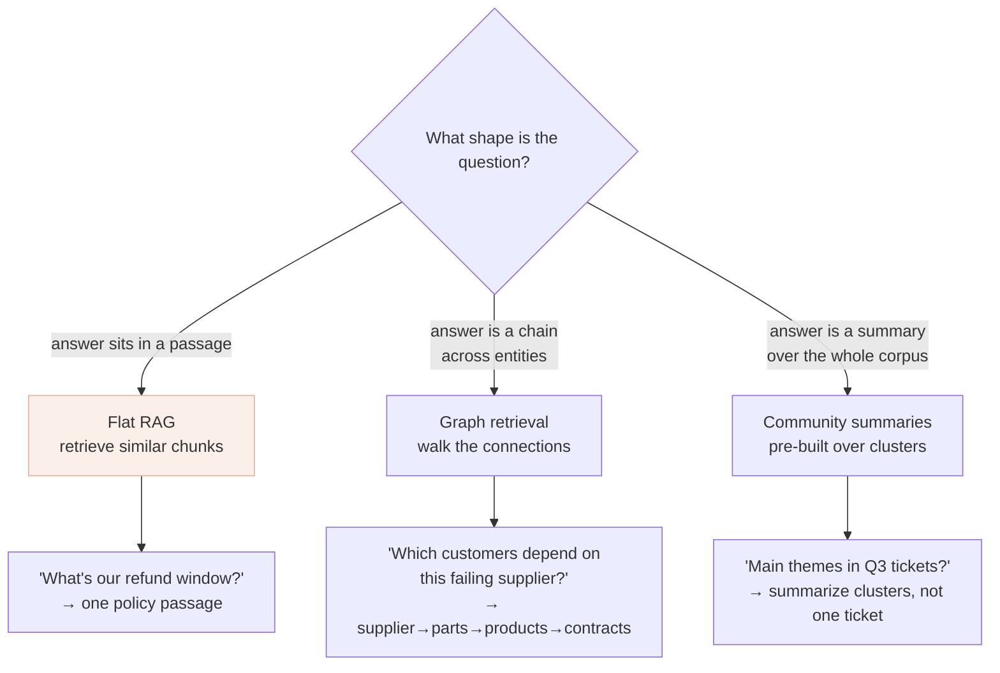

# Beyond flat RAG: GraphRAG & structured retrieval

*Part of [RAG & vector databases for the product leader](./README.md)*

## TL;DR

Plain ("flat") RAG retrieves the text chunks most *similar* to a question — which is
perfect when the answer sits in a passage somewhere, and useless when the answer is a
*connection* no single passage states, or a *summary* of the whole corpus. Two question
types break flat RAG structurally: **multi-hop** ("which of our customers are exposed to
this supplier's recall?" — the answer is a chain across documents, not any one of them) and
**global** ("what are the main themes across this quarter's tickets?" — the answer is an
aggregate, not a retrievable passage). **GraphRAG** and structured retrieval fix this by
retrieving *structure* — a subgraph of connected entities, pre-built community summaries, or
the result of an actual database query — instead of, or alongside, similar text. The
product-leader takeaway is a discipline, not a technology purchase: know *which* questions
flat RAG can't answer, adopt structure only when your roadmap actually has those questions,
and never let a heavier pipeline in for a workload plain vector search already handles.

> 🎯 **For the product leader**
>
> **Why it matters** — Teams hit a wall where "our RAG just can't answer these questions"
> and either give up or over-build. Knowing the *shape* of question that flat RAG can't do
> tells you exactly when to invest in structure — and when the acronym is just fashion.
>
> **What it changes in your decisions** — You classify the questions your feature must
> answer (passage-level vs. multi-hop vs. global) before choosing a retrieval architecture,
> and you let *measured* flat-RAG failures justify the step up, not a vendor deck.
>
> **Ask yourself** — *"Are the questions we're failing on actually about connections or
> whole-corpus summaries — or is our flat RAG just tuned badly?"*
>
> **Risk if ignored** — Either a feature that plateaus because it can't do the questions
> that matter most, or an expensive graph-indexing pipeline built for questions that were
> 95% simple passage lookups.

## The mental model: passages, chains, and summaries

Three question shapes, three retrieval needs:

Flat RAG is the right and cheapest tool for the first shape — most questions. The other two
are where you graduate to structure.

## Why flat RAG breaks on these

- **Multi-hop.** The answer requires *joining* facts across several documents:
  customer → contract → product → component → supplier. No single chunk contains the chain,
  so similarity search — which fetches chunks that each resemble the question — retrieves
  fragments that never connect. You can sometimes brute-force it with clever prompting and
  many retrieval rounds, but it's fragile and expensive.
- **Global.** The answer is *about the corpus*, not *in it*: "what are the recurring
  complaints?", "how has our policy drifted over time?" There's no passage to retrieve
  because the answer is a synthesis over thousands of passages. Similarity search returns a
  handful of chunks and the model summarizes *those*, giving a confident answer based on a
  biased sliver.

## The structured approaches

- **GraphRAG.** Build a [knowledge graph](../knowledge-graphs/what-is-a-knowledge-graph.md)
  from your corpus (entities and typed relationships), then retrieve *connected subgraphs*
  for multi-hop questions, and *pre-computed community summaries* for global ones.
  Microsoft's 2024 GraphRAG work popularized the pattern; it answers the two hard shapes
  with citations. The cost is a real indexing stage — extraction, resolution, summarization
  — that must be [kept fresh](../knowledge-graphs/governance-quality-and-trust.md), so it
  earns its place only when those questions are on the roadmap.
- **Text-to-query (structured data).** When the real answer lives in a database ("how many
  contracts renew in Q3?"), don't embed and retrieve — have the model
  [write a query](../knowledge-graphs/knowledge-graphs-and-llms.md) (SQL/Cypher) and let the
  database compute the exact answer. Retrieval-by-similarity is the wrong tool for precise
  aggregates; the database is the right one.
- **Hybrid, in practice.** Most mature systems keep flat RAG for the common passage-level
  questions and route the multi-hop/global/quantitative ones to graph or query retrieval —
  a router in front of several retrievers, not one architecture forced to do everything.

The full treatment of graphs and their marriage with LLMs is the
[Knowledge graphs](../knowledge-graphs/README.md) track — this lesson is the bridge from
RAG to it.

## How to decide

1. **Classify your questions.** Sample the real (or expected) questions and bucket them:
   passage-level, multi-hop, global, quantitative. The mix tells you what you need.
2. **Start flat, measure the failures.** Ship plain [hybrid RAG](./retrieval-quality.md),
   and watch *which* questions it fails — with an [eval set](../content/03-rag/retrieval-evals.md),
   not vibes. If the failures cluster in multi-hop/global, you have your justification.
3. **Add structure surgically.** Route only the question types that need it to graph or
   query retrieval; keep flat RAG for the majority. Don't replace a working pipeline
   wholesale.
4. **Cost the freshness.** A graph or structured index is a second thing to keep current;
   budget that before committing.

## Failure modes

- **GraphRAG as fashion** — building an expensive graph-indexing pipeline for a workload
  that was overwhelmingly simple passage lookups; complexity and cost with no payoff.
- **Flat RAG on multi-hop forever** — jamming ever-more chunks into the prompt to force
  connections similarity can't make, instead of retrieving structure.
- **Similarity for aggregates** — answering "how many / what's the trend" from a handful of
  retrieved chunks instead of querying the source of truth; confidently wrong numbers.
- **All-or-nothing architecture** — replacing flat RAG entirely with a graph, losing the
  cheap, excellent tool for the 90% of questions that were passage-level.
- **Unmeasured escalation** — jumping to GraphRAG on a hunch without an eval showing flat
  RAG actually fails the questions that matter.

## Practitioner checklist

- [ ] Have we classified our real questions into passage-level / multi-hop / global /
      quantitative?
- [ ] Is plain hybrid RAG in place and *measured*, so we know which question types actually
      fail?
- [ ] For multi-hop/global needs, have we scoped graph retrieval — including the freshness
      cost of a second index?
- [ ] For precise aggregates, are we using text-to-query against the source of truth rather
      than similarity retrieval?
- [ ] Do we route by question type (keep flat RAG for the majority) rather than forcing one
      architecture to do everything?

## Related lessons

- [Retrieval quality](./retrieval-quality.md) — get flat RAG genuinely good before adding
  structure.
- [Knowledge graphs & LLMs](../knowledge-graphs/knowledge-graphs-and-llms.md) — GraphRAG and
  text-to-query in depth.
- [What is a knowledge graph?](../knowledge-graphs/what-is-a-knowledge-graph.md) — the
  structure GraphRAG retrieves over.
- [RAG vs. long-context vs. fine-tuning](./rag-vs-long-context-vs-finetuning.md) — the other
  axis of the retrieval decision.
