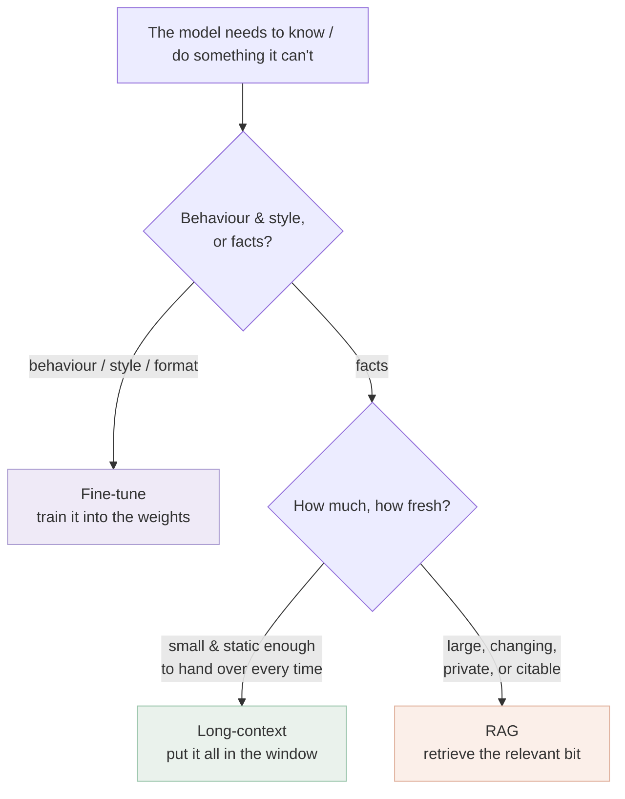

# RAG vs. long-context vs. fine-tuning

*Part of [RAG & vector databases for the product leader](./README.md)*

## TL;DR

There are three ways to give a model knowledge it didn't have, and teams reach for the
wrong one constantly. **RAG** retrieves the relevant facts at query time and puts them in
the prompt — best for large, changing, private, citable knowledge. **Long-context** just
stuffs everything into the (now huge) context window every request — simplest, but pays to
re-read everything each time and degrades when the pile gets big. **Fine-tuning** bakes
patterns into the model's weights by training on your examples — best for *behaviour, style,
and format*, and poor for facts (they go stale and can't be cited). The one-line rule:
**fine-tune for how the model should behave; retrieve for what it needs to know; use
long-context when the knowledge is small enough to just hand over.** They combine — a
fine-tuned model with RAG is common — but choosing the primary tool for *this* need is a
real decision with real cost, and defaulting to any one of them blindly is how features get
expensive, stale, or unattributable.

> 🎯 **For the product leader**
>
> **Why it matters** — This is the most common expensive mistake in AI features:
> fine-tuning to teach facts (which goes stale the next day and can't be cited), or paying
> long-context prices to re-read a knowledge base on every call. The wrong choice here
> compounds into your cost, freshness, and trust story.
>
> **What it changes in your decisions** — You separate two questions that get conflated —
> "how should it behave?" (fine-tune) vs. "what does it need to know?" (retrieve) — and
> pick per need, often combining them, instead of adopting one religion.
>
> **Ask yourself** — *"Are we trying to change the model's behaviour, or give it facts? And
> how fresh must those facts be?"*
>
> **Risk if ignored** — A fine-tuned model confidently reciting last quarter's policy with
> no citation, or a long-context bill that scales with your document count instead of your
> usage.

## The mental model: weights, window, or lookup

Three places knowledge can live, with very different economics:

- **Fine-tuning = the weights.** Permanent, learned patterns. Great for teaching a *voice*,
  a *format*, a *classification*, a domain *style* — things you'd otherwise re-explain in
  every prompt. Bad for facts: retraining to update a price is absurd, and a weight can't
  be cited.
- **Long-context = the window.** Hand the model the material fresh each call. Zero
  retrieval machinery, always current (you control what you paste), and dead simple — but
  you pay to process all of it *every single request*, and quality sags as the pile grows
  and the relevant needle hides in a haystack of tokens.
- **RAG = the lookup.** Fetch only the relevant passages per query. Scales to huge corpora,
  stays fresh (update the index), supports citations and permissions — at the cost of the
  retrieval pipeline you spend this module building.

## The comparison, at altitude

| | Fine-tuning | Long-context | RAG |
| --- | --- | --- | --- |
| Best for | Behaviour, style, format, tone | Small, self-contained knowledge per request | Large / changing / private / citable knowledge |
| Freshness | Stale until you retrain | Fresh (you supply it) | Fresh (update the index) |
| Citations | No | Possible but coarse | Yes — per-passage |
| Cost shape | Big up-front train, cheap-ish serve | Pay to re-read everything every call | Cheap per call + pipeline to build/run |
| Scales to | — (about the model, not data size) | The window limit; degrades well before it | Millions of documents |
| Main risk | Facts rot; expensive to iterate | Cost + "lost in the middle" quality drop | Retrieval quality is the ceiling |

The deeper mechanics of the fine-tune-vs-RAG-vs-in-context tradeoff live in the
[strategy spoke](../content/06-strategy-tradeoffs/finetune-vs-icl-vs-rag.md); this lesson is
the product-leader's decision layer on top of it.

## The "long-context killed RAG" myth

As context windows grew to hundreds of thousands of tokens, a recurring claim appears:
"just put everything in the prompt; RAG is obsolete." It isn't, for four stubborn reasons.
**Cost** — long-context re-processes the whole pile every request, so your bill scales with
document count × calls, not with usage; RAG processes only what's retrieved. **Latency** —
a huge prompt is slow to read before the first token appears. **Quality** — models attend
unevenly across a long window (the "lost in the middle" effect), so burying the answer in
100K tokens can retrieve *worse* than handing over the right 2K. **Freshness & scale** —
your corpus is usually bigger than any window and changes constantly. Long-context is a
genuine, simpler option *when the knowledge is small and static enough* — and a great
partner to RAG (retrieve a generous set, let a long window hold it) — not a replacement.

## They combine

The framing isn't a three-way fight; it's a toolkit. Common stacks: a **fine-tuned model +
RAG** (the model has your voice and domain style baked in, and retrieves current facts); or
**RAG feeding a long window** (retrieve broadly, let the big context hold more candidates so
you lean less on perfect precision). Pick the *primary* tool by the dominant need, then add
the others where they pay.

## Failure modes

- **Fine-tuning for facts** — training to teach knowledge that's stale by next week and
  can't be cited; the classic expensive mistake.
- **Long-context as a default** — paying to re-read a knowledge base every call because it
  "was easier than building RAG," until the bill and latency force a rebuild.
- **RAG for behaviour** — trying to fix tone or format by retrieving examples every time,
  when fine-tuning (or a system prompt) would bake it in cheaply.
- **Religion over fit** — adopting one approach for everything because it's the team's
  comfort zone, instead of matching tool to need.
- **Ignoring "lost in the middle"** — assuming a bigger window means better answers, then
  finding quality dropped as the relevant passage got buried.

## Practitioner checklist

- [ ] Have we separated *behaviour* (fine-tune) from *facts* (retrieve/long-context) for
      this feature?
- [ ] For the facts: are they small and static enough for long-context, or large/changing/
      citable enough to need RAG?
- [ ] Does our cost model reflect that long-context pays per call for the whole pile, while
      RAG pays per retrieval?
- [ ] If we're fine-tuning, is it for style/format/behaviour — never for facts that will
      change?
- [ ] Have we considered *combining* (fine-tune + RAG, or RAG + long window) rather than
      picking one for everything?

## Related lessons

- [Why RAG?](./why-rag.md) — the four jobs that push you toward retrieval.
- [Memory & context](../content/00-foundations/context-engineering.md) — what fills the
  window and why more isn't always better.
- [Fine-tuning vs. ICL vs. RAG vs. distillation](../content/06-strategy-tradeoffs/finetune-vs-icl-vs-rag.md)
  — the engineering-depth spoke.
- [Cost attribution](../content/04-evals-observability/cost-attribution.md) — pricing the
  three approaches honestly.
