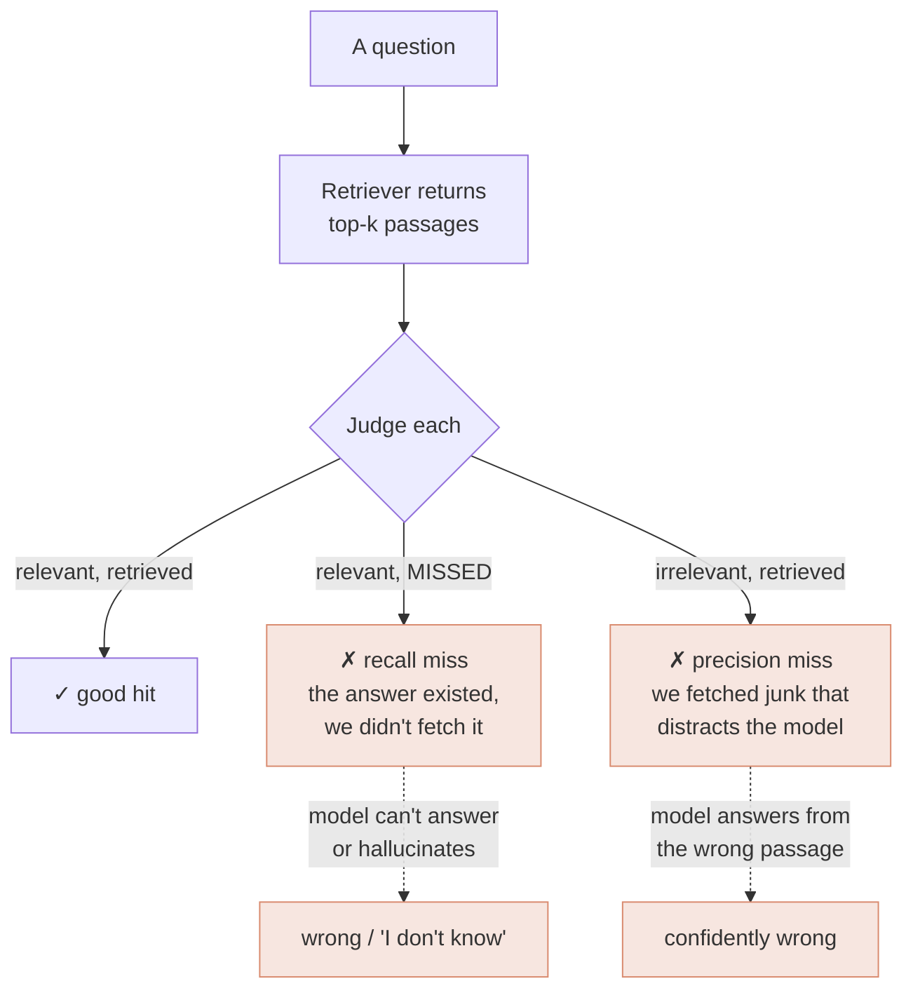

# Retrieval quality

*Part of [RAG & vector databases for the product leader](./README.md)*

## TL;DR

The model's answer can only ever be as good as the passages it's handed — so retrieval
quality *is* RAG quality. Two numbers frame it: **recall** (of the passages that could
answer the question, how many did we retrieve?) and **precision** (of the passages we
retrieved, how many were actually relevant?). They trade off, and which you favour is a
product decision. Three techniques do most of the lifting to raise both: **hybrid search**
(run keyword and [semantic search](./embeddings-and-semantic-search.md) together so each
covers the other's blind spot), **reranking** (a slower, smarter model re-scores the top
candidates so the genuinely-best passages rise to the top), and **filtering** (use
[metadata](./chunking-and-ingestion.md) — recency, permissions, tenant — to exclude the
wrong-but-similar). The non-negotiable underneath all of it: you cannot improve what you
don't measure. A retrieval **eval set** — real questions with known-good passages — turns
"the answers feel off" into "recall dropped on multi-part questions," which is the
difference between a demo and a product.

> 🎯 **For the product leader**
>
> **Why it matters** — This is where RAG features quietly succeed or fail. Two teams with
> the same model and vector DB ship wildly different products depending on retrieval
> quality — and the gap is invisible until you measure it or a customer hits it.
>
> **What it changes in your decisions** — You make a retrieval eval set a launch
> requirement, not a nice-to-have; and you spend the improvement budget on hybrid +
> reranking + filtering before ever reaching for a bigger model.
>
> **Ask yourself** — *"What's our retrieval recall on real, hard questions — and is it on a
> dashboard, or are we guessing from a few demos?"*
>
> **Risk if ignored** — Silent, uneven quality: great on the questions you tested,
> confidently wrong on the ones you didn't, with no way to catch a regression before users
> do.

## The mental model: two ways to be wrong

Retrieval fails in two opposite directions, and confusing them leads to fixing the wrong
thing.

- **A recall miss** — the answer was in your data but retrieval didn't fetch it. The model
  is left to say "I don't know" (best case) or fill the gap by guessing (worst case).
- **A precision miss** — retrieval fetched irrelevant passages. Now the model has distractors
  in its context and may answer from the wrong one, confidently and with a citation.

You want high recall (don't miss the answer) *and* high precision (don't drown it in junk),
and the techniques below push both — but when they conflict, you choose based on stakes.

## Recall vs. precision: the product call

Retrieve more passages (bigger top-k, looser matching) and recall rises but precision falls
— you catch the answer but also more junk. Retrieve fewer/tighter and precision rises but
you risk missing the answer. Which to favour depends on the feature:

- **Favour recall** when missing the answer is the worse failure and the model can sift —
  e.g. legal or medical research where an omission is dangerous, and you'd rather over-fetch
  and rerank hard.
- **Favour precision** when a wrong-but-confident answer is the worse failure — e.g. a
  customer-facing policy bot, where one distractor passage produces an authoritative wrong
  answer worse than a graceful "let me check."

The full treatment — including grounding and citation metrics — lives in the
[retrieval evals](../content/03-rag/retrieval-evals.md) spoke.

## The three levers

- **Hybrid search.** Keyword search nails exact strings (IDs, names, codes); semantic
  search nails paraphrase and intent. Running both and blending the results covers each
  other's blind spots — the single highest-leverage upgrade over pure vector search, and
  the reason production RAG is almost never semantic-only.
- **Reranking.** First-pass retrieval (ANN) is fast and a bit sloppy: it casts a wide net
  of ~20–100 candidates. A **reranker** — a slower, more accurate model — reads those
  candidates against the query and reorders them, so the genuinely-best few reach the model.
  It buys a large precision gain for a little latency, without touching the index.
- **Filtering.** Before or after scoring, use metadata to *exclude* the wrong-but-similar:
  only non-expired passages, only this tenant's, only the current policy version, only what
  this user may see. This is where retrieval quality and [safety/isolation](../content/05-safety-multitenancy/multi-tenant-isolation.md)
  become the same lever.

A typical strong pipeline: hybrid retrieve ~50 candidates → filter by metadata → rerank to
the top 5 → hand those to the model. Each stage is cheap relative to the trust it buys.

## Why you must measure it

Retrieval quality is invisible to inspection — a feature can look great across every query
you happen to try and fail on the long tail you didn't. The remedy is an **eval set**: a
curated list of real questions, each tagged with the passage(s) that should be retrieved.
Run it on every change and you get recall/precision as tracked numbers, catch regressions
before users do, and can finally answer "did that change help?" objectively. This is the
[eval-driven](../technical-product-management/tpm-for-ai-products.md) discipline applied to
retrieval, and it's the practice that most separates teams who *think* their RAG is good
from teams who *know*.

## Failure modes

- **Pure-semantic blindness** — no keyword leg, so every query hinging on an exact code or
  name silently fails; fixed by hybrid, not a bigger embedding model.
- **No reranker** — shipping raw ANN top-k, so similar-but-wrong passages reach the model
  and produce confident errors.
- **Filter-free retrieval** — no recency/permission/version filters, so the stale, the
  forbidden, and the superseded get retrieved and answered from.
- **Vibes-based quality** — no eval set, so quality is a feeling, regressions ship silently,
  and "is it better?" is unanswerable.
- **Optimizing the model, not the retrieval** — swapping to a bigger LLM to fix answers that
  are wrong because retrieval handed it the wrong passages.

## Practitioner checklist

- [ ] Do we run **hybrid** (keyword + semantic), not semantic-only?
- [ ] Is there a **reranking** stage between first-pass retrieval and the model?
- [ ] Do we **filter** by recency, permission, tenant, and version before answering?
- [ ] Have we decided whether this feature favours **recall or precision**, given its worst
      failure?
- [ ] Is there a **retrieval eval set** of real questions with known-good passages, run on
      every change, with recall/precision on a dashboard?

## Related lessons

- [Embeddings & semantic search](./embeddings-and-semantic-search.md) — the fuzzy first
  pass reranking sharpens.
- [Chunking & ingestion](./chunking-and-ingestion.md) — retrieval can only find what
  chunking made findable.
- [Retrieval evals](../content/03-rag/retrieval-evals.md) — the engineering-depth spoke on
  recall, precision, grounding, and citations.
- [Evals](../content/04-evals-observability/evals.md) — the broader measurement discipline.
