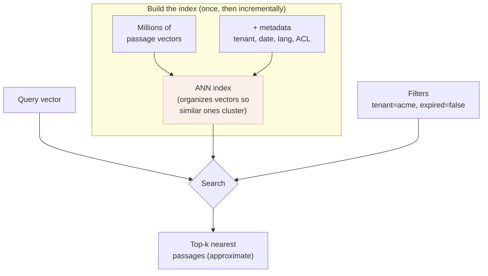

# Vector databases

*Part of [RAG & vector databases for the product leader](./README.md)*

## TL;DR

Once your data is a pile of [embedding vectors](./embeddings-and-semantic-search.md), you
need somewhere to keep millions of them and, given a query vector, find the nearest ones in
milliseconds. That's a **vector database**. Its one hard trick is **approximate nearest
neighbour (ANN)** search: checking every vector to find the truly closest is too slow at
scale, so a vector index takes a deliberate shortcut — it finds *almost* the closest,
*much* faster, trading a sliver of accuracy for orders-of-magnitude speed. Around that core
sit the features that actually decide whether you need a specialist product: **metadata
filtering** (retrieve only this tenant's, this language's, non-expired passages),
freshness (add/update/delete without a full rebuild), and scale. The product-leader trap is
treating this as the hard part — it's the easy, commoditized part. Below a few million
vectors, the vector index in the database you already run is usually enough; the real work
is upstream in [chunking](./chunking-and-ingestion.md) and [retrieval quality](./retrieval-quality.md).

> 🎯 **For the product leader**
>
> **Why it matters** — This is the loudest, most vendor-crowded corner of RAG, so it's
> where teams over-spend attention and budget. Knowing the vector DB is a component — not
> the product — keeps you from a six-month platform bake-off for a workload Postgres
> handles.
>
> **What it changes in your decisions** — You ask for the *query shape* (how many vectors,
> what filters, what latency, what freshness) before anyone names a vendor, and you push
> the team's effort toward ingestion and retrieval quality where it actually pays.
>
> **Ask yourself** — *"How many vectors, filtered by what, at what latency — and did we
> check whether what we already run is enough before buying a new database?"*
>
> **Risk if ignored** — Either an expensive specialist system for a workload that didn't
> need one, or the reverse: a naïve store that can't filter by tenant and leaks one
> customer's passages into another's answers.

## The mental model: a librarian for meaning

A normal database finds rows by exact match on a key ("give me order #4411"). A vector
database finds rows by *closeness in meaning* ("give me the 5 passages most like this
question"). Picture a librarian who, instead of fetching the book you named, fetches the
five books whose *contents* are most similar to a description you hand over — and does it
without reading every book on every request, because they've pre-organized the shelves so
similar books sit together.

That pre-organizing is the index; the "don't read every book" is the *approximate* in ANN.

## Exact vs. approximate: the one tradeoff that matters

The naïve way to find nearest neighbours is *brute force*: compare the query to every
vector. It's perfectly accurate and perfectly unscalable — fine for 10,000 vectors,
hopeless for 100 million. **ANN indexes** (you'll hear names like HNSW and IVF) organize
the vectors so search can skip almost all of them and still usually find the true nearest —
returning in milliseconds what brute force would take seconds to do.

The price is a **recall** knob: an ANN index might return 95–99% of the true top results,
missing an occasional genuine match. You tune it — more accuracy costs more speed and
memory, and vice-versa. For product work this is a dial, not a worry: the miss rate is
tiny, and [reranking](./retrieval-quality.md) and hybrid search cover the gap. What matters
is knowing the dial exists, because "why did it miss that obvious document?" sometimes
traces here.

## What actually differentiates the options

The nearest-neighbour math is commoditized; these surrounding capabilities are where the
real product decisions live:

| Capability | Why it's a product decision |
| --- | --- |
| **Metadata filtering** | Retrieve only this tenant's / this user's / non-expired / this-language passages. This is your [multi-tenant isolation](../content/05-safety-multitenancy/multi-tenant-isolation.md) and permission boundary — get it wrong and you leak. |
| **Freshness (CRUD)** | Can you add, update, and delete vectors continuously, or must you rebuild the index? Decides whether your data can ever be current. |
| **Scale & cost** | Millions vs. billions of vectors changes the architecture and the bill; most products are smaller than vendors imply. |
| **Hybrid support** | Does it combine keyword + vector natively ([lesson 5](./retrieval-quality.md)), or must you bolt that on? |
| **Ops maturity** | Backups, security, monitoring — a new distributed system is a new thing to run at 3 a.m. |

The families you'll meet: **the database you already have** (Postgres with `pgvector`,
or vector features now in most cloud databases) — one system, one ops story, great to a few
million vectors; **dedicated vector databases** (Pinecone, Weaviate, Qdrant, Milvus and
kin) — built for scale, rich filtering and hybrid, at the cost of another system to run;
and **search engines with vectors** (Elasticsearch/OpenSearch) — strong when you already
run them for keyword search and want hybrid in one place.

## How to choose without the vendor fog

1. **Write the query shape down.** Vector count, filters you need (tenant, ACL, recency,
   language), latency budget, freshness (how often data changes), and whether it's in a
   user-facing request path. One page beats any benchmark deck.
2. **Try what you already run first.** If `pgvector` or your cloud DB's vector feature meets
   the shape, stop — you avoid a whole new system. Revisit at the next order of magnitude.
3. **Buy a specialist for real scale or rich hybrid/filtering** you can't get otherwise —
   deliberately, justified by the query shape, not the roadmap slide.
4. **Guard the seams.** Keep ingestion writing a store-neutral format and keep raw sources
   replayable, so the vector DB is a component you can swap — the same
   [lock-in discipline](../technical-product-sense/economics-of-infrastructure.md) as any
   infrastructure choice.

## Failure modes

- **Bake-off theatre** — months comparing vector DBs on synthetic recall while chunking and
  retrieval quality (the real levers) go untouched.
- **Filtering as an afterthought** — discovering post-launch that you can't cheaply
  restrict retrieval to one tenant, so isolation is bolted on or, worse, missing —
  a [leakage](../content/05-safety-multitenancy/safety-engineering.md) risk.
- **Rebuild-only freshness** — an index that can't accept updates without a full rebuild, so
  "current data" quietly means "data as of last Sunday."
- **Over-provisioning for imaginary scale** — running a billion-vector architecture for two
  million vectors; complexity and cost with no benefit.
- **Blaming the DB for bad answers** — the vector DB returned the right neighbours; the
  answer was wrong because the [chunks](./chunking-and-ingestion.md) or
  [reranking](./retrieval-quality.md) were wrong. Look upstream first.

## Practitioner checklist

- [ ] Do we have the query-shape page (count, filters, latency, freshness) before any
      vendor conversation?
- [ ] Did we benchmark the database we already run on production-scale data first?
- [ ] Can we filter retrieval by tenant / permission / recency — and is that enforced, not
      optional?
- [ ] Can the index take continuous adds/updates/deletes, so data stays current?
- [ ] Is ingestion store-neutral and are sources replayable, so we're not married to one
      vector DB?

## Related lessons

- [Embeddings & semantic search](./embeddings-and-semantic-search.md) — what the vectors
  are and how closeness is measured.
- [Chunking & ingestion](./chunking-and-ingestion.md) — where the vectors come from, and
  where quality is really made.
- [Multi-tenant isolation](../content/05-safety-multitenancy/multi-tenant-isolation.md) —
  why metadata filtering is a safety boundary.
- [The economics of infrastructure](../technical-product-sense/economics-of-infrastructure.md)
  — the build/buy/lock-in instincts applied here.
