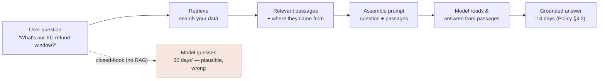

# Why RAG?

*Part of [RAG & vector databases for the product leader](./README.md)*

## TL;DR

A language model knows only what it absorbed at training time: generic, frozen, and
impossible to trace to a source. That's fatal for most real products, which need answers
about *your* data — this customer, this policy, today's inventory — with a citation you can
stand behind. **Retrieval-Augmented Generation (RAG)** solves it without retraining: when a
question comes in, you search your own data for the relevant passages and paste them into
the prompt, so the model answers *from* those facts instead of its frozen memory. RAG does
four jobs a bare model can't — **grounding** (answer from real facts, not invention),
**freshness** (today's data, no retraining), **private knowledge** (your data, never in any
training set), and **attribution** (cite the source). The product test is simple: if your
feature must answer from a body of knowledge that is private, changing, or must be cited,
you need retrieval — and RAG is the default way to get it.

> 🎯 **For the product leader**
>
> **Why it matters** — "The model is smart, let's just ask it" is how teams ship features
> that hallucinate your refund policy in your brand's voice. RAG is the difference between
> an impressive demo and a feature you can put in front of a customer or an auditor.
>
> **What it changes in your decisions** — You stop framing AI features as "which model"
> and start framing them as "which knowledge, how fresh, and how do we prove the answer."
> The model becomes a component; your data and its retrieval become the product.
>
> **Ask yourself** — *"When our feature answers, can it point to the exact source it used —
> and is that source current and ours?"*
>
> **Risk if ignored** — Confident wrong answers about your own business: invented
> policies, stale prices, leaked or fabricated facts — each one a support ticket, a
> cancelled contract, or a compliance finding.

## The mental model: open-book, not closed-book

A bare model answering from training is a student sitting a **closed-book** exam from
memory — fluent, but frozen and prone to confabulation on anything it half-remembers. RAG
turns it into an **open-book** exam: the student still writes the answer, but first gets to
look up the relevant pages. The model's job shifts from *recall* to *reading comprehension
plus synthesis* — a task it's far better and safer at.

The retrieved passages don't just improve the answer — they *bound* it. A well-built RAG
feature can be told "answer only from the passages; if they don't contain the answer, say
so." That single instruction, made possible by retrieval, converts a confident guesser into
a system that knows the edge of its knowledge.

## The four jobs RAG does

| Job | What a bare model does | What RAG adds |
| --- | --- | --- |
| **Grounding** | Invents plausible answers when unsure ([hallucination](../content/03-rag/retrieval-evals.md)) | Answers from retrieved facts; can refuse when they're absent |
| **Freshness** | Frozen at training cutoff; knows nothing since | Retrieves today's data — update the index, not the model |
| **Private knowledge** | Only public training data; nothing of yours | Answers from your docs, which were never in any training set |
| **Attribution** | No idea where an answer "came from" | Every claim traces to a source passage you can show |

These map directly to product requirements. A support assistant needs all four. A coding
helper leans on freshness and private (your codebase). A research tool lives or dies on
attribution. Naming which jobs *your* feature needs tells you how hard to invest in
retrieval quality — and whether RAG is even the right tool
([lesson 6](./rag-vs-long-context-vs-finetuning.md)).

## What RAG is *not*

- **Not fine-tuning.** Fine-tuning bakes *behaviour and style* into the model's weights and
  is poor at facts (they go stale and can't be cited). RAG supplies *facts* at query time.
  They're complementary, and the choice is a real one ([lesson 6](./rag-vs-long-context-vs-finetuning.md)).
- **Not "just search."** Search returns documents for a human to read; RAG returns passages
  for a *model* to read and synthesize into an answer. Retrieval is the first half; the
  model's grounded generation is the second.
- **Not a guarantee.** RAG makes grounding *possible*, not automatic. If retrieval returns
  the wrong passage, the model will faithfully answer from the wrong passage — which is why
  [retrieval quality](./retrieval-quality.md) and [evals](../content/03-rag/retrieval-evals.md)
  are the real work, not the model call.

## The test: do you actually need RAG?

You need retrieval when the answer depends on knowledge that is any of:

1. **Private** — your customers, contracts, code, tickets; never in a training set.
2. **Fresh** — changes faster than you'd ever retrain (prices, inventory, policies, news).
3. **Large** — more than you can or want to paste into every prompt (see the
   [long-context tradeoff](./rag-vs-long-context-vs-finetuning.md)).
4. **Citable** — the product must show its sources for trust, audit, or compliance.

If none hold — the knowledge is public, static, small, and needs no citation — a bare model
(or a fine-tuned one for style) may be simpler. If any hold, you're in RAG territory, and
the rest of this module is how to do it well.

## Failure modes

- **Closed-book shipping** — trusting the model's memory for facts about your business;
  discovered when a customer screenshots an invented policy.
- **Retrieval as an afterthought** — pouring effort into prompt wording while the retriever
  quietly returns the wrong passages; the model's answer can't be better than what it's
  handed.
- **Grounding theatre** — showing citations that don't actually support the claim; worse
  than no citations, because it manufactures false trust ([attribution](../content/03-rag/retrieval-evals.md)).
- **No "I don't know" path** — a RAG feature that always answers, even when retrieval found
  nothing relevant, is just a slower guesser.
- **RAG where fine-tuning or long-context fits better** — reaching for the default without
  checking the alternatives ([lesson 6](./rag-vs-long-context-vs-finetuning.md)).

## Practitioner checklist

- [ ] Which of the four jobs (grounding, freshness, private, citable) does this feature
      actually need — and does that justify retrieval?
- [ ] Can the feature *refuse* — say "I don't have that" when retrieval comes back empty?
- [ ] Does every answer trace to a source passage a user could open and verify?
- [ ] Have we confirmed RAG beats the alternatives (long-context, fine-tuning) for this
      case, not just assumed it?
- [ ] Is retrieval quality — not just prompt wording — on the roadmap as the thing to
      measure and improve?

## Related lessons

- [Embeddings & semantic search](./embeddings-and-semantic-search.md) — how retrieval finds
  the right passages.
- [RAG vs. long-context vs. fine-tuning](./rag-vs-long-context-vs-finetuning.md) — is RAG
  even the right tool?
- [RAG architecture](../content/03-rag/rag-architecture.md) — the engineering-depth spoke.
- [Retrieval evals](../content/03-rag/retrieval-evals.md) — proving the model used the data.
