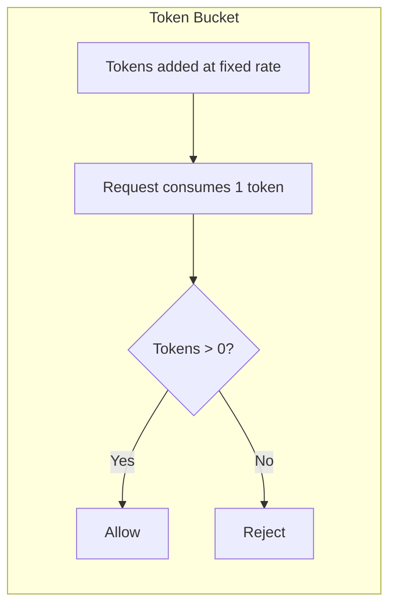
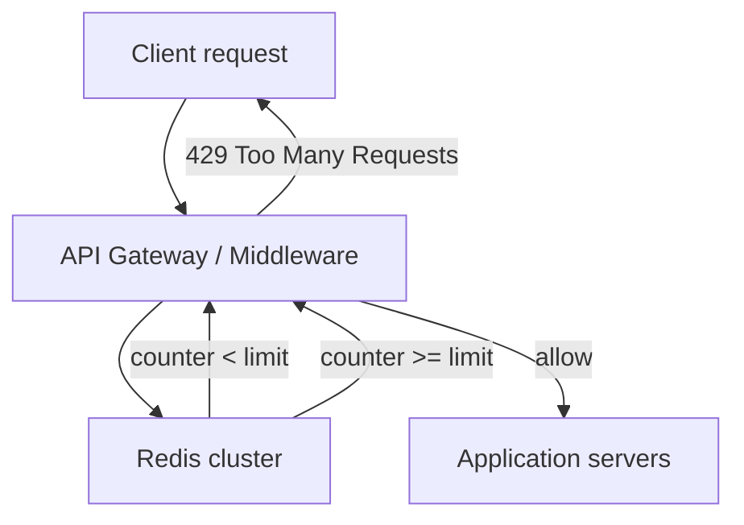
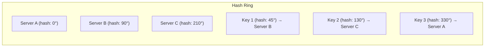
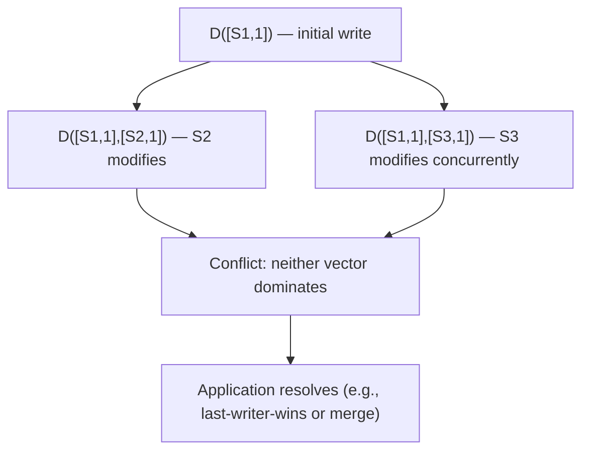
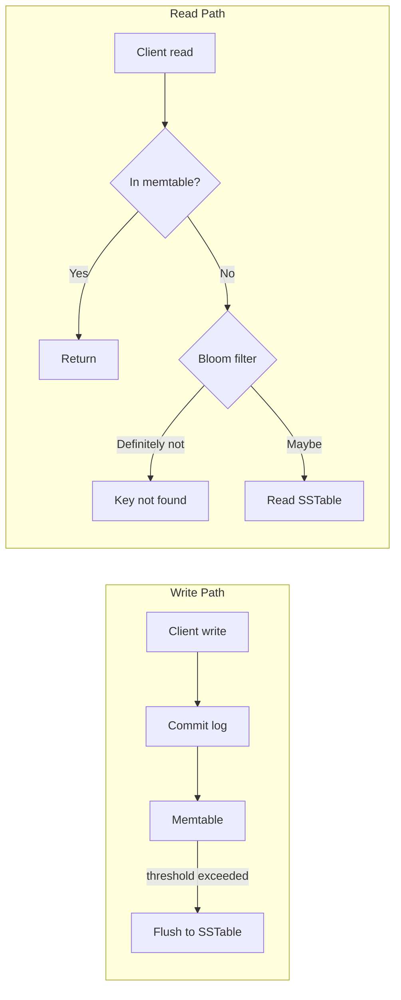
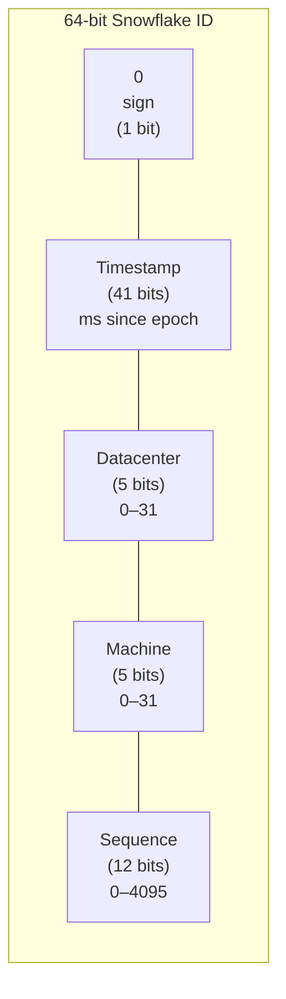

# Core building blocks

*Part of [System design for the technical PM](./README.md)*

## TL;DR

Every large-scale system assembles from a small set of reusable primitives. **Rate limiters** protect services from being overwhelmed — by users, by bugs, by attacks — using algorithms that trade precision for memory and latency. **Consistent hashing** distributes data across a changing set of servers without triggering full re-mappings, and virtual nodes smooth out the inevitable hot spots. **Distributed key-value stores** force you to choose between consistency and availability (CAP theorem) and then give you dials — quorum parameters, vector clocks, gossip protocols — to fine-tune that choice. **Unique ID generators** seem trivial until you need 10,000 IDs per second across five datacenters with no coordination — Twitter's Snowflake shows how a 64-bit integer can encode time, location, and sequence without a single network call.

> 🎯 **For the technical PM**
>
> **Why it matters** — These four primitives show up inside almost every system in this track. If you don't understand how your rate limiter works, you can't reason about why legitimate users get throttled. If you don't understand consistent hashing, you can't evaluate your team's data-migration plan. If you don't understand quorum math, you'll set the wrong expectations about data freshness.
>
> **What it changes in your decisions** — You stop treating rate limits as "just a number" and start asking which algorithm fits your traffic shape. You evaluate storage migrations by how many keys get remapped. You define product SLAs by understanding the consistency model underneath.
>
> **Ask your eng team** — *"What happens to in-flight requests when we add or remove a storage node — how many keys get remapped, and what's the latency during rebalancing?"*
>
> **Risk if ignored** — Rate limits that either block legitimate traffic or fail to stop abuse. Storage rebalancing that takes the system offline. Stale reads that corrupt business logic because nobody checked the quorum configuration.

---

## Rate limiter

A rate limiter controls the rate of traffic a client can send to a system. It sits in the request path — usually as middleware or at the API gateway — and rejects requests that exceed a defined threshold. Without it, a single misbehaving client (or a DDoS attack, or a retry storm from a buggy mobile app) can saturate a service and take down everything behind it.

### Where to place it

Three options, each with tradeoffs:

| Placement | Pros | Cons |
|---|---|---|
| **Client-side** | Zero server load | Easily forged or bypassed; can't enforce across clients |
| **Server-side** | Full control; sees real request | Adds latency to every request; tied to app deployment |
| **Middleware / API gateway** | Decoupled from app; centralized policy | Separate infrastructure to operate; may lack app context |

In practice, most production systems use middleware or a dedicated API gateway (AWS API Gateway, Kong, Envoy) that applies rate limiting before traffic reaches application servers. If you already have an API gateway, put rate limiting there rather than building a second layer.

### Algorithms

Five algorithms dominate production use. Each trades off memory, precision, and burst tolerance:

**Token bucket** — A bucket holds up to *b* tokens. Tokens are added at rate *r* per second. Each request consumes one token (or more for expensive operations). If the bucket is empty, the request is rejected. This naturally allows short bursts (up to *b* requests) while enforcing the long-term rate *r*. Used by Amazon and Stripe. Two parameters per rule: bucket size and refill rate.

**Leaking bucket** — Requests enter a FIFO queue of fixed size. The queue drains at a constant rate. If the queue is full, new requests are dropped. Unlike token bucket, this produces a perfectly smooth output rate — no bursts. Useful when the downstream service can't handle spikes. Shopify uses this via their Leaky Bucket library.

**Fixed window counter** — Divide time into windows (e.g., 60-second intervals). Maintain a counter per window. Increment on each request; reject when counter exceeds threshold. Simple, low memory (one counter per window). Problem: a burst at the boundary between two windows can allow 2x the intended rate — 100 requests in the last 500ms of window 1 and 100 requests in the first 500ms of window 2 gives 200 requests in a one-second span despite a 100/minute limit.

**Sliding window log** — Keep a sorted set of timestamps for each request. When a new request arrives, remove all timestamps older than the window. If the remaining count exceeds the threshold, reject. Precise, but memory-intensive — every request is logged.

**Sliding window counter** — A hybrid: take the weighted count from the previous window and add the current window's count. If the previous window had 70 requests and is 30% elapsed into the current window, the weighted count is `70 * 0.70 + current_count`. Only two counters per window, near-zero memory, and the boundary spike problem is smoothed. This is the most common choice in production.

### Distributed rate limiting with Redis

In a distributed system, rate limit counters must be shared across all application instances. Redis is the standard choice: its `INCR` and `EXPIRE` commands are atomic, fast, and cluster-friendly.

Two race conditions emerge in distributed setups:

1. **Read-then-write race** — Two processes read the same counter, both see it below the limit, both increment. Fix: use Redis's atomic `INCR` or a Lua script that reads, checks, and increments in a single operation.
2. **Synchronization across rate-limiter instances** — If you run multiple rate-limiter nodes, each with its own Redis connection, they may disagree on the current count during network partitions. Fix: use a single Redis cluster as the source of truth, or accept slight over-admission during brief partitions.

### Response headers

Clients need to know their rate-limit status. Standard headers returned with every response:

- `X-Ratelimit-Remaining` — allowed requests left in the current window
- `X-Ratelimit-Limit` — total calls the client can make per window
- `X-Ratelimit-Retry-After` — seconds to wait before retrying (returned with 429)

These headers are essential for well-behaved clients to implement backoff. Without them, clients either retry blindly (making the overload worse) or give up entirely (degrading user experience unnecessarily).

---

## Consistent hashing

When you have *n* servers and need to decide which server stores a given key, the naive approach is `hash(key) % n`. This works until you add or remove a server — then *n* changes, and almost every key maps to a different server. In a cache layer, that means a mass cache miss. In a database, it means a full data migration.

Consistent hashing solves this: when a server is added or removed, only `k/n` keys need to move (where *k* is the total number of keys), rather than nearly all of them.

### The hash ring

Imagine the output space of a hash function (SHA-1 gives 0 to 2^160) bent into a circle — a ring. Both servers and keys are hashed onto this ring. To find which server owns a key, start at the key's position and walk clockwise until you hit a server.

**Adding a server:** Only keys between the new server and its counter-clockwise neighbor need to move. Everything else stays put.

**Removing a server:** Only that server's keys move — they walk clockwise to the next server. The rest of the ring is undisturbed.

### The problem with basic consistent hashing

With a small number of servers, the ring can be badly unbalanced. Three servers won't divide a ring into three equal arcs — their hash positions are effectively random. One server might own 60% of the key space while another owns 10%. Worse, when a server is removed, its entire load transfers to a single neighbor, potentially doubling that neighbor's traffic.

### Virtual nodes

The fix: map each physical server to multiple positions on the ring. Server A gets `hash("A-0")`, `hash("A-1")`, ... `hash("A-199")`. With 200 virtual nodes per physical server, the distribution becomes nearly uniform, and removing a server spreads its load across many neighbors rather than one.

The tradeoff is space: you need to store the mapping from virtual node to physical server. With 200 virtual nodes per server and 1,000 servers, that's 200,000 ring entries — trivially small.

### Where it's used

Consistent hashing is everywhere in distributed infrastructure:

- **Amazon DynamoDB** — partitions data across storage nodes
- **Apache Cassandra** — distributes data across the cluster ring
- **Discord** — routes users to chat servers
- **Akamai CDN** — maps content to edge servers
- **Maglev (Google)** — load balancing with consistent hashing for connection affinity

---

## Distributed key-value store

A key-value store maps keys to values — `put(key, value)` and `get(key)`. At small scale, this is a hash map in memory. At large scale, it's a distributed system that must handle node failures, network partitions, and concurrent writes — which forces you into the most fundamental tradeoff in distributed computing.

### CAP theorem

The CAP theorem (Brewer, 2000) states that a distributed system can deliver at most two of three guarantees simultaneously:

- **Consistency** — every read returns the most recent write
- **Availability** — every request receives a (non-error) response
- **Partition tolerance** — the system continues operating despite network partitions between nodes

Since network partitions are unavoidable in any real distributed system, the practical choice is between **CP** (consistency + partition tolerance) and **AP** (availability + partition tolerance):

| Choice | Behavior during partition | Example | Good for |
|---|---|---|---|
| **CP** | Rejects writes to maintain consistency | HBase, MongoDB (default) | Banking, inventory |
| **AP** | Accepts writes, resolves conflicts later | Cassandra, DynamoDB | Social feeds, session stores |

This isn't a one-time architectural decision — many systems let you choose per-operation or per-table.

### Data partitioning

Data is distributed across nodes using consistent hashing with virtual nodes (see above). Each key hashes to a position on the ring and is stored on the first *N* nodes encountered clockwise.

### Data replication

For durability, each key is replicated across *N* nodes. After hashing a key to its position on the ring, the system walks clockwise and places replicas on the next *N-1* distinct physical servers (skipping virtual nodes that map to the same physical machine).

### Consistency: quorum consensus

Three parameters control the consistency-availability tradeoff:

- **N** — number of replicas
- **W** — number of replicas that must acknowledge a write for it to succeed
- **R** — number of replicas that must respond to a read

The rule: **if W + R > N, strong consistency is guaranteed** — at least one node in the read set will have the latest write.

| Configuration | Guarantee | Use case |
|---|---|---|
| W=1, R=N | Fast writes, slow reads | Write-heavy workloads |
| W=N, R=1 | Slow writes, fast reads | Read-heavy workloads |
| W=N/2+1, R=N/2+1 | Balanced | General purpose |
| W=1, R=1 | Fast but eventually consistent | Caching, analytics |

### Conflict resolution with vector clocks

When two replicas accept concurrent writes to the same key, you have a conflict. **Vector clocks** track causality: each replica maintains a vector of `[server, version]` pairs. When vectors are ordered (one is a strict superset), the superset wins. When they're concurrent (neither is a superset), the system presents both versions to the application for resolution.

Vector clocks grow in size as more servers handle writes. In practice, a clock-truncation threshold removes the oldest entries when the vector exceeds a limit — a rare source of reconciliation errors, but unavoidable for bounded memory.

### Failure detection: gossip protocol

How does the system know when a node is down? Heartbeats to a central monitor create a single point of failure. Instead, distributed KV stores use the **gossip protocol**:

Each node maintains a membership list with heartbeat counters. Periodically, each node increments its own counter and sends its list to a random subset of peers. If a node's counter hasn't increased for a configurable period, it's considered offline. The protocol converges quickly — information spreads exponentially, like gossip in a social network.

### Handling temporary failures

**Sloppy quorum** — when a node in the designated replica set is unreachable, the system temporarily routes writes to the next healthy node on the hash ring. This node holds the data in a **hinted handoff** — when the original node recovers, the temporary holder ships the data back and deletes its copy.

### Permanent failure recovery: Merkle trees

When a replica comes back after a prolonged outage, how do you know which keys are out of date? Comparing every key is expensive. **Merkle trees** (hash trees) solve this: each node maintains a tree where leaves are hashes of key ranges and parent nodes are hashes of children. Two replicas compare their root hashes — if they match, the data is identical. If not, they recurse down the tree, comparing children until they find the divergent key ranges. This reduces the data transferred during synchronization from *O(n)* to *O(log n)*.

### Write and read paths

The internal storage engine follows the **LSM-tree** (Log-Structured Merge-Tree) pattern:

**Write path:**
1. Write is appended to a **commit log** on disk (for durability)
2. Data is inserted into an in-memory **memtable** (sorted structure, typically a red-black tree or skip list)
3. When the memtable exceeds a size threshold, it's flushed to disk as an **SSTable** (Sorted String Table) — an immutable, sorted file

**Read path:**
1. Check the **memtable** first (most recent writes)
2. If not found, check a **Bloom filter** — a probabilistic data structure that tells you if a key is *definitely not* in an SSTable (avoiding disk reads for keys that don't exist)
3. If the Bloom filter says "maybe," read the SSTable from disk

This design optimizes for write throughput: writes are always sequential (append to log, then sequential flush). Reads may require checking multiple SSTables, but Bloom filters and compaction (periodically merging SSTables) keep read amplification manageable.

---

## Unique ID generator

Generating unique IDs seems trivial — `auto_increment` in a single database does the job. But at scale, you need IDs that are:

- **Globally unique** across all servers, datacenters, and time
- **Sortable by time** (so IDs roughly correspond to creation order)
- **64-bit** (fits in a long integer, database-friendly, network-efficient)
- **Generated at high throughput** (10,000+ IDs/second) without coordination

No single approach satisfies all requirements. Here are the options and their tradeoffs:

### Multi-master replication

Use the database's `auto_increment`, but with a step size equal to the number of servers. With 3 servers: server 1 generates 1, 4, 7, 10...; server 2 generates 2, 5, 8, 11...; server 3 generates 3, 6, 9, 12...

**Pros:** Simple, uses existing infrastructure.
**Cons:** Does not scale with multiple datacenters. IDs don't sort by time across servers (server 1's ID 7 may be generated after server 2's ID 8). Adding or removing servers requires changing the step on all nodes — operationally dangerous.

### UUID

A 128-bit universally unique identifier. Generated independently on any server with near-zero collision probability (2^122 random bits in v4). No coordination needed.

**Pros:** Simple, no coordination, scales to any number of servers.
**Cons:** 128 bits, not 64. Not sortable by time. Not numeric — bad for database index performance. The string representation (`550e8400-e29b-41d4-a716-446655440000`) is 36 characters, wasteful in URLs and logs.

### Ticket server

A centralized service (Flickr's approach) that hands out IDs from a single `auto_increment` counter. Simple, numeric, sequential.

**Pros:** Numeric, easy to implement, IDs are ordered.
**Cons:** Single point of failure. If you run two ticket servers with even/odd allocation, you lose global ordering. Becomes a throughput bottleneck at high scale.

### Twitter Snowflake (the winner for most use cases)

A 64-bit ID with a structured layout that encodes time, location, and sequence:

**How it works:**

- **1 sign bit** — always 0 (unsigned)
- **41 bits for timestamp** — milliseconds since a custom epoch. 2^41 ms = ~69 years of IDs before wraparound
- **5 bits for datacenter ID** — supports 32 datacenters
- **5 bits for machine ID** — supports 32 machines per datacenter
- **12 bits for sequence number** — allows 4,096 IDs per millisecond per machine. That's 4,096,000 IDs/second per machine, or 4 billion per second across 1,024 machines

**Why this wins:** IDs are 64-bit (database-friendly), sortable by time (the timestamp is the most significant bits after the sign), globally unique (datacenter + machine + sequence), and generated with zero coordination (each machine generates independently). The custom epoch can be set to your system's launch date to maximize the 69-year range.

**The clock dependency:** Snowflake IDs assume clocks are roughly synchronized (NTP). If a machine's clock goes backward (NTP correction), it could generate duplicate IDs. Production implementations refuse to generate IDs when the clock moves backward, and alert operations.

---

## Failure modes

- **Rate limiter bypassed by client IP rotation** — IP-based rate limiting fails against distributed attacks. Combine with user-ID, API-key, and behavioral-pattern limiting.
- **Rate limiter as a bottleneck** — If the rate limiter (or its Redis backend) fails, you must choose: fail open (allow all traffic, losing protection) or fail closed (reject all traffic, causing an outage). Neither is safe by default — this must be an explicit design decision.
- **Consistent hashing with too few virtual nodes** — Uneven distribution causes hot spots. Monitor per-node load and increase virtual node count if skew exceeds 20%.
- **Vector clock explosion** — In a KV store with many writers, vector clocks grow unbounded. Truncation is necessary but can cause incorrect conflict resolution in rare cases.
- **Gossip protocol slow convergence** — In large clusters (1000+ nodes), gossip can take seconds to propagate a failure. During that window, clients may route requests to a dead node.
- **Snowflake clock skew** — NTP corrections or leap seconds can cause a machine's clock to jump backward, producing duplicate or out-of-order IDs. Monitor clock drift; halt ID generation if the clock moves backward.
- **Quorum misconfiguration** — Setting W=1, R=1 with N=3 gives you speed but no consistency guarantee. If the product requires read-your-writes consistency, this configuration will produce bugs that are almost impossible to reproduce.

## Practitioner checklist

- [ ] Is your rate limiter algorithm matched to your traffic pattern? (Bursty traffic needs token bucket; smooth output needs leaking bucket.)
- [ ] Are rate-limit counters shared across all application instances via a central store (Redis)?
- [ ] Do your rate-limit responses include `X-Ratelimit-Remaining` and `Retry-After` headers?
- [ ] Does your consistent hashing use virtual nodes? How many per physical node?
- [ ] Have you measured the actual key distribution across nodes, not just the theoretical distribution?
- [ ] Is your KV store configured as CP or AP, and does the product team understand what that means for user-visible behavior?
- [ ] Do your quorum parameters (N, W, R) satisfy W + R > N if you need strong consistency?
- [ ] Is your unique ID generator resilient to clock skew? What happens when NTP corrects the clock?
- [ ] Can your ID generator sustain the peak throughput you estimated in [lesson 1](./foundations-and-framework.md)?

## Related lessons

- [Foundations & framework](./foundations-and-framework.md) — the scaling path and estimation techniques these building blocks support
- [Web-scale services](./web-scale-services.md) — URL shortener, web crawler, and news feed that use these primitives directly
- [Data infrastructure](./data-infrastructure.md) — distributed message queues and metrics systems built on the same KV store and hashing primitives
- [Transactional & financial systems](./transactional-and-financial.md) — payment systems where quorum configuration is a business-critical decision

← [Foundations & framework](./foundations-and-framework.md) · → [Web-scale services](./web-scale-services.md)
