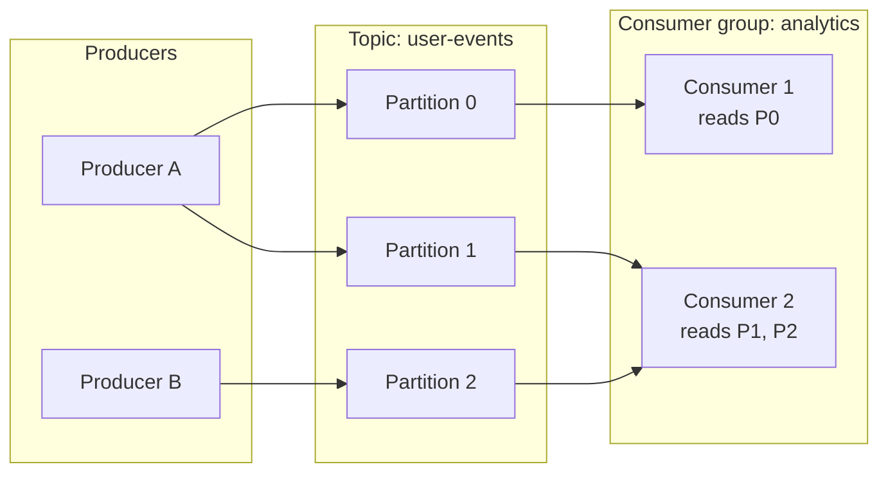
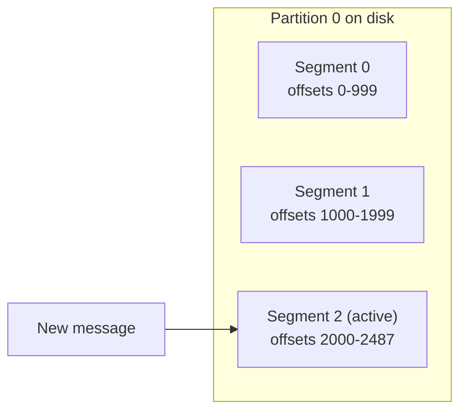
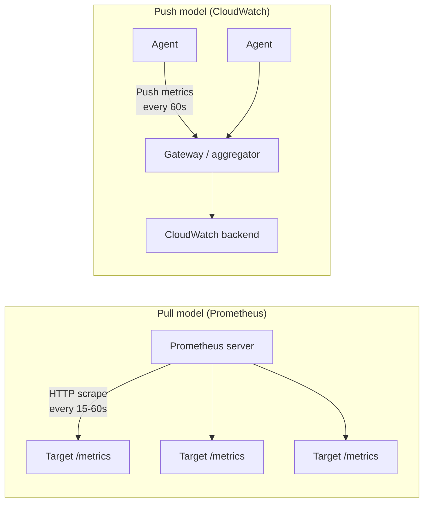
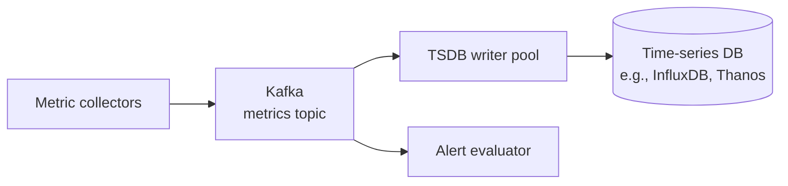
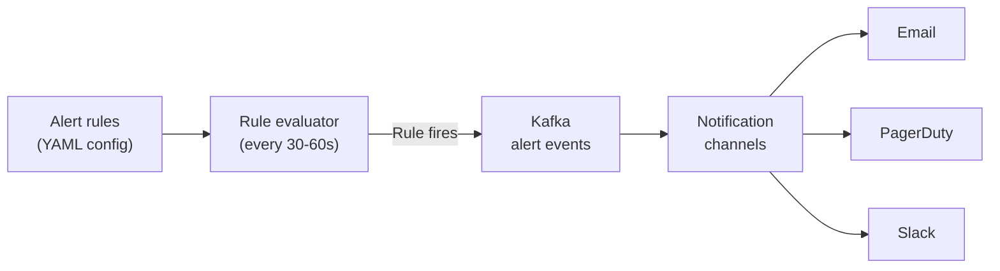
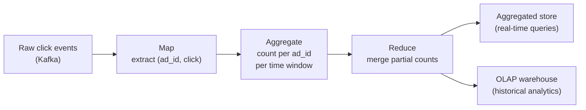
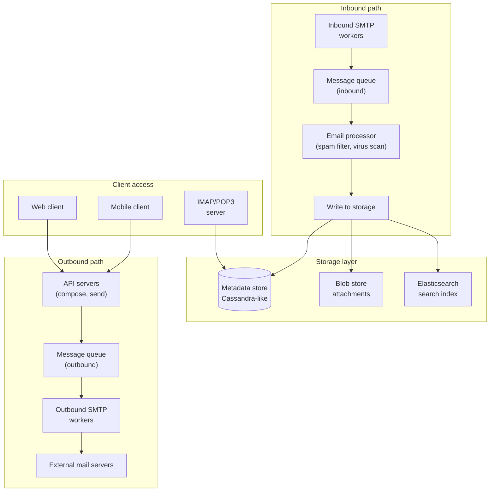

# Data infrastructure

*Part of [System design for the technical PM](./README.md)*

## TL;DR

Data infrastructure is the plumbing beneath every system in this track. **Distributed message queues** (Kafka) decouple producers from consumers, using append-only logs, partitioned topics, and consumer groups. This same pattern appears as a building block in metrics, ad aggregation, email, and a dozen other designs. **Metrics monitoring** combines pull-based collection (Prometheus) with time-series databases and down-sampling, to track 10M metrics without drowning in data. **Ad click aggregation** applies MapReduce and stream processing (Kappa architecture) to produce billing-accurate counts under exactly-once semantics. **Distributed email** handles 100K messages per second by separating SMTP processing from metadata storage, search indexing, and deliverability infrastructure. These four systems share a throughput-first, eventual-consistency design philosophy.

> 🎯 **For the technical PM**
>
> **Why it matters** — Message queues, metrics pipelines, and event aggregation are invisible to users but determine whether your system can absorb traffic spikes, detect problems before users do, and produce accurate billing. They are the foundations your visible features rest on.
>
> **What it changes in your decisions** — You design for throughput and acceptable delay (seconds to minutes), not for sub-millisecond latency. You accept eventual consistency in exchange for fault tolerance. You budget for data retention and down-sampling rather than keeping everything forever.
>
> **Ask your eng team** — *"What's our exactly-once guarantee for billing-critical events, and where in the pipeline can we lose or double-count?"*
>
> **Risk if ignored** — You double-bill advertisers because the click pipeline has at-least-once semantics, or you miss a production outage because your metrics pipeline silently dropped data during a traffic spike.

---

## Distributed message queue

### Scale and requirements

- Kafka-like system handling millions of messages per second
- Messages are durable (persisted to disk, replicated)
- Ordered within a partition, not globally
- Consumer groups for parallel processing
- Retention: days to weeks, not ephemeral

### Core concepts

**Topics** — named streams of messages (e.g., "user-events", "order-updates"). Each topic is divided into **partitions**.

**Partitions** — the unit of parallelism. Each partition is an ordered, append-only log. Messages within a partition are assigned a monotonically increasing **offset**. Ordering is guaranteed within a partition but not across partitions.

**Consumer groups** — a set of consumers that cooperate to consume a topic. Each partition is assigned to exactly one consumer in the group. This guarantees that each message is processed once per group, enabling parallel consumption.

### WAL: the append-only log

Each partition is backed by a **write-ahead log** on disk:

- Messages are **appended** to the active segment — sequential writes, the fastest disk I/O pattern.
- Old segments are immutable and can be served from page cache.
- The log is segmented into files (e.g., 1 GB each) for easier retention management.
- Disk throughput matters more than disk latency — Kafka is designed around sequential I/O, achieving hundreds of MB/s on commodity disks.

### Pull model vs. push model

Kafka uses a **pull model**: consumers request messages from brokers at their own pace.

| Property | Pull (Kafka) | Push (traditional MQ) |
|---|---|---|
| Backpressure | Consumer controls rate | Broker must handle slow consumers |
| Batching | Consumer batches reads | Push granularity set by broker |
| Reprocessing | Consumer resets offset | Not possible without replay |
| Empty queue | Consumer polls (long-poll to avoid busy-wait) | No wasted requests |

The pull model's killer feature is **offset replay**: a consumer can reset its offset to any point in the log and reprocess messages. This enables recovery from bugs, backfilling new features, and exactly-once semantics via idempotent reprocessing.

### ISR replication

Each partition has one **leader** and N-1 **followers**. The **In-Sync Replica set (ISR)** is the set of followers that have caught up to the leader within a configurable lag threshold:

- **ACK=all** — the producer waits for all ISR replicas to confirm. Strongest durability, highest latency.
- **ACK=1** — the producer waits only for the leader. Risk: leader crashes before replicating, message lost.
- **ACK=0** — fire and forget. Fastest, least durable.

If a follower falls too far behind, it's removed from the ISR. If the leader fails, a new leader is elected from the ISR.

### Consumer rebalancing

When consumers join or leave a group, partitions are **rebalanced** — reassigned across the remaining consumers. This is necessary but disruptive:

- During rebalancing, the affected partitions are paused (no messages processed).
- **Eager rebalancing** revokes all partitions and reassigns from scratch — simple but causes a full processing stop.
- **Cooperative rebalancing** (incremental) only revokes the partitions that need to move — less disruption, more complexity.
- Frequent rebalancing (e.g., flapping consumers) degrades throughput. Configure health check intervals and session timeouts carefully.

### Delivery semantics

| Guarantee | How | Cost |
|---|---|---|
| **At-most-once** | Commit offset before processing | Messages may be lost |
| **At-least-once** | Commit offset after processing | Messages may be duplicated |
| **Exactly-once** | Idempotent producer + transactional consumer | Highest complexity, ~10-20% throughput reduction |

**Exactly-once** in Kafka requires:
1. The producer assigns a sequence number to each message; the broker deduplicates.
2. The consumer reads, processes, and commits the offset in a single atomic transaction (Kafka transactions).
3. Downstream systems must be idempotent — if the consumer crashes and retries, the side effect must be safe to repeat.

---

## Metrics monitoring

### Scale and requirements

- 10M active metrics (CPU, memory, request count, error rate, custom business metrics)
- 100M data points per minute at peak
- Dashboard queries spanning hours to months
- Alert latency: detect anomalies within 1-2 minutes
- Data retention: full resolution for 7 days, down-sampled for years

### Collection: pull vs. push

| Property | Pull (Prometheus) | Push (CloudWatch/StatsD) |
|---|---|---|
| Discovery | Service discovery required | Targets self-register |
| Firewall | Scraper must reach targets | Agents push outbound (easier) |
| Short-lived jobs | Misses jobs that finish between scrapes | Captures all events |
| Health detection | Scrape failure = target down | Must infer from missing data |
| Scale | Single scraper bottleneck | Horizontally scalable gateways |

Most production systems use a **hybrid**: Prometheus pull for long-lived services, push gateways for batch jobs and lambdas.

### Kafka as a buffer

Between collectors and the time-series database, a **Kafka buffer** absorbs traffic spikes:

Without the buffer, a traffic spike (deployment, incident, Black Friday) overwhelms the TSDB write path, causing data loss exactly when you need metrics most. Kafka absorbs the burst. The TSDB writer pool processes at a sustainable rate.

### Time-series storage: down-sampling and encoding

Raw metrics at 10-second intervals generate enormous data volumes. **Down-sampling** reduces older data:

| Age | Resolution | Aggregation |
|---|---|---|
| 0-7 days | 10 seconds | Raw |
| 7-30 days | 1 minute | Average, min, max |
| 30-365 days | 1 hour | Average, min, max |
| 1+ year | 1 day | Average, min, max |

**Double-delta encoding** compresses time-series data efficiently:
- Timestamps are regular (every 10s), so the delta between consecutive timestamps is nearly constant. Store the delta-of-deltas (often 0 or very small).
- Values often change slowly. Store the XOR of consecutive values (leading/trailing zeros compress well).
- Result: 16 bytes per data point compressed to ~1.37 bits on average (Facebook's Gorilla paper).

### Alert system

Alert rules are evaluated continuously (every 30-60 seconds):
- `avg(cpu_usage{service="api"}) > 0.85 for 5m` — sustained high CPU.
- `rate(http_5xx_total[5m]) > 0.01` — error rate spike.

Fired alerts go through Kafka (decoupling evaluation from notification) and fan out to configured channels. **Alert fatigue** is the biggest operational risk — too many alerts train teams to ignore them.

---

## Ad click aggregation

### Scale and requirements

- 1 billion ad clicks per day (~11,600 clicks/sec average, ~30K peak)
- Aggregated counts used for **billing** — accuracy is non-negotiable
- Real-time dashboard for advertisers (counts within 1-2 minutes of click)
- Historical analytics queries (trends, A/B testing)

### MapReduce aggregation

The click stream flows through a MapReduce-style pipeline:

**Map** — extract the relevant fields from raw click events: ad_id, timestamp, user_id, device_id.

**Aggregate** — count clicks per ad_id per time window (e.g., per minute). This is the first reduction: billions of raw events become millions of (ad_id, window, count) tuples.

**Reduce** — merge partial counts from multiple aggregation nodes into final counts.

### Kappa architecture

Traditional Lambda architecture maintains two pipelines: a batch layer for accuracy and a speed layer for latency. **Kappa architecture** simplifies this to a single stream-processing pipeline:

- All data flows through Kafka.
- A stream processor (Flink, Spark Streaming) performs real-time aggregation.
- If the logic changes, replay Kafka from the beginning to recompute.
- No separate batch layer to maintain and reconcile.

The tradeoff: replay for recomputation can be slow for large windows, but for click aggregation (daily/weekly windows), it's manageable.

### Event time vs. processing time

Clicks don't arrive in order. A click at 14:00:03 might arrive at the server at 14:00:07 due to network delays. Which timestamp matters?

- **Processing time** — when the server receives the event. Simpler but inaccurate during traffic bursts or network issues.
- **Event time** — when the click actually happened (client-side timestamp). Accurate but requires handling late arrivals.

**Watermarking** handles late events:
- The system tracks a **watermark**: the timestamp beyond which no more events are expected.
- Events arriving after the watermark are either dropped or sent to a late-event side output.
- The watermark advances as events arrive, with a configurable lag tolerance (e.g., "wait 5 minutes for stragglers").

### Windowing strategies

| Window type | How it works | Use case |
|---|---|---|
| **Tumbling** | Fixed, non-overlapping intervals (e.g., every 1 minute) | Per-minute click counts |
| **Sliding** | Fixed size, advances by a slide interval (e.g., 5-min window, 1-min slide) | Moving averages |
| **Session** | Dynamic, grouped by activity gaps | User session analysis |

For billing, **tumbling windows** are the standard: each click falls into exactly one window, guaranteeing no double-counting.

### Exactly-once for billing

Billing demands exactly-once semantics. The pipeline achieves this through:

1. **Kafka transactions** — consume input, produce output, and commit offsets atomically.
2. **Idempotent writes** — each aggregation result carries a unique (ad_id, window_start) key. Duplicate writes overwrite with the same value.
3. **Click deduplication** — same user clicking the same ad within a short window (1 minute) is deduplicated using a Bloom filter or Redis set keyed on (ad_id, user_id, minute).

### Star schema pre-aggregation

For analytics queries ("show me clicks by country, by device, by hour for campaign X"), raw events are pre-aggregated into a **star schema**:

- **Fact table:** aggregated clicks (ad_id, timestamp_minute, count, click_cost)
- **Dimension tables:** ad details, campaign details, advertiser details, geography, device type

Pre-aggregation reduces query-time computation: instead of scanning billions of raw events, the OLAP engine scans millions of pre-aggregated rows.

---

## Distributed email service

### Scale and requirements

- 1 billion users
- 100,000 emails sent/received per second
- Average email: 50 KB text + metadata; attachments stored separately
- Search across a user's entire mailbox within 1 second
- 99.99% availability — email is mission-critical infrastructure
- Deliverability: emails must reach recipients' inboxes, not spam folders

### Architecture overview

### SMTP workers + message queues

Email processing is inherently asynchronous — the sender doesn't wait for the recipient to read it. Message queues decouple each stage:

- **Inbound:** SMTP workers accept connections, parse MIME messages, and enqueue for processing. The queue absorbs bursts (email traffic is extremely spiky — marketing blasts, newsletters, holiday greetings).
- **Processing:** spam filtering, virus scanning, routing rules, auto-reply triggers. Each is a consumer of the inbound queue.
- **Outbound:** compose requests go to an outbound queue. SMTP workers dequeue, resolve MX records, establish TLS connections, and deliver. Failures go to a retry queue with exponential backoff.

### Metadata storage: Cassandra-like store

Email metadata (sender, recipients, subject, timestamp, folder, read/unread status, labels) is stored in a wide-column store (Cassandra, HBase) **partitioned by user_id**:

| Partition key | Clustering key | Data |
|---|---|---|
| user_id | (folder, timestamp DESC) | subject, from, snippet, is_read, labels |

This partitioning guarantees:
- **All of one user's email on one partition** — folder listing is a single-partition scan, no cross-partition queries.
- **Time-ordered within folders** — newest first, matching inbox UX.
- **Horizontally scalable** — add nodes as user count grows, with consistent hashing for partition assignment.

Attachments are stored separately in blob storage (S3 or equivalent), with only a reference (blob_id, size, content_type) in the metadata row.

### Elasticsearch for search

Full-text search across email bodies, subjects, and metadata is powered by Elasticsearch:

- **Indexing:** when an email is stored, an async job indexes its text content, metadata, and attachment text (extracted via Tika or similar) into an Elasticsearch index sharded by user_id.
- **Querying:** search queries are routed to the user's shard, supporting boolean queries, phrase matching, date ranges, and label filters.
- **Consistency:** the search index is eventually consistent with the metadata store. A just-received email may take 1-5 seconds to appear in search results.

### Deliverability: SPF, DKIM, and IP warm-up

Sending email is easy. Getting it delivered to inboxes (not spam folders) is hard:

**SPF (Sender Policy Framework):** a DNS TXT record listing the IP addresses authorized to send email for a domain. Receiving servers check the sending IP against this list.

**DKIM (DomainKeys Identified Mail):** the sending server signs each email with a private key. The receiving server verifies the signature using a public key published in DNS. This proves the email wasn't tampered with in transit.

**IP warm-up:** a new sending IP has no reputation. Sending a million emails from a cold IP triggers spam filters. The warm-up process:
1. Start with 50-100 emails/day to engaged recipients.
2. Gradually increase volume over 4-6 weeks.
3. Monitor bounce rates, spam complaints, and inbox placement.
4. Maintain consistent volume — sudden spikes damage reputation.

**DMARC** ties SPF and DKIM together with a policy: "if an email fails both SPF and DKIM, reject it / quarantine it / let it through." This protects the domain from spoofing.

---

## Failure modes

- **Consumer lag in Kafka** — if consumers can't keep up with producers, the lag grows until retention expires and messages are lost. Monitor consumer lag as a first-class metric.
- **Alert storm** — a widespread failure triggers thousands of alerts simultaneously, overwhelming the notification system and the on-call engineer. Mitigation: alert aggregation, deduplication, and escalation policies.
- **Click double-counting** — at-least-once semantics without deduplication means the same click is counted twice. For billing, this means overcharging advertisers. Mitigation: idempotent writes with (ad_id, window) keys.
- **Watermark too aggressive** — setting the late-event tolerance too tight drops legitimate late clicks. Setting it too loose delays final aggregation. There is no correct value, only a tradeoff.
- **Email backpressure cascade** — a downstream mail server (Gmail, Outlook) rate-limits your sending IP. The outbound queue grows, retry storms amplify load, and all outbound email is delayed. Mitigation: per-destination rate limiting, separate queues per destination domain.
- **Elasticsearch index corruption** — a corrupted search index makes a user's email unsearchable. The metadata store is the source of truth; the search index can be rebuilt from it, but rebuilding for a heavy user takes minutes.
- **TSDB write amplification** — down-sampling creates write amplification as data is rewritten at coarser granularities. During a spike, the TSDB may struggle with both ingestion and down-sampling simultaneously.
- **Kafka partition hotspot** — if the partition key has skewed distribution (one ad_id gets 90% of clicks), one partition bears disproportionate load. Mitigation: add a random suffix to the key (sub-partitioning) and reaggregate downstream.

## Practitioner checklist

- [ ] Is your message queue configured for the right delivery guarantee (at-most/at-least/exactly-once) for each use case?
- [ ] Are consumer group rebalancing events monitored and minimized?
- [ ] For metrics: is there a Kafka buffer between collection and storage to absorb spikes?
- [ ] Are metrics down-sampled with appropriate retention policies?
- [ ] For click aggregation: is deduplication in place before aggregation?
- [ ] Is the pipeline using event time (not processing time) with watermarking for late events?
- [ ] For email: is metadata partitioned by user_id for single-partition reads?
- [ ] Are SPF, DKIM, and DMARC configured, and is IP warm-up planned for new sending infrastructure?
- [ ] Is the search index eventually consistent with the source of truth, and can it be rebuilt from it?
- [ ] Are alert rules tuned to avoid fatigue (alert on symptoms, not causes)?

## Related lessons

- [Storage & sync](./storage-and-sync.md) — WAL-style append model that underpins both Kafka and object storage
- [Core building blocks](./core-building-blocks.md) — consistent hashing for Kafka partition assignment and Cassandra ring membership
- [Location & geo services](./location-and-geo-services.md) — Kafka-based stream processing for the traffic aggregation pipeline
- [Transactional & financial systems](./transactional-and-financial.md) — exactly-once semantics reappears in payment processing and double-entry ledgers

← [Location & geo services](./location-and-geo-services.md) · → [Transactional & financial systems](./transactional-and-financial.md)
