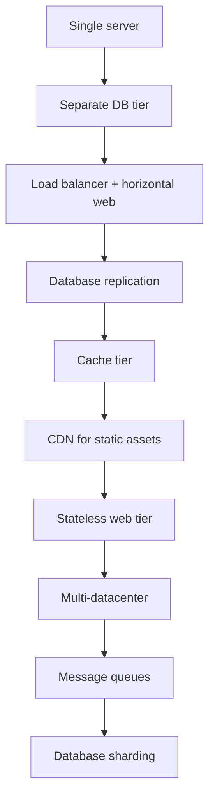
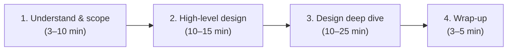

# Foundations & framework

*Part of [System design for the technical PM](./README.md)*

## TL;DR

Every system starts as one server and grows by separating concerns: compute from storage, reads from writes, hot data from cold. **Scaling** is the art of adding capacity without redesigning — through load balancers, replication, caching, CDNs, message queues, and sharding. Before you design anything, **back-of-envelope estimation** forces you to confront the numbers: QPS, storage, bandwidth, cost. And the **four-step framework** (scope → high-level design → deep dive → wrap-up) keeps you from getting lost in detail before you've agreed on what you're building.

> 🎯 **For the technical PM**
>
> **Why it matters** — If you can't estimate QPS or spot where a system will bottleneck, you're making capacity and timeline decisions blind. The framework isn't academic — it's how your team should scope every technical bet.
>
> **What it changes in your decisions** — You stop treating scaling as "we'll figure it out later." You insist on estimation before committing to architecture. You know when vertical scaling hits a wall and horizontal scaling demands statelessness.
>
> **Ask your eng team** — *"What's our peak QPS, and which tier hits its limit first — compute, storage, or network?"*
>
> **Risk if ignored** — You ship a system that works at demo scale and breaks at launch scale, or you over-provision by 10× because nobody ran the numbers.

---

## Scaling: from one server to millions of users

The evolution follows a predictable path. Each step solves one bottleneck and introduces the next:

### Single server to separated tiers

Everything starts on one machine: web server, database, cache, static files. The first split separates **compute** (web/application servers) from **storage** (database), because they scale differently — compute is stateless and horizontally scalable, storage needs replication and consistency guarantees.

### Load balancing and replication

A **load balancer** sits in front of web servers and distributes requests. Users hit the LB's public IP; individual servers keep private IPs, hidden from clients. This enables horizontal scaling (add servers behind the LB) and eliminates single points of failure.

**Database replication** follows, typically master-slave: writes go to the master, reads fan out across replicas. If the master fails, a slave is promoted. If a slave fails, reads redirect to others. The tradeoff: replication lag means reads can be stale — acceptable for most features, dangerous for financial transactions.

### Caching, CDN, and statelessness

A **cache tier** (Redis, Memcached) sits between the web tier and the database. Read-through caching: check cache first, fall back to DB, populate cache for next read. Critical decisions: expiration policy, eviction strategy (LRU is the default), and how to handle cache-DB inconsistency during writes.

A **CDN** pushes static assets to edge servers near users. CDN cost is proportional to traffic, so cache expiration tuning matters — too short wastes origin bandwidth, too long serves stale content.

**Statelessness** means moving session data out of individual web servers into a shared store (Redis, or a dedicated session DB). This lets any request go to any server, which is what makes auto-scaling and multi-datacenter deployments possible.

### Sharding: the final frontier

When the database itself becomes the bottleneck, you **shard** — partition data across multiple database instances. The key decision is the **shard key**: it must distribute data evenly and support your most common queries without cross-shard joins.

Sharding introduces three hard problems:
- **Resharding** — when shards grow unevenly, you need to redistribute. Consistent hashing ([lesson 2](./core-building-blocks.md)) solves this.
- **Celebrity/hotspot problem** — one shard gets disproportionate traffic (e.g., a celebrity's data). Solution: dedicate shards per hot key, or add a secondary partition layer.
- **Join and denormalization** — cross-shard joins are expensive or impossible. You denormalize, trading storage for query simplicity.

---

## Back-of-envelope estimation

Jeff Dean's philosophy: "back-of-the-envelope calculations are estimates you create using a combination of thought experiments and common performance numbers." The goal isn't precision — it's sanity-checking whether a design is feasible.

### The numbers you need to know

| Operation | Latency |
|---|---|
| L1 cache reference | 0.5 ns |
| L2 cache reference | 7 ns |
| Main memory reference | 100 ns |
| SSD random read | 150 μs |
| HDD seek | 10 ms |
| Send 1 MB over 1 Gbps network | 10 ms |
| Read 1 MB sequentially from SSD | 1 ms |
| Read 1 MB sequentially from HDD | 20 ms |
| Cross-datacenter round trip | 150 ms |

**Key insight:** memory is fast, disk is slow, network is expensive. Compress data before sending it over the network. Avoid disk seeks whenever possible.

### Availability in nines

| Availability | Downtime/year | Downtime/day |
|---|---|---|
| 99% (two nines) | 3.65 days | 14.4 minutes |
| 99.9% | 8.77 hours | 1.44 minutes |
| 99.99% | 52.6 minutes | 8.6 seconds |
| 99.999% (five nines) | 5.26 minutes | 0.86 seconds |

### Worked example: Twitter-scale estimation

- 300M monthly active users, 50% daily → 150M DAU
- Each user tweets 2/day on average → 300M tweets/day
- 10% of tweets contain media, average 1 MB → 30 TB/day of media storage
- QPS: 300M / 86,400 ≈ 3,500 avg, ~7,000 peak (2× avg)
- 5-year storage: 30 TB/day × 365 × 5 ≈ **55 PB**

The point isn't the exact number — it's knowing whether you need terabytes or petabytes, hundreds of QPS or hundreds of thousands.

---

## The four-step system design framework

A structured approach that prevents you from diving into implementation before agreeing on scope:

### Step 1: Understand the problem and establish scope

Ask clarifying questions. Document assumptions. Determine the scale (users, QPS, storage, latency requirements). Identify the most important features — you can't design everything in 45 minutes; scope decides what to detail and what to sketch.

### Step 2: Propose high-level design and get buy-in

Draw the box diagram: clients, load balancers, web servers, caches, databases, message queues, CDNs. Walk through the main use cases against the diagram. Do a quick back-of-envelope check. Get agreement before going deeper.

### Step 3: Design deep dive

Prioritize the 2–3 most critical or interesting components. This is where you discuss algorithms, data models, API contracts, consistency models, and failure handling. Balance depth with breadth — a thorough treatment of one component is better than a shallow pass across everything.

### Step 4: Wrap-up

Summarize the design. Name the bottlenecks you didn't address. Propose what you'd improve next: error handling, scaling the next bottleneck, metrics and monitoring. This is where you show you understand the system's limits, not just its capabilities.

---

## Failure modes

- **Premature optimization** — sharding before you've exhausted replication; caching before you've indexed properly.
- **Estimation without units** — "we need a lot of storage" is not an estimate. Label everything: QPS, GB/day, ms latency.
- **Ignoring the read/write ratio** — a 100:1 read-heavy system and a 1:1 write-heavy system need fundamentally different architectures.
- **Stateful web tier** — session affinity (sticky sessions) prevents horizontal scaling and makes failover dangerous.
- **Single points of failure** — any component without redundancy is a system-wide outage waiting to happen.

## Practitioner checklist

- [ ] Can you estimate the QPS, storage, and bandwidth for the system from first principles?
- [ ] Have you identified the read/write ratio and designed the architecture accordingly?
- [ ] Is the web tier stateless? Can any request go to any server?
- [ ] Does every critical component have redundancy (no SPOF)?
- [ ] Have you chosen a cache eviction strategy and defined TTLs?
- [ ] Do you know which tier will hit its scaling limit first?
- [ ] Is the shard key chosen to distribute data evenly and support your primary queries?

## Related lessons

- [Core building blocks](./core-building-blocks.md) — the primitives (consistent hashing, rate limiting) that the scaling path relies on
- [Latency, scale & performance](../technical-product-sense/latency-scale-performance.md) — the product-sense view of the same scaling concerns
- [Economics of infrastructure](../technical-product-sense/economics-of-infrastructure.md) — what scaling decisions cost in dollars
- [Production failure modes](../content/06-strategy-tradeoffs/production-failure-modes.md) — how these patterns fail when LLMs are in the loop

← [Overview](./README.md) · → [Core building blocks](./core-building-blocks.md)
