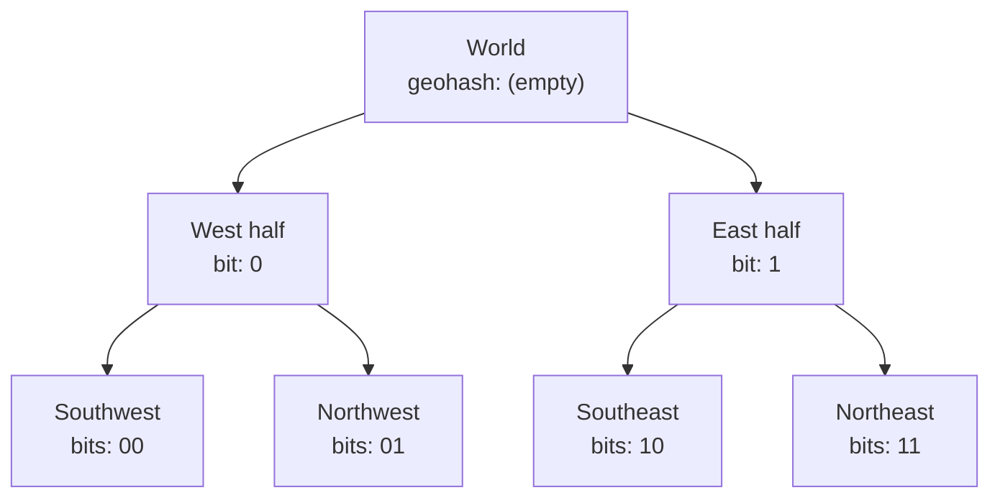
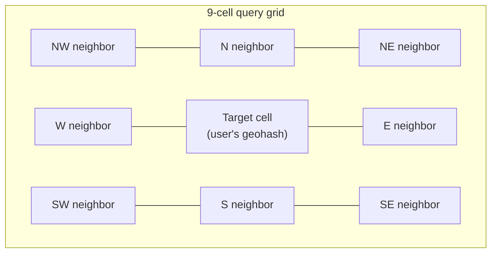
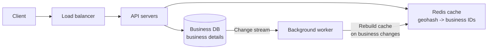
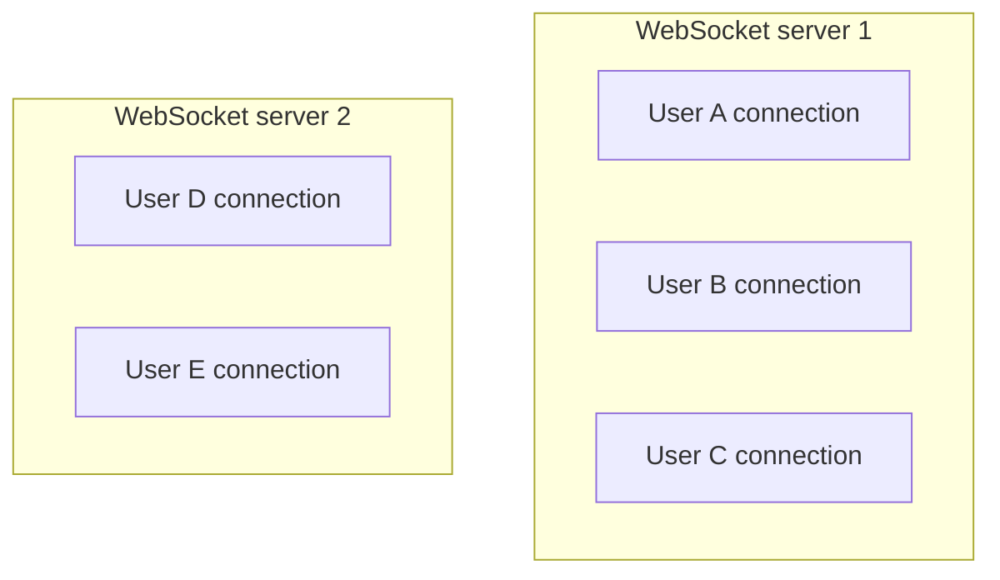
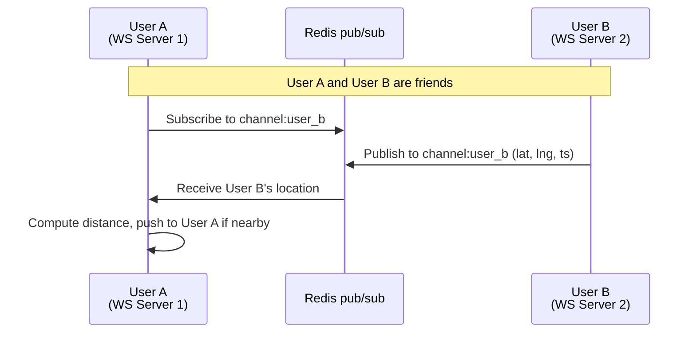
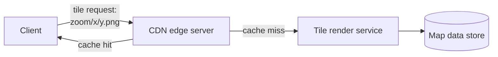
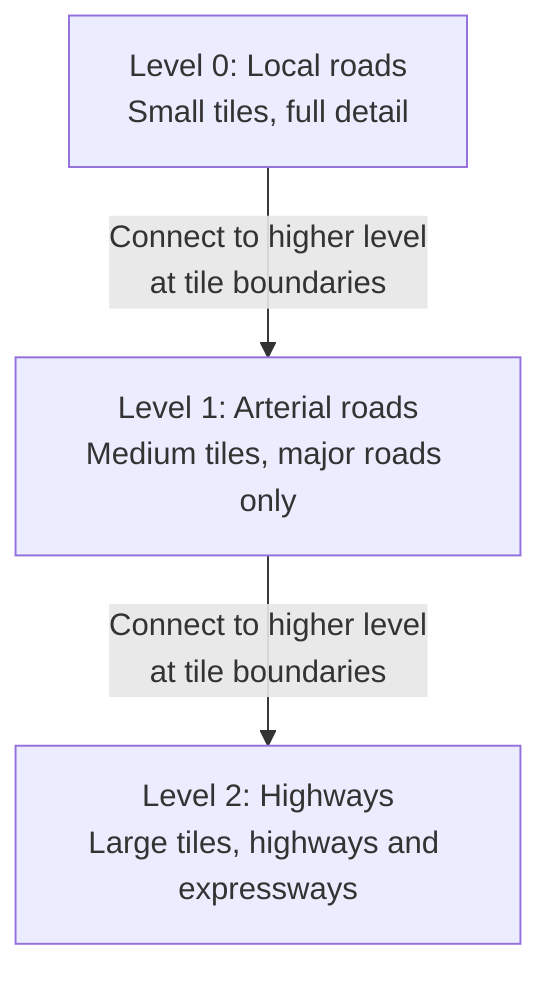
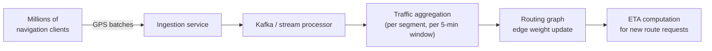

# Location & geo services

*Part of [System design for the technical PM](./README.md)*

## TL;DR

Location-aware systems face a fundamental challenge: mapping the continuous, curved surface of the Earth onto discrete, queryable data structures. **Proximity search** (find businesses near me) uses geohashing to convert 2D coordinates into sortable 1D strings. This enables efficient range queries on standard databases. **Nearby friends** (real-time location sharing) adds the streaming dimension — 334K location updates per second flowing through WebSocket servers and Redis pub/sub channels. **Google Maps** stacks multiple geospatial problems: tiling the planet into a hierarchy of pre-rendered images, routing through continent-scale road graphs, and computing adaptive ETAs from live traffic. The common thread: spatial indexing is the bottleneck. The choice of index structure — geohash, quadtree, S2 cells — determines every downstream tradeoff.

> 🎯 **For the technical PM**
>
> **Why it matters** — Any feature involving "nearby," "around me," or "estimated arrival" depends on spatial indexing. The choice of geospatial data structure determines query latency, update cost, and whether your system can scale to millions of moving entities.
>
> **What it changes in your decisions** — You stop treating location as just a lat/long column with a distance filter. You budget for the infrastructure to handle continuous location streams (WebSockets, pub/sub), and you size your tile/routing CDN for the coverage area.
>
> **Ask your eng team** — *"Are we using geohash or quadtree for spatial indexing, and how do we handle queries at geohash boundaries?"*
>
> **Risk if ignored** — Your "find nearby" feature scans every record in the database, your real-time location sharing drains phone batteries, or your routing engine gives ETAs that are 30% off because it ignores live traffic.

---

## Proximity service

### Scale and requirements

- 100M daily active users
- 200M businesses in the database
- Users search for businesses within a radius (500m to 5km)
- Read-heavy: business data changes infrequently; searches happen constantly
- Latency target: results in under 200ms

### The spatial indexing problem

The naive approach — scan all 200M businesses, compute the distance to the user, filter by radius — is O(n) per query. At 100M DAU, that's unacceptable.

The problem is that standard database indexes (B-trees) work on one dimension. Latitude and longitude are two dimensions. You need a way to convert 2D spatial proximity into something a 1D index can handle.

### Approaches compared

| Approach | How it works | Pros | Cons |
|---|---|---|---|
| **2D range scan** | `WHERE lat BETWEEN x1 AND x2 AND lng BETWEEN y1 AND y2` | Simple | Two index scans intersected; slow at scale |
| **Even grid** | Divide world into equal-sized cells | Conceptually simple | Uneven data distribution (ocean cells empty, city cells overloaded) |
| **Geohash** | Encode lat/lng into a base-32 string; shared prefix = spatial proximity | Sortable, standard DB index, easy neighbor lookup | Edge cases at cell boundaries |
| **Quadtree** | Recursively subdivide space; split cells that exceed a threshold | Adaptive density | In-memory only; hard to distribute |
| **Google S2** | Map sphere to cube faces, then use Hilbert curves | Handles poles and antimeridian; tunable cell levels | Complex implementation |

**Geohash is the standard choice** for most proximity services: it's simple, works with any database that supports range queries, and handles the common case well.

### How geohashing works

Geohash recursively bisects the world, alternating between longitude and latitude, encoding each decision as a bit. The bits are then encoded as a base-32 string:

Key properties:
- **Prefix sharing** — points with the same geohash prefix are spatially close (with caveats at boundaries).
- **Precision control** — longer geohash = smaller cell. A 6-character geohash covers ~1.2 km x 0.6 km.
- **Range queryable** — "find all businesses in cell 9q8yyk" is a simple string prefix query on a B-tree index.

| Geohash length | Cell width | Cell height | Use case |
|---|---|---|---|
| 4 | ~39 km | ~20 km | Regional search |
| 5 | ~5 km | ~5 km | City district |
| 6 | ~1.2 km | ~0.6 km | Neighborhood |
| 7 | ~150 m | ~150 m | Block level |

### The boundary problem and 8-neighbor lookup

Geohash has a well-known edge case: two points on opposite sides of a cell boundary can be very close geographically but have completely different geohash prefixes.

The solution: query the target cell **and all 8 neighboring cells**:

This guarantees coverage: any point within the search radius falls within one of these 9 cells (assuming the cell size is chosen to match the search radius). The query becomes 9 prefix lookups — still fast on an indexed column.

### Caching with Redis

Business data changes slowly (new restaurant listings, address updates), but searches are extremely frequent. Cache businesses by geohash key in Redis:

- **Key:** `geohash:{precision}:{geohash_value}` (e.g., `geohash:6:9q8yyk`)
- **Value:** list of business IDs in that cell
- **TTL:** long (hours), because business locations rarely change
- **Invalidation:** when a business is added/updated/removed, recompute its geohash and update the relevant key

A search query resolves to 9 Redis lookups (the target cell + 8 neighbors), each returning a list of business IDs. Client-side or API-side filtering then computes exact distances and applies the radius filter.

### Architecture

---

## Nearby friends

### Scale and requirements

- 1 billion total users, 10% concurrent (~100M online at any time)
- 10M actively sharing location simultaneously
- Location updates every 30 seconds per active user
- Update rate: 10M / 30 = **~334K location updates per second**
- Show friends within 5 miles, refresh every 30 seconds
- Average user has 400 friends, ~10% are nearby at any time

### Why HTTP polling fails

At 334K updates/sec, if each update requires:
1. Client sends location to server (HTTP request)
2. Server queries all friends' locations
3. Server returns nearby friends list

This is request-heavy, latency-heavy, and wasteful — most updates won't change the nearby-friends list.

### WebSocket servers (stateful)

The solution: **persistent WebSocket connections** between each client and a WebSocket server. The server holds in-memory state mapping user_id to their connection:

When User A sends a location update:
1. The WebSocket server receives it.
2. It looks up User A's friend list.
3. For each friend, it checks: is that friend nearby?
4. If yes, it pushes User A's new location to the friend's WebSocket connection.

The problem: User A's friends may be connected to *different* WebSocket servers. You need a way for Server 1 to notify Server 2 that User A moved.

### Redis pub/sub for cross-server communication

Each user gets a **Redis pub/sub channel** named after their user_id. When User A comes online:
- User A's WebSocket server subscribes to the channels of all of User A's friends.
- When a friend sends a location update, it publishes to their own channel.
- User A's server receives the publish, computes the distance, and pushes the update to User A if the friend is within range.

### Scaling Redis pub/sub

With 10M concurrent users each subscribing to ~400 friend channels, the total subscription count is 4 billion. A single Redis instance cannot handle this.

**Consistent hashing** distributes users across a Redis pub/sub cluster:
- Hash(user_id) determines which Redis node holds that user's channel.
- When a new Redis node is added, only ~1/N of channels need to migrate.
- The WebSocket server maintains connections to multiple Redis nodes (one per friend's assigned node).

### Redis location cache

Separate from the pub/sub layer, a **Redis location cache** stores the latest known position of every active user:

- **Key:** `loc:{user_id}`
- **Value:** `{lat, lng, timestamp}`
- **TTL:** 10 minutes (if no update arrives, the user is assumed offline/inactive)

This cache serves two purposes:
1. When a user first comes online, it bootstraps their nearby-friends list without waiting for individual friend updates.
2. It provides a fallback when pub/sub messages are lost.

### Alternative: Erlang distributed processes

An alternative architecture uses Erlang/Elixir (or similar actor-model systems) where each user is a lightweight process:

- Each user process holds their state (location, friend list, subscriptions).
- Erlang's built-in distributed messaging replaces Redis pub/sub.
- The BEAM VM handles millions of concurrent processes per node.
- Processes are location-transparent — they can migrate between nodes.

This eliminates the Redis layer but couples you to the Erlang ecosystem. WhatsApp famously used this approach to handle 2M connections per server.

---

## Google Maps

### Scale and requirements

- 1 billion daily active users
- Global coverage: roads, transit, walking, cycling
- Petabytes of map data (satellite imagery, street data, POIs)
- Sub-second tile loading
- Real-time traffic-aware routing and ETA

### Web Mercator projection

Maps display a spherical planet on a flat screen. **Web Mercator** (EPSG:3857) projects the sphere onto a cylinder, then unrolls it:

- The world becomes a square at zoom level 0.
- Each zoom level divides each tile into 4 sub-tiles.
- At zoom level N, there are 4^N tiles total.
- Zoom 0 = 1 tile (whole world). Zoom 21 = ~4 trillion tiles (building-level detail).

The projection distorts area near the poles (Greenland looks enormous) but preserves angles and shapes locally, which is what navigation needs.

### Geohashing for tile addressing

Each tile is addressed by (zoom_level, x, y), but the system uses geohashing principles for spatial indexing:

- A tile's geohash-like address enables efficient CDN caching (nearby tiles share prefixes, enabling prefix-based cache grouping).
- Tile requests are the dominant read pattern — pre-render and cache aggressively.

### Static pre-rendered tiles + CDN

Map tiles are **pre-rendered** at all zoom levels and served as static images from a CDN:

At Google's scale, the tile set is hundreds of petabytes. But the access pattern is highly skewed:
- Most users look at a few cities → those tiles are always cached at the edge.
- Remote areas are rarely accessed → cache misses are rare and acceptable.
- Tiles change infrequently (road networks update weekly/monthly) → long TTLs.

### Hierarchical routing tiles

Road network routing at global scale cannot use a single graph — the full graph has billions of nodes. Instead, the road network is partitioned into **routing tiles** at multiple hierarchy levels:

For a cross-country route:
1. Route locally from origin to the nearest highway (Level 0).
2. Route on highways to near the destination (Level 2).
3. Route locally from highway to destination (Level 0).

This hierarchical decomposition reduces the search space from billions of nodes to thousands per query.

### A* shortest path

Within each routing tile, the system uses **A\* search** — a variant of Dijkstra's algorithm that uses a heuristic (straight-line distance to destination) to prioritize exploring nodes in the direction of the goal:

- **Edge weights** incorporate distance, speed limit, road type, and real-time traffic.
- **Pre-computed contractions** (Contraction Hierarchies) shortcut through low-importance nodes, reducing the graph size by 10-100x.
- The combination of hierarchical tiles + A* + contraction hierarchies makes continent-scale routing possible in milliseconds.

### Client-side GPS batching

Mobile clients send GPS coordinates, but not every reading:

- GPS readings arrive at 1 Hz (once per second).
- Sending every reading wastes bandwidth and battery.
- The client **batches** readings and sends them every 15-30 seconds, or when significant movement is detected.
- The batch includes timestamps for each reading, enabling the server to reconstruct the path.

### Adaptive ETA via tile-based traffic tracking

Real-time ETA depends on current traffic conditions, computed from the aggregate behavior of all map users:

1. Every active navigation client reports its (tile, speed, timestamp) via GPS batches.
2. A traffic processing service aggregates speeds per road segment per time window.
3. The aggregated speeds update edge weights in the routing graph.
4. ETA computation for new routes uses these live-updated weights.

The feedback loop is powerful: the more users navigate with the system, the better the traffic data, the more accurate the ETAs, the more users trust and use the system.

---

## Failure modes

- **Geohash boundary misses** — a business 50m away sits across a geohash boundary and is missed because only the center cell was queried. Always query 8 neighbors.
- **WebSocket server failure** — a server crash disconnects thousands of users. They must reconnect (to a different server), re-subscribe to all friend channels, and re-bootstrap their nearby list. Design for fast reconnection.
- **Redis pub/sub message loss** — Redis pub/sub is fire-and-forget; if the subscriber is temporarily disconnected, messages are lost. The location cache provides eventual consistency, but real-time accuracy degrades.
- **GPS drift in indoor/urban environments** — GPS accuracy drops to 10-50m near tall buildings or indoors. Nearby-friends may show a friend "nearby" who is actually several blocks away, inside a building.
- **Stale traffic data** — if the traffic aggregation pipeline lags (processing backlog, pipeline failure), ETA computation uses outdated edge weights. On fast-changing roads (accident, event), the ETA drifts.
- **Tile rendering backlog** — when map data updates, millions of tiles need re-rendering. If the render pipeline can't keep up, users see stale map tiles for days or weeks.
- **Hot geohash cells** — Times Square, Shibuya Crossing, or a stadium during an event creates extreme load on one geohash cell. The Redis key for that cell becomes a hotspot. Mitigation: split hot cells into sub-cells or replicate the key.

## Practitioner checklist

- [ ] Have you chosen a spatial index (geohash, quadtree, S2) and justified the choice against your data distribution and query pattern?
- [ ] For geohash: are you querying 8 neighbors plus the target cell to avoid boundary misses?
- [ ] For real-time location: are you using persistent connections (WebSocket) rather than polling?
- [ ] Is the pub/sub layer scaled with consistent hashing, and is there a fallback for lost messages?
- [ ] For mapping: are tiles pre-rendered and CDN-cached, with appropriate TTLs?
- [ ] Is the routing graph hierarchically decomposed to avoid full-graph searches?
- [ ] Are GPS updates batched client-side to preserve battery and bandwidth?
- [ ] Is there a traffic aggregation feedback loop for adaptive ETA?
- [ ] Have you tested behavior under GPS drift, stale data, and pub/sub message loss?

## Related lessons

- [Core building blocks](./core-building-blocks.md) — consistent hashing for distributing Redis pub/sub channels; key-value stores for the location cache
- [Real-time systems](./real-time-systems.md) — WebSocket connection management patterns from the chat system design
- [Data infrastructure](./data-infrastructure.md) — Kafka-based stream processing for the traffic aggregation pipeline
- [Storage & sync](./storage-and-sync.md) — notification via long polling as an alternative to WebSockets

← [Storage & sync](./storage-and-sync.md) · → [Data infrastructure](./data-infrastructure.md)
