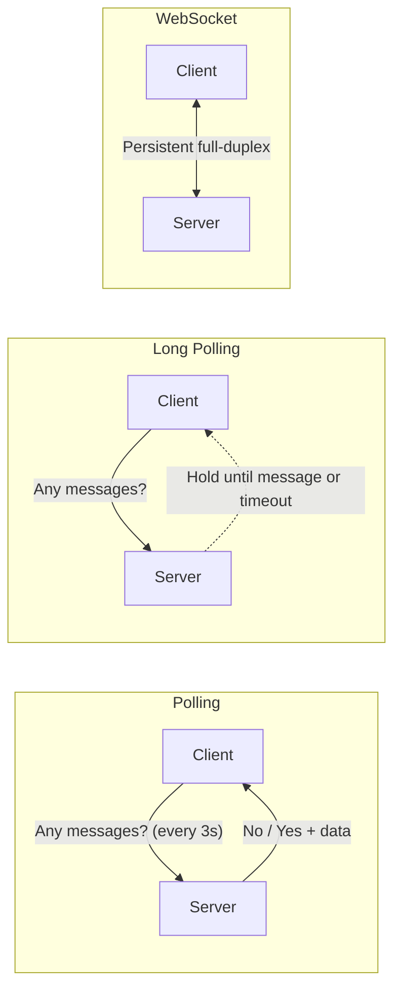
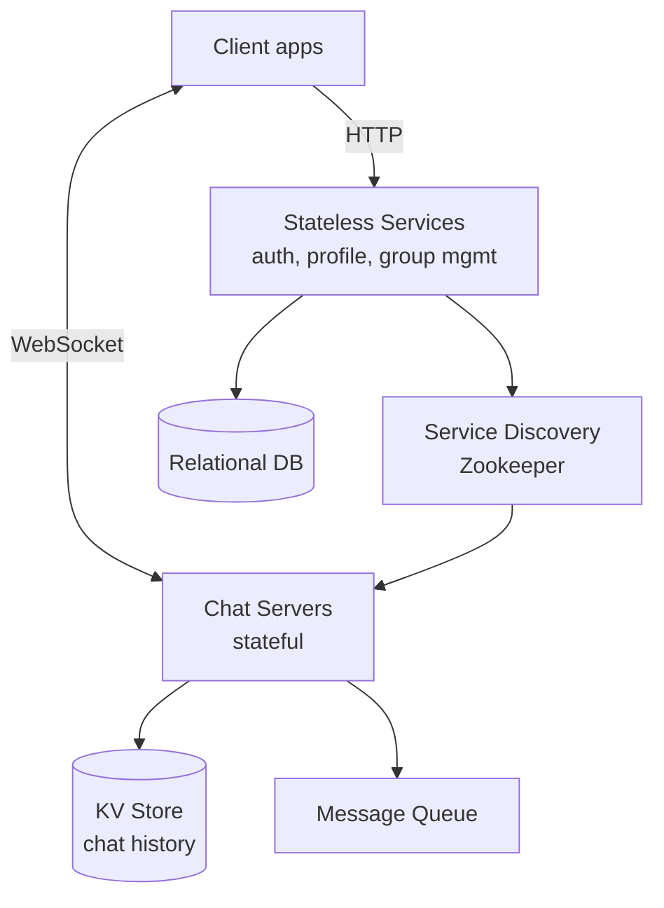
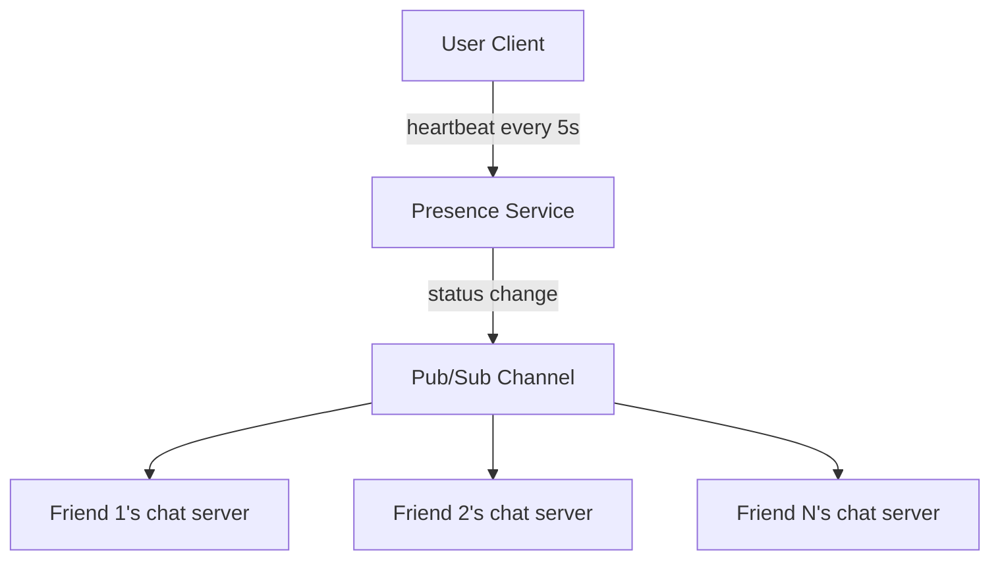
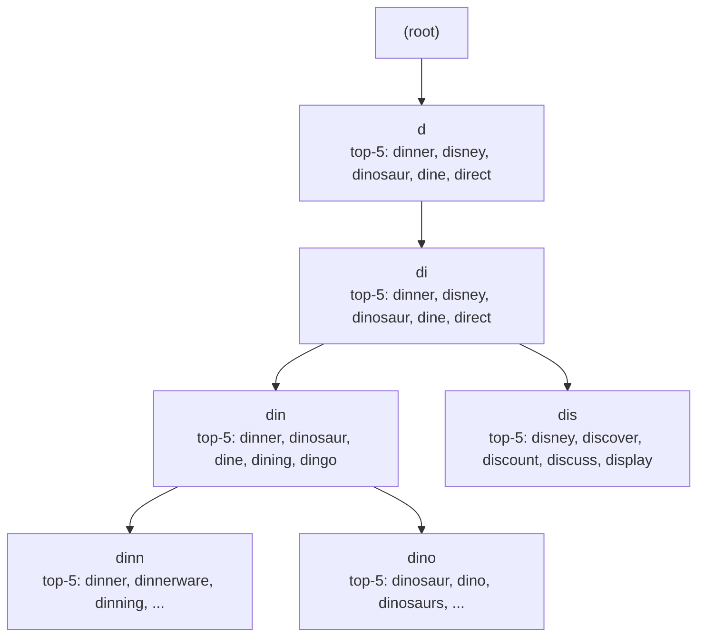
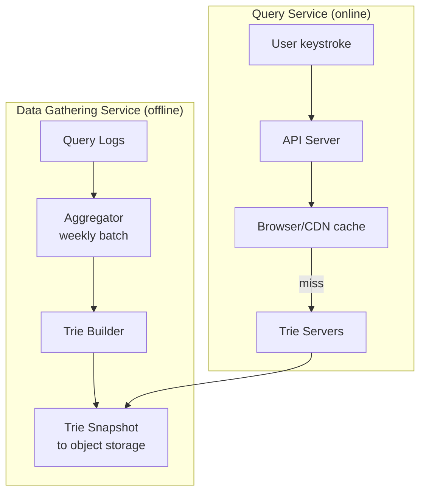
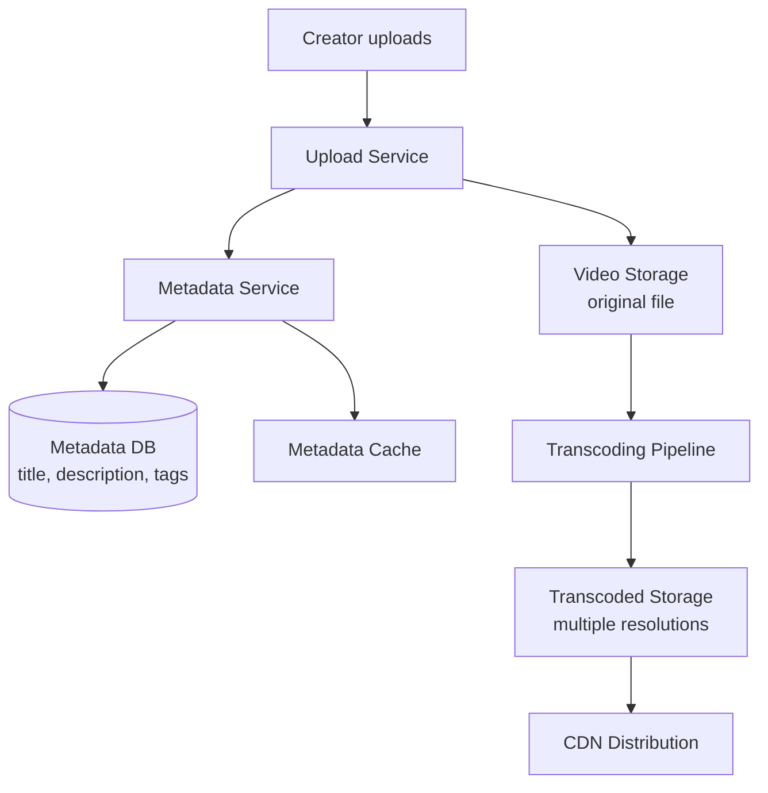
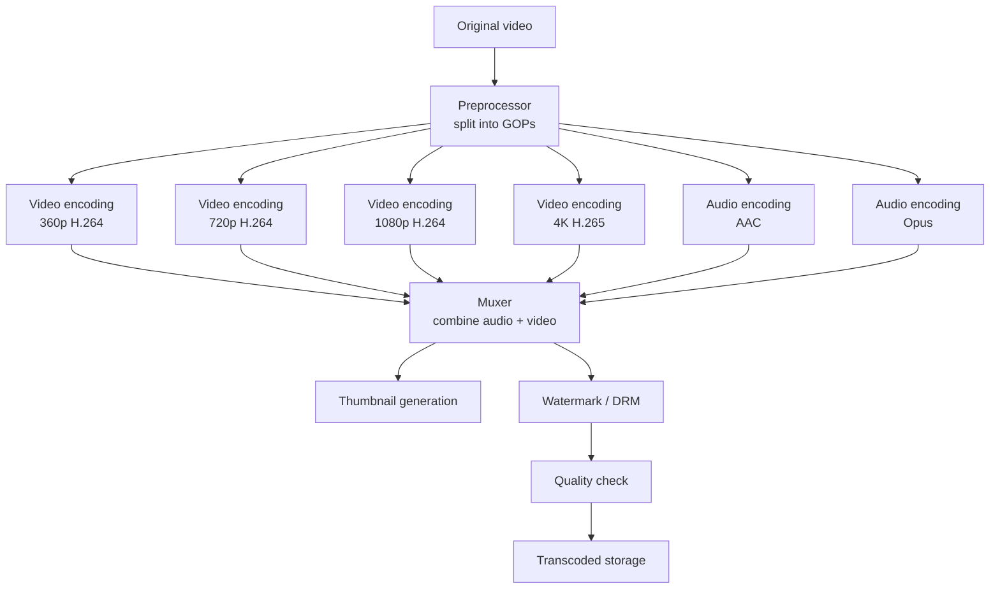
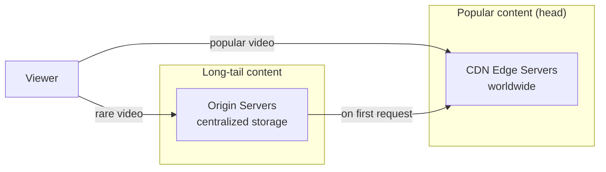

# Real-time systems

*Part of [System design for the technical PM](./README.md)*

## TL;DR

Three systems where latency is the product: a **chat system** serving 50 million daily users through WebSocket connections to stateful chat servers, with a key-value store for message history and heartbeat-based presence detection. A **search autocomplete** system that responds in under 100ms at 48,000 peak QPS by pre-computing top-k results at every node of a trie data structure, rebuilt weekly in batch and sharded by prefix range. And a **video streaming platform** at YouTube scale (5 billion daily views) that parallelizes upload and transcoding through a DAG-based processing pipeline, serves popular content from CDN edge nodes, and streams via adaptive bitrate protocols (MPEG-DASH, HLS) that adjust quality to the viewer's bandwidth in real time.

> 🎯 **For the technical PM**
>
> **Why it matters** — In real-time systems, latency *is* the feature. A chat message that takes 3 seconds to deliver feels broken. Autocomplete that takes 500ms is useless — the user has already finished typing. A video that buffers for 10 seconds loses the viewer. These systems require fundamentally different architecture from request-response services: persistent connections, stateful servers, and aggressive caching at every layer.
>
> **What it changes in your decisions** — You define latency budgets per interaction (message delivery < 200ms, autocomplete < 100ms, video start < 2s). You size infrastructure for concurrent connections, not just QPS. You accept that stateful servers are harder to operate than stateless ones, and plan accordingly.
>
> **Ask your eng team** — *"What's the delivery latency at P99 for a 1:1 message, a group message to 500 people, and a presence update — and which of those degrades first under load?"*
>
> **Risk if ignored** — Chat that feels sluggish compared to competitors. Autocomplete that returns stale or irrelevant suggestions because the trie update cycle is too slow. Video that buffers on mobile because the CDN strategy doesn't account for the long tail of content.

---

## Chat system

The product: real-time messaging for 50 million daily active users. 1:1 chats, group chats (up to 500 members), online presence indicators, and message history. The fundamental challenge: HTTP is request-response, but chat requires the server to *push* messages to the client the instant they arrive.

### Connection strategy: polling, long polling, WebSocket

Three approaches to server-to-client communication, with very different resource profiles:

**Polling** — The client sends a request every few seconds asking "any new messages?" The server responds immediately with either new messages or an empty response.

- **Pro:** Simple, works everywhere.
- **Con:** Wasteful — most polls return empty responses. With 50M users polling every 3 seconds, that's 16M requests/second for mostly nothing. Latency is bounded by the polling interval.

**Long polling** — The client sends a request, and the server holds it open until a new message arrives (or a timeout, typically 30-60 seconds). When a message arrives, the server responds immediately and the client opens a new connection.

- **Pro:** Reduces empty responses. Lower latency than polling.
- **Con:** The sender and receiver may connect to different servers — the server holding the sender's connection may not be the one holding the receiver's long poll. Requires server coordination. Still opens a new HTTP connection for each message cycle.

**WebSocket** — A persistent, full-duplex connection initiated by an HTTP upgrade handshake. Once established, both client and server can send messages at any time over the same connection.

- **Pro:** True real-time. Minimal overhead per message (no HTTP headers on each exchange). Efficient for bidirectional communication.
- **Con:** Stateful — the server must maintain the connection. Load balancing is harder (connections are sticky). Server restarts disconnect all clients on that server.

WebSocket is the clear winner for chat. The initial connection cost is amortized over thousands of messages, and the per-message overhead drops from ~800 bytes (HTTP headers) to ~6 bytes (WebSocket frame).

### Architecture: stateless + stateful tiers

The chat system separates stateless services from stateful chat servers:

**Stateless services** — Authentication, user profile, group management, and all non-chat API calls. These are standard HTTP services behind a load balancer, horizontally scalable, using a relational database.

**Stateful chat servers** — Each client maintains a WebSocket connection to one chat server. The server tracks which clients are connected and routes messages accordingly. Because connections are stateful, you can't arbitrarily load-balance them — a client must reconnect to a specific server (or any server, with a shared presence layer).

**Service discovery (Zookeeper)** — When a client connects, the service discovery layer assigns it to a chat server based on server load, geographic proximity, and available capacity. Zookeeper maintains the registry of available chat servers and their current connection counts.

### Chat storage: why not RDBMS

Message history has a distinctive access pattern:

- **Recent messages** are read frequently (opening a chat loads the last 20-50 messages)
- **Old messages** are read rarely (scrolling back)
- **Writes are append-only** — messages are never updated (ignoring edits for simplicity)
- **The dataset is enormous** — 50M users sending 40 messages/day = 2 billion messages/day

A relational database struggles with this: random reads across a 2-billion-row-per-day table are slow, and the write volume overwhelms single-master replication. A **key-value store** (HBase, Cassandra) is the standard choice:

- **Key:** `(channel_id, message_id)` where message_id is a Snowflake-style time-ordered ID
- **Value:** message content, sender, timestamp, metadata
- **Access pattern:** range scan on message_id within a channel (fetch latest N messages)

The time-ordered key ensures that recent messages are physically co-located on disk, making the dominant query (latest messages) a fast sequential read.

### Message flow: 1:1 chat

1. User A sends a message via their WebSocket connection to Chat Server 1
2. Chat Server 1 generates a message ID (time-ordered) and stores the message in the KV store
3. Chat Server 1 checks the connection registry: is User B connected? To which server?
4. If User B is connected to Chat Server 2, route the message to Chat Server 2 via an internal message queue
5. Chat Server 2 pushes the message to User B over their WebSocket connection
6. If User B is offline, the message is stored and a push notification is sent via the [notification system](./web-scale-services.md)

### Message flow: group chat

Group messages use a **per-recipient inbox** model. When a message is sent to a group of 500 members:

1. The message is stored once in the KV store
2. A copy of the message reference (message ID + group ID) is written to each member's inbox
3. Each member's chat server pushes the message to connected members
4. Offline members receive it from their inbox when they reconnect

This is essentially fanout-on-write at the message level — similar to the [news feed](./web-scale-services.md) pattern. For small groups (under 500), the fanout cost is acceptable. For broadcast channels with millions of subscribers, you'd switch to fanout-on-read.

### Message sync

When a client reconnects (after a network switch, app background/foreground, or server failover), it needs to catch up on missed messages. The client tracks `cur_max_message_id` — the ID of the last message it received. On reconnection:

1. Client sends `cur_max_message_id` to the chat server
2. Server queries the KV store: all messages in the user's channels with ID > `cur_max_message_id`
3. Server pushes the delta to the client

This is efficient because message IDs are time-ordered — the query is a simple range scan.

### Online presence

Presence (online/offline/away status) seems simple but is surprisingly expensive at scale. With 50M daily users, presence changes are frequent (phone locks, network switches, app backgrounding).

**Heartbeat model:**
1. Client sends a heartbeat to the presence server every 5 seconds via the WebSocket connection
2. If the server doesn't receive a heartbeat for 30 seconds, it marks the user as offline
3. When a user's status changes, the presence server publishes the update

**Fanout for presence updates:** If User A has 500 friends online, each status change triggers 500 push updates. This is manageable for 1:1 friend lists. For group chats, presence is fetched on-demand (when a user opens the group info) rather than pushed in real time.

---

## Search autocomplete

The product: as a user types in a search box, show the top 5 most relevant completions in under 100ms. With 10 million daily active users, each typing an average of 5 queries with 6 characters each, that's 300 million keystrokes per day — about 3,500 QPS average, 48,000 at peak (roughly 14x average, accounting for time-of-day concentration).

### The trie data structure

A **trie** (prefix tree) is the natural data structure for prefix matching. Each node represents a character, and the path from root to a node represents a prefix. Searching for "din" walks root → d → i → n in O(L) time, where L is the prefix length.

The naive approach — walk to the prefix node, then enumerate all descendants to find completions — is too slow. A subtree might contain millions of terms. Instead, **cache the top-k results at every node**:

With top-k cached at each node, the query is a single trie traversal — O(L) to reach the prefix node, then O(1) to return the cached results. The tradeoff: updating cached results on every query is expensive, so the trie is rebuilt periodically.

### Two-service architecture

The system splits into a **Data Gathering Service** (offline, batch) and a **Query Service** (online, real-time):

**Data Gathering Service:** Runs weekly (or more frequently for trending queries). Aggregates query logs, computes frequency-weighted rankings, builds a new trie with top-k cached at every node, and stores the trie snapshot in object storage (S3). The weekly cadence is intentional — daily rebuilds rarely change the results for established queries, and the batch processing cost is non-trivial. For trending/breaking topics, a separate real-time pipeline can inject hot queries into the trie between rebuilds.

**Query Service:** Trie servers load the latest snapshot into memory. On a user keystroke, the API server routes the prefix to the appropriate trie server, which returns the cached top-k in microseconds. If the trie is too large for a single server's memory, it's sharded.

### Trie sharding

Two strategies for distributing the trie across multiple servers:

**By prefix range** — Server 1 handles a-f, Server 2 handles g-m, etc. Simple, but uneven — prefixes starting with 's' or 'c' have far more entries than 'x' or 'z'. Adjust ranges based on measured query distribution rather than alphabet position.

**By hash** — Hash the prefix and route to a server. Even distribution, but a single query can't be answered by a single server if prefixes of different lengths hash to different servers. Less practical for tries.

Prefix-range sharding with uneven splits (based on empirical query volume) is the standard approach.

### Client-side optimization

The client plays a crucial role in keeping latency low and reducing server load:

- **Debounce** — Don't send a request on every keystroke. Wait 50-100ms after the user stops typing before sending the query. This eliminates requests for intermediate characters.
- **Browser caching** — Autocomplete results for a prefix are highly cacheable. Set `Cache-Control: max-age=3600` (or longer). "din" will return the same top-5 for most of the day. The browser cache eliminates server requests for repeated prefixes.
- **AJAX (no page reload)** — Autocomplete requests are asynchronous; the page doesn't reload between keystrokes.
- **Abort previous requests** — If the user types "d", then "di" before the "d" response returns, abort the "d" request. The browser's AbortController API handles this.

These optimizations can reduce actual server QPS by 80%+ compared to naive per-keystroke requests.

### Data freshness vs. cost

The weekly batch rebuild means truly trending queries (breaking news, viral events) won't appear in autocomplete for up to a week. Options:

- **Accept the lag** — for most products, a 1-week delay is fine. Users still find what they need via full search.
- **Real-time injection** — a streaming pipeline (Kafka + Flink) detects query frequency spikes and injects hot terms into the trie between rebuilds.
- **Hybrid** — the trie servers maintain a small "hot terms" overlay that's updated hourly, merged with the weekly-built base trie at query time.

---

## YouTube / video streaming platform

The product: a video platform at YouTube scale — 5 billion videos watched per day, hundreds of hours of video uploaded every minute. The system must handle video upload, processing (transcoding into multiple formats and resolutions), storage, and streaming — each with distinct scaling challenges.

### Upload flow: parallel processing

Video upload is split into two parallel streams that proceed independently:

1. **Video file** — uploaded to a temporary storage location, then passed to the transcoding pipeline
2. **Metadata** — title, description, tags, thumbnail are stored in a relational database and cache immediately

The metadata path completes quickly (the video page can be "live" with a "processing" status). The video processing path is the slow, compute-intensive part.

### Transcoding: DAG-based pipeline

Video transcoding (converting a raw upload into multiple formats, resolutions, and bitrates) is not a single operation — it's a directed acyclic graph (DAG) of dependent tasks:

The pipeline has four components:

1. **Preprocessor** — Validates the video, splits it into GOPs (Group of Pictures — small, independently decodable segments). GOPs enable parallel encoding.
2. **DAG Scheduler** — Determines task dependencies and parallelism. Video encoding at different resolutions can run in parallel; audio and video can be processed independently; muxing depends on both completing.
3. **Resource Manager** — Allocates CPU/GPU workers to tasks. GPU-intensive tasks (H.265 encoding, 4K) get GPU workers; lighter tasks (thumbnail generation) get CPU workers.
4. **Task Workers** — Execute individual encoding tasks. Horizontally scaled, stateless — they pull tasks from a queue, process the GOP, and write the output to storage.

### Streaming: adaptive bitrate

Users watch videos on devices ranging from 4K TVs on fiber to phones on 3G. Serving a single bitrate is wasteful (too high for slow connections, too low for fast ones). **Adaptive bitrate streaming** solves this:

The video is pre-encoded at multiple quality levels. Each quality level is split into small segments (2-10 seconds). The player downloads segments one at a time, choosing the quality level that matches its current bandwidth. If bandwidth drops (the viewer enters a tunnel), the player switches to a lower quality for the next segment — seamlessly, without rebuffering.

Two dominant protocols:

| Protocol | Developed by | Container | Adoption |
|---|---|---|---|
| **MPEG-DASH** | MPEG consortium | MP4 | Open standard; Netflix, YouTube |
| **HLS** (HTTP Live Streaming) | Apple | MPEG-TS or fMP4 | Required on iOS/Safari; widely supported |

Both work the same way: a manifest file lists available quality levels and segment URLs. The player downloads the manifest, then fetches segments at the appropriate quality. All delivery happens over standard HTTP/HTTPS — no special streaming servers needed.

### CDN strategy: popular vs. long-tail

Video storage and delivery have a distinctive distribution: a small percentage of videos account for the vast majority of views (head), while millions of videos are watched rarely (long tail).

**Popular videos** are pushed to CDN edge servers worldwide. The CDN caches them close to viewers, reducing latency and origin load. For a viral video, the CDN absorbs >99% of the traffic.

**Long-tail videos** stay on origin servers. Serving them from CDN would be wasteful — the CDN storage cost exceeds the benefit for a video watched once a month. If a long-tail video suddenly becomes popular (someone shares it on social media), the CDN pulls it on the first request and caches it, transitioning it from origin to edge automatically.

### Upload security: pre-signed URLs

Users upload videos directly to object storage (S3), bypassing the application servers. This avoids using application-server bandwidth for large file transfers. The flow:

1. Client requests an upload URL from the API server
2. API server generates a **pre-signed URL** — a time-limited, one-use URL that grants write access to a specific storage path
3. Client uploads the video directly to storage using the pre-signed URL
4. Storage notifies the transcoding pipeline via an event (S3 event notification, or a message queue)

Pre-signed URLs are secure: they expire (typically in 15-60 minutes), they're scoped to a specific path, and they can't be reused. The client never receives storage credentials.

### Cost optimization

Video infrastructure is expensive. Key optimizations:

- **Encode only what's needed** — Don't encode 4K for a 360p upload. Detect the source resolution and encode only at that level and below.
- **Encode popular resolutions first** — 720p and 1080p are watched most. Encode these first; queue 4K for later.
- **Short videos skip some formats** — A 10-second clip doesn't need HLS segmentation; a single progressive download is fine.
- **Regional CDN placement** — Don't push content to CDN regions where it has no viewers. Use analytics to determine which regions need which content.
- **Tiered storage** — Move old, rarely-accessed transcoded files to cold storage (S3 Glacier). Keep only the original and the most popular resolutions in hot storage.

---

## Failure modes

- **WebSocket server restart** — All clients connected to a chat server lose their connection simultaneously. Without graceful drain (migrating connections before shutdown), thousands of clients reconnect at once, potentially overwhelming other servers. Implement connection draining: stop accepting new connections, notify clients to reconnect to a different server, wait for transfer before shutting down.
- **Chat message ordering** — Messages routed through different servers or queue partitions can arrive out of order. Time-ordered message IDs (Snowflake) provide global ordering, but displaying order should be based on server-assigned IDs, not client timestamps (which can be wrong).
- **Presence false positives** — A user's phone loses network for 20 seconds (under the 30-second timeout) and regains it. They appear online the entire time, but messages sent during the outage queue up. Reduce the heartbeat interval for a more responsive (but more expensive) presence system.
- **Autocomplete stale results** — The weekly trie rebuild means trending queries take up to a week to appear. If a major event breaks and users search for it, autocomplete is useless. Implement a hot-term injection pipeline or accept the lag as a product decision.
- **Autocomplete trie memory pressure** — The trie with cached top-k at every node can be large. If it exceeds available memory, the server swaps to disk and latency spikes from microseconds to milliseconds — still fast, but potentially above the 100ms budget when combined with network latency.
- **Video transcoding backlog** — A viral challenge causes upload volume to spike 10x. The transcoding pipeline queues up, and videos take hours to process instead of minutes. Auto-scale transcoding workers, but with cost guardrails — unbounded auto-scaling can generate enormous cloud bills.
- **CDN cache miss storm** — A popular video's CDN cache expires across all edge servers simultaneously. Thousands of viewers hit the origin at once. Use staggered TTLs (jitter) or cache-lock (only one edge server fetches from origin; others wait for the cached copy).
- **Video playback buffering** — Adaptive bitrate switching is too aggressive — the player oscillates between quality levels, causing visible quality changes every few seconds. Implement hysteresis: require bandwidth to be consistently higher/lower for several segments before switching.

## Practitioner checklist

- [ ] Is the chat system using WebSocket for real-time messaging, with HTTP fallback for environments that block WebSocket?
- [ ] Is chat history stored in a KV store with time-ordered keys for efficient range queries?
- [ ] Does the presence system use heartbeats with a reasonable timeout (not too aggressive, not too slow)?
- [ ] Is group chat fanout bounded — what's the maximum group size, and what happens above it?
- [ ] Is the autocomplete trie rebuilt on a schedule, and is there a mechanism for injecting trending queries between rebuilds?
- [ ] Are autocomplete results cached in the browser with appropriate Cache-Control headers?
- [ ] Is client-side debouncing in place for autocomplete keystrokes?
- [ ] Does the video transcoding pipeline split work into parallelizable GOPs?
- [ ] Is the CDN strategy differentiated for popular vs. long-tail content?
- [ ] Are pre-signed URLs used for direct-to-storage uploads with appropriate expiration?
- [ ] Is adaptive bitrate streaming implemented with hysteresis to prevent quality oscillation?
- [ ] What is the P99 message delivery latency for 1:1 chat, group chat, and presence updates?

## Related lessons

- [Core building blocks](./core-building-blocks.md) — the Snowflake ID generator used for time-ordered message IDs, and the consistent hashing used for chat server assignment
- [Web-scale services](./web-scale-services.md) — the notification system that handles offline message delivery, and the news feed fanout pattern used in group chat
- [Foundations & framework](./foundations-and-framework.md) — the estimation techniques for sizing WebSocket connection capacity and transcoding throughput
- [Data infrastructure](./data-infrastructure.md) — the distributed message queues that connect chat servers and the event pipelines that feed autocomplete trie rebuilds

← [Web-scale services](./web-scale-services.md) · → [Storage & sync](./storage-and-sync.md)
