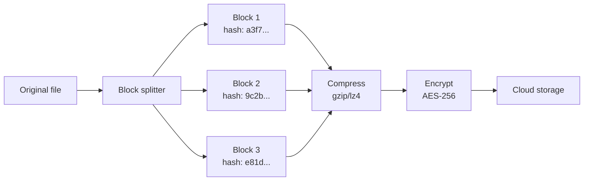
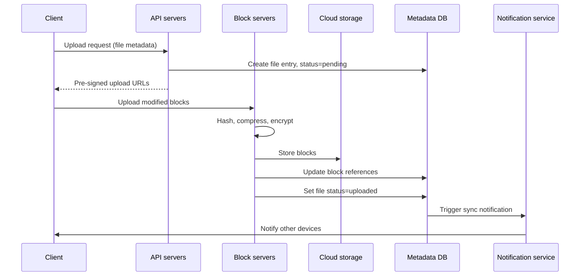
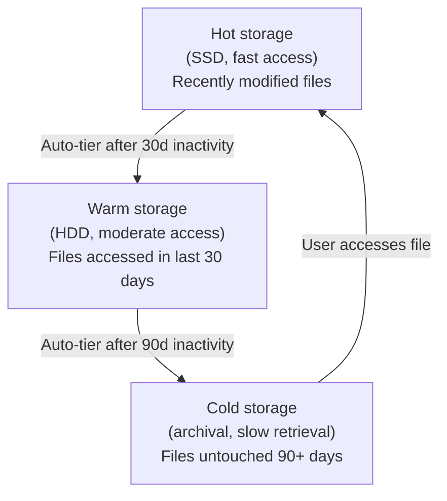
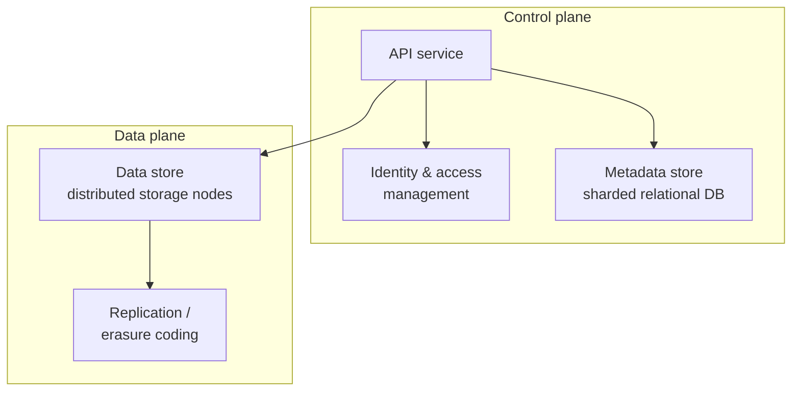
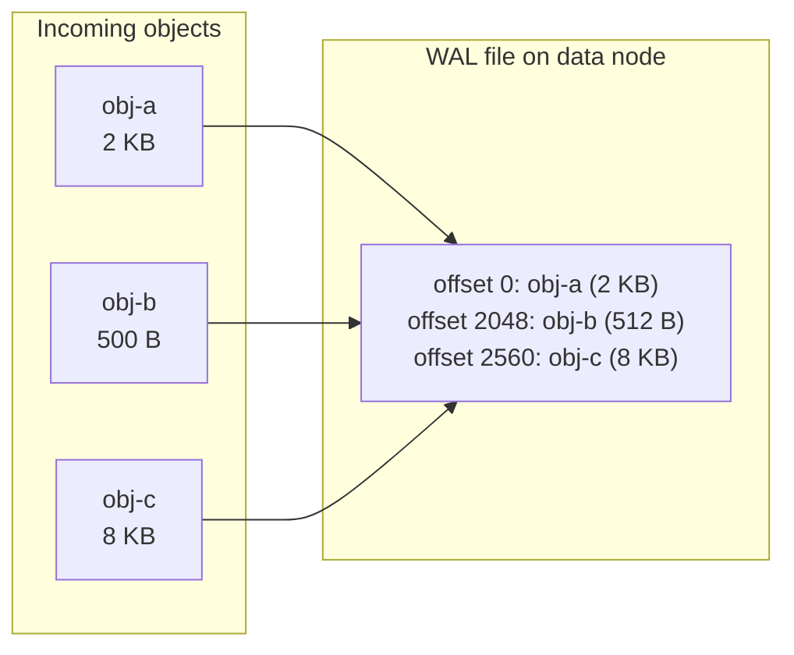

# Storage & sync

*Part of [System design for the technical PM](./README.md)*

## TL;DR

Cloud storage systems solve two distinct problems. **File sync** (Google Drive) keeps user files consistent across devices. It splits them into content-addressed blocks, syncs only deltas, and resolves conflicts. **Object storage** (S3) stores immutable blobs at planetary scale, with extreme durability guarantees through replication or erasure coding. Both split metadata from data, but for different reasons: file sync needs fast tree traversal and conflict detection, while object storage needs petabyte-scale durability at minimal overhead. Understanding the boundary between these two models determines whether your product stores files that users edit or objects that services consume.

> 🎯 **For the technical PM**
>
> **Why it matters** — Every product stores something. Choosing between file-sync semantics and object-store semantics shapes your upload UX, your consistency model, and your infrastructure cost. Pick wrong and you build conflict resolution for data that never conflicts, or skip it for data that does.
>
> **What it changes in your decisions** — You evaluate whether your product needs mutable, version-tracked files (documents, collaborative assets) or immutable write-once blobs (media, logs, backups). You size storage tiers — hot vs. cold — and budget for durability overhead (50% for erasure coding vs. 200% for replication).
>
> **Ask your eng team** — *"Are we storing mutable files or immutable objects, and what durability guarantee do we actually need — six nines or eleven?"*
>
> **Risk if ignored** — You promise "Google Drive-like sync" but deliver a dumb upload/download API, or you replicate 3x when erasure coding would halve your storage bill at higher durability.

---

## Google Drive: cloud file storage

### Scale and requirements

- 50M registered users, 10M DAU
- 10 GB free space per user
- Average file size ~500 KB, heavy on documents and images
- Files must sync across all devices within seconds
- File history and conflict resolution required
- Mobile and desktop clients, web interface

### The block server: splitting files into blocks

The core insight: don't upload entire files — split them into **blocks** (typically 4 MB), then hash, compress, and encrypt each block independently.



Why blocks matter:

- **Delta sync** — when a user modifies a file, only the changed blocks are re-uploaded. Edit one paragraph of a 100 MB document and you upload 4 MB, not 100 MB.
- **Deduplication** — identical blocks (across files, across users) are stored once. Content-addressed by hash (SHA-256).
- **Resumable uploads** — if the connection drops mid-upload, resume from the last unfinished block, not from the beginning.
- **Bandwidth optimization** — compress before encrypt, because encrypted data is incompressible. Typical savings: 30-50% on text-heavy files.

### Metadata vs. data: the separation principle

The system separates **metadata** (file names, versions, block lists, sharing permissions, user info) from **data** (the actual block bytes). They live in different stores with different consistency requirements:

| Concern | Metadata store | Data store |
|---|---|---|
| Storage | Relational DB (MySQL/PostgreSQL) | Cloud/object storage (S3) |
| Consistency | Strong (ACID transactions) | Eventual |
| Scale strategy | Sharding by user_id | Content-addressed, replicated |
| Access pattern | Small reads, frequent updates | Large reads/writes, append-mostly |
| Failure impact | Users can't see their files | Users can't open their files |

The metadata database schema centers on a **file_versions** table that maps each file version to an ordered list of block hashes, plus a **blocks** table that maps hashes to storage locations.

### Upload flow



Key design decisions in the upload path:

- **Pre-signed URLs** — the API server generates time-limited, signed URLs for direct client-to-storage upload, keeping block data off the API servers.
- **Two-phase commit** — the file entry is created as "pending" before upload begins, then flipped to "uploaded" after all blocks land. If the client disappears mid-upload, a background job cleans up orphaned pending entries.

### Download and sync flow

When a client comes online (or receives a push notification), it:

1. Asks the metadata service: "What's changed since my last sync checkpoint?"
2. Receives a list of file changes (new, modified, deleted) with their block lists.
3. Compares each file's block list against its local cache.
4. Downloads only the blocks it doesn't already have.
5. Reassembles files locally: decrypt, decompress, concatenate blocks in order.

### Conflict resolution

When two users (or two devices) edit the same file concurrently:

- **First-processed wins** — the first upload to reach the metadata service becomes the canonical version.
- **Second upload becomes a conflict copy** — the system creates a separate file (e.g., "report (conflict copy - Alice - Jan 5).docx") rather than silently overwriting.
- The user resolves the conflict manually.

This is deliberately simple. More sophisticated strategies (operational transforms for Google Docs, CRDTs for collaborative editing) are layered on top for specific file types but not built into the storage layer.

### Notification service: long polling

Devices need to know when files change. The notification service uses **long polling** rather than WebSockets:

- Client opens a connection and holds it open.
- Server responds only when there's a change (or after a timeout, typically 30-60 seconds).
- Client immediately opens a new long-poll connection.

Why long polling over WebSockets here:

- File sync events are infrequent (seconds to minutes apart, not milliseconds).
- Long polling works through corporate proxies and firewalls that block WebSockets.
- Lower server resource consumption — no persistent connection state for millions of idle clients.

### Storage tiering

Not all data is equally hot:



Cold storage is 5-10x cheaper per GB than hot storage. For a system with 50M users and 10 GB each, the difference between storing everything hot (500 PB at hot prices) vs. tiering (with 80% of data cold) is enormous.

---

## S3-like object storage

### Scale and requirements

- **100 PB** of data
- **6 nines durability** (99.9999%) — lose at most 1 object per million per year
- **4 nines availability** (99.99%) — ~52 minutes of downtime per year
- Billions of objects, each 1 KB to 5 GB
- Immutable: write-once, read-many (no in-place updates)
- Support for versioning and lifecycle policies

### Core data model: buckets and objects

An object store is flat — no directories, no hierarchy. The "path" is just a key string:

```
s3://my-bucket/photos/2024/vacation/IMG_0042.jpg
        ^           ^
      bucket      object key (opaque string)
```

Each object consists of:
- **Key** — the unique identifier within its bucket
- **Data** — the byte payload (immutable once written)
- **Metadata** — system metadata (size, content-type, creation time) plus user-defined key-value pairs

### Architecture: metadata store + data store



**Metadata store** — a sharded relational database (sharded by bucket + object key hash). Stores:
- Bucket information (owner, ACLs, region, versioning config)
- Object metadata (key, version_id, size, checksum, storage class, data node locations)
- Does NOT store object data — only pointers to data nodes

**Data store** — a distributed cluster of storage nodes that hold the actual bytes. Each node manages local disks and reports health/capacity to a placement service.

### The small-file problem and WAL-style merging

Object storage is optimized for large objects, but real workloads include many small files (1-100 KB). Writing each small object as a separate file on the data node wastes:
- Disk seeks (one per file)
- Inode table entries
- Space due to filesystem block alignment

The solution: **WAL-style file merging** (write-ahead log). Small objects are appended sequentially to a large "WAL file" on each data node:



The metadata store records (WAL_file_id, offset, length) for each object. Reads seek to the exact offset in the WAL file. This converts random writes to sequential appends — the fastest I/O pattern on both HDD and SSD.

### Durability: replication vs. erasure coding

The two approaches to surviving disk and node failures:

**3x Replication:**
- Store three copies of every object on different nodes (ideally in different failure zones).
- **Overhead:** 200% (store 3 bytes for every 1 byte of data).
- **Durability:** ~6 nines (99.9999%).
- **Recovery:** fast — any surviving copy is a complete object.
- **Best for:** hot data that needs low-latency reads.

**Erasure coding (8+4):**
- Split the object into 8 data shards, compute 4 parity shards using Reed-Solomon coding.
- Any 8 of the 12 shards can reconstruct the original object.
- **Overhead:** 50% (store 12 shards for 8 shards of data).
- **Durability:** ~11 nines (99.999999999%).
- **Recovery:** slower — must read 8 shards and compute reconstruction.
- **Best for:** warm/cold data where storage cost matters more than read latency.

| Property | 3x Replication | Erasure coding (8+4) |
|---|---|---|
| Storage overhead | 200% | 50% |
| Durability | ~6 nines | ~11 nines |
| Read latency | Low (single copy read) | Higher (multi-shard read) |
| Recovery speed | Fast (copy) | Slow (reconstruct) |
| Write amplification | 3x | 1.5x |
| Use case | Hot/active data | Warm/cold data |

At 100 PB scale, the storage cost difference is staggering: replication needs 300 PB of raw storage, erasure coding needs 150 PB. That difference is millions of dollars annually.

### Multipart upload

Large objects (>100 MB) are uploaded in parts:

1. Client initiates a multipart upload, receives an upload_id.
2. Client uploads parts in parallel (each part 5 MB to 5 GB), receiving an ETag per part.
3. Client sends a "complete" request listing all part ETags.
4. Server assembles the parts into a single object atomically.

Benefits:
- **Parallelism** — upload parts concurrently, saturating available bandwidth.
- **Resumability** — retry individual failed parts, not the whole object.
- **Progress tracking** — each part completion is a progress event.
- **Memory efficiency** — the client and server never need to hold the entire object in memory.

If the client never sends "complete" (crashed, abandoned), a lifecycle policy garbage-collects the orphaned parts after a configurable timeout.

### Garbage collection and compaction

Objects are never truly deleted in place (the data is immutable). Instead:

1. A delete request marks the object as deleted in the metadata store (tombstone).
2. Versioned buckets keep the old version accessible; non-versioned buckets hide it.
3. A background **compaction** process periodically scans WAL files, identifies space occupied by deleted/overwritten objects, and rewrites live objects into new WAL files.
4. The old WAL file is reclaimed only after all references to it are updated in the metadata store.

This is the same compaction model used by LSM-tree databases (LevelDB, RocksDB) — a pattern that appears repeatedly in systems that favor write throughput.

### Object versioning and lifecycle

Versioning stores every version of every object:

- Each PUT creates a new version with a unique version_id.
- GET without version_id returns the latest; GET with version_id returns that specific version.
- DELETE adds a "delete marker" (a zero-byte version) — the object appears deleted but previous versions remain.

Lifecycle policies automate storage management:
- Transition objects to cheaper storage classes after N days.
- Permanently delete non-current versions after N days.
- Abort incomplete multipart uploads after N days.

---

## Failure modes

- **Split-brain in file sync** — two devices both believe they have the latest version, producing irreconcilable changes. The conflict-copy approach is safe but creates user friction.
- **Block server hash collision** — astronomically unlikely with SHA-256 but catastrophic if it happens (two different blocks treated as identical). Mitigation: verify on read, use strong hash functions.
- **Metadata store unavailability** — the metadata DB is the single most critical component in both systems. If it goes down, no new reads or writes are possible even though the data is intact. Mitigation: multi-region replication, read replicas.
- **Erasure coding reconstruction storms** — when a node dies, reconstruction reads amplify traffic to surviving nodes. If they're already near capacity, cascading failures begin. Mitigation: throttle reconstruction, maintain headroom.
- **Cold storage retrieval latency surprise** — a product that auto-tiers to cold storage must surface retrieval delay to users. Promising "instant access" and delivering minutes-long waits breaks trust.
- **WAL file corruption** — a corrupted WAL file affects multiple objects. Mitigation: per-object checksums verified on every read, plus replication/erasure coding of the WAL files themselves.
- **Notification service overload** — a bulk operation (e.g., restoring 10,000 files) can flood the notification service and delay sync for all users. Mitigation: batch notifications, rate-limit per-user event generation.

## Practitioner checklist

- [ ] Have you determined whether your workload needs mutable file semantics or immutable object semantics?
- [ ] Is the metadata store sharded and replicated independently from the data store?
- [ ] For file sync: does the client compute block-level deltas to minimize upload bandwidth?
- [ ] For file sync: is the conflict resolution strategy defined and surfaced to users?
- [ ] For object storage: have you chosen between replication and erasure coding based on your durability/cost tradeoff?
- [ ] Are large uploads handled via multipart with resumability?
- [ ] Is there a garbage collection / compaction process for deleted objects?
- [ ] Have you defined storage tiering policies and tested cold-to-hot retrieval latency?
- [ ] Are checksums verified on both write and read paths?

## Related lessons

- [Core building blocks](./core-building-blocks.md) — consistent hashing for shard distribution, which both the metadata store and data node placement use
- [Foundations & framework](./foundations-and-framework.md) — back-of-envelope estimation for storage at petabyte scale
- [Data infrastructure](./data-infrastructure.md) — the WAL-based append model reappears in distributed message queues
- [Web-scale services](./web-scale-services.md) — notification patterns (long polling, push) from the notification system design

← [Real-time systems](./real-time-systems.md) · → [Location & geo services](./location-and-geo-services.md)
