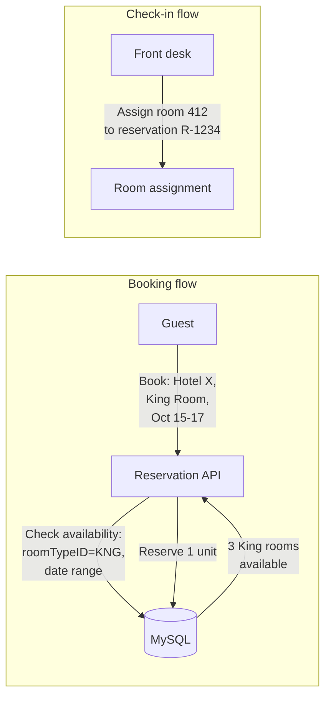
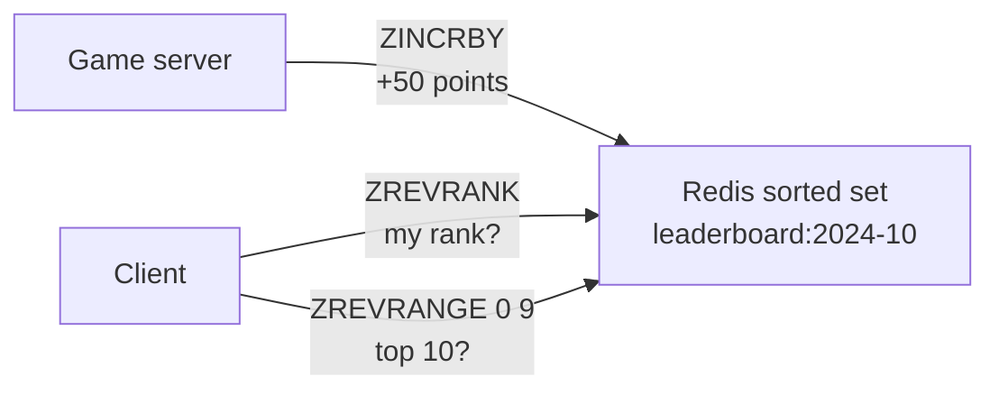
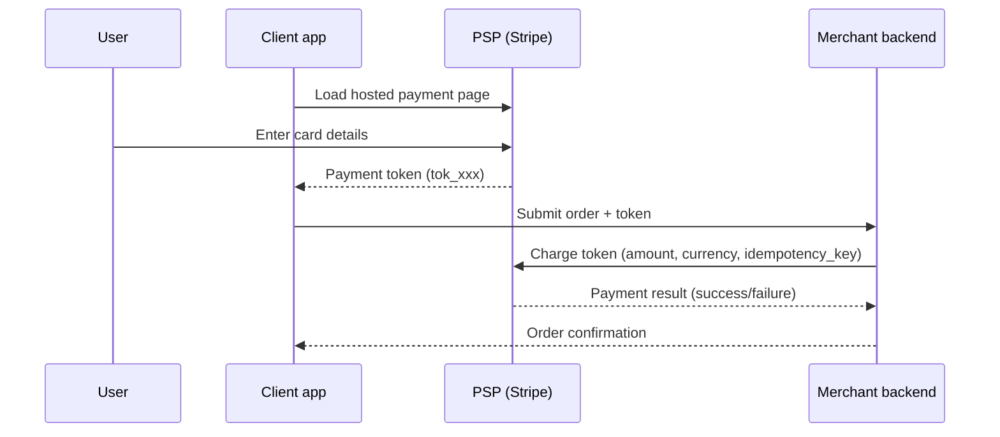
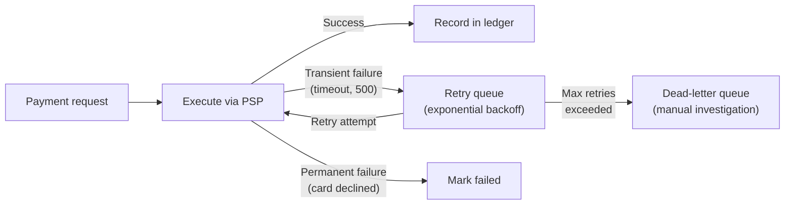
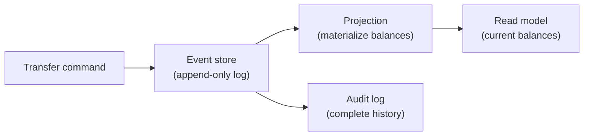
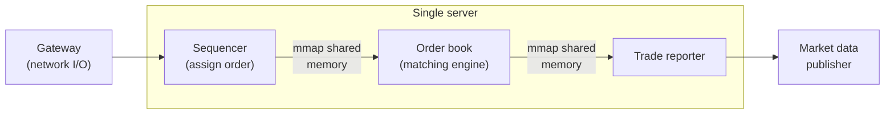
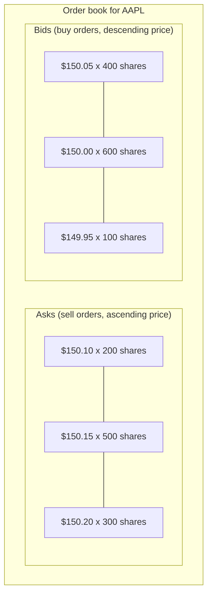

# Transactional & financial systems

*Part of [System design for the technical PM](./README.md)*

## TL;DR

Financial and transactional systems are where distributed systems meet zero tolerance for error. A **hotel reservation** system prevents double-booking through database constraints and idempotency keys on a modest 3 TPS write load. A **gaming leaderboard** exploits Redis sorted sets for O(log N) rank operations across 5M daily players. A **payment system** orchestrates PSP integration, double-entry ledgers, and nightly reconciliation to ensure every cent is accounted for. A **digital wallet** evolves from naive Redis to event-sourced Raft replication as TPS demands grow from thousands to millions. A **stock exchange** pushes latency to microseconds with single-server mmap'd memory, custom sequencers, and reliable UDP multicast. The common theme: correctness is more important than availability. The cost of a bug is measured in dollars, not just user frustration.

> 🎯 **For the technical PM**
>
> **Why it matters** — These systems handle money, reservations, and competitive rankings — domains where a bug is a financial loss, a legal liability, or a PR disaster. The engineering tradeoffs are dominated by correctness constraints that don't exist in social media or content systems.
>
> **What it changes in your decisions** — You accept higher latency for stronger consistency. You insist on idempotency for every write operation. You budget for reconciliation infrastructure and audit trails. You question every "eventually consistent" proposal when money is involved.
>
> **Ask your eng team** — *"What happens if this operation is executed twice — do we double-charge, double-book, or is it safely idempotent?"*
>
> **Risk if ignored** — You double-book hotel rooms during peak season, double-charge customers during payment retries, or discover that your ledger is off by $2M during the quarterly audit.

---

## Hotel reservation system

### Scale and requirements

- 5,000 hotels, 1 million rooms total
- ~3 TPS average reservation rate (modest write load)
- Read-heavy: users browse availability far more than they book
- Zero tolerance for double-booking
- Support for concurrent booking of the same room type

### Data model: reserve roomTypeID, not roomID

A critical design insight: **guests reserve a room type, not a specific room**. Room assignment happens at check-in, not at booking time.



This simplification means the availability check is a count query (`SELECT available_count FROM inventory WHERE hotel_id=X AND room_type='KNG' AND date BETWEEN ...`), not a scan of individual room status.

### Double-booking prevention

Three approaches, with increasing sophistication:

**Pessimistic locking:**
```
SELECT ... FOR UPDATE WHERE hotel_id=X AND room_type='KNG' AND date='2024-10-15'
-- Check availability
-- If available: UPDATE SET available_count = available_count - 1
COMMIT
```
The `FOR UPDATE` lock blocks all other transactions trying to book the same room type on the same date. Safe but serializes all bookings — a bottleneck at high concurrency.

**Optimistic locking (version column):**
```
SELECT available_count, version FROM inventory WHERE ...
-- Check availability (application side)
UPDATE inventory SET available_count = available_count - 1, version = version + 1
  WHERE ... AND version = {read_version}
-- If 0 rows updated: conflict, retry
```
No locks held during the check. If two transactions read the same version, only one succeeds. The other retries. Better concurrency, but retries add latency under contention.

**Database constraints (preferred):**
```
ALTER TABLE inventory ADD CONSTRAINT chk_availability
  CHECK (available_count >= 0);

UPDATE inventory SET available_count = available_count - 1
  WHERE hotel_id=X AND room_type='KNG' AND date='2024-10-15';
-- DB rejects if available_count would go negative
```
The database enforces the invariant. No application-level locking logic. The simplest correct solution for this scale.

### Idempotency via reservationID

Network failures cause retries. Without idempotency, a retry creates a duplicate reservation:

1. Client generates a unique `reservation_id` (UUID) before sending the request.
2. Server uses `reservation_id` as the primary key (or a unique constraint).
3. If the same `reservation_id` arrives twice, the second INSERT is rejected (duplicate key) and the server returns the existing reservation.

This pattern is universal in financial systems — it appears in every design in this lesson.

### Why MySQL (ACID) at this scale

At ~3 TPS, there is no need for distributed databases. A single MySQL instance with replication handles this comfortably:

- **ACID transactions** guarantee that availability checks and reservation writes are atomic.
- **Relational constraints** enforce business rules (no negative availability) in the database layer.
- **Read replicas** handle the read-heavy browse/search traffic.
- **Failover** to a hot standby for availability.

The lesson: don't reach for distributed databases when a well-tuned RDBMS solves the problem.

---

## Gaming leaderboard

### Scale and requirements

- 5M daily active users, 25M total registered
- Real-time leaderboard: show a player's rank and the top N players
- Updated on every game completion (score increment)
- Monthly/weekly/all-time leaderboards
- Latency: rank lookup in under 50ms

### Redis sorted sets

Redis sorted sets are purpose-built for this:

- **ZINCRBY** `leaderboard:2024-10` `player_123` `50` — increment player_123's score by 50. O(log N).
- **ZREVRANK** `leaderboard:2024-10` `player_123` — get player_123's rank (0-indexed, highest score first). O(log N).
- **ZREVRANGE** `leaderboard:2024-10` `0` `9` `WITHSCORES` — get the top 10 players with scores. O(log N + K).



All three core operations — increment, rank lookup, and top-N — are O(log N). At 25M members, that means about 25 comparisons — sub-millisecond on Redis.

### Monthly keys and TTL

Each time period gets its own sorted set key:
- `leaderboard:2024-10` — October 2024
- `leaderboard:2024-W43` — week 43
- `leaderboard:alltime` — never expires

Monthly keys get a TTL (e.g., 90 days after the month ends). This avoids unbounded memory growth.

### Scaling beyond a single Redis instance

A single Redis instance holds the sorted set in memory. For 25M members with 8-byte scores and ~20-byte member names, that's ~700 MB — well within a single instance's capacity.

But if the player base grows to hundreds of millions, or if there are thousands of concurrent leaderboards:

**Range partitioning** — split the score range across Redis instances:
- Instance 1: scores 0-999
- Instance 2: scores 1000-9999
- Instance 3: scores 10000+

Problem: score distributions are skewed (most players cluster in the middle), so partitions are uneven.

**Hash partitioning** — hash player_id to a shard. Each shard holds a partial leaderboard.
- Getting a player's rank requires querying all shards and merging.
- Top-N requires querying all shards for their top-N and merging.
- Trade-off: write distribution is even, but reads are scatter-gather.

For most games (under 100M players), a single beefy Redis instance is sufficient and simpler.

---

## Payment system

### Scale and requirements

- Millions of transactions per day
- Integration with Payment Service Providers (PSPs): Stripe, Braintree, Adyen
- Double-entry ledger for every money movement
- Exactly-once payment execution
- Nightly reconciliation against PSP and bank records

### PSP integration and hosted payment page

The payment system does **not** handle raw credit card numbers. Instead:

1. The client loads a **hosted payment page** from the PSP (Stripe Checkout, Braintree Drop-in).
2. The user enters card details directly into the PSP's iframe.
3. The PSP returns a payment token to the client.
4. The client sends the token to the merchant's backend.
5. The backend calls the PSP API with the token to execute the charge.



This keeps the merchant out of PCI scope — they never see, store, or transmit card numbers.

### Double-entry ledger

Every money movement is recorded as **two entries** that sum to zero:

| Transaction | Debit (from) | Credit (to) | Amount |
|---|---|---|---|
| Customer pays | Customer wallet | Merchant revenue | $100.00 |
| PSP fee | Merchant revenue | PSP fees payable | $2.90 |
| Refund | Merchant revenue | Customer wallet | $100.00 |

The invariant: **sum of all debits = sum of all credits**, always. If they diverge, something is wrong and the discrepancy must be investigated before any more transactions process.

Double-entry bookkeeping is 700 years old and remains the gold standard because:
- Every transaction is self-documenting (where the money came from, where it went).
- Errors are detectable (the books don't balance).
- Auditing is straightforward (follow the chain of entries).

### Idempotency via payment_order_id

The most dangerous failure in payments: a network timeout after the PSP charges the card but before the merchant records the success. The merchant retries, and the customer is charged twice.

Prevention:
1. The merchant generates a unique `payment_order_id` before calling the PSP.
2. This ID is sent as the PSP's `idempotency_key`.
3. If the PSP receives the same idempotency_key twice, it returns the original result without re-executing.
4. The merchant's own database uses `payment_order_id` as a unique key.

### Retry queue and dead-letter queue

Failed payment attempts follow a structured retry path:



- **Transient failures** (timeouts, 500 errors) go to the retry queue with exponential backoff (1s, 2s, 4s, 8s...).
- After max retries (typically 3-5), the payment moves to the **dead-letter queue** for manual investigation.
- **Permanent failures** (card declined, insufficient funds) are not retried.

### Nightly reconciliation

The payment system, PSP, and bank each have their own record of every transaction. **Reconciliation** verifies that all three agree:

1. Download the PSP's settlement report (all charges, refunds, fees for the day).
2. Download the bank's statement (deposits received).
3. Compare against the internal ledger, line by line.
4. Flag discrepancies for investigation.

Discrepancies happen more often than you'd expect: timezone differences, currency rounding, PSP processing delays, partial refunds. A robust reconciliation pipeline is not optional — it's how you catch errors before the quarterly audit.

---

## Digital wallet

### Scale and requirements

- 1 million transactions per second (TPS) at peak
- Balance correctness: no cent lost, no cent created
- Auditability: complete history of every balance change
- Low latency: balance check in under 10ms

### Evolution of the architecture

The architecture evolves through four stages as TPS requirements grow:

**Stage 1: Redis (simple but fragile)**

Store balances in Redis as key-value pairs. INCR/DECR for transfers. Fast but no durability guarantee — a Redis crash loses uncommitted transactions.

**Stage 2: Sharded RDBMS with 2PC**

Move balances to MySQL, sharded by user_id. A transfer between two users on different shards requires **two-phase commit (2PC)**:

1. **Prepare:** both shards lock the rows and confirm they can execute.
2. **Commit:** the coordinator tells both shards to commit.

If either shard fails during prepare, both abort. If the coordinator crashes after prepare but before commit, the shards remain locked until the coordinator recovers. This is the **blocking problem** of 2PC.

**Try-Confirm/Cancel (TC/C)** is a business-level alternative:
1. **Try:** tentatively debit the sender (hold the amount).
2. **Confirm:** credit the receiver and finalize the debit.
3. **Cancel:** if confirm fails, reverse the hold.

TC/C avoids distributed locks but requires compensating transactions (reversal logic).

**Stage 3: Event sourcing + CQRS**



Instead of updating a balance column, append an event: `{type: "transfer", from: A, to: B, amount: 50, timestamp: ...}`.

The current balance is a **projection** — computed by replaying all events for that user. This is cached in a read model (Redis or a materialized view) for fast lookups.

**CQRS (Command Query Responsibility Segregation):** writes go to the event store. Reads come from the projected read model. They can scale independently.

**Stage 4: Raft replication**

At 1M TPS, even sharded databases struggle. The final architecture uses a custom storage engine with **Raft consensus** for replication:

- Each shard is a Raft group (leader + 2 followers).
- Writes go to the leader, which replicates to followers before acknowledging.
- If the leader fails, a follower is elected within milliseconds.
- The event log *is* the Raft log — no separate replication mechanism.

### Why event sourcing for wallets

Event sourcing is not just an implementation choice — it's a regulatory requirement:

- **Auditability:** the event log is a complete, immutable record of every transaction. Regulators can request it.
- **Debugging:** reproduce any balance by replaying events up to a point in time.
- **Correction:** to fix a wrong transaction, append a compensating event (a reversal), don't modify history.
- **Analytics:** replay events through different projections to answer business questions.

---

## Stock exchange

### Scale and requirements

- 1 billion orders per day (~30K orders/sec sustained, 100K+ peak)
- Matching latency: microseconds (not milliseconds)
- Deterministic execution: same inputs must produce same outputs
- Zero message loss in the critical path
- Market data disseminated to thousands of subscribers in real time

### Single-server architecture with mmap

The most surprising design choice: the matching engine runs on a **single server**, not a distributed cluster.

Why single-server:
- Eliminates network latency between components (cross-network hops are microseconds to milliseconds; in-process is nanoseconds).
- Deterministic execution — no distributed consensus delays.
- Modern servers handle 100K+ orders/sec with custom code.

**mmap'd shared memory** connects components within the server:



mmap allows multiple processes to share a memory region without serialization/deserialization overhead. The sequencer writes an order to shared memory. The matching engine reads it directly — zero copy.

### Custom sequencer (not Kafka)

A stock exchange cannot use Kafka as a sequencer because:
- Kafka's latency is milliseconds; the exchange needs microseconds.
- Kafka's ordering is per-partition; the exchange needs total order across all symbols (or per-symbol with deterministic interleaving).
- Kafka's consumer pull model adds latency; the exchange pushes events directly.

The custom sequencer:
1. Receives orders from the gateway.
2. Assigns a globally monotonic sequence number.
3. Writes the sequenced order to the mmap'd ring buffer.
4. The matching engine consumes from the ring buffer in sequence order.

### Order book: doubly-linked list + hash map

The **order book** tracks all outstanding buy and sell orders for a symbol, sorted by price-time priority:



Data structure: a **doubly-linked list** of price levels, with a **hash map** from order_id to its node in the list:

- **Add order:** hash map insert + linked list insertion at the correct price level. O(1) amortized.
- **Cancel order:** hash map lookup + linked list removal. O(1).
- **Match (execute trade):** walk the best bid/ask price levels. O(1) for a simple match; O(K) for a fill across K price levels.

Why not a tree? Trees have O(log N) operations. At microsecond latency targets, the constant factor of hash map + linked list beats tree traversal. Cache locality matters — the linked list at each price level keeps related orders contiguous in memory.

### Event sourcing + Raft for durability

The exchange uses **event sourcing**: every order, cancellation, and trade is an event in an append-only log. The order book state is a deterministic projection of this log.

For disaster recovery, the event log is replicated via **Raft consensus** to standby servers:

- The primary processes events and replicates the log to followers.
- If the primary fails, a follower replays the log and becomes the new primary.
- Because the log is deterministic, the follower's order book state is identical to the primary's at any given sequence number.

### Reliable UDP multicast for market data

Market data (price updates, trade executions) must reach thousands of subscribers simultaneously. TCP unicast doesn't scale — one connection per subscriber, with TCP's congestion control adding latency.

**Reliable UDP multicast:**
- The exchange publishes market data to a multicast group (one packet reaches all subscribers simultaneously).
- Each packet carries a sequence number.
- Subscribers detect gaps (missing sequence numbers) and request retransmission via a side channel.
- The exchange buffers recent packets for retransmission.

The tradeoff: UDP multicast requires network infrastructure support (IGMP, switches with multicast routing). It works within a datacenter or across connected exchanges, not over the public internet.

---

## Failure modes

- **Double-booking despite locking** — optimistic locking retries can succeed if the retry window is too wide and availability changes between retries. DB constraints are the safest fallback.
- **Redis sorted set memory exhaustion** — an all-time leaderboard for a game with 100M players uses significant memory. Monitor memory; archive old data.
- **Payment idempotency key collision** — if the idempotency key is too short or poorly generated, collisions cause silent payment failures (the PSP returns the old result for a new, different payment). Use UUIDs.
- **2PC coordinator failure** — in the digital wallet's Stage 2, a coordinator crash during the commit phase leaves shards in a locked, uncertain state. TC/C or event sourcing eliminates this class of failure.
- **Exchange sequencer failure** — a single sequencer is a single point of failure. Failover to a standby sequencer must preserve the sequence number without gaps or duplicates. This requires Raft-replicated sequence state.
- **Reconciliation drift** — if the payment system's nightly reconciliation is delayed or skipped, discrepancies compound and become harder to investigate. Reconciliation must be treated as a P0 operational process.
- **Event sourcing replay time** — rebuilding a wallet's balance from billions of events is slow. Periodic snapshots (checkpoints) reduce replay time but add complexity.
- **Market data multicast gap storm** — if many subscribers miss the same packet, they all request retransmission simultaneously, overwhelming the retransmit server. Mitigation: stagger retransmission requests with jitter.

## Practitioner checklist

- [ ] Is every write operation in the financial path idempotent, with a client-generated unique key?
- [ ] For reservations: is double-booking prevented by a database constraint, not just application logic?
- [ ] For leaderboards: have you verified that the data set fits in Redis memory, with a plan for growth?
- [ ] For payments: is the ledger double-entry, and does the sum of debits always equal the sum of credits?
- [ ] Is there a dead-letter queue for failed operations, with alerting and manual investigation workflow?
- [ ] For wallets: is the event log the source of truth, with balances as derived projections?
- [ ] For the exchange: is the matching engine deterministic — same inputs always produce same outputs?
- [ ] Is nightly reconciliation automated, with discrepancy alerting?
- [ ] Have you tested the failure of every component in the critical payment/trading path?
- [ ] Are compensating transactions defined for every operation that can partially succeed?

## Related lessons

- [Data infrastructure](./data-infrastructure.md) — exactly-once delivery semantics in Kafka, which underpins payment event processing
- [Foundations & framework](./foundations-and-framework.md) — back-of-envelope estimation for TPS, storage, and latency budgets
- [Core building blocks](./core-building-blocks.md) — consistent hashing for wallet shard distribution; unique ID generation for idempotency keys
- [Real-time systems](./real-time-systems.md) — low-latency pub/sub patterns from chat and streaming that inform market data distribution

← [Data infrastructure](./data-infrastructure.md) · → [Recap](./recap.md)
