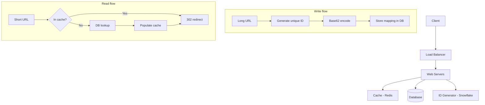
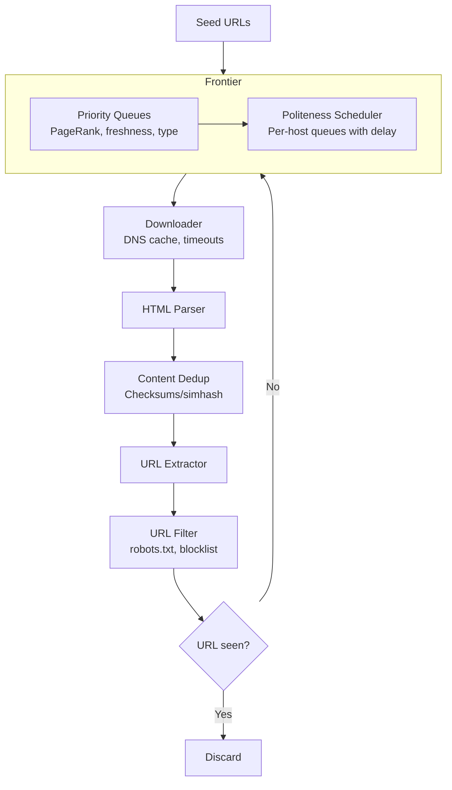
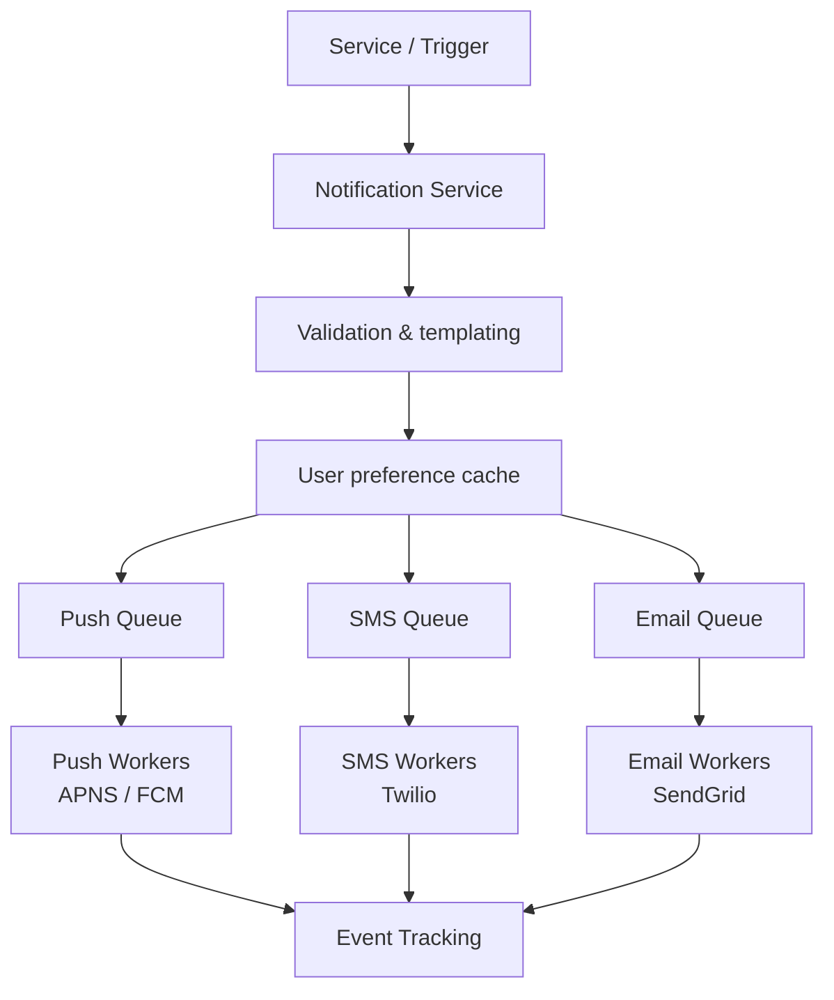
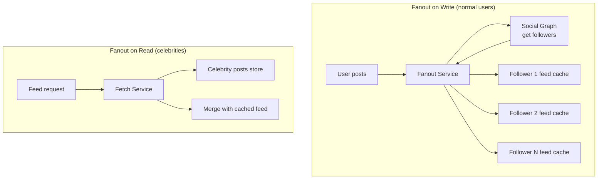

# Web-scale services

*Part of [System design for the technical PM](./README.md)*

## TL;DR

Four systems that define "internet scale." A **URL shortener** maps 100 million new short links per day, using a distributed ID generator and Base62 encoding. It chooses between 301 redirects (faster, cached) and 302 redirects (trackable, measurable). A **web crawler** systematically downloads billions of pages, using BFS traversal, a URL frontier with politeness and priority queues, and deduplication at every layer. A **notification system** routes 16 million daily notifications across push (APNS/FCM), SMS (Twilio), and email (SendGrid). Each channel gets its own message queue, with templating, rate limiting, and retry logic. And a **news feed system** serves a personalized timeline by combining fanout-on-write for normal users with fanout-on-read for celebrities, backed by a five-layer cache architecture.

> 🎯 **For the technical PM**
>
> **Why it matters** — These are the systems your product decisions directly shape. The URL shortener's redirect choice (301 vs 302) determines whether you can track click analytics. The crawler's politeness settings determine whether you get blocked by every major site. The notification system's rate limiter is the difference between engagement and user churn from spam. The news feed's fanout strategy determines whether celebrity posts take minutes or milliseconds to appear.
>
> **What it changes in your decisions** — You define SLAs with numbers attached: redirect latency under 20ms, notification delivery within 30 seconds, feed refresh under 500ms. You make explicit tradeoffs between features (analytics tracking vs redirect speed) and know the engineering cost of each.
>
> **Ask your eng team** — *"What's our P99 notification delivery latency, and what happens to the queue when a single notification targets 10 million followers?"*
>
> **Risk if ignored** — Short URLs that can't be tracked because you chose the wrong redirect code. A crawler that gets IP-banned from target sites within hours. Notifications that arrive minutes late because a celebrity mention flooded the queue. A news feed where new posts take 30 seconds to appear for users following popular accounts.

---

## URL shortener

The product: given a long URL, produce a short one (e.g., `tinyurl.com/abc123`). Given the short URL, redirect to the original. At 100 million new URLs per day with a 10:1 read-to-write ratio, that's 1 billion redirects per day — roughly 11,600 reads/second average, 23,000+ at peak.

### The encoding decision

Two approaches to generating the short code:

**Hash + collision resolution** — Hash the long URL (e.g., CRC32 or MD5), take the first 7 characters. If there's a collision (another URL already mapped to that code), append a predefined string and re-hash. Problem: checking for collisions requires a database query on every write, and the collision rate grows as the table fills.

**Distributed ID generator + Base62** — Generate a unique numeric ID (using the Snowflake approach from [lesson 2](./core-building-blocks.md)), then encode it in Base62 (a-z, A-Z, 0-9). A 7-character Base62 string supports 62^7 = 3.5 trillion unique URLs. No collision checking needed — the ID is guaranteed unique.

The Base62 approach wins for high-throughput systems because it eliminates collision resolution and the database lookup on every write.

### The redirect decision

This seemingly minor HTTP choice has major product implications:

| Code | Meaning | Browser behavior | Analytics impact |
|---|---|---|---|
| **301** | Moved Permanently | Browser caches; future visits skip your server | You lose visibility — can't count clicks after first visit |
| **302** | Found (Temporary) | Browser always hits your server first | Every click is tracked — essential for analytics |

If click tracking and analytics are part of your product (they usually are), use 302. If pure redirect speed matters and you have no analytics requirement, use 301.

### System architecture



**Write flow:** Client submits a long URL. The system generates a unique ID via the distributed ID generator and converts it to Base62. It stores the `(shortCode, longURL)` mapping in the database and returns the short URL.

**Read flow:** Client visits a short URL. The system checks the cache (Redis) first. On a cache hit, it issues a 302 redirect immediately. On a cache miss, it queries the database, populates the cache, then redirects. Given the 10:1 read-to-write ratio, the cache hit rate should be high — popular short links will stay hot in cache.

### Storage estimation

At 100M new URLs/day for 10 years: 365 billion records. Each record is ~100 bytes (short code + long URL + metadata). Total: ~36 TB. This is within the range of a sharded relational database or a distributed KV store partitioned via consistent hashing.

---

## Web crawler

A web crawler systematically browses the web by downloading pages, extracting links, and following them. At scale (billions of pages), the challenge isn't downloading — it's doing so politely, efficiently, and without getting stuck in loops or traps.

### Traversal strategy

**BFS is preferred** over DFS because DFS can get trapped in deep link chains on a single domain (forums, paginated archives, infinite calendars). BFS explores breadth-first, discovering more domains and more diverse content early.

### URL frontier architecture

The URL frontier is the heart of the crawler — a sophisticated queue that manages which URLs to crawl next, balancing politeness, priority, and freshness.



### Priority

Not all URLs are equal. The frontier maintains **priority queues** that rank URLs by:

- **PageRank** — pages linked to by many other pages are more important
- **Content type** — known high-quality domains get priority
- **Freshness** — pages that change frequently (news sites) should be re-crawled sooner
- **Depth** — pages discovered earlier in the BFS tend to be more important

A **prioritizer** assigns each URL a priority score and routes it to the appropriate queue. The front-end selector picks from higher-priority queues more frequently.

### Politeness

Hammering a single domain will get you blocked. The politeness layer ensures:

- **Per-host queues** — all URLs for the same host go into the same queue, processed sequentially
- **Configurable delay** — a minimum time between requests to the same host (typically 1-2 seconds)
- **robots.txt compliance** — the crawler checks and caches each site's robots.txt before crawling

This means the crawler maintains hundreds of thousands of per-host queues. A queue-router maps each URL's hostname to its queue, and worker threads pull from different host queues in parallel.

### Deduplication

Deduplication happens at two levels:

1. **URL dedup** — a set (often backed by a Bloom filter for memory efficiency) tracks which URLs have been seen. Before adding a URL to the frontier, check the set. This prevents crawl loops (A links to B, B links to A).

2. **Content dedup** — different URLs can serve identical content (mirrors, syndication, URL parameters). Compute a content hash (or simhash for near-duplicate detection) and skip pages whose content matches a previously crawled page.

### Robustness

Production crawlers handle dozens of edge cases:

- **Spider traps** — URLs that generate infinite content (e.g., `/calendar/2025/01`, `/calendar/2025/02`, ...). Set a maximum URL depth or detect pattern repetition.
- **DNS resolution** — DNS lookups are slow. Cache DNS results aggressively (locally and in a shared cache).
- **Timeouts** — set aggressive timeouts. A crawler that waits 30 seconds for a response wastes precious throughput.
- **Content types** — skip binary files, images, and non-HTML content unless specifically needed.
- **Distributed coordination** — multiple crawler instances must partition the URL space (by domain hash) to avoid duplicate work.

---

## Notification system

The product: deliver 10 million mobile push notifications, 1 million SMS messages, and 5 million emails per day — 16 million total, across three channels with different providers, latency expectations, and failure modes.

### Provider landscape

Each channel has its own delivery infrastructure:

| Channel | Provider | Protocol | Characteristics |
|---|---|---|---|
| **iOS push** | APNS (Apple) | HTTP/2, certificate-based | Token-based auth, payload ≤ 4 KB |
| **Android push** | FCM (Google) | HTTP/JSON | API-key auth, payload ≤ 4 KB |
| **SMS** | Twilio, Nexmo | REST API | Per-message cost, carrier variability |
| **Email** | SendGrid, SES | SMTP/API | Deliverability reputation, bounce handling |

### Architecture: per-channel message queues

The critical design insight: **each channel gets its own message queue and worker pool**. This prevents a slow channel (SMS, which depends on carrier networks) from blocking a fast channel (push, which is near-instant).



### Notification templates

At 16M notifications/day, you don't craft individual messages. Templates define the structure:

```
Hello {{user.first_name}}, your order {{order.id}} has shipped!
Tracking: {{tracking.url}}
```

Templates are stored, versioned, and cached. The notification service merges the template with user-specific data at send time. This enables A/B testing (different templates for different cohorts), localization (language-specific templates), and rapid iteration without code deployments.

### Rate limiting

Without rate limiting, a bug or misconfigured campaign can blast millions of users with duplicate notifications — the fastest way to destroy app engagement. The notification system applies rate limits at multiple levels:

- **Per-user** — no more than *n* notifications per channel per hour (e.g., max 3 push per hour)
- **Per-campaign** — a marketing campaign has a total send budget
- **Per-channel** — respect provider rate limits (APNS throttles per-device, SendGrid has hourly sending limits)

The rate limiter uses the same algorithms from [lesson 2](./core-building-blocks.md) — typically sliding window counter backed by Redis.

### Retry and failure handling

Notifications fail: APNS returns an invalid token, Twilio gets a carrier error, SendGrid bounces an email. The system must:

1. **Retry with exponential backoff** — first retry after 1s, then 2s, 4s, 8s, up to a maximum (e.g., 1 hour)
2. **Dead letter queue** — after *n* retries, move the notification to a DLQ for manual investigation
3. **Token invalidation** — if APNS returns "invalid token," remove the device token from the user's record to stop future failures
4. **Bounce handling** — hard email bounces (invalid address) should permanently suppress the address; soft bounces (mailbox full) can be retried

### Event tracking

The notification system tracks the full lifecycle:

- **Created** — notification request received
- **Queued** — placed in channel queue
- **Sent** — delivered to provider (APNS, Twilio, SendGrid)
- **Delivered** — provider confirmed delivery (not available for all channels)
- **Opened** — user opened the notification (via tracking pixel for email, or app callback for push)
- **Clicked** — user tapped a link (via redirect URL with tracking parameter)

This data feeds analytics dashboards and enables product decisions: which notification types drive engagement, which channels perform best for which user segments, when to send for maximum open rates.

---

## News feed system

The product: show each user a personalized timeline of posts from people they follow. Facebook's news feed, Twitter's timeline, Instagram's feed. The core challenge: when a user with 10 million followers posts, how do you make that post appear in all 10 million feeds quickly?

### The fanout problem

Two fundamental approaches:

**Fanout on write (push model)** — When a user publishes a post, immediately write it to every follower's feed cache. The feed is pre-computed. Reading is instant — just fetch the cache.

- **Pro:** Feed reads are O(1) — read from the pre-computed cache. Feed loads are fast.
- **Con:** Writes are expensive. A user with 10M followers triggers 10M cache writes. Inactive users' feeds are computed but never read — wasted work.

**Fanout on read (pull model)** — When a user opens their feed, the system fetches posts from all followed users on the fly, merges, ranks, and returns.

- **Pro:** Writes are O(1). No wasted work for inactive users.
- **Con:** Feed reads are expensive — must fetch from many sources and merge. Slow for users following thousands of accounts.

**Hybrid approach (the production answer):** Use fanout-on-write for most users (fast reads for the common case). For users with massive followings (celebrities, verified accounts), use fanout-on-read — their posts are fetched and merged into the feed at read time rather than pushed to millions of caches.



### Feed publishing flow

1. User creates a post via the API
2. Post is stored in the **post database** and the **post cache**
3. The **fanout service** queries the **social graph cache** for the user's followers
4. For each follower, the post ID is inserted into their **feed cache** (a sorted set in Redis, ordered by timestamp or ranking score)
5. If the poster is a celebrity (follower count above threshold), skip fanout — the post stays only in the post store

### Feed retrieval flow

1. User opens their feed
2. The system reads the user's **feed cache** (pre-computed post IDs)
3. For each celebrity the user follows, fetch their recent posts from the **post store**
4. Merge the cached feed with celebrity posts
5. Rank (by time, engagement, ML model) and return the top *N* posts
6. For each post ID, hydrate the full content from the **post cache** and **user cache** (author name, avatar)

### The five-layer cache

Feed performance depends entirely on cache architecture. Production news feed systems use five distinct cache layers:

| Cache layer | What it stores | Why it's separate |
|---|---|---|
| **News feed cache** | Pre-computed feed (list of post IDs per user) | The hottest data — every feed load hits this |
| **Content cache** | Post bodies, images, metadata | Large objects; different eviction pattern from feed IDs |
| **Social graph cache** | Follow/friend relationships | Queried on every fanout; rarely changes |
| **Action cache** | Likes, comments, shares per post | High write rate; separate to avoid invalidating content cache |
| **Counter cache** | Like counts, comment counts, share counts | Extremely high write rate; often approximate |

Each layer has its own cluster, eviction policy, and TTL. Mixing them in a single cache would cause hot data (counters) to evict warm data (social graph), degrading overall hit rates.

### Social graph cache

The social graph (who follows whom) is read on every fanout and every feed fetch. It changes rarely (follows/unfollows are infrequent compared to posts and reads). Storing it in a dedicated cache with long TTLs and lazy invalidation keeps fanout latency low. The data structure is typically a hash map: `user_id → set of follower_ids`.

---

## Failure modes

- **URL shortener hash collision** — If using hash+collision resolution, high write rates increase collision frequency, degrading write latency. Monitor collision rate; switch to ID-based encoding if it exceeds 1%.
- **URL shortener cache stampede** — A popular short URL expires from cache, and thousands of concurrent redirects hit the database simultaneously. Use cache warming or probabilistic early expiration.
- **Crawler politeness violation** — A bug in the per-host delay logic causes aggressive crawling, getting your IP range blocked by major sites. Monitor per-host request rates with hard circuit breakers.
- **Crawler infinite loops** — Spider traps (auto-generated calendars, session-ID URLs) create infinite URL generation. Set maximum crawl depth per domain and detect URL pattern repetition.
- **Notification thundering herd** — A system event (e.g., "service restored") triggers notifications to all users simultaneously, overwhelming the provider. Jitter the send times across a window.
- **Notification duplicate delivery** — Retry logic without idempotency causes users to receive the same notification multiple times. Use idempotency keys per notification.
- **News feed celebrity bottleneck** — A celebrity with 50M followers posts during peak hours. Even with the hybrid approach, the fan-on-read merge at read time can spike latency. Pre-compute celebrity feeds on a schedule rather than on-demand.
- **News feed stale cache** — A user unfollows someone, but the social graph cache hasn't been invalidated. The unfollowed user's posts continue appearing in the feed until the cache expires.

## Practitioner checklist

- [ ] Does your URL shortener use 301 or 302 redirects, and does the product team understand the analytics implications?
- [ ] Is the short-code generation collision-free (ID-based), or does it require collision resolution?
- [ ] Does your crawler respect robots.txt and enforce per-host request delays?
- [ ] Is crawl deduplication happening at both the URL level and the content level?
- [ ] Does each notification channel have its own message queue and worker pool?
- [ ] Are per-user notification rate limits in place to prevent spam?
- [ ] Does the notification system retry with exponential backoff and have a dead letter queue?
- [ ] Is the news feed fanout strategy hybrid (push for normal users, pull for celebrities)?
- [ ] Can you name all five cache layers and their eviction strategies?
- [ ] What's the P99 latency for feed retrieval, and is it within your product SLA?

## Related lessons

- [Core building blocks](./core-building-blocks.md) — the rate limiter, consistent hashing, and ID generator that these services are built on
- [Foundations & framework](./foundations-and-framework.md) — the estimation and scaling techniques used to size these systems
- [Real-time systems](./real-time-systems.md) — chat and autocomplete systems that share the queue-and-worker pattern with notifications
- [Data infrastructure](./data-infrastructure.md) — distributed message queues that underpin the notification and feed architectures

← [Core building blocks](./core-building-blocks.md) · → [Real-time systems](./real-time-systems.md)
