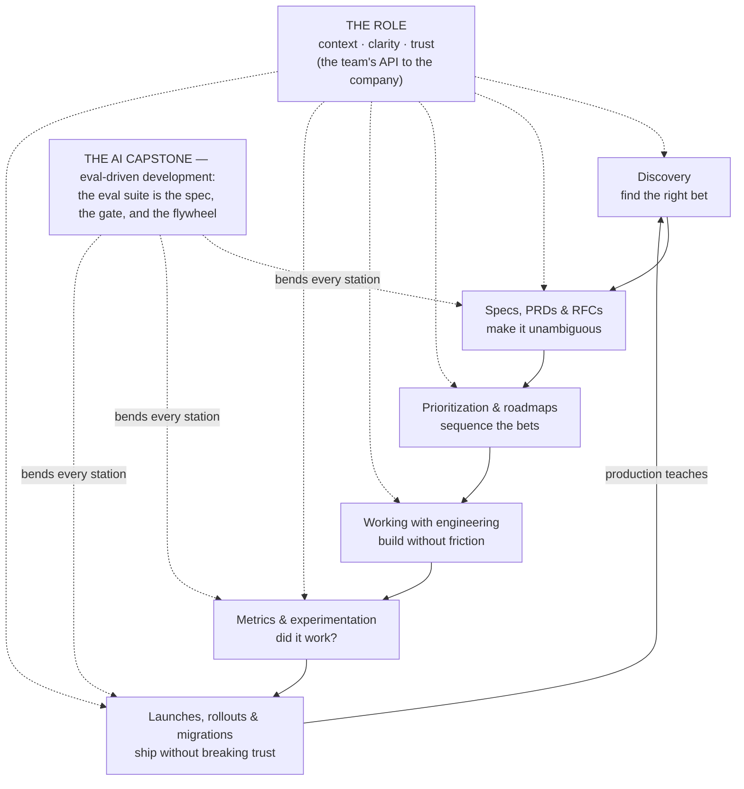

# Technical product management for the AI PM

Product sense tells you *what* to build. Technical product sense tells you what the system
will *let* you build. **Technical product management** is the discipline that turns those
judgments into shipped software: the role, the artifacts, the rituals, and the release
machinery that carry an idea from a hunch to a feature running reliably in production. It's
the *operating system* of the PM job — the part you're actually evaluated on when the
quarter ends.

For APMs and PMs moving into **AI product management**, the craft matters double. AI
features are harder to spec (behaviour is probabilistic), harder to estimate (quality is
discovered, not designed), harder to launch (a model can regress silently), and harder to
measure (the interesting failures don't throw errors). Every lesson here teaches the general
practice first, then shows exactly what changes when there's a model in the build. **Each
lesson ships a diagram** you can redraw on a whiteboard.

## The knowledge graph

The craft is a loop that runs every quarter — with the role at the center and the AI
capstone bending every station:

- [**The technical PM role**](./the-technical-pm-role.md) — what a technical PM actually
  owns, the PM ↔ TPM ↔ EM spectrum, and where your leverage comes from.
- [**Discovery to delivery**](./discovery-to-delivery.md) — the product development
  lifecycle: dual-track discovery and delivery, and the loops that keep them honest.
- [**Specs, PRDs & RFCs**](./specs-prds-and-rfcs.md) — the document stack: writing a PRD
  engineers respect, reading an RFC, and requirements that survive contact with reality.
- [**Prioritization & roadmaps**](./prioritization-and-roadmaps.md) — RICE, cost of delay,
  and the Kano model; roadmaps as bets, not promises; and how to say no.
- [**Working with engineering**](./working-with-engineering.md) — sprints, rituals,
  estimates, and the trust economy between PMs and engineers.
- [**Metrics & experimentation**](./metrics-and-experimentation.md) — the metric tree,
  instrumentation as a requirement, and A/B testing without fooling yourself.
- [**Launches, rollouts & migrations**](./launches-rollouts-and-migrations.md) — feature
  flags, progressive delivery, rollback plans, and retiring the old thing safely.
- [**Incidents & postmortems**](./incidents-and-postmortems.md) — severity, incident
  command, honest communication, blameless learning — and the AI extension (quality
  incidents, kill switches).
- [**Technical product management for AI**](./tpm-for-ai-products.md) — the capstone:
  eval-driven development, probabilistic acceptance criteria, model upgrades as migrations,
  and the data flywheel.

Each lesson pairs the craft with a **🎯 For the AI PM** briefing — how the practice bends
when the product has a model in it — and a diagram to make it concrete.

## Connects to other tracks

- [Product sense](../product-sense/README.md) — the judgment that decides what's worth shipping.
- [Technical product sense](../technical-product-sense/README.md) — reading the system you're shipping on.
- [Evals: golden sets, adversarial, LLM-as-judge](../content/04-evals-observability/evals.md) — the measurement layer under eval-driven development.
- [Versioning & migration (Flowable)](../flowable/phases/08-versioning-and-migration/README.md) — model upgrades as migrations, made concrete.

**📌 Close out the module:** [Recap & real-world examples](./recap.md).
