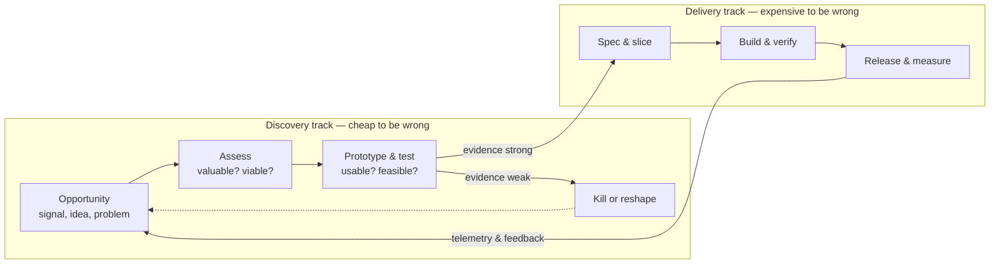

# Discovery to delivery

*Part of [Technical product management for the AI PM](./README.md)*

## TL;DR

Products don't move in a straight line from idea to launch; they move through two parallel
tracks. **Discovery** answers "should we build this, and what exactly?" — cheaply, with
prototypes, data, and user conversations. **Delivery** answers "build it well" — with
specs, sprints, and releases. The classic failure is skipping discovery and using the
delivery track (the expensive one) to find out an idea was wrong. The discipline is
**dual-track**: discovery runs continuously, a step ahead of delivery, feeding it only
ideas that have already survived a risk check — *valuable, usable, feasible, viable* —
while telemetry from shipped work flows back to seed the next round of discovery.

> 🎯 **For the AI PM**
>
> **Why it matters** — For an AI feature, feasibility can't be assessed in a meeting; it
> has to be *demonstrated*. Whether the model can actually do the task, at acceptable
> quality and cost, is unknowable until you've run it against real examples.
>
> **What it changes in your decisions** — Discovery for AI features always includes a
> **feasibility spike**: a prompt or fine-tune tested against a few dozen real inputs,
> scored, *before* the feature enters the delivery track. "The demo looked great" is not a
> discovery output; a scored eval set is.
>
> **Ask yourself** — *"What evidence do I have that this is valuable, usable, feasible, and
> viable — and which of those four am I taking on faith?"*
>
> **Risk if ignored** — The team spends a quarter productionizing a feature whose quality
> ceiling was discoverable in a week, or ships the demo-day version that collapses on real
> user inputs.

## The two tracks

The tracks run **concurrently, not sequentially**. While engineering delivers this month's
validated bet, you (with a designer and an engineer, part-time) are de-risking next
month's. Delivery should never have to stop and wait for discovery to figure out what's
next — and discovery should never hand delivery an unvalidated guess.

## Discovery: kill ideas cheaply

Marty Cagan's four risks are the standard checklist, and they map to who you need:

- **Valuable** — will anyone's behaviour change because this exists? Evidence: user
  interviews, funnel data, support tickets, willingness-to-pay signals. Not evidence: an
  executive really wants it (that's an input, not a validation).
- **Usable** — can the target user actually operate it? Evidence: prototype tests, even
  five of them. Cheapest of the four to check, most often skipped.
- **Feasible** — can we build it with the time, tech, and data we have? Evidence: an
  engineering spike, not an engineering *opinion*. For anything novel, budget real days to
  try it.
- **Viable** — does it work for the business: cost to serve, legal, support load, brand?
  The risk PMs are most uniquely responsible for, because nobody else is looking.

The output of discovery is not a document; it's a **decision** — build, kill, or reshape —
plus the evidence that justifies it. Kills are wins: every idea killed for $5k of
discovery is a quarter of delivery capacity saved.

## Delivery: slice small, verify constantly

Once a bet enters delivery, the craft becomes decomposition. The unit of progress is a
**vertical slice** — a thin, end-to-end piece a user could actually touch (one happy path,
one input type) — not a horizontal layer ("first we build the whole backend"). Vertical
slices surface integration problems early, produce demo-able progress every sprint, and
give you honest options: if the quarter goes sideways, you have a smaller shippable thing,
not 80% of everything and 100% of nothing.

Your delivery-track responsibilities, sprint by sprint: keep acceptance criteria
unambiguous ([next lesson](./specs-prds-and-rfcs.md)), make scope calls fast when reality
diverges from the spec, and protect the definition of done — including instrumentation, so
release actually closes the loop back into discovery.

## The loop is the point

The diagram's most important arrow is the last one: **release feeds discovery**. A shipped
feature is a hypothesis put into production; telemetry and user feedback are the results
coming back. Teams that skip this arrow ship feature after feature into the void and call
it velocity. Put a date in the calendar the day you launch: 2–4 weeks out, review the
metrics against what the PRD predicted, and write down what you learned. That document is
where next quarter's best discovery leads come from.

## Failure modes

- **Waterfall in agile clothing** — a quarter of "discovery" producing a giant spec, then a
  quarter of delivery. Long feedback loops, all risk discovered at the end.
- **Delivery-track discovery** — "let's build it and see." The most expensive possible way
  to learn an idea is wrong.
- **Validation theater** — running interviews and tests but only hearing confirmation.
  If discovery never kills anything, it isn't discovery.
- **The demo trap (AI-specific)** — promoting a feature to delivery because a
  hand-picked demo impressed a VP, without an eval on realistic inputs.
- **Horizontal slicing** — "the API is done, the UI is done, they've just never been
  connected." All integration risk lands in the final week.

## Practitioner checklist

- [ ] For my current biggest bet: what's my evidence on valuable / usable / feasible /
      viable — and which is weakest?
- [ ] Is discovery running *now* for what the team builds *next month*, or will delivery
      idle while we figure it out?
- [ ] If the bet is AI-shaped: has a feasibility spike run against real inputs, with
      scores?
- [ ] Is the current build sliced vertically — could we ship the smallest slice alone if
      we had to?
- [ ] Do I have a post-launch review scheduled that compares results to what the PRD
      predicted?

## Related lessons

- [Specs, PRDs & RFCs](./specs-prds-and-rfcs.md)
- [Metrics & experimentation](./metrics-and-experimentation.md)
- [Technical product management for AI](./tpm-for-ai-products.md)
