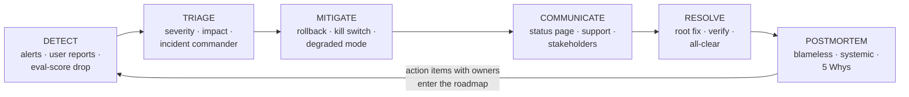

# Incidents & postmortems

*Part of [Technical product management for the AI PM](./README.md)*

## TL;DR

Owning a product includes owning its worst hour. An **incident** is any unplanned event
degrading what users depend on; the discipline around it has three phases with
different tempos: **respond** (stop the bleeding — mitigation before diagnosis, one
incident commander, users informed honestly), **recover** (restore service, then
restore *trust*), and **learn** (a **blameless postmortem** that finds the systemic
causes and converts them into funded fixes). The PM is rarely the one typing the fix —
your incident-time job is user impact, communication, and decisions that trade
recovery speed against risk; your postmortem-time job is making sure the lessons
actually reach the roadmap.

> 🎯 **For the AI PM**
>
> **Why it matters** — AI features fail differently: quality can degrade with no
> errors thrown, a model update can shift behaviour overnight, and "the bot said
> something horrifying" is an incident with a screenshot. Your incident definitions,
> detectors, and playbooks all need an AI-shaped extension.
>
> **What it changes in your decisions** — You define *quality incidents* (eval-score
> drop, spike in user overrides) as pageable events, not just availability incidents;
> and every AI feature ships with a kill switch and a degraded mode you chose on
> purpose.
>
> **Ask yourself** — *"If this feature started confidently misbehaving at 2 a.m., how
> would we know, who would decide to pull it, and what would users see instead?"*
>
> **Risk if ignored** — Slow, improvised responses that turn twenty-minute problems
> into front-page ones — and a team that repeats its incidents because nothing was
> ever truly learned.

## The lifecycle

Severity drives everything: a **SEV1** (users broadly down, data at risk) gets a war
room and executive updates; a **SEV3** (degraded corner case) gets a ticket. Agree on
the ladder *before* you need it — arguing about severity during an incident is how
minutes become hours. Two rules survive every framework: **mitigate before you
diagnose** (rollback first, root-cause later — which is why
[rollback-ready releases](./launches-rollouts-and-migrations.md) are an incident tool,
not just a launch tool), and **one incident commander** — a single person directing,
so ten helpful engineers don't make eleven uncoordinated changes.

## The PM's job while it burns

Not the keyboard — the blast radius:

- **Size the user impact** — who is affected, how badly, and is it getting worse?
  Engineering knows what's broken; you know what it *means* — which customers, which
  commitments, which revenue.
- **Own communication** — honest, plain, and on a cadence: status page, support
  macros, account teams for the big customers. "We know, we're on it, next update at
  :30" beats silence and beats spin. Trust is lost less by the outage than by the
  handling.
- **Make the product calls** — degrade or disable? Ship the risky fast fix or the
  safe slow one? Accept data loss for recovery speed? These are product decisions
  that arrive dressed as technical ones; being in the room is the job.
- **Keep the timeline** — someone should be logging what happened when; it's the raw
  material of the postmortem and it's never reconstructible afterward.

## Blameless postmortems — learning as an artifact

The postmortem's premise: people acted reasonably on the information they had; the
*system* let them down. Blamelessness isn't kindness — it's instrumentation: the
moment a postmortem can hurt someone, it stops hearing the truth.

The document is short and structured: impact (users, duration, cost) · timeline ·
root causes — plural, found by [asking why five times](../first-principles/the-method.md)
past the trigger to the conditions (the deploy was the spark; the missing alert, the
unbounded retry, and the single point of failure were the fuel) · what went *well* ·
and **action items with owners and dates**. That last line is where postmortems go to
die: track them like features, review them monthly, and treat a repeat incident with
an unshipped action item as the process failure it is. The best input to
[prioritizing reliability work](./prioritization-and-roadmaps.md) is a stack of
postmortems all pointing at the same subsystem.

## The AI extension

- **Quality incidents are incidents.** Define them: eval score below bar in
  production sampling, override/rejection spike, a
  [guardrail](../content/04-evals-observability/observability.md) firing at 10× base
  rate. Wire them to [drift detection](../content/04-evals-observability/observability.md)
  so degradation pages someone instead of accruing silently.
- **Every AI feature ships with a kill switch** — and a *chosen* degraded mode:
  fall back to the previous model version, to retrieval-only answers, or to the
  human process. "Turn it off" should be a product decision made calmly in advance,
  not invented at 2 a.m.
- **Model updates are change events.** Provider ships a new version, behaviour
  shifts, tickets spike: that's an incident class. The mitigation is the
  [pin-and-diff discipline](./tpm-for-ai-products.md) — pinned versions, eval diffs
  before adoption, staged ramps.
- **The screenshot incident** — one appalling output going viral is a real severity
  class with its own playbook: capture the trace, reproduce, guardrail the pattern,
  and feed it to the [eval suite](./tpm-for-ai-products.md) so it can never ship
  again unnoticed.

## Failure modes

- **Diagnosis before mitigation** — an hour of root-causing while the rollback
  button waits; users pay for the team's curiosity.
- **The headless incident** — no commander; parallel uncoordinated fixes, one of
  which causes incident number two.
- **Blameful postmortems** — the room optimizes for self-defense; the same incident
  returns with a different name on it.
- **Action-item graveyard** — lessons documented, never funded; the postmortem
  becomes a ritual of description.
- **Availability-only monitoring** — the AI feature is "up" while its quality is
  quietly on fire; no error, no page, no idea.

## Practitioner checklist

- [ ] Is there a severity ladder, and does everyone know who commands a SEV1?
- [ ] For each critical feature: what's the rollback, and when was it last exercised?
- [ ] Do users hear from us honestly and on a cadence during incidents — and is that
      *someone's* named job?
- [ ] Are postmortem action items tracked, owned, and reviewed — and do repeat
      incidents trigger escalation?
- [ ] For AI features: is a quality drop pageable, is there a kill switch, and is
      the degraded mode a decision rather than an accident?

## Related lessons

- [Launches, rollouts & migrations](./launches-rollouts-and-migrations.md)
- [Metrics & experimentation](./metrics-and-experimentation.md)
- [TPM for AI products](./tpm-for-ai-products.md)
- [Reliability & failure](../technical-product-sense/reliability-and-failure.md)
