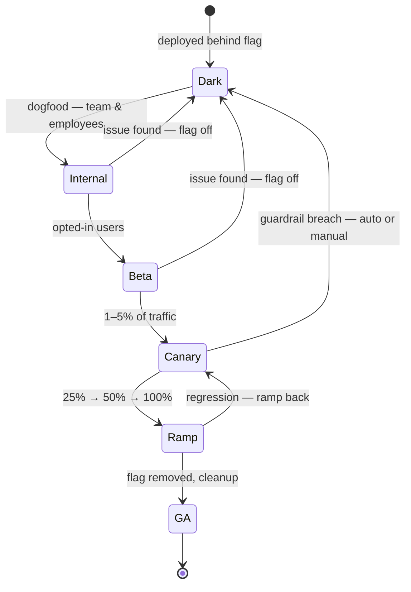

# Launches, rollouts & migrations

*Part of [Technical product management for the AI PM](./README.md)*

## TL;DR

Modern shipping separates two things that used to be one: **deploy** (code reaches
production, dark, behind a feature flag) and **release** (users actually see it, at a
percentage you control). That separation enables **progressive delivery** — internal
users, then beta, then 1%, 10%, 50%, 100% — with metrics checked at every stage and a
rollback plan that's a flag-flip, not a fire drill. Launch is the *marketing* moment and
needs its own machinery: support enablement, docs, comms, and a go/no-go that someone
actually owns. And the least glamorous, highest-risk work in the discipline is the
**migration** — moving users and data off the old thing — where the rule is: the effort
lives in the transition, not the destination, and you're not done until the old thing is
*off*.

> 🎯 **For the AI PM**
>
> **Why it matters** — AI features fail in ways staged rollouts are built to catch:
> quality problems that only appear on real-user inputs, costs that only appear at real
> volume, and abuse that only appears in public. And the riskiest recurring change isn't
> your code — it's the **model or prompt upgrade**, which can silently regress behaviour
> that worked yesterday.
>
> **What it changes in your decisions** — Every AI rollout stage gates on *quality*
> signals (acceptance rate, eval spot-checks) alongside crashes and latency; and model or
> prompt swaps get the full migration treatment — offline eval diff, side-by-side
> shadow run, staged ramp with rollback — never a quiet Tuesday config change.
>
> **Ask yourself** — *"At 1%, what signal tells me quality is wrong — and can I get back
> to yesterday's behaviour in one action?"*
>
> **Risk if ignored** — A model upgrade that improves the average and breaks a top
> customer's workflow ships to 100% in one step, and the rollback path turns out to be
> "re-deploy last month's build under pressure."

## Progressive delivery

Each stage exists to catch a different class of problem:

- **Dark / deployed-off** — integration verified in production with zero user exposure.
- **Internal (dogfooding)** — the cheapest honest users you'll ever have. If your own
  team routes around the feature, users will too; listen *before* beta.
- **Beta** — opted-in users who expect rough edges and give real-workflow feedback. Set
  expectations explicitly; a beta user surprised by instability is a churn story.
- **Canary (1–5%)** — the money stage. Enough traffic for real signal on crashes,
  latency, cost, and (for AI) quality proxies; small enough that a disaster is an
  apology, not a headline. Define the **abort criteria before you start** — "flag off if
  error rate exceeds X or acceptance rate drops Y%" — because mid-incident is the worst
  time to negotiate thresholds.
- **Ramp** — watch the [guardrail metrics](./metrics-and-experimentation.md) at each
  step; costs and tail latencies that looked fine at 5% have opinions at 50%.
- **GA and cleanup** — the flag comes *out*. A codebase of permanent flags is
  [tech debt](../technical-product-sense/tech-debt-and-estimation.md) with a countdown
  attached.

**Rollback is a product requirement you own.** Before any stage: what's the one action
that restores yesterday's behaviour, who can take it, and does data written by the new
version still work under the old one? That last question is the sneaky one — a feature
that writes a new data format can make "just turn it off" impossible. If rollback is
hard, you find out now, not at 2 a.m.

## Launch ≠ release

Release is traffic percentages; **launch** is the coordinated moment the world is told.
The launch machinery PMs own:

- **Tiering** — not everything deserves fireworks. A tier-1 launch (press, exec
  visibility) needs weeks of coordination; a tier-3 (changelog note) needs a paragraph.
  Deciding the tier early prevents both over-production and under-communication.
- **Support enablement** — support sees the surge first. They get docs, known-issues
  lists, and escalation paths *before* the announcement, or launch day becomes their
  worst day and their opinion of product durably drops.
- **The go/no-go** — a real checkpoint with a named owner (usually you), a checklist
  (feature complete, evals green, support ready, comms staged, rollback rehearsed), and
  the genuine option of "no." A go/no-go that has never said no-go is a ceremony.
- **The post-launch review** — 2–4 weeks after: metrics vs. the PRD's predictions,
  honest deltas, lessons written down. This closes the
  [discovery loop](./discovery-to-delivery.md); skipping it means every launch teaches
  nothing.

## Migrations: the transition is the project

Sooner or later you'll run a migration — new billing system, v2 API, re-platformed
search, swapped model provider. The pattern that survives contact with reality is
**expand → migrate → contract**:

1. **Expand** — stand up the new path alongside the old. Often both run simultaneously
   (dual-write; or **shadow mode**, where the new system processes real traffic but its
   output is only logged and compared).
2. **Migrate** — move traffic/users in cohorts, easiest first, watching comparisons. For
   external users this is where deprecation comms, timelines, and incentives live — you
   are changing *someone else's* roadmap, and goodwill is spent or earned here.
3. **Contract** — turn the old path off and delete it. The step everyone skips, leaving
   two systems to run, secure, and reconcile forever. **A migration is done when the old
   thing is off** — track that as the milestone, not "new thing launched."

PM-owned migration questions: What breaks for which cohort, and do they know? What's the
comparison that proves the new path matches the old (for an AI swap: the eval diff and
shadow-run comparison)? What's the rollback at each cohort? And who is watching the
long tail — the last 5% of users on the old path who consume 50% of the effort?

## Failure modes

- **The big-bang launch** — 0% to 100% in one step, discovering scale, cost, and quality
  problems with the whole user base watching.
- **Rollback theater** — a rollback "plan" nobody rehearsed, defeated by a data format
  change the moment it's needed.
- **Flag graveyard** — a codebase of permanent flags multiplying test paths until nobody
  knows what production actually does.
- **The 95% migration** — old system still up "temporarily" two years later, doubling
  the operational surface forever.
- **Silent model swaps** (AI-specific) — prompt or model changed without eval diff or
  staged ramp; behaviour regresses for a workflow you never thought to test.

## Practitioner checklist

- [ ] Is deploy separated from release (flags), and can I say today's exposure
      percentage for each in-flight feature?
- [ ] Are abort criteria for the current rollout written down — and would a guardrail
      breach flag off automatically or wait for a human?
- [ ] Has rollback actually been rehearsed, including the data-compatibility question?
- [ ] Do support and docs get enabled before the announcement, not after?
- [ ] For the current migration: what's the contract date — when is the *old* thing off?

## Related lessons

- [Metrics & experimentation](./metrics-and-experimentation.md)
- [Working with engineering](./working-with-engineering.md)
- [Technical product management for AI](./tpm-for-ai-products.md)
