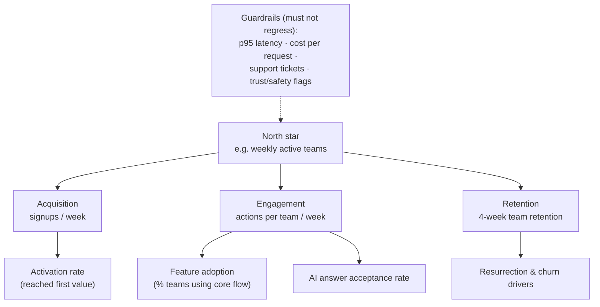

# Metrics & experimentation

*Part of [Technical product management for the AI PM](./README.md)*

## TL;DR

If you can't measure it, you shipped an opinion. The measurement stack has three layers:
a **metric tree** connecting one north-star outcome to the input metrics teams can
actually move; **instrumentation** written into the spec so the events exist when you
need them; and **experiments** (A/B tests) that separate "the metric moved because of us"
from "the metric moved." Experiments keep you honest, but they're not free and not
always right: they need enough traffic, an up-front hypothesis, guardrail metrics, and
the discipline not to peek and stop at the first flattering result. Where you can't
test, you can still reason — with before/after comparisons, holdouts, and humility.

> 🎯 **For the AI PM**
>
> **Why it matters** — An AI feature's interesting failures return HTTP 200. Latency and
> error dashboards stay green while answer quality quietly degrades — so the standard
> metric stack, which assumes correctness is binary and crashes are visible, misses the
> thing that matters most.
>
> **What it changes in your decisions** — You add a **quality layer** to the tree:
> eval scores as the offline metric, thumbs-up rate / edit rate / retry-and-rephrase rate
> as online proxies — and you instrument the *feedback capture* (accepted the suggestion?
> edited it? abandoned?) as a launch-blocking requirement, because that stream is also
> your future eval data.
>
> **Ask yourself** — *"If answer quality dropped 15% tomorrow, which number on which
> dashboard would move, and how long until a human noticed?"*
>
> **Risk if ignored** — Quality drifts for weeks behind green dashboards, and the first
> detector is a customer thread going viral.

## The metric tree

A north-star metric alone is a scoreboard, not a strategy — no team can directly move
"weekly active teams." The tree makes it actionable:

- **North star** — one number that proxies delivered value (not revenue — revenue lags
  value) . Everything in the tree must have a plausible causal path to it.
- **Input metrics** — the branches teams can actually own and move this quarter. A good
  input metric is sensitive (responds in days, not quarters) and causally connected
  (moving it plausibly moves the parent).
- **Guardrails** — the "do no harm" set: latency, cost, support load, trust. Every
  experiment and launch is judged on its target metric *and* on leaving guardrails intact.
- **Leading vs. lagging** — retention is lagging (you learn you failed months later);
  activation is leading. Manage with leading indicators, report with lagging ones.

Beware **Goodhart's law**: any metric made a target gets gamed, usually innocently.
"Answers delivered" as a target produces more answers, not better ones. Pair every
target metric with a quality counterweight.

## Instrumentation is a requirement, not a favour

The events you'll need to answer "did it work?" must be in the spec —
[the PRD](./specs-prds-and-rfcs.md) — before build, because retrofitting analytics after
launch means weeks of blindness followed by data you only half trust. The PM's
instrumentation pass: for each success metric, *which event, with which properties,
fired from where, proves it?* If you can't name the event, you can't have the metric.
Then check the funnel: every step a user takes toward value should emit something, or
your drop-off analysis will have holes exactly where the mystery is.

## Experiments without self-deception

An A/B test randomly splits users, shows each group a variant, and compares. The
mechanics are a solved problem; the discipline isn't:

- **Hypothesis first, in writing** — "we believe moving X will lift Y by ~Z% because…"
  Written *before* launch, because post-hoc, any result can be narrated into a win.
- **Power before launch** — small effects need surprising amounts of traffic. If the
  calculator says eight months to significance, the honest answer is "this isn't
  A/B-testable here" — not "we'll run it two weeks and squint."
- **No peeking** — checking daily and stopping at the first p < 0.05 is how teams ship
  noise. Fix the duration up front (or use sequential methods designed for early looks).
- **Judge the guardrails too** — a win on the target that degrades latency or support
  volume isn't a win; it's a trade you should make consciously or not at all.
- **Segments lie enthusiastically** — slice a neutral result twenty ways and one slice
  will "win" by chance. Segment analyses generate hypotheses for the *next* test; they
  don't rescue this one.

When you can't test — traffic too small, change too structural, effect too slow — use
the humbler tools: pre/post with the seasonality caveat stated out loud, a long-running
**holdout** (5% who don't get the new experience for a quarter), or staged
rollout-as-natural-experiment ([next lesson](./launches-rollouts-and-migrations.md)).
Weaker evidence honestly labelled beats strong claims from weak designs.

## The AI quality layer

For model-powered features, wire *offline* and *online* measurement together:

- **Offline: eval scores** — the graded example set from your
  [spec](./specs-prds-and-rfcs.md), run against every prompt/model/retrieval change
  *before* it ships. This is your regression suite for quality.
- **Online: behavioural proxies** — users rarely click thumbs-down; they silently
  *edit* the draft, *retry* the question rephrased, or *abandon* the flow. Edit distance,
  retry rate, and acceptance rate are your truest online quality signals — instrument
  them from day one.
- **The loop** — online failures (edited outputs, rephrased retries) flow back into the
  eval set, so the offline suite keeps resembling reality. That loop is the
  [data flywheel](./tpm-for-ai-products.md), and it's the capstone's subject.

## Failure modes

- **Vanity dashboards** — big cumulative numbers ("10M answers served!") that only go
  up and inform nothing. If no decision changes when the number changes, it's decoration.
- **Metric monotheism** — optimizing the target with no guardrails until support volume
  or trust pays the bill.
- **Peeking and p-hacking** — early stops, post-hoc hypotheses, twenty segment slices.
  The result is a culture that "wins" every test and moves no annual number.
- **Instrumentation as cleanup** — analytics scheduled after launch, so the team debates
  opinions during the weeks that matter most.
- **Green-dashboard blindness** (AI-specific) — infrastructure metrics healthy, no
  quality signal wired, drift discovered by customers.

## Practitioner checklist

- [ ] Can I draw my product's metric tree — north star, the 3–5 inputs, the guardrails —
      from memory?
- [ ] Does the current PRD name the exact events that will prove or disprove success?
- [ ] Is there a written hypothesis and a fixed duration for the currently running test?
- [ ] For AI features: do I have an offline eval score *and* an online behavioural proxy,
      and do failures flow back into the eval set?
- [ ] Which metric on my dashboard would I delete tomorrow for informing no decisions?

## Related lessons

- [Specs, PRDs & RFCs](./specs-prds-and-rfcs.md)
- [Launches, rollouts & migrations](./launches-rollouts-and-migrations.md)
- [Technical product management for AI](./tpm-for-ai-products.md)
