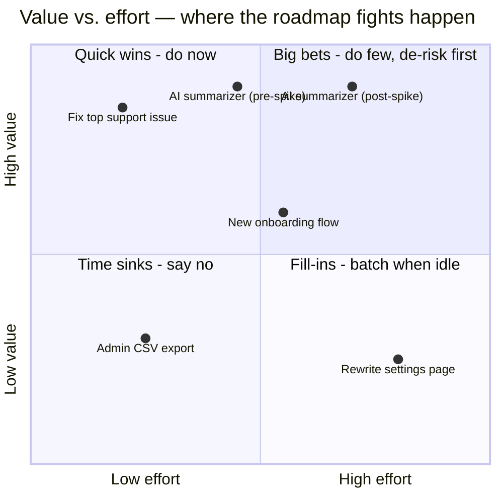

# Prioritization & roadmaps

*Part of [Technical product management for the AI PM](./README.md)*

## TL;DR

Prioritization is the job reduced to one sentence: **you have 10x more good ideas than
capacity, and the order you build them in is the strategy**. Frameworks — RICE, ICE, cost
of delay, Kano — don't make the decision for you; they make your *reasoning legible* so it
can be challenged and improved. The roadmap that comes out the other side is a
**communication of bets and their sequence**, not a delivery contract — which is why
*now / next / later* beats a Gantt chart for most audiences. And because every "yes" is a
hundred implicit "no"s, saying no — clearly, with the reasoning attached — is the most
valuable sentence a PM produces.

> 🎯 **For the AI PM**
>
> **Why it matters** — AI bets break naive scoring. Effort is uncertain by an order of
> magnitude (quality is discovered, not scheduled), and a demo makes *reach × impact* feel
> huge before feasibility is known. Meanwhile stakeholder pressure to "do something with
> AI" injects fake urgency into the inputs.
>
> **What it changes in your decisions** — You score AI ideas with an explicit **confidence
> discount** until a feasibility spike has run, and you hold roadmap slots for eval and
> data work — the unglamorous items that never win a RICE bake-off but determine whether
> anything else on the list ships well.
>
> **Ask yourself** — *"Is this AI feature high on the list because the evidence is strong,
> or because the demo was?"*
>
> **Risk if ignored** — A roadmap of impressive-sounding AI bets, none de-risked, all
> late — while the boring fix that users actually begged for waits another quarter.

## Frameworks: engines for arguments, not answers

- **RICE** — score = (Reach × Impact × Confidence) / Effort. Its real value is the
  **Confidence** term: it forces you to admit which numbers are guesses. A 10/10 impact at
  20% confidence should lose to a 6/10 at 90%.
- **ICE** (Impact, Confidence, Ease) — RICE's quick cousin; fine for triaging a long list
  in an hour, too coarse for the final call on big bets.
- **Cost of delay / WSJF** — asks "what does *waiting* cost per month?" instead of "what
  is this worth?" This flips priorities when timing matters: a medium-value item ahead of
  a compliance deadline outranks a high-value item that's worth the same next year.
  Dividing cost of delay by duration (WSJF — weighted shortest job first) formalizes
  "do the quick valuable things first."
- **Kano** — separates *basic* features (absence infuriates, presence goes unnoticed),
  *performance* features (more is linearly better), and *delighters* (unexpected joy).
  Its lesson: a product of pure delighters with a missing basic still fails. Check your
  top ten for uncovered basics before celebrating the delighters.

All of them share failure math: garbage estimates in, confident-looking garbage out. The
discipline isn't the arithmetic — it's writing your assumptions down where someone can
tell you they're wrong.

Note the summarizer appearing twice: a feasibility spike doesn't just reduce risk, it
*moves the dot* — effort estimates tighten dramatically once someone has actually tried
it. Cheap discovery work exists to reposition expensive bets before you commit.

## Roadmaps are bets, not promises

A roadmap does two jobs at once — aligning stakeholders and guiding the team — and the
classic mistake is using one artifact for both:

- **Now / next / later** — the default for most audiences. *Now* is committed and
  specific; *next* is planned but re-orderable; *later* is directional. The buckets encode
  honesty about certainty, which date-based roadmaps destroy: paint a feature on Q3 and by
  Friday it's a commitment someone sold to a customer.
- **Outcome-based roadmaps** — organize by the problem or metric ("cut onboarding
  drop-off by 30%") rather than the feature. Harder to write, but they preserve the
  team's freedom to change *solution* without appearing to change *plan*.
- **Date-based roadmaps** — legitimate when dates are real: compliance deadlines,
  contractual commitments, coordinated launches. Use dates where dates exist; don't
  invent them for decoration.

Whatever the format, reserve explicit capacity **before** feature prioritization begins:
a platform/debt allocation (teams commonly hold 15–30% — see
[tech debt](../technical-product-sense/tech-debt-and-estimation.md)) and, on AI products,
an eval/data line item. Debt never wins a head-to-head RICE contest against a shiny
feature; that's precisely why it gets a reserved lane instead of a lottery ticket.

## Saying no

Every framework ends at the same human moment: telling someone their thing didn't make
the cut. The craft:

- **Say no to the idea, yes to the problem** — "we're not building custom dashboards this
  quarter, but the underlying reporting pain is real and here's where it sits on the
  list."
- **Show the trade, not just the verdict** — "for this to be *now*, one of these three
  things moves out. Which?" moves the argument from *whether you care* to *what it
  displaces* — which is the actual decision.
- **Write it down** — a visible, reasoned not-now list. Re-litigating the same request
  monthly because the reasoning evaporated is pure waste.

## Failure modes

- **Framework laundering** — tuning RICE inputs until the spreadsheet blesses the thing
  you'd already decided. Everyone can tell.
- **The peanut-butter roadmap** — spreading capacity thinly over everything so no bet
  gets enough to actually win. Prioritization means *concentration*.
- **Roadmap as contract** — shipping the Q3 painting instead of responding to what you
  learned in Q2. The map ate the territory.
- **Demo-driven prioritization** — AI bets jumping the queue on wow-factor, with
  confidence never revisited after the applause.
- **Loudest-voice allocation** — priority by stakeholder volume. A framework's real
  political function is giving you something to point at that isn't a person.

## Practitioner checklist

- [ ] For my top five items: can I state reach, impact, confidence, and effort — and
      which of those numbers are guesses?
- [ ] Does anything urgent-by-timing (cost of delay) deserve to jump the value ranking?
- [ ] Are the basics covered (Kano) before the delighters?
- [ ] Does the roadmap encode certainty honestly (now/next/later) — and has debt/eval
      capacity been reserved off the top?
- [ ] Can I name the last significant thing I said no to, and does the requester know why?

## Related lessons

- [Discovery to delivery](./discovery-to-delivery.md)
- [Specs, PRDs & RFCs](./specs-prds-and-rfcs.md)
- [Metrics & experimentation](./metrics-and-experimentation.md)
