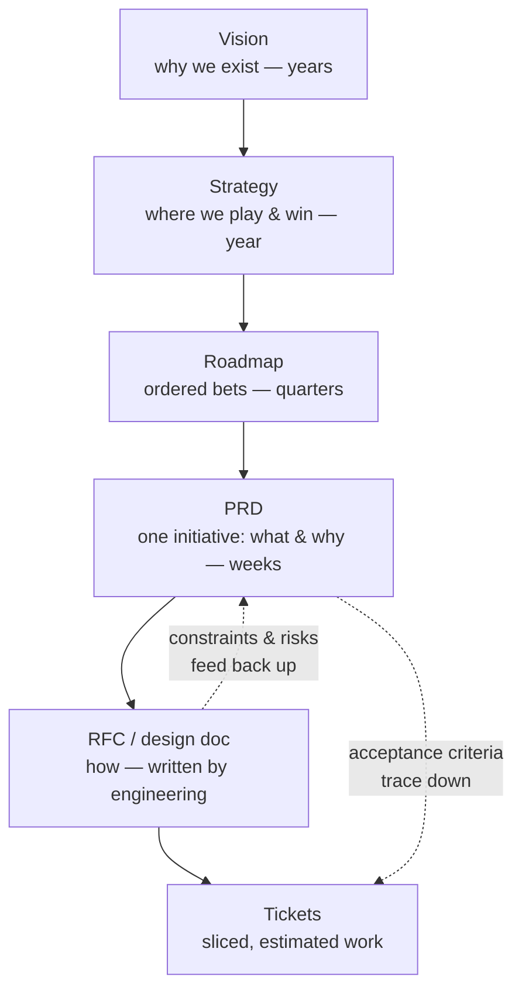

# Specs, PRDs & RFCs

*Part of [Technical product management for the AI PM](./README.md)*

## TL;DR

Writing is the PM's power tool, and the documents form a stack: **vision** (why we exist)
→ **strategy** (where we'll win) → **roadmap** (what, in what order) → **PRD** (what
exactly, for one initiative) → **RFC / design doc** (how, written by engineering) →
**tickets** (the work itself). Each layer answers questions the layer below shouldn't have
to re-litigate. The PRD is yours: a good one nails the *problem*, *goals and non-goals*,
*requirements with acceptance criteria*, *non-functional requirements*, and *how we'll
measure success* — and stays silent on implementation. The RFC is engineering's: your job
there is to be its sharpest *reader*, checking the design against the product intent it
claims to serve.

> 🎯 **For the AI PM**
>
> **Why it matters** — Deterministic features can be specified by enumerating behaviour:
> "clicking X does Y." An AI feature can't — you can't enumerate every input. The spec has
> to define *quality* instead of *behaviour*.
>
> **What it changes in your decisions** — Your PRD gains new mandatory sections: example
> inputs and *graded* ideal outputs (the seed of an eval set), explicit tolerance for being
> wrong ("what's the cost of a bad answer, and what does the user see?"), and latency/cost
> budgets as first-class NFRs.
>
> **Ask yourself** — *"Could an engineer read this spec and know how good is good enough —
> without asking me?"*
>
> **Risk if ignored** — The team builds to "make the AI answer questions," discovers
> "good enough" was never defined, and the launch decision becomes a vibes-based argument
> in week eleven.

## The document stack

Two arrows matter most. Acceptance criteria written in the PRD should be traceable all the
way into tickets — if a ticket can't be traced to a requirement, ask why it exists. And
RFCs feed *back*: engineering's design work routinely uncovers a constraint ("that data
doesn't exist", "that latency is impossible without precomputation") that must flow back up
and change the PRD, not get silently absorbed.

## Anatomy of a PRD engineers respect

Length is not quality — one to four pages beats twenty. The sections that earn their place:

- **Problem & evidence** — whose problem, how you know it's real, what it costs today.
  This is the section engineers actually read to decide if the project is worth caring
  about. Write it best.
- **Goals and non-goals** — non-goals are the highest-leverage sentence in the document.
  "V1 does not support bulk import" kills a hundred Slack threads in advance.
- **Requirements with acceptance criteria** — each requirement testable: *given* a
  context, *when* the user acts, *then* this observable result. "The search should be
  fast" is an opinion; "search returns first results within 500 ms at p95" is a
  requirement.
- **Non-functional requirements (NFRs)** — the ones that get forgotten until they're
  emergencies: latency and availability targets, scale assumptions, privacy and data
  residency, accessibility, localization, security review, support/admin tooling. NFRs are
  where the [technical product sense](../technical-product-sense/README.md) track cashes in.
- **Edge cases and unhappy paths** — what happens on empty state, failure, retry, abuse.
  If the PRD only describes the happy path, the engineers design the unhappy ones alone.
- **Success metrics** — the numbers that will move if this works, and when you'll check
  ([Metrics & experimentation](./metrics-and-experimentation.md)).
- **Open questions** — an explicit list. Pretending certainty you don't have costs trust;
  a visible open-questions section *builds* it.

What a PRD should *not* contain: database schemas, API designs, technology choices, or a
solution disguised as a requirement ("build a Redis cache" is a design; "repeat visits
must load in under a second" is the requirement behind it).

## Reading an RFC like a PM

The RFC (design doc) is where engineering proposes *how*. You won't judge the
architecture — but you're the only reader checking it against product intent. Read for:

- **Does the design serve the requirements it cites?** RFCs sometimes quietly relax a
  requirement ("we'll refresh nightly instead of real-time"). Nightly might be fine — but
  that's your call, made in the open.
- **The trade-offs section** — every honest RFC lists rejected alternatives. Check the
  rejection reasons against product priorities; engineers optimize for elegance and
  operability, which *usually* aligns with users, but not always.
- **The migration/rollout plan** — how the world moves from old to new
  ([Launches, rollouts & migrations](./launches-rollouts-and-migrations.md)). Missing
  rollout plan = risk landing on your launch date.
- **New promises being made** — an RFC that exposes a new API or data contract is creating
  something other teams will depend on, which is product surface, whether or not it has a UI.

Comment with questions, not directives: "what happens to requirement 4's p95 target under
this design?" moves the conversation; "use Postgres instead" ends it.

## Acceptance criteria for probabilistic features

The AI-specific craft deserves its own pattern. You can't write "the summary is always
accurate." You *can* write:

- **Eval-based criteria** — "on the 200-example eval set, ≥90% of summaries are graded
  *acceptable or better* by the rubric in appendix A; zero examples in the *harmful*
  category." The eval set becomes part of the spec.
- **Behavioural bounds** — "when confidence is low or retrieval returns nothing, the
  feature says it can't answer rather than guessing; it never fabricates a citation."
- **Budgets** — "p95 end-to-end latency ≤ 3 s; marginal cost ≤ $0.02 per request at
  projected volume."

This is the bridge into [eval-driven development](./tpm-for-ai-products.md) — the AI
capstone builds on exactly this section.

## Failure modes

- **The write-once PRD** — treated as done when circulated, never updated as reality
  arrives. A stale spec is worse than none; people follow it.
- **Solutioneering** — specifying implementation in the PRD. You get your design *and*
  full blame when it underperforms — and you taught the engineers not to think.
- **The unread masterpiece** — twenty pages nobody finishes. If the team can't recall the
  goals and non-goals, the document failed regardless of quality.
- **NFRs by default** — no latency, privacy, or scale targets stated, so the system
  inherits whatever the implementation happened to produce.
- **Consensus-by-silence** — circulating a doc, hearing nothing, calling it alignment.
  Silence means *unread*. Review meetings exist for a reason.

## Practitioner checklist

- [ ] Does my current PRD have explicit non-goals — and have they killed at least one
      scope argument?
- [ ] Is every requirement testable — could QA (or an eval) verify it without asking me?
- [ ] Are latency, privacy, scale, and failure behaviour stated, or defaulted?
- [ ] Have I read the RFC for my current build and traced each requirement into it?
- [ ] For AI features: does the spec include graded examples and a "how good is good
      enough" threshold?

## Related lessons

- [Discovery to delivery](./discovery-to-delivery.md)
- [Working with engineering](./working-with-engineering.md)
- [Technical product management for AI](./tpm-for-ai-products.md)
