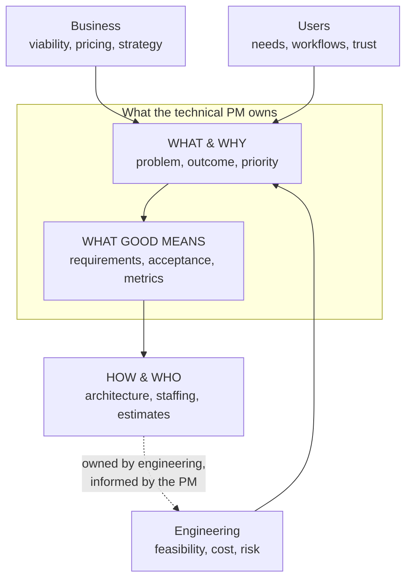

# The technical PM role

*Part of [Technical product management for the AI PM](./README.md)*

## TL;DR

A technical product manager owns the same thing every PM owns — **outcomes** — but earns
them on products where the hard decisions are technical: platforms, APIs, infrastructure,
data products, and AI features. The role sits at the intersection of **business** (is it
worth building?), **users** (does it solve a real problem?), and **engineering** (can we
build and run it?). You are not the architect and not the engineering manager: you don't
decide *how* it's built or *who* builds it — you decide *what* gets built, *why*, in *what
order*, and *what "good" means*. Your leverage is influence without authority, and it runs
on three currencies: context, clarity, and trust.

> 🎯 **For the AI PM**
>
> **Why it matters** — An AI PM is a technical PM by default. Model choice, eval design,
> latency budgets, and data rights are product decisions on an AI product; you can't
> delegate them all to engineering and still claim to own the outcome.
>
> **What it changes in your decisions** — You treat "which model, at what cost, with what
> fallback" as your call to *frame* (options, trade-offs, recommendation) even though
> engineering makes the final technical selection.
>
> **Ask yourself** — *"On this product, which decisions are mine to make, mine to frame,
> and mine to stay out of — and does my engineering counterpart agree with that list?"*
>
> **Risk if ignored** — You drift into being a ticket-writer for engineering's ideas, or a
> backseat architect they route around. Both destroy the role's leverage.

## What the role actually is

Every strong PM works three questions at once. The *technical* PM's distinction is that on
their product, the third question dominates the other two:

- **You own:** the problem statement, the priority order, the requirements (including
  non-functional ones), the success metrics, the launch decision, and the communication
  that keeps everyone pointed at the same outcome.
- **You inform, but don't own:** architecture, technology choices, estimates, and how the
  team organizes its work. You bring constraints and consequences ("this must answer in
  under 2 seconds", "this data can't leave the EU") — engineering brings the design.
- **You stay out of:** code review, individual task assignment, and performance
  management. The fastest way to lose an engineering team is to do their jobs badly.

## The PM ↔ TPM ↔ EM spectrum

Titles vary wildly across companies; the underlying spectrum doesn't:

| Role | Optimizes for | Customer is | Typical outputs |
| --- | --- | --- | --- |
| Product manager | User & business outcomes | End users, buyers | Strategy, PRDs, roadmaps |
| Technical PM | Outcomes on technical products | Often *developers* or internal teams | PRDs with contracts, API specs, migration plans |
| Program manager (also "TPM" at some companies) | Cross-team execution | The org itself | Plans, dependency maps, status |
| Engineering manager | Team health & delivery | The team | Staffing, architecture reviews, career growth |

Two things to notice. First, at Amazon, Google, and Microsoft, "TPM" often means *technical
program manager* — an execution and dependency-management role, not a product-ownership
role. Ask what the letters mean before you interview. Second, platform and API products
invert the empathy problem: your "user" is another engineer, so *developer experience* —
docs, error messages, versioning, time-to-first-call — becomes your UX surface.

## Where the leverage comes from

You have no direct authority over the people who build the product. Your leverage is:

- **Context** — you know things the team can't see from inside the sprint: what customers
  said, what the business needs, what other teams are shipping. Deliver it relentlessly and
  decisions start going your way without you in the room.
- **Clarity** — a crisp problem statement and unambiguous "definition of done" are worth
  more than any amount of meeting attendance. Ambiguity is where velocity goes to die.
- **Trust** — built by understanding enough of the technical picture to ask good questions
  (see the [technical product sense track](../technical-product-sense/README.md)), by never
  negotiating an estimate you don't understand, and by taking the blame boundary seriously:
  you absorb ambiguity from above; you don't pass panic downward.

A useful mental model: the PM is the team's **API to the rest of the company**. Requests
come to you in business language; you translate them into a prioritized, unambiguous
contract; the team's work flows back out through you as narrative the company understands.

## A week in the role

Not a schedule — a portfolio. Strong technical PMs spend roughly:

- **~40% on now** — unblocking the current build: answering spec questions, making scope
  calls, reviewing what's landed against acceptance criteria.
- **~40% on next** — discovery and definition for the next one or two bets: user
  conversations, data digging, writing, aligning stakeholders before the team needs to start.
- **~20% on later** — strategy, metrics review, debt conversations, and the unglamorous
  maintenance of the roadmap and stakeholder trust.

If "now" eats the whole week for more than a sprint or two, the next build starts without
definition and the cycle worsens. Guarding the discovery time *is* the job.

## Failure modes

- **The backseat architect** — overruling technical designs you half-understand. Engineers
  stop bringing you real options and start managing you instead.
- **The ticket clerk** — writing down whatever the loudest stakeholder or the tech lead
  wants, adding no judgment. The role's entire value is the judgment.
- **The absentee** — delegating "technical stuff" wholesale, then being surprised by a
  latency, cost, or privacy property that was knowable months earlier.
- **The hero translator** — hoarding context so all information flows through you. It feels
  like leverage; it's a bottleneck and a bus-factor of one.

## Practitioner checklist

- [ ] Can I state, in one sentence each, the outcome my product owes the business and the
      problem it solves for users?
- [ ] Have my engineering counterpart and I explicitly agreed on which decisions are mine,
      theirs, and shared?
- [ ] Do I know the two or three technical constraints that most shape my product's
      roadmap (a latency budget, a data boundary, a dependency)?
- [ ] Am I spending real weekly time on *next* and *later*, or is *now* consuming me?
- [ ] When did I last change my mind because an engineer showed me a better option?

## Related lessons

- [Discovery to delivery](./discovery-to-delivery.md)
- [Working with engineering](./working-with-engineering.md)
- [Specs, PRDs & RFCs](./specs-prds-and-rfcs.md)
