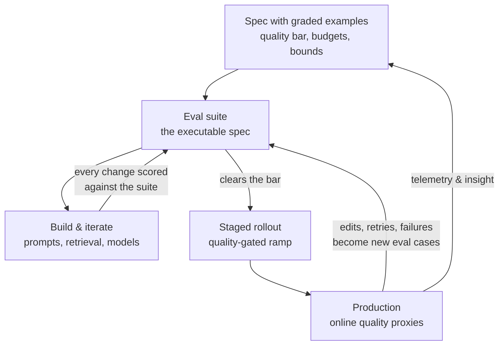

# Technical product management for AI

*Part of [Technical product management for the AI PM](./README.md)*

## TL;DR

Everything in this module still applies to AI products — and every practice bends the
same way, for the same root cause: **behaviour is probabilistic and quality is
discovered, not designed**. So the operating loop reorganizes around evidence:
**eval-driven development** makes a graded example set the spec, the regression suite,
and the launch gate all at once; discovery starts with feasibility spikes; delivery
mixes experiment-shaped work with feature-shaped work; releases treat every model and
prompt change as a migration; and the product that wins long-term is the one whose
**data flywheel** — production feedback improving evals, evals enabling safe iteration,
iteration improving the product — spins fastest. The AI PM's job is to build and protect
that loop.

> 🎯 **For the AI PM**
>
> **Why it matters** — This lesson *is* the briefing. The previous seven taught the
> general craft; this one assembles the AI-specific deltas into a single operating loop
> you can run.
>
> **What it changes in your decisions** — You budget for the loop, not just the feature:
> eval construction, feedback instrumentation, and model-change management are line
> items with your name on them, not engineering hygiene you hope happens.
>
> **Ask yourself** — *"If the model provider shipped a new version tomorrow, does my
> team have a same-day, evidence-based answer to 'should we upgrade?' — or a debate?"*
>
> **Risk if ignored** — An AI feature that demos well, launches loudly, degrades
> silently, and can never be safely improved — because nobody can tell whether any
> change makes it better or worse.

## The operating loop

Read it as three connected loops. The **inner loop** (build ↔ eval) is daily: no prompt,
retrieval, or model change lands without a score. The **release loop** (eval → rollout →
production) is weekly-to-monthly: quality gates the ramp. The **outer loop** (production
→ spec) is quarterly: what users actually do reshapes what "good" means. Your leverage
as PM is making sure all three arrows back into the eval suite actually exist.

## Eval-driven development

The eval suite is to an AI feature what the test suite is to code — except the PM
co-owns it, because it encodes *product judgment*:

- **Sourcing** — start with 50–200 real (or realistic) inputs from discovery; grade
  ideal outputs with a rubric. This is exactly the "graded examples" section of
  [your PRD](./specs-prds-and-rfcs.md), graduated into infrastructure.
- **Grading** — three tiers, in cost order: exact/programmatic checks (did it cite a
  source? valid JSON?), model-graded rubrics (an LLM judges tone, groundedness — cheap,
  scalable, needs spot-audits against human judgment), and human review (the gold
  standard, spent where stakes are highest).
- **The bar** — a launch threshold you set *as the PM*: "≥90% acceptable, zero harmful."
  Where that bar sits is a product decision balancing user trust, cost of errors, and
  competitive urgency — the modern version of "how good is good enough."
- **Maintenance** — a static suite rots as users find new ways to use (and break) the
  feature. Feed production failures back in monthly; retire cases that stop
  discriminating. Treat suite freshness like test coverage: a number someone owns.

Once the suite exists, hard conversations get easy. "Can we ship?" is a score. "Did the
new model help?" is a diff. "Which of these two prompts is better?" takes an afternoon,
not a meeting.

## What each discipline gains

- **Discovery** ([lesson 2](./discovery-to-delivery.md)) — feasibility is a spike with
  scores, run *before* the bet enters delivery. Add two AI-specific viability checks:
  unit economics (tokens × volume, at p95 context sizes — cost scales with usage, unlike
  most software) and data rights (can we use this data for this purpose, including
  feedback capture?).
- **Specs** ([lesson 3](./specs-prds-and-rfcs.md)) — acceptance criteria become
  eval thresholds plus behavioural bounds ("never fabricates a citation; refuses when
  retrieval is empty") plus budgets (latency, cost per request). Also spec the
  **failure UX**: what the user sees when the model is wrong, slow, or down is product
  surface, not error handling.
- **Prioritization** ([lesson 4](./prioritization-and-roadmaps.md)) — confidence
  discounts before spikes; reserved capacity for eval and data work; and honest reach
  math (an AI feature's *effective* reach is reach × the fraction of inputs it handles
  well).
- **Execution** ([lesson 5](./working-with-engineering.md)) — experiment-shaped work
  runs as time-boxed spikes with score-based exit criteria; "still at 82%, bar is 85%"
  is a legitimate, informative sprint outcome, not a slip.
- **Metrics** ([lesson 6](./metrics-and-experimentation.md)) — the quality layer:
  offline eval scores paired with online proxies (acceptance, edit distance,
  retry-and-rephrase), plus cost-per-request on the guardrail list next to latency.
- **Releases** ([lesson 7](./launches-rollouts-and-migrations.md)) — every model/prompt
  change is a migration: offline eval diff → shadow or side-by-side run → staged ramp
  with quality gates → instant rollback (which for AI is usually just re-pinning the
  old model/prompt version — cheap, *if* you versioned them).

## The data flywheel

The compounding asset of an AI product isn't the model — everyone can rent the same
model. It's the loop: **usage → captured feedback → better evals (and sometimes
fine-tuning data) → safer, faster iteration → better product → more usage**. Two PM jobs
make it spin: *instrument feedback capture as a launch requirement* (accepted / edited /
abandoned — the silent signals, since users rarely click thumbs-down), and *secure the
right to learn from it* (privacy policy, enterprise contracts, regional law — a
viability question from lesson 2 that quietly determines whether your flywheel is legal).
A competitor with the same model and a faster flywheel wins in a year. That asymmetry —
not model choice — is usually the real AI strategy question.

## The long game: models age, debt compounds

Three roadmap truths that only bite in the product's second year, so budget for them in
its first:

- **Models degrade on your watch.** Data drifts, user behaviour shifts in response to
  the product itself, and the provider ships new versions underneath you. Continuous
  re-evaluation and periodic retraining (or re-prompting, or re-pinning) is a permanent
  line item — *sustainable model evolution*, not one-off maintenance.
- **Ethical debt compounds like tech debt.** Bias audits, explainability, privacy
  reviews, and fairness checks deferred at launch don't get cheaper — they get baked
  into training data, product behaviour, and user expectations, and the eventual fix
  costs a rewrite plus trust. Schedule this work with the same discipline as
  [tech-debt paydown](./prioritization-and-roadmaps.md), before an incident schedules
  it for you.
- **Platforms outlast features.** The investments with compounding returns are rarely
  the visible features — they're the eval infrastructure, data pipelines, and feedback
  instrumentation every future feature rides on. When the roadmap fight comes, the
  flywheel's plumbing is usually the highest-leverage thing on the list.

A closing practical note: **use these tools in your own workflow**. The PMs with the
best model intuition use models daily — generating mock-up variations for design
discussions, clustering and prioritizing bug reports, critiquing a UX flow, drafting the
first pass of a PRD or stakeholder mail. It's the cheapest training available in where
models shine and where they quietly fail — and that intuition is exactly what the
eval bar and scoping decisions above run on.

## Failure modes

- **Demo-driven development** — the team iterates until the demo impresses, ships, and
  discovers real inputs are nothing like the demo script. The eval suite exists to make
  this impossible.
- **Eval-less iteration** — prompt changes shipped on vibes. Without scores, every
  change is a coin flip you can't distinguish from progress.
- **The static eval** — a suite built at launch and never fed; a year later it certifies
  quality on problems users stopped having.
- **Flywheel-blind economics** — shipping without feedback capture (or the rights to use
  it), then wondering why the product stopped improving after launch.
- **Treating the model as the moat** — betting differentiation on model choice while a
  competitor with an identical model out-loops you on data and iteration speed.

## Practitioner checklist

- [ ] Does every AI feature I own have an eval suite with a PM-set bar — and does every
      prompt/model change get scored against it before shipping?
- [ ] Are prompts and model versions pinned and versioned, so rollback is a re-pin?
- [ ] Is feedback capture (accept / edit / abandon) instrumented — and do we have the
      legal right to learn from it?
- [ ] Do production failures flow into the eval suite on a schedule someone owns?
- [ ] Can I sketch this lesson's loop for my product and point to the arrow that's
      currently broken?

## Related lessons

- [Specs, PRDs & RFCs](./specs-prds-and-rfcs.md)
- [Metrics & experimentation](./metrics-and-experimentation.md)
- [Launches, rollouts & migrations](./launches-rollouts-and-migrations.md)
- [Technical sense for AI systems](../technical-product-sense/technical-sense-for-ai.md)
