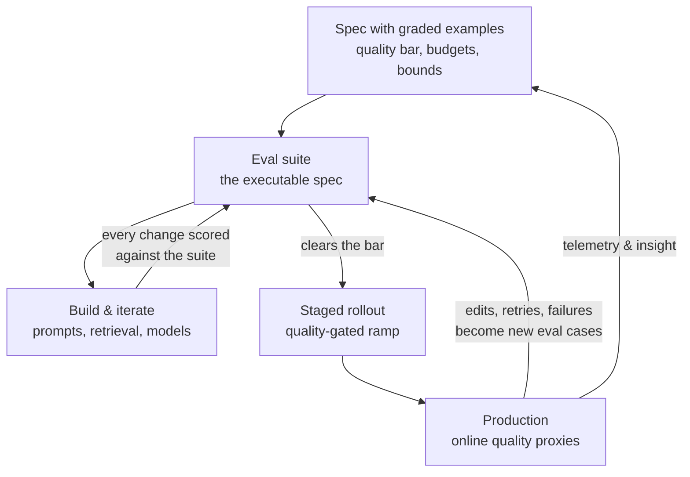

# Technical product management for AI

*Part of [Technical product management for the AI PM](./README.md)*

## TL;DR

Everything in this module still applies to AI products. Every practice bends the
same way, for the same root cause: **behaviour is probabilistic and quality is
discovered, not designed**. So the operating loop reorganizes around evidence.
**Eval-driven development** makes a graded example set the spec, the regression suite,
and the launch gate all at once. Discovery starts with feasibility spikes. Delivery
mixes experiment-shaped work with feature-shaped work. Releases treat every model and
prompt change as a migration. And the product that wins long-term is the one whose
**data flywheel** — production feedback improving evals, evals enabling safe iteration,
iteration improving the product — spins fastest. The AI PM's job is to build and protect
that loop.

> 🎯 **For the AI PM**
>
> **Why it matters** — This lesson *is* the briefing. The previous seven taught the
> general craft. This one assembles the AI-specific deltas into a single operating loop
> you can run.
>
> **What it changes in your decisions** — You budget for the loop, not just the feature:
> eval construction, feedback instrumentation, and model-change management are line
> items with your name on them, not engineering hygiene you hope happens.
>
> **Ask yourself** — *"If the model provider shipped a new version tomorrow, does my
> team have a same-day, evidence-based answer to 'should we upgrade?' — or a debate?"*
>
> **Risk if ignored** — An AI feature that demos well, launches loudly, degrades
> silently, and can never be safely improved — because nobody can tell whether any
> change makes it better or worse.

## The operating loop

```mermaid
flowchart TB
  SPEC["Spec with graded examples<br/>quality bar, budgets, bounds"] --> EV["Eval suite<br/>the executable spec"]
  EV --> BUILD["Build & iterate<br/>prompts, retrieval, models"]
  BUILD -->|"every change scored<br/>against the suite"| EV
  EV -->|"clears the bar"| SHIP["Staged rollout<br/>quality-gated ramp"]
  SHIP --> PROD["Production<br/>online quality proxies"]
  PROD -->|"edits, retries, failures<br/>become new eval cases"| EV
  PROD -->|"telemetry & insight"| SPEC
```

Read it as three connected loops. The **inner loop** (build ↔ eval) is daily: no prompt,
retrieval, or model change lands without a score. The **release loop** (eval → rollout →
production) is weekly-to-monthly: quality gates the ramp. The **outer loop** (production
→ spec) is quarterly: what users actually do reshapes what "good" means. Your leverage
as PM is making sure all three arrows back into the eval suite actually exist.

## Eval-driven development

The eval suite is to an AI feature what the test suite is to code — except the PM
co-owns it, because it encodes *product judgment*:

- **Sourcing** — start with 50–200 real (or realistic) inputs from discovery. Grade
  ideal outputs with a rubric. This is exactly the "graded examples" section of
  [your PRD](./specs-prds-and-rfcs.md), graduated into infrastructure.
- **Grading** — three tiers, in cost order: exact/programmatic checks (did it cite a
  source? valid JSON?), model-graded rubrics (an LLM judges tone, groundedness — cheap,
  scalable, needs spot-audits against human judgment), and human review (the gold
  standard, spent where stakes are highest).
- **The bar** — a launch threshold you set *as the PM*: "≥90% acceptable, zero harmful."
  Where that bar sits is a product decision balancing user trust, cost of errors, and
  competitive urgency — the modern version of "how good is good enough."
- **Maintenance** — a static suite rots as users find new ways to use (and break) the
  feature. Feed production failures back in monthly. Retire cases that stop
  discriminating. Treat suite freshness like test coverage: a number someone owns.
- **The ritual** — a standing PM + eng session reading raw production traces together:
  label failures free-form, cluster them into a failure taxonomy, and only then decide
  which modes deserve automated evaluators. The PM reads *traces*, not dashboards.
  A PM–eng disagreement over whether an output passes is a requirements discovery,
  not annotation noise. Budget accordingly: eval construction and error analysis are a
  first-class share of the feature's development budget, not a tax on it.

Once the suite exists, hard conversations get easy. "Can we ship?" is a score. "Did the
new model help?" is a diff. "Which of these two prompts is better?" takes an afternoon,
not a meeting.

## What each discipline gains

- **Discovery** ([lesson 2](./discovery-to-delivery.md)) — feasibility is a spike with
  scores, run *before* the bet enters delivery. Add two AI-specific viability checks:
  unit economics (tokens × volume, at p95 context sizes — cost scales with usage, unlike
  most software) and data rights (can we use this data for this purpose, including
  feedback capture?).
- **Specs** ([lesson 3](./specs-prds-and-rfcs.md)) — acceptance criteria become
  eval thresholds plus behavioural bounds ("never fabricates a citation; refuses when
  retrieval is empty") plus budgets (latency, cost per request). Also spec the
  **failure UX**: what the user sees when the model is wrong, slow, or down is product
  surface, not error handling.
- **Prioritization** ([lesson 4](./prioritization-and-roadmaps.md)) — confidence
  discounts before spikes; reserved capacity for eval and data work; and honest reach
  math (an AI feature's *effective* reach is reach × the fraction of inputs it handles
  well).
- **Execution** ([lesson 5](./working-with-engineering.md)) — experiment-shaped work
  runs as time-boxed spikes with score-based exit criteria. "Still at 82%, bar is 85%"
  is a legitimate, informative sprint outcome, not a slip.
- **Metrics** ([lesson 6](./metrics-and-experimentation.md)) — the quality layer:
  offline eval scores paired with online proxies (acceptance, edit distance,
  retry-and-rephrase), plus cost-per-request on the guardrail list next to latency.
- **Releases** ([lesson 7](./launches-rollouts-and-migrations.md)) — every model/prompt
  change is a migration: offline eval diff → shadow or side-by-side run → staged ramp
  with quality gates → instant rollback (which for AI is usually just re-pinning the
  old model/prompt version — cheap, *if* you versioned them).

## Context engineering: the PM's real lever over quality

For a decade, "what data do we have?" was the right question — dashboards, KPIs, and
analytics rewarded whoever collected the most. An AI feature breaks that assumption: the
model already has more raw data than any team could organize by hand. What it lacks is
*framing* — the right slice of memory, retrieved documents, tool output, and user state,
assembled for the decision in front of it. The question that actually predicts quality
is "what context does the model need to make this decision meaningful?", not "what data
do we have?"

Prompt engineering — a clever instruction string — looks like the answer, and it's the
fastest way to a working demo. It doesn't survive contact with production, for three
reasons that show up as separate failure patterns:

- **Fragility.** A prompt tuned on "how do I request a refund?" breaks on "can I get my
  money back if I cancel mid-cycle?" — same intent, different words, no output. Real
  inputs are never as clean as the five examples a prompt was tuned against.
- **No scale across use cases.** Every new scenario — a PRD draft, a competitor summary,
  a niche support question — gets its own bespoke prompt. The team ends up maintaining a
  library of brittle strings instead of one adaptive system, and that library is
  operational debt with a PM's name on it.
- **No memory.** A prompt answers in isolation unless something else carries context
  forward. Without it, an AI roadmap assistant can recommend the SMB segment on Monday
  and enterprise-only on Tuesday, because nothing told it what was decided last week.

**Context engineering** is the discipline that survives contact with production:
architecting the system around the model call — retrieval, memory, tool state,
guardrails — so the model reliably has what it needs, instead of hoping the wording
carries it. This is exactly the "prompt assembly" box in the
[AI-feature pipeline](../technical-product-sense/technical-sense-for-ai.md) and the AI
Engineering track's
[context engineering](../content/00-foundations/context-engineering.md) lesson. The
PM's job isn't to write the prompt — it's to **specify what context the decision
requires**, the same way [specs](./specs-prds-and-rfcs.md) specify an eval threshold:
what must the system know, remember, and retrieve for this feature to be trustworthy,
and where does that context come from at query time? Put that requirement in the spec
next to the eval bar, and "the prompt doesn't work for this edge case" stops being an
engineering surprise and starts being a context gap you scoped for.

## The data flywheel

The compounding asset of an AI product isn't the model — everyone can rent the same
model. It's the loop: **usage → captured feedback → better evals (and sometimes
fine-tuning data) → safer, faster iteration → better product → more usage**. Two PM jobs
make it spin: *instrument feedback capture as a launch requirement* (accepted / edited /
abandoned — the silent signals, since users rarely click thumbs-down), and *secure the
right to learn from it* (privacy policy, enterprise contracts, regional law — a
viability question from lesson 2 that quietly determines whether your flywheel is legal).
A competitor with the same model and a faster flywheel wins in a year. That asymmetry —
not model choice — is usually the real AI strategy question.

The flywheel's strategic twin is **workflow capture**. The defensible position isn't the
model or even a beloved feature — it's owning a *control point* in the customer's
workflow: the step whose outputs downstream work consumes and whose inputs upstream
work feeds. From a control point you expand horizontally (each captured workflow adds
enterprise context that makes the next one easier to win), and a broader bundle lets
you cross-subsidize any component a point-solution competitor tries to commoditize.
When you evaluate an adjacent workflow, the deciding question is directional: *if
another player captured it, would they integrate into us, or we into them?*

## The long game: models age, debt compounds

Three roadmap truths that only bite in the product's second year, so budget for them in
its first:

- **Models degrade on your watch.** Data drifts, user behaviour shifts in response to
  the product itself, and the provider ships new versions underneath you. Continuous
  re-evaluation and periodic retraining (or re-prompting, or re-pinning) is a permanent
  line item — *sustainable model evolution*, not one-off maintenance.
- **Ethical debt compounds like tech debt.** Bias audits, explainability, privacy
  reviews, and fairness checks deferred at launch don't get cheaper — they get baked
  into training data, product behaviour, and user expectations, and the eventual fix
  costs a rewrite plus trust. Schedule this work with the same discipline as
  [tech-debt paydown](./prioritization-and-roadmaps.md), before an incident schedules
  it for you.
- **Platforms outlast features.** The investments with compounding returns are rarely
  the visible features — they're the eval infrastructure, data pipelines, and feedback
  instrumentation every future feature rides on. When the roadmap fight comes, the
  flywheel's plumbing is usually the highest-leverage thing on the list.

## Vibe coding: the prototype is the new spec

The 2025 shift with the biggest day-to-day impact on the PM craft: AI coding tools
(Claude Code, Cursor-class editors) made working software cheap enough that PMs build
it themselves — "vibe coding," Karpathy's February 2025 coinage that ended the year as
Collins' word of the year. Three changes follow for this lesson's operating loop:

- **Discovery ships artifacts, not documents.** A working prototype in front of five
  users beats a PRD in front of five stakeholders. Increasingly the prototype *is* the
  spec, with the written doc recording the decisions the prototype forced.
- **The PM–eng contract compresses.** "Here's what I mean" becomes something engineers
  can click, which kills a whole class of specification ambiguity — and creates a new
  duty: be explicit that the prototype demonstrates *intent*, not architecture.
- **The new failure mode is prototype-grade code in production.** Vibe-coded software
  demos beautifully and hides its corners (no error handling, no tenancy, no evals).
  The discipline is a hard line: prototypes are for learning, the eval-gated pipeline
  above is for shipping — and a PM who ships the prototype because it "already works"
  has volunteered for the incident review.

A closing practical note: **use these tools in your own workflow**. The PMs with the
best model intuition use models daily — generating mock-up variations for design
discussions, clustering and prioritizing bug reports, critiquing a UX flow, drafting the
first pass of a PRD or stakeholder mail. It's the cheapest training available in where
models shine and where they quietly fail — and that intuition is exactly what the
eval bar and scoping decisions above run on.

## Failure modes

- **Demo-driven development** — the team iterates until the demo impresses, ships, and
  discovers real inputs are nothing like the demo script. The eval suite exists to make
  this impossible.
- **Eval-less iteration** — prompt changes shipped on vibes. Without scores, every
  change is a coin flip you can't distinguish from progress.
- **The static eval** — a suite built at launch and never fed. A year later it certifies
  quality on problems users stopped having.
- **Flywheel-blind economics** — shipping without feedback capture (or the rights to use
  it), then wondering why the product stopped improving after launch.
- **Treating the model as the moat** — betting differentiation on model choice while a
  competitor with an identical model out-loops you on data and iteration speed.

## Practitioner checklist

- [ ] Does every AI feature I own have an eval suite with a PM-set bar — and does every
      prompt/model change get scored against it before shipping?
- [ ] Are prompts and model versions pinned and versioned, so rollback is a re-pin?
- [ ] Have I specified what context (not just what data) this feature needs, and where
      it's retrieved or remembered from — not just what the prompt says?
- [ ] Is feedback capture (accept / edit / abandon) instrumented — and do we have the
      legal right to learn from it?
- [ ] Do production failures flow into the eval suite on a schedule someone owns?
- [ ] Can I sketch this lesson's loop for my product and point to the arrow that's
      currently broken?

## Related lessons

- [Specs, PRDs & RFCs](./specs-prds-and-rfcs.md)
- [Metrics & experimentation](./metrics-and-experimentation.md)
- [Launches, rollouts & migrations](./launches-rollouts-and-migrations.md)
- [Technical sense for AI systems](../technical-product-sense/technical-sense-for-ai.md)
