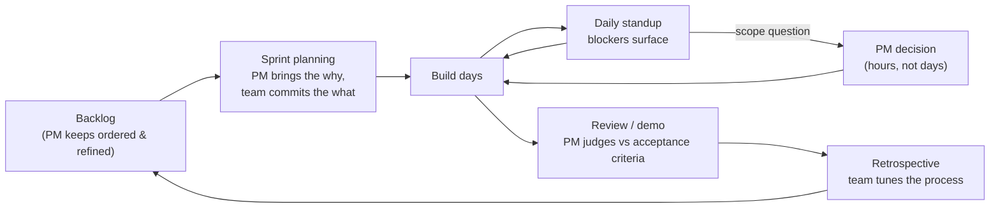

# Working with engineering

*Part of [Technical product management for the AI PM](./README.md)*

## TL;DR

Most software teams run some flavour of **agile**: work sliced small, built in short
cycles, corrected by feedback — either in **sprints** (Scrum: fixed 1–2 week cycles with
planning, review, and retro) or **flow** (Kanban: continuous pull through a
work-in-progress-limited board). The rituals are where the PM's product intent physically
enters the machine, and each one has a specific PM job: bring the *why* and the priorities
to planning, make scope calls at standup speed during the sprint, judge outcomes at
review, and hear the process feedback at retro. Underneath all of it runs the **trust
economy**: estimates are honoured as estimates, bad news travels fast in both directions,
and the PM who understands *why* things take time gets told the truth about how long
things take.

> 🎯 **For the AI PM**
>
> **Why it matters** — AI work fits rituals awkwardly. "Improve answer quality" isn't a
> ticket that burns down linearly — it's an experiment loop that might converge in two
> days or never. Forcing research-shaped work into feature-shaped sprints makes every
> sprint look like a failure.
>
> **What it changes in your decisions** — You let the team run experiment-shaped work as
> **time-boxed spikes with an eval-score exit criterion** ("two weeks; ship if the eval
> clears 85%, escalate if it doesn't") instead of feature tickets with an implied promise
> of success.
>
> **Ask yourself** — *"Is this sprint item a build (we know what done looks like) or an
> experiment (we're buying information) — and does the plan admit which?"*
>
> **Risk if ignored** — Quality work gets reported as "still not done" sprint after
> sprint, trust erodes on both sides, and the team quietly stops attempting ambitious AI
> work at all.

## The shape of a sprint

- **Backlog refinement** (continuous) — your most underrated hour of the week. Stories
  get clarified, sliced, and estimated *before* planning, so planning is a decision
  meeting, not an archaeology session. A PM who shows up to refinement with crisp
  acceptance criteria is worth two who show up only to demos.
- **Sprint planning** — you bring the ordered backlog and the context (*why these, why
  now*); the team decides how much fits. The commitment must be theirs — a sprint stuffed
  by the PM is a sprint the team never owned.
- **Daily standup** — not a status report to you. You're there to catch the sentence
  "blocked, waiting on product" and kill it within hours. PM decision latency is invisible
  in every metric and deadly in every sprint.
- **Review/demo** — working software against acceptance criteria. Praise specifically,
  question honestly; "looks great, ship it" to something that misses a criterion teaches
  the team the criteria are decoration.
- **Retrospective** — the team's meeting about *how* it works. Attend if invited, listen
  more than you talk, and actually fix the top process complaint if it's yours to fix.
  (It's often "requirements arrive late or change mid-sprint." Ouch — and fair.)

**Scrum vs. Kanban** in one line each: Scrum batches work into fixed commitments —
strongest when the work is plannable feature-building. Kanban pulls work continuously
through WIP limits — strongest for interrupt-heavy or flow-shaped work (platform teams,
support-heavy products, ops). Many teams blend them. Your concern isn't the methodology
name; it's that priorities enter cleanly and feedback exits regularly.

## Estimates and the trust economy

Estimation mechanics — story points, ranges, the cone of uncertainty — are covered in
[tech debt & estimation](../technical-product-sense/tech-debt-and-estimation.md). What
belongs *here* is the relationship layer:

- **An estimate is data, not an opening bid.** The moment you haggle ("can't we do it in
  three?"), every future estimate arrives pre-padded, and you've lost your most useful
  signal. If the estimate doesn't fit the need, change *scope* — that's your lever, and
  using it is respected.
- **Ask for the drivers, not a discount.** "What's the expensive part?" routinely reveals
  that 60% of the cost sits in an edge case you didn't actually need. Cutting *that* is
  collaborative; pressuring the number is adversarial.
- **Deliver bad news upward at full speed.** If the sprint says the date is wrong, the
  date-holder hears it *this week*, from you, with options. Teams watch what you do with
  bad news, and it determines whether you get the early warnings.
- **Never spend trust you didn't earn.** "It's probably a small change, right?" from a PM
  who can't read the [system diagram](../technical-product-sense/how-systems-are-built.md)
  lands very differently from the same sentence after you've drawn it on the whiteboard.

## Being worth building for

The compounding, unglamorous behaviours that make engineers *want* your product to win:

- **Be findable and decisive.** Most sprint delays hide inside "waiting on an answer from
  product." Set an SLA on yourself: scope questions answered same-day.
- **Bring users into the room.** Session recordings, support tickets, a customer call the
  engineers can join. Engineers who've *seen* the pain write better software than
  engineers implementing your summary of it.
- **Absorb ambiguity, don't relay it.** Stakeholder chaos is your input, not the team's.
  What crosses from you into the sprint should already be decisions.
- **Give credit outward, precisely.** "Priya's retry design is why the launch survived
  the traffic spike" — in front of leadership — buys more goodwill than any pizza budget.

## Failure modes

- **The feature factory** — sprints measured by tickets closed, never by outcomes moved.
  Velocity becomes the product; users notice eventually.
- **Estimate haggling** — negotiating numbers instead of scope. You'll get quieter
  estimates, not faster software.
- **Mid-sprint scope injection** — "one tiny addition" that reshuffles the committed
  plan. Do it twice and planning stops meaning anything; there's a backlog for a reason.
- **Standup-as-status-court** — engineers performing progress for the PM instead of
  coordinating with each other. You've turned a sync tool into a surveillance tool.
- **Research punished as slippage** (AI-specific) — experiment work judged by feature
  metrics, teaching the team to only propose safe, boring model work.

## Practitioner checklist

- [ ] Is the backlog's top ordered, refined, and criteria-complete far enough ahead that
      planning never idles?
- [ ] What's my actual median latency on scope questions — hours or days?
- [ ] Have I changed scope (not pressured the estimate) the last time a number didn't
      fit the date?
- [ ] Is experiment-shaped work labelled as such, with a time-box and an exit criterion?
- [ ] Can I name the last piece of bad news I carried upward fast — and the last credit I
      gave outward by name?

## Related lessons

- [The technical PM role](./the-technical-pm-role.md)
- [Specs, PRDs & RFCs](./specs-prds-and-rfcs.md)
- [Launches, rollouts & migrations](./launches-rollouts-and-migrations.md)
- [Technical product sense: tech debt & estimation](../technical-product-sense/tech-debt-and-estimation.md) — reading the estimates you negotiate
