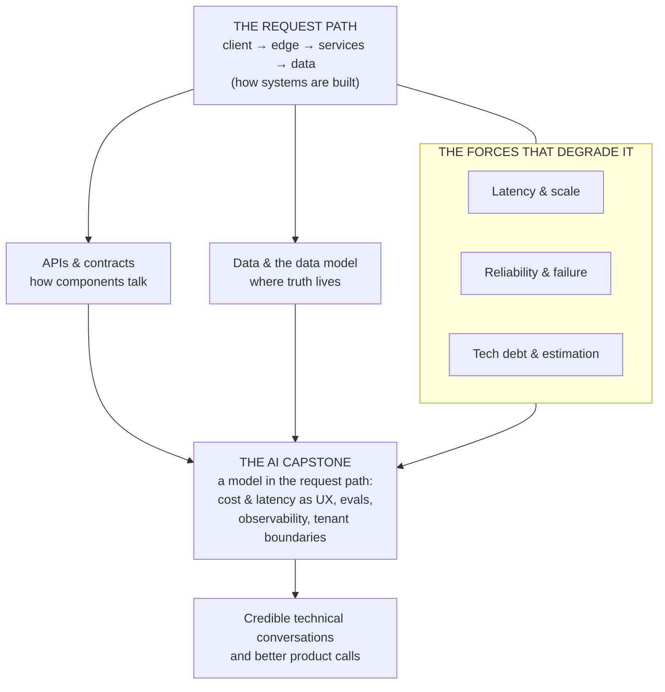

# Technical product sense for the AI PM

Product sense tells you *what* to build. **Technical product sense** tells you what it will
take to build it — and what the system will and won't let you do. It's the ability to read
an architecture, reason about data, latency, and failure, and hold a credible conversation
with engineers about trade-offs. You don't need to write the code; you need to understand
the *shape* of the system well enough to make good calls and earn engineers' trust.

For APMs and PMs moving into **AI product management**, this is non-optional. An AI feature
is a distributed system with a probabilistic component bolted into it — latency, cost,
failure, and data flow are now *product* decisions, not back-end details. This module
builds the mental models, one system concept at a time, and **each lesson ships a diagram**
you can redraw on a whiteboard.

## The knowledge graph

A system is a request path, the contracts and data it moves through, and the forces that
degrade it — with the AI capstone bolting a probabilistic component into the middle:

- [**How systems are built**](./how-systems-are-built.md) — clients, servers, services, and
  the path a request actually travels.
- [**APIs & contracts**](./apis-and-contracts.md) — how components talk: requests,
  idempotency, versioning, and webhooks.
- [**Data & the data model**](./data-and-the-data-model.md) — entities, relationships, and
  why "where does this data live?" is a product question.
- [**Latency, scale & performance**](./latency-scale-performance.md) — where time goes,
  caching, and what "it doesn't scale" really means.
- [**Reliability & failure**](./reliability-and-failure.md) — retries, timeouts, graceful
  degradation, and designing for the request that goes wrong.
- [**Tech debt & estimation**](./tech-debt-and-estimation.md) — reading an estimate, pricing
  trade-offs, and working with engineers on debt.
- [**Security & privacy sense**](./security-and-privacy.md) — authn vs. authz, hostile
  input, blast radius, and privacy as a product surface.
- [**The economics of infrastructure**](./economics-of-infrastructure.md) — where the money
  goes, cost curves, and the unit-economics napkin every feature deserves.
- [**Technical sense for AI systems**](./technical-sense-for-ai.md) — the capstone: the
  anatomy of an AI feature, evals and observability, and cost/latency as UX.

Each lesson pairs the concept with a **🎯 For the AI PM** briefing — why it matters when the
system has a model in it — and a diagram to make it concrete.

## Connects to other tracks

- [Latency / quality / cost / reliability tradeoffs](../content/06-strategy-tradeoffs/inference-stack-tradeoffs.md) — the same tradeoffs when the system has a model in it.
- [Reliability engineering](../harness-engineering/phases/14-reliability-engineering/README.md) — timeouts, retries, and budgets built by hand.
- [The job executor (Flowable)](../flowable/phases/02-the-engine-state-and-transactions/04-job-executor/docs/en.md) — durable async execution in a real engine.
- [Technical product management](../technical-product-management/README.md) — turning system understanding into delivery.

**📌 Close out the module:** [Recap & real-world examples](./recap.md).
